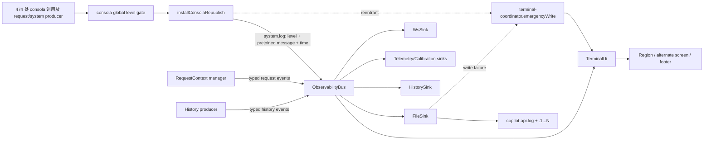
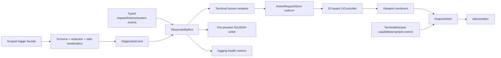

# TUI 与终端日志机制全面审计

- 日期：2026-07-17
- 范围：`src/lib/tui/**`、`src/lib/observability/**`、consola 生产点、FileSink、shutdown/raw-mode 接线、相关单元/集成/PTY 测试与活文档
- 结论类型：当前主树只读审计，不修改生产实现
- 裁判轴：长期正确性、完整性、模块化、真实终端语义、Bun-first、可运维性、richest-context-flow、敏感数据不落日志

## 1. 执行摘要

项目已经建立了一套明显高于普通 CLI 的终端架构：`TerminalUi` 是服务进程的终端 owner，纯 renderer、纯 reducer、键输入解析、DECSTBM region、emergency coordinator 均有明确边界；consola 经单一 republish 点进入 typed observability bus，再扇出到 TerminalUi 与同步旋转 FileSink；退出路径有 alternate-screen-aware restore，且有 Bun.Terminal + xterm-headless 整屏测试和 Python 真 PTY 两信号测试。

但“全面完善、符合最佳实践”尚不能成立。主要原因不是 DECSTBM 主机制，而是外围契约仍有实质缺口：verbose device-auth 可把 access token 写进持久日志；`system.log` 在 republish 时被提前拍平成不安全的字符串；stdout 故障会沿 bus diagnostics→emergencyWrite 再次写同一坏流并抛回 producer，真实 EPIPE 可杀进程；输入 decoder 跨 chunk 不保状态；帮助栏宣称 `q: quit` 但 `q` 被测试钉成 no-op；detail 无 viewport/scroll；panel selection 在并发终结后可越界并进入无输出的伪 detail；FileSink 在双进程 graceful-restart overlap 下不是安全的 rotation owner；过滤器异常可击穿 bus 的 sink 隔离；当前相关测试集合自身还有 3 个稳定失败，PTY harness 还写死本机绝对路径。

模块化结论是“外层边界强，内核仍偏重”：目录级依赖治理、纯叶子和 sink 解耦做得好；但 1300+ 行 `TerminalUi` 同时承担事件投影、active store、raw session、view identity、日志排队、渲染调度与 shutdown control，`system.log` 又只是一条预拼接字符串，因此尚未达到长期理想形态。

### 成熟度判断

| 维度 | 判断 | 说明 |
|---|---|---|
| TUI 主渲染机制 | 良好 | DECSTBM、alternate screen、scroll-before-grow、emergency write、restore 均有生产代码与较强测试 |
| TUI 功能完整性 | 部分完善 | 主流程可用，但 q、detail scroll、selection reconciliation、job control、capability fallback 不完整 |
| 日志管线架构 | 良好 | 单一 republish、typed bus、sink 顺序与故障隔离方向正确 |
| 结构化日志与敏感数据治理 | 不合格 | `system.log` 仅保留字符串；无统一 redaction；已确认 verbose token 泄漏路径 |
| 文件日志持久性 | 单进程良好，重叠进程不足 | sync append 无进程内 flush 缺口，但 rotation 跨进程不安全，跨重启日切有缺陷 |
| 测试可信度 | 较强但未闭环 | PTY/grid oracle 很好；矩阵、可移植性、持续正样本和当前红测仍有缺口 |
| 文档一致性 | 中等 | DESIGN 当前渲染模型基本准确，但 q、retry、P1 状态、ADR addendum 和源码注释存在漂移 |

## 2. 审计方法与实测

本次使用项目专用 `process-lifecycle-shutdown` 与公共 `pty-terminal-ui-testing` 方法论，以“字节测试证明机制，PTY+终端模拟器证明整屏结果，正样本证明 oracle 有牙”为准。另用 `find-skills` 检索公开技能生态；相关候选最高安装量仅 80 左右，而项目已有更贴合本实现且包含真实事故经验的本地技能，因此未引入低采用量第三方技能作为权威。

完成的独立验证：

1. 运行 `bun test tests/tui tests/observability`。稳定复跑结果为 370 pass、3 fail；失败均来自 [console-thinking.unit.test.ts](../../tests/observability/console-thinking.unit.test.ts#L86-L113)，其 fixture 从第一条 feature event 起就错误声明 `ctx.state="completed"`，被生产代码的 terminal-state anti-resurrection guard 正确拒绝 materialize。说明生产 guard 与旧测试已漂移，当前相关套件不是 green。
2. 单独探测 consola republish：记录 `1n` 会在 [republish.ts](../../src/lib/observability/republish.ts#L36-L47) 的 `JSON.stringify` 同步抛出 `JSON.stringify cannot serialize BigInt`；带 `cause`/`code` 的 Error 只保留 stack/message，结构化诊断字段丢失。
3. 用真实 `bus → TerminalUi → fake raw stdin` 链探测 selection：3 条 active 中选中索引 2，随后该行在 panel 态终结，再按 Enter，输出为 0 字节，既未进入 alternate screen，也未渲染 detail/panel。机制对应 [renderDetail()](../../src/lib/tui/terminal-ui.ts#L1033-L1064) 在 `detailActive=false` 且索引越界时调用 [exitDetail()](../../src/lib/tui/terminal-ui.ts#L1120-L1130)，后者立即 return，留下 `uiState.view="detail"`。
4. 代码级核对 FileSink 使用 [appendFileSync](../../src/lib/observability/sinks/file.ts#L137-L151)，因此不存在“Node 异步文件 buffer 未 flush”这一问题；最后一条已返回的 append 已交给内核。审计不采纳“为 FileSink 增加普通 async flush 即可修复”的错误建议。
5. 代码级核对 TUI PTY 资产：6 个 `.pty.test.ts` 已进入 `test:ci`，覆盖 no-eaten-lines、footer pinned、detail replay、resize re-anchor、clean restore 与 harness 自证；信号路径另有 Python `pty.fork()` 真前台测试。
6. 异模型复核独立执行双进程 FileSink 探针，5 轮各写 1000 条仅保住 984、998、1000、999、995 条，并观察到 active/rotated rename 的 ENOENT；该问题已从静态竞态升级为实证数据丢失。
7. 独立接线探针令 TerminalUi stdout 同步抛 EPIPE，原始 consola 调用最终也抛出 `EPIPE: broken stdout`；关闭真实 Unix pipe 读端时 Bun 1.3.14 进程退出码为 1。stdout failure amplification 因而不是理论边界。
8. 本机 10,000 条 `system.log` metronome 探针观察到约 320ms 循环耗时和约 323ms 最大 timer gap，证明同步日志可冻结事件循环；但是否在真实 workload 达到 P1 影响仍需生产分布探针。

## 3. 当前架构与数据流

TUI 内部依赖基本是单向的：`input/keys` 负责 bytes→key，`controller` 负责纯状态转移，`render/*` 负责纯字符串/终端协议构建，`terminal-ui` 编排 I/O，`terminal-coordinator` 是 bus-independent emergency leaf。ESLint 对 TUI→other sinks、sink→sibling sink 以及 render/input/controller 横向依赖有结构性守卫，方向正确。

## 4. 已经做得好的部分

### 4.1 终端单 owner 与输出协调

- 服务模式中 consola reporter 被替换，普通应用日志不再与 footer 竞争；`TerminalUi` 负责 stdout，未注册 owner 时 emergency 才落 stderr。
- [terminal-coordinator.ts](../../src/lib/tui/terminal-coordinator.ts#L101-L132) 按 `region/inline/alt/none` 分流，region/inline 以单次 `write` 完成 clear→line→redraw，避免多数 escape 序列交织。
- FileSink failure 与 republish reentrancy 不回到 bus，避免 disk-full→warn→FileSink→warn 的递归风暴。

### 4.2 TUI 分层与纯函数覆盖

- [controller.ts](../../src/lib/tui/controller.ts) 是纯 reducer；[footer.ts](../../src/lib/tui/render/footer.ts)、[panel.ts](../../src/lib/tui/render/panel.ts)、[syslog.ts](../../src/lib/tui/render/syslog.ts) 主要是纯 projection。
- footer 统一去 C0、按 `string-width` 截断到 `columns-1` 后再着色，避免 last-column wrap 和 ANSI 中途截断。
- detail 使用稳定 `detailReqId` 而不是长期依赖 Map index，修复了 sibling 删除导致 detail 静默切人这一类错误。

### 4.3 DECSTBM 与退出生命周期

- [Region.render()](../../src/lib/tui/render/region.ts#L84-L166) 明确维护 scroll-region geometry，并在 collapsed→panel grow 前将即将被 panel 占用的日志行推进 scrollback。
- unchanged geometry 每拍重申明 DECSTBM，同时用 DECSC/DECRC 吸收 cursor-home 副作用。
- detail 进入顺序是 alternate screen→reset margins→DECOM off→clear；退出/崩溃/shutdown-draining 均先离开 alternate screen，再恢复 cooked mode 与主屏 scroll region。
- raw-mode Ctrl-C 与 kernel SIGINT 共享同一 shutdown coordinator；第一次 draining 事件同步 restore cooked mode，第二次 Ctrl-C 成为真实 SIGINT。

### 4.4 请求可观测性与 durable truth 分离

- request lifecycle 使用 typed event union，不依赖普通文本日志作为唯一真相。
- lifecycle render 在 detail replay queue 淘汰后仍有 History 结构化真相；system logs 则有 FileSink 副本。代码注释已诚实区分“文本行耐久”和“结构化事件耐久”。
- HistorySink-before-WsSink 的 attach 顺序使持久化更新先于前端广播，测试也有 sink-ordering 覆盖。

### 4.5 测试方法优于常见 CLI 项目

- [PTY harness](../../tests/tui/pty/harness.ts) 把 Bun.Terminal 输出串行喂给 `@xterm/headless`，保留 grid、scrollback 与 raw bytes；运行中 panel 由 marker settle 后抓快照，不误用 destroy 后末态。
- [no-eaten-lines](../../tests/tui/pty/no-eaten-lines.pty.test.ts)、[footer-pinned](../../tests/tui/pty/footer-pinned.pty.test.ts)、[resize-reanchor](../../tests/tui/pty/resize-reanchor.pty.test.ts) 各自声明了生产 mutation 正样本；核心时序用 10 连跑。
- [shutdown-signals.it.test.ts](../../tests/shutdown/shutdown-signals.it.test.ts) 通过 Python 真 PTY 写 `0x03`，验证第一次仍活、第二次 exit 130、raw TUI 恢复 ICANON+ECHO。这比普通 `Bun.spawn` 信号测试可靠。

## 5. 发现与优先级

### P0——必须优先修复

#### P0-1：verbose device-auth 会把 credential 写入终端与持久日志

[device-auth.ts](../../src/lib/token/providers/device-auth.ts#L45-L61) 在 verbose 下打印完整 device-code response；[github-client.ts](../../src/lib/token/github-client.ts#L88-L103) 打印完整 access-token response，其中成功响应含 `access_token`。服务启动先在 [start.ts](../../src/start.ts#L287-L289) attach FileSink/republish，再在 [start.ts](../../src/start.ts#L461) 初始化 token manager，因此 `start --verbose` 触发 device auth 时，token 会进入 `copilot-api.log`。`--show-github-token` 是用户显式选择，但普通 `--verbose` 不应隐式获得同等泄密语义。

同时 FileSink 未显式创建 `0600` 文件或 `0700` 目录，默认权限取决于 umask。日志还会持久化 parse-failure 的 raw upstream frame，例如 [Responses reverse](../../src/routes/responses/handler-v4.ts#L698-L703)、[Chat Completions reverse](../../src/routes/chat-completions/handler-v4.ts#L689-L695) 和 [Gemini reverse](../../src/routes/gemini/handler-v4.ts#L574-L580)，这些帧可能包含模型输出。

目标：引入单一 redaction policy，在生产点和 sink 防御层同时覆盖 token、authorization/cookie、device_code、response access token、敏感 headers 与大段 raw payload；完整 raw truth 留在受控 History，不重复落普通日志。FileSink 目录/文件权限应显式收紧。所有 token-flow 日志必须有“日志中绝无 token 字节”的自动化 negative assertion。

#### P0-2：`system.log` 过早字符串化且 serializer 可使日志调用抛异常

[joinArgs()](../../src/lib/observability/republish.ts#L36-L47) 对任意非字符串、非 Error 值直接 `JSON.stringify`。已实测 BigInt 同步抛错，循环对象同类；这两者是防御性边界，当前未定位固定的内建生产调用点，但任意第三方/未来 diagnostic object 都可触发。更常见的当前损失是 Error 的 `cause`、`code`、status 与自定义字段被稳定丢弃，`undefined`/Symbol 信息也会静默消失。一个诊断调用不应反过来破坏业务控制流。

目标：`system.log` 保留 richest structured args/error/context 到 terminal sink 才裁剪；使用经过 Bun PoC 的成熟 safe serializer，而不是继续扩手写 `JSON.stringify` 分支。建议优先评估 Pino 的 serializer/redaction/child-logger 能力，但其 worker transport、pretty adapter、shutdown drain 与当前 TUI single-owner 接线必须先做 Bun PoC；consola 只保留 one-shot prompt/reporting 或作为兼容 adapter。若不引入 Pino，至少使用维护良好的 safe-stable stringify + serialize-error 组合，并把 serializer failure 转成有界 fallback，而不是 throw。

#### P0-3：stdout 故障会穿透 sink 隔离并放大为 producer 异常/进程退出

[TerminalUi](../../src/lib/tui/terminal-ui.ts#L811-L843) 直接写 stdout。若 write 抛错，[bus handler catch](../../src/lib/observability/bus.ts#L102-L120) 调 `consola.warn` 报 sink 故障；此时 republish 仍在 reentrant 状态，于是 [republish fallback](../../src/lib/observability/republish.ts#L52-L74) 进入 `emergencyWrite`；coordinator 又写同一已损坏 stdout。第二次异常不再位于新的 isolation boundary 内，最终抛回原始 `consola.info()` 调用者。若故障以 Writable 的未监听 `error` 事件出现，则进入全局 uncaughtException→exit 1。

独立探针已得到 `outcome="threw:EPIPE:broken stdout"`，真实关闭 pipe 读端的 Bun 子进程也以 1 退出。该链违反“一坏 sink 不影响 producer/后续 fan-out”的公开契约。

目标：`TerminalSession/OutputArbiter` 明确定义 stdout/stderr 的同步 throw、异步 `error`、EPIPE、TTY hangup policy；terminal sink 故障后原子熔断并注销 owner，诊断改投独立且尚健康的 fallback，不能递归写同一坏流。补同步 throw 与 async emit error 两个子进程 oracle，证明服务不因单个终端输出故障退出。

#### P0-4：相关测试集合当前稳定红 3 条，且 PTY harness 写死开发机路径

[console-thinking fixture](../../tests/observability/console-thinking.unit.test.ts#L38-L48) 把 feature event 的 ctx 从一开始就设为 terminal，已不符合 anti-resurrection 契约，导致 3 条测试稳定失败。测试应以 executing/streaming ctx 发布 feature，再用 completed ctx 发布 terminal event。

[PTY harness](../../tests/tui/pty/harness.ts#L113-L124) 将 cwd 写死为 `/home/xp/src/copilot-api-js`，而 `test:ci` 包含 `test:pty`。任何其他 clone path 都会直接失败，当前 PTY 绿不能代表可移植 CI 绿。

目标：先恢复相关套件全绿；harness cwd 从 `import.meta.dir`/workspace root 推导。CI 必须在非固定 checkout path 运行一次，防止此类本机绑定复发。

### P1——高优先级完整性与可靠性缺口

#### P1-1：TUI 帮助栏承诺 `q: quit`，但 q 是明确 no-op

[panel hint](../../src/lib/tui/render/panel.ts#L116-L121) 显示 `q: quit`，DESIGN 也声明 q/Ctrl-C 都转发 shutdown；但 [controller.ts](../../src/lib/tui/controller.ts#L112-L136) 将所有 char 设为 no-op，[controller.unit.test.ts](../../tests/tui/controller.unit.test.ts#L156-L160) 甚至用 q 作为 generic no-op 正样本。用户界面与测试共同锁住了错误行为。

目标：把 q 作为显式 semantic key，在 TerminalUi 走与 Ctrl-C 同一个 `handleShutdownSignal`；或删除所有 q 提示与文档。根据现有公开契约，应实现前者。

#### P1-2：按键 decoder 不跨 chunk 保状态

[parseKeys()](../../src/lib/tui/input/keys.ts#L55-L113) 把单个 `data` chunk 当成完整协议单元。终端可把 `ESC [ A` 拆成多个 chunk；若首 chunk 只有 ESC，当前实现立即发 escape，下一 chunk 的 `[`/`A` 又变成普通 char。UTF-8 多字节输入也按单字节丢弃或误解。

目标：改成持状态的 streaming key decoder，保留 incomplete CSI/SS3/UTF-8 前缀，使用短 ESC disambiguation timeout；覆盖跨 2/3 chunk 的 arrow、Alt-key、连续多键、UTF-8、未知 CSI 和粘连输入。若采用成熟 keypress parser，须先做 Bun/raw stream PoC。

另一个需要显式裁决的输入语义是 [Ctrl-D 目前被折叠成 ctrl-c](../../src/lib/tui/input/keys.ts#L26-L43)。这不同于 Unix EOF 惯例；若保留，应作为公开设计而非偶然映射记录并测试。

#### P1-3：detail 不是可浏览的 viewport

[buildDetailLines()](../../src/lib/tui/render/panel.ts#L205-L246) 生成所有行，[renderDetail()](../../src/lib/tui/terminal-ui.ts#L1066-L1072) 一次写完整数组；detail reducer 对 up/down/PgUp/PgDn 均 no-op。attempt 多或终端矮时，顶部 identity/context 会滚出 alternate buffer，用户无法回看，因而“单条全 ctx 快照 + per-attempt 明细”并未真正满足。

目标：detail state 增加稳定 `detailScrollOffset`，按 `rows` 形成 viewport，并实现 up/down、PgUp/PgDn、Home/End；顶部/底部显示位置和 hidden count。resize 后 clamp offset。PTY 增加 3 行极矮终端与 50+ attempts 的可达性断言。

#### P1-4：panel selection 不随 active 集合收缩 reconciliation

`selectedIndex` 只在按 up/down 时 clamp；active 删除不调整 selection/scroll。已实测选中最后一行后该行终结，再 Enter 会进入 `view=detail` 但输出 0 字节；因为 `renderDetail` 在 alternate screen 尚未激活时找不到条目，`exitDetail` 又因 `!detailActive` 直接返回。

目标：active set 每次改变后，用稳定 selected request id 做 reconciliation；若选中项消失，选择最近 surviving sibling 并 clamp scroll。`exitDetail` 应先修正 logical view，再决定是否需要 terminal bytes，不能把“没进 alt screen”等同于“无需状态收敛”。补 sibling/selected/last-row 三类终结测试。

#### P1-5：FileSink 的 rotation owner 不支持 graceful-restart 双进程 overlap

新旧进程 overlap 时会同时持有 [FileSink](../../src/lib/observability/sinks/file.ts#L93-L185)，共享同一路径、各自维护 `currentSize/currentDay` 并独立执行 exists→rm→rename。SQLite/WAL overlap 已有专门治理，日志 rotation 却没有 owner/lock。这里 `appendFileSync(path, ...)` 每次按路径打开，不是“长期持有并继续写已移动 inode”；真实机制是 stale size/day 状态与并发 rename/recreate 竞争。独立双进程探针已经观察到 ENOENT 和每轮 0–16 条不等的数据丢失。

另外构造时 [currentDay](../../src/lib/observability/sinks/file.ts#L101-L109) 有意取“今天”以避免旧 event timestamp 触发伪轮转，但代价是无法从现有文件恢复 artifact day；进程跨午夜停机后第二天重启，第一条新日志不会把昨日 active file 日切。该行为应被明确裁决，而不是由构造初值顺带决定。

目标：首选把 standalone file 改成 per-process/boot-id 文件，让每个进程只轮转自己拥有的文件，再由独立 retention pass 清理；supervisor 环境首选 stdout→journald/pm2 自有日志轮转。若坚持共享 active file，必须有跨进程锁与可恢复 rotation protocol。currentDay 应从 existing file metadata/最后一条记录恢复，并补 restart-day 与 two-writer tests。

#### P1-6：终端边界缺少统一 control-sequence sanitization

footer 只清 C0；panel/detail 的 model/path/id/tags/error 文本以及 `system.log` message 没有统一 terminal sanitizer。FileSink 只剥 SGR，不剥其他 CSI/OSC。来自上游 raw frame、HTTP path、模型目录或 error message 的控制序列可能清屏、改标题、写 OSC52 clipboard、破坏 DECSTBM，或污染文件日志。

目标：数据字段在进入 renderer 前统一 strip/escape C0、C1、CSI、OSC、DCS；只允许 renderer 自己生成的 ANSI。human terminal 与 JSON/file sink 使用不同末端策略，但共享可信字段标记。补 BEL、ESC[2J、OSC 8、OSC 52、CR/LF、tab、超长字符串、CJK/combining/emoji 测试。

#### P1-7：ObservabilityBus 的“sink 隔离”不覆盖 filter

[publishSync()](../../src/lib/observability/bus.ts#L95-L121) 在 try/catch 之外执行 predicate；一个 filter throw 会中断整个 fan-out并把异常抛回 producer，后续 sinks 收不到事件。该主缺陷已由独立探针确认。`ret instanceof Promise` 还会漏 thenable/cross-realm Promise，但当前 subscriber 均为项目内普通 async function，属于同处可顺手收敛的低概率边界，不单独支撑 P1 定级。

目标：filter 与 handler 统一置于 subscriber isolation boundary；用 `Promise.resolve(ret)`/thenable detection 跟踪 async；诊断失败走独立 never-recursive channel，并增加 `observability_sink_failures_total{sink,phase}`。测试必须证明 filter throw/reject 后后续 subscriber 仍收到事件。

#### P1-8：同步 FileSink 与逐帧 bus fan-out会把观测成本施加到请求热路径，最终等级待 workload probe

FileSink 每条 system log 同步执行 mkdir+append；stat 只在构造时，rotation 操作只在超限/跨日触发，不应误写成每条都做。request `stream_progress` 可逐帧构造 snapshot 并同步扫描所有 subscribers；stdout.write 的 backpressure 返回值在 TerminalUi/Region 中完全忽略。高日志量、慢磁盘或管道消费者停读时，观测层可阻塞 event loop 或积累 stream buffer。本机 10,000 日志探针已证约 323ms event-loop gap，但真实日志率、慢盘分布、阻塞 PTY 与 `writableLength` 增长仍需实测，故架构机制成立、生产严重性暂不假定。

目标：先采集真实 system-log rate、stream-progress rate、同步写时延和 stdout `writableLength` 曲线，再确定队列容量与线程模型。设计方向仍应区分“必须同步可见的 emergency”与普通 diagnostic：普通日志进入有界、串行、可 drain 的 writer/worker；shutdown durability barrier 明确 seal→drain→fsync policy。stream_progress 在 producer/coalescer 以 50–100ms 最新值节流，terminal 前强制 flush 最终累计。stdout backpressure 至少要有 coalesced redraw 和 bounded queue，不能逐帧堆完整 ANSI frame。

### P2——模块化、可运维性与终端最佳实践

#### P2-1：`TerminalUi` 仍是 1300+ 行 orchestration god-class

虽然叶子拆分良好，但 [terminal-ui.ts](../../src/lib/tui/terminal-ui.ts) 仍拥有 event→active projection、attempt merge、terminal log projection、footer timer、raw stdin、view state、stable detail identity、replay queue、alternate screen、shutdown forwarding、restore 与 coordinator hooks。任何新增 view/action 都会继续加重它。

目标模块：

- `active-request-store.ts`：纯 event reducer，输出 immutable state + display effects。
- `ui-controller.ts`：用 selectedRequestId 而非裸 index，统一 selection/detail/scroll reconciliation。
- `terminal-session.ts`：TTY capability、raw/cooked、SIGTSTP/SIGCONT、exit hooks、resize source。
- `output-arbiter.ts`：normal log、emergency、detail replay、backpressure、frame coalescing。
- `render/log-line.ts` 与现有 render leaves：只消费 view model。
- `terminal-ui.ts`：薄编排器，不再内含业务 projection 算法。

#### P2-2：`system.log` 没有结构化 context、稳定 scope 或 per-sink policy

代码依赖手写 `[Module]` 前缀，大小写/命名不统一；绝大多数普通诊断没有 request/session/attempt/transport/pid/boot-id 字段。File 与 terminal 共享的只有 prejoined message，无法可靠过滤、聚合、redact、采样或构建错误 fingerprint。全局 `consola.level` 能 gate debug，但没有 terminal/file 独立 level、动态配置或 machine-readable JSONL。

目标事件建议：`{ time, level, scope, event, message, error:{name,message,stack,cause,code,status}, request?, process:{pid,bootId,version,sha}, fields, sensitivity }`。生产模块使用 child logger/scoped logger；Terminal sink 末端生成人类可读行，File sink 默认 NDJSON，必要时另提供 human log。level、sampling、redaction 按 sink 配置并支持热重载。

#### P2-3：raw-mode job control 与 terminal capability fallback 不完整

DESIGN 已承认 Ctrl-Z 在 raw mode 失效。当前 interactive gate 只检查 `isTTY + setRawMode`，不处理 `TERM=dumb`、无 DECSTBM/alternate-screen 终端、screen reader、用户显式 `--no-tui`，也没有 SIGTSTP 前 restore、SIGCONT 后 re-enter/repaint。

目标：引入 capability policy 与显式 `tui.enabled/--no-tui`；TERM=dumb、CI pseudo-TTY、无 cursor addressing 时退化 P0 plain stream。Ctrl-Z 应 restore→临时恢复默认 SIGTSTP→self-suspend，SIGCONT 后重新 raw、重建 region。补 Python PTY 的 SIGTSTP/SIGCONT 和 TERM=dumb 测试。

#### P2-4：时间、进程身份和 multi-line 格式不利于事后分析

> **2026-07-18 后续状态：部分解决。** Terminal 已用 `renderSystemLogLines` 保留 diagnostic 的物理行/空行结构、仅首行加 badge+time、每行独立净化；启动模型目录也不再把多行压平。下述逐续行重复 timestamp/level、File 时间/进程身份仍是未完成的事后分析增强。

Terminal 用本地 HH:MM:SS，File 用无时区的本地秒级时间；Error stack 多行只有首行有 timestamp/level；republish 忽略 `logObj.date` 而重采 `Date.now()`。graceful overlap 时两个进程写同文件，只有启动 banner 能间接区分来源。

目标：structured file 使用 RFC3339/UTC 毫秒时间并逐记录带 pid/boot-id；terminal 可继续短本地时间。multi-line stack 在 JSON 中保持单字段，human renderer 每 continuation line 显式 indent。优先使用原始 `logObj.date`，缺失时才采 now。

#### P2-5：模块级纯度声明有少量名实不符

[format.ts](../../src/lib/observability/projections/format.ts#L1-L29) 声称 formatting helpers 是纯函数，但 `formatBillingLabel` 读取全局 `state.tokenBasedBilling`。这使同一输入在热重载/测试环境中可能得到不同输出，也迫使 frontend/backend pure-module 边界依赖人工记忆。

目标：把 billing mode 作为 view-model/input 显式传入；projection 层不读 global state。类似规则应由 lint/architecture test 而非注释保证。

#### P2-6：小型长期状态与 exit hook 缺少生命周期收敛

`AgentOrdinalRegistry` 按 session 永久增长，exit hook 注册后 destroy 不解除闭包。单实例通常影响小，但长寿命代理/嵌入式多 attach 测试会积累。

目标：session 无 active request 且无近期 display 需求时释放 ordinal map，或使用 bounded LRU；exit hook API 返回 unregister，在 destroy 时成对移除。

## 6. 测试矩阵评估

### 已有强覆盖

| 契约 | 当前 oracle | 强度 |
|---|---|---|
| collapsed↔panel 不吞编号日志 | xterm scrollback + 10 连跑 | 强 |
| panel 钉底、日志不侵 panel | 运行中网格快照 + 10 连跑 | 强 |
| detail 期间不直接污染并退出回放 | raw alt bytes + scrollback 编号 | 中强 |
| resize 后无孤儿 footer | 注入 rows + grid snapshot + 10 连跑 | 强于字节测试，但未覆盖生产 resize 通知链 |
| alt-screen/cursor/DECSTBM restore | raw byte sequence + xterm active buffer | 强 |
| 两次 Ctrl-C 与 cooked restore | Python 真 PTY + termios + exit code | 强 |
| pure renderer/reducer/region | unit + golden fixture | 强 |
| FileSink append/ANSI SGR/size/day/failure | unit | 中强 |
| bus sync/async/filter happy path/deadline | unit | 中 |

### 缺失或需要加强

1. 输入：escape sequence 跨 chunk、UTF-8、SS3、Alt、PgUp/PgDn、Home/End、paste burst。
2. 几何：cols 20/40/80/120/240，rows 2/3/10/24/60，连续 resize 24→30→12→40，resize 与 grow 同拍窄缝。
3. 字符：CJK、emoji、combining marks、ZWJ、控制序列与恶意 OSC。
4. detail：超屏 50 attempts 全部可达、scroll/resize clamp、selected request/sibling/last row 并发终结。
5. capability/job control：TERM=dumb、`--no-tui`、SIGTSTP/SIGCONT、SIGTERM 对称路径、stdout EPIPE/TTY hangup。
6. 输出：颜色开启的真实 PTY；目前 harness 强制 `FORCE_COLOR=0`，没有证明 SGR 与 width/clear choreography 组合后不留残色。
7. FileSink：existing previous-day file after restart、two-process rotate、permission 0600、oversized line、retain edge、ENOSPC storm/backoff、redaction。
8. bus：filter throw、thenable、subscriber 动态增删、diagnostic channel 自身失败。
9. structured logger：BigInt/circular/Error cause/code、秘密 negative test、multi-line JSON round-trip。
10. non-TTY：现有 unit 证明未注入 stdin 时走 P0，但缺真正 child process `stdout=pipe/file` 的无 ANSI/raw-mode 端到端测试。
11. 正样本持续化：多数 PTY 文件的 production mutation 是注释记录，不是 CI mutation job。至少对 scroll-before-grow、alt leave、region reset、replay flush 建定期 mutation profile，避免 oracle 随重构变钝。

### 当前 false-green/false-red 风险

- `footer-pinned` 只断言 panel zone 某行含 model；应再断言恰好一行、固定 zone、无同文日志伪命中。
- `detail-no-clobber` 只验证编号存在，不验证 replay 严格顺序与 exactly-once。
- `clean-restore` 验证还原序存在，但应把 `?1049l` 与随后的主屏 reset/show-cursor 顺序钉在同一时序断言。
- 当前 3 个 console-thinking 失败是 stale fixture 的 false-red；在修复前，相关套件无法作为合并门。
- harness 的绝对 cwd 让本机 green 成为跨环境 false-green。

## 7. 文档与代码漂移

1. [DESIGN TUI 模块表](../DESIGN.md#L161) 仍说 P1/P2 interactive panel 待 PoC，但下方 [live 面板章节](../DESIGN.md#L385-L391) 又描述为已实现。
2. [DESIGN](../DESIGN.md#L385) 声明 q/Ctrl-C 均 shutdown，代码 q no-op。
3. [DESIGN](../DESIGN.md#L380-L392) 仍使用 `[RETRY-n]` 与 `[RETRY-1]` 示例，而已落地代码使用固定 `[RETRY]` 前缀，重试编号由 `formatDurationField` 生成的 `last/total(N)` duration 字段承载。
4. ADR [2026-07-10-tui-terminal-ownership](../decisions/2026-07-10-tui-terminal-ownership.md) 的补记②仍把“恒定高度 MODE A”称最终模型；后续用户反转只在 spec 顶部和 DESIGN 更新。ADR 应追加第三次决策补记，而不是让 Accepted ADR 保留相反的最终结论。
5. [terminal-coordinator.ts](../../src/lib/tui/terminal-coordinator.ts#L9-L15) 顶部仍说“Nothing here yet calls it / P2.2 will wire”，实际 P2.2 已完成。
6. [events.ts](../../src/lib/observability/events.ts#L220-L275)、[console-system-log.unit.test.ts](../../tests/observability/console-system-log.unit.test.ts#L1-L12) 与 [console-thinking.unit.test.ts](../../tests/observability/console-thinking.unit.test.ts#L1-L12) 仍称 ConsoleSink，实际 owner 已是 TerminalUi。
7. DESIGN 声称“仅 tui/input 允许 setRawMode”，实际 setRawMode 正确地位于 orchestration owner `terminal-ui.ts`；架构文字与实现边界应统一。
8. spec INV-5 的“日志始终 FileSink durable”应明确只指 `system.log`，request lifecycle rendered text 只有 History 的结构化 durable truth。

## 8. 建议的目标架构

关键不变量：

1. 结构化事件是源，human line 是末端 projection；禁止 producer 手拼 JSON 或把秘密混进 message。
2. request lifecycle durable truth 仍在 History；diagnostic durable truth 在 per-process JSONL/supervisor log；两者通过 requestId/process identity 关联，不复制完整 payload。
3. terminal data 一律 untrusted；只有 renderer 生成 ANSI。
4. UI selection 以 request id 为主，index 只是当前 projection。
5. normal logging 可排队、可节流、可 drain；emergency logging 绕过普通队列但必须有 rate-limit/circuit-breaker。
6. graceful restart 时每个进程只拥有自己的 log artifact；不共享 rotation state。
7. raw terminal session 必须支持 suspend/resume、capability fallback 和显式 disable。

## 9. 推荐实施顺序

### Phase A：先恢复可信基线

1. 修复 3 个 stale console-thinking tests 与 PTY cwd。
2. 增加 stdout-failure、q contract、split-key decoder、selection reconciliation 四组红测。
3. 补 FileSink restart-day、two-writer、token-redaction negative tests；补 bus filter-throw test。
4. 更新 DESIGN/ADR/source comments，消除已知契约漂移。

### Phase B：堵住秘密与日志自伤

1. 立刻删除/重塑 device/auth token response 原文日志；显式 0600/0700。
2. 定义 `DiagnosticEvent` 与 redaction schema，引入 safe serializer；保持 consola adapter 兼容迁移。
3. Terminal/File 两个 sink 从 structured event 各自 projection；增加 pid/boot-id/RFC3339/error cause/code。
4. FileSink failure 加状态机：首次失败 emergency 一次，退避重试，恢复时通知一次，导出 health metric；禁止每条日志重复打磁盘和 emergency。

### Phase C：完成 TUI 功能与内部分层

1. stateful key decoder + q。
2. ID-based controller reconciliation + detail viewport/scroll。
3. 抽 `ActiveRequestStore`、`TerminalSession`、`OutputArbiter`，将 TerminalUi 收敛成薄编排器。
4. terminal sanitizer、TERM fallback、`--no-tui`、SIGTSTP/SIGCONT。

### Phase D：解决 I/O 与 overlap

1. per-process/boot-id JSONL 或 supervisor logging，退役共享 active-file rotation owner。
2. 普通日志 writer queue/worker + shutdown durability barrier；stream_progress coalescing；stdout frame coalescing/backpressure。
3. 扩充 PTY 矩阵并建立定期 mutation profile。

## 10. 最终判断

本项目 TUI 的核心终端机制已经“设计成熟且有实证”，不是需要推倒重写的草稿；observability bus/sink 外层也具备良好模块化基础。但整个“TUI + 终端日志系统”仍是“核心强、边界未收口”：输入协议、detail UX、selection concurrency、job control、structured logging、redaction、multi-process log ownership、backpressure 和测试可移植性都还没有达到全面完善标准。

最重要的优先级不是继续微调颜色/布局，而是先完成四件事：阻断 verbose token 落盘、把 `system.log` 从危险字符串升级为结构化事件、恢复全绿且可移植的测试基线、修 q/input/selection 三个用户可见契约。完成这些后，再进行 TerminalUi 内核拆分与 per-process structured file logging，整体架构即可从“高质量内部工具”进入“长期可演进、可运维、可证明”的状态。