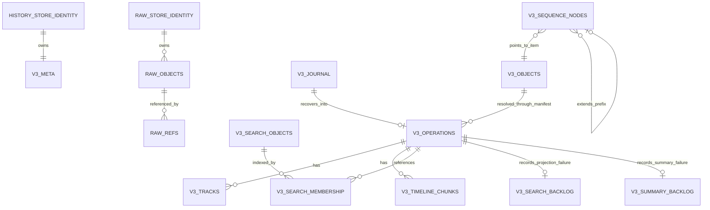

# History V3 SQLite schema

> **状态：活文档。** 本文描述当前生产代码实际创建和读取的 History V3 SQLite schema。DDL 单一事实源是 [`src/lib/history/v3/store.ts`](../src/lib/history/v3/store.ts) 的 `V3_SCHEMA_SQL` 与 [`src/lib/history/raw/manager.ts`](../src/lib/history/raw/manager.ts) 的 `RAW_SCHEMA`。

## 1．数据库命名与职责

当前 History V3 **没有活跃的 `history.db + archive.db` 双库**。这两个文件名属于已退役的 V2／tiered-archive 设计，生产服务不会打开、迁移、回填或删除它们。V3 的两个物理库如下。

| 逻辑角色 | 当前文件 | 默认路径 | 是否默认启用 | 说明 |
|---|---|---|---|---|
| Semantic History DB | `history-v3.db` | `$XDG_DATA_HOME/copilot-api/history-v3.db`，未设置 XDG 时为 `~/.local/share/copilot-api/history-v3.db` | 是 | `ModelOperationRecord` 的权威 semantic CAS、manifest、ordered tracks、timeline、journal、搜索派生数据 |
| Raw capture sidecar | `raw.db` | 与 `history-v3.db` 同目录 | 否 | 可选 exact-byte CAS 与 operation/sequence/track 引用；配置热重载按 store generation 切换 |
| Legacy V2 | `history.db` | 同 `$XDG_DATA_HOME/copilot-api/` 目录 | 否 | 保留原样；不是 V3 schema，不被在线服务触碰 |
| Legacy tiered archive | `archive.db`、seal files | 原归档目录 | 否 | 内置 archiver 已退役；不是 V3 schema，不被在线服务触碰 |

因此，如果运维语境仍把两个 V3 库简称为“history DB + archive DB”，对应关系应理解为：**semantic `history-v3.db` + optional raw `raw.db`**，而不是字面文件 `history.db + archive.db`。

路径常量在 [`src/lib/config/paths.ts`](../src/lib/config/paths.ts)：`PATHS.HISTORY_V3_DB` 与 `PATHS.HISTORY_RAW_DB`。`history.enabled=false` 或 CLI `--no-history` 会在开库前关闭整个 History 子系统；`history.raw_capture.enabled=false` 只关闭 raw sidecar，不影响 semantic V3。

## 2．总关系图



`v3_operations.manifest_gz` 内有 operation-local handle → `v3_objects.hash` 的映射，所以 `v3_objects` 与 `v3_operations` 没有 SQL FK。这个边由 manifest 保持，读取时批量解析并校验；SQL 层只为 operation-owned 子表建立 FK。journal 与 operation 也没有 FK，且正常情况下不共存：journal 先于 operation 行出现，成功提交后即删除。raw 侧同样没有 SQL FK：`raw_store_identity` 是 artifact 身份标记，`raw_refs.object_hash` 是到 `raw_objects` 的逻辑引用。

## 3．`history-v3.db` schema

### 3.1 `history_store_identity`

由 [`src/lib/history/sqlite/connection.ts`](../src/lib/history/sqlite/connection.ts) 的 `assertV3Owner()` 创建，不在 `V3_SCHEMA_SQL` 字符串内。

| 列 | 类型 | 约束 | 语义 |
|---|---|---|---|
| `owner` | `TEXT` | `PRIMARY KEY` | 固定为 `copilot-api-history-v3` |

已有文件若没有该表，或 owner 不匹配，V3 会在执行 schema reconcile 前拒绝打开，防止把旧 `history.db` 误当 V3 改写。

### 3.2 `v3_meta`

| 列 | 类型 | 约束 | 语义 |
|---|---|---|---|
| `key` | `TEXT` | `PRIMARY KEY` | V3 schema／store 元数据键 |
| `value` | `TEXT` | `NOT NULL` | 元数据值 |

当前生产代码写入并读取 `schema_version`。format-v2 当前 schema version 为 `4`；reconcile 只有在版本落后时才检查／增加列并更新该键。

### 3.3 `v3_objects`

Semantic payload/frame 内容寻址对象库。

| 列 | 类型 | 约束 | 语义 |
|---|---|---|---|
| `hash` | `TEXT` | `PRIMARY KEY` | SHA-256 十六进制内容键 |
| `kind` | `TEXT` | `NOT NULL` | `payload`、`payload-skeleton`、`sequence-item` 或 `frame` |
| `canonical_gz` | `BLOB` | `NOT NULL` | canonical JSON bytes 的 zstd 压缩结果 |
| `canonical_bytes` | `INTEGER` | `NOT NULL` | 压缩前字节数 |

Canonical JSON 递归排序 object key，保持 array 顺序；typed-array 转为 `{ "$bytes": "<base64>" }`。当前新写入 `FORMAT_VERSION=2`，hash 域为 `history-v3:2:object:${kind}\0` 加 canonical bytes。hash 命中时仍解压并做完整字节比较；不把哈希相等直接当成内容相等。format-v1 对象留在原 hash domain，不在线重写。

### 3.4 `v3_sequence_nodes`

可提取对象数组的持久前缀 DAG。每个 node 表示“parent prefix + 当前 clean item”，不同 operation/分支共享相同前缀。

| 列 | 类型 | 约束 | 语义 |
|---|---|---|---|
| `hash` | `TEXT` | `PRIMARY KEY` | sequence node 的 format-v2 内容键 |
| `parent_hash` | `TEXT` | nullable | 前一 prefix node；首项为 `NULL` |
| `item_hash` | `TEXT` | `NOT NULL` | `v3_objects` 中 `sequence-item` 的逻辑引用 |
| `depth` | `INTEGER` | `NOT NULL` | 1-based prefix 长度 |

`cache_control`／`ephemeral` 不参与 clean item identity；每次出现的值作为 manifest overlay（item index + nested path + value）保存，hydrate 时恢复。因此 volatile hint 不会破坏稳定对话前缀共享，也不会丢失原始 JSON 语义。当前没有 SQL FK：node/object 完整性由写入时 collision check 与读取时长度／对象存在校验保证。

### 3.5 `v3_operations`

一条 terminal model operation 一行，是 list/detail 的根表。

| 列 | 类型 | 约束 | 语义 |
|---|---|---|---|
| `operation_id` | `TEXT` | `PRIMARY KEY` | canonical operation ID |
| `revision` | `INTEGER` | `NOT NULL` | terminal record 的 `lastSequence` |
| `digest` | `TEXT` | `NOT NULL` | `SHA-256("history-v3:${FORMAT_VERSION}:operation\0" || manifest_bytes)` |
| `kind` | `TEXT` | `NOT NULL` | `generation`、`responses_ws`、`count_tokens`、`embeddings` |
| `created_at` | `INTEGER` | `NOT NULL` | operation 创建 epoch ms |
| `terminal_sequence` | `INTEGER` | `NOT NULL` | terminal event sequence |
| `ended_at` | `INTEGER` | nullable | terminal epoch ms；旧数据可为空 |
| `timing_source` | `TEXT` | `NOT NULL` | `canonical`、`storage-commit-upper-bound`、`terminal-log-rounded` 或 `unavailable` |
| `manifest_gz` | `BLOB` | `NOT NULL` | format-v2 value-free record、handle→hash、payload sequence roots/overlays、`tracksExternal`，zstd 压缩 |
| `summary_json` | `TEXT` | nullable | list/session/stats 使用的轻量 `EntrySummary`；旧行由 V3-only backfill 补齐 |
| `pinned` | `INTEGER` | `NOT NULL DEFAULT 0` | 产品 debug pin 投影 |
| `committed_at` | `INTEGER` | `NOT NULL` | authoritative commit epoch ms |

索引：

- `idx_v3_operations_created(created_at DESC, operation_id DESC)`：稳定时间排序与分页。
- `idx_v3_operations_kind(kind, created_at DESC)`：按 operation kind 过滤。

同一 `operation_id + revision + digest` 重放是幂等 no-op；同 operation ID 出现不同 revision／digest 是冲突，写入失败并增加 `conflicts` 状态计数。

### 3.6 `v3_tracks`

每条记录描述一条有序逻辑轨。payload/frame 值不在本表重复保存，`refs_json` 只存 operation-local handle。

| 列 | 类型 | 约束 | 语义 |
|---|---|---|---|
| `operation_id` | `TEXT` | `NOT NULL`，FK → `v3_operations(operation_id) ON DELETE CASCADE` | 所属 operation |
| `track_name` | `TEXT` | `NOT NULL` | 轨名 |
| `attempt_index` | `INTEGER` | `NOT NULL` | `-1` 表示 operation 级；`0..N` 表示 attempt |
| `refs_json` | `TEXT` | `NOT NULL` | 紧凑 handle refs；兼容旧 schema／无 `track_gz` 行的 fallback |
| `track_gz` | `BLOB` | nullable | format-v2 完整 `OperationTrack`（refs、metadata、frame observations），zstd 压缩 |

主键：`(operation_id, track_name, attempt_index)`。

当前轨名：

| `track_name` | `attempt_index` | 内容 |
|---|---:|---|
| `client-ingress` | `-1` | client → proxy 原始 semantic request |
| `effective-request` | `0..N` | proxy 内部 rewrite/sanitize 后请求 |
| `upstream-request` | `0..N` | proxy → upstream wire semantic request |
| `upstream-response` | `0..N` | upstream → proxy response payload/frame sequence |
| `upstream-egress` | `-1` | operation 级最终 upstream 轨 |
| `client-egress` | `-1` | proxy → client 实际 delivery 轨 |

未改写的 upstream/client frame 可以共享同一个 arena node；rewrite/filter/translation/synthetic 输出使用 derived node，并在 manifest 的 transform/provenance 数据中记录来源。

format-v2 manifest 中同位置只保留空的结构占位，读取时按 `(track_name, attempt_index)` 从 `track_gz` 恢复完整轨，避免 request/response metadata 在 manifest 中重复。`track_gz IS NULL` 的 format-v1 行仍从 `refs_json` 读取。

### 3.7 `v3_timeline_chunks`

按 sequence 排序的生命周期事件块，每块最多 128 个事件。

| 列 | 类型 | 约束 | 语义 |
|---|---|---|---|
| `operation_id` | `TEXT` | `NOT NULL`，FK → `v3_operations(operation_id) ON DELETE CASCADE` | 所属 operation |
| `chunk_index` | `INTEGER` | `NOT NULL` | 从 0 开始的块序号 |
| `first_sequence` | `INTEGER` | `NOT NULL` | 块内首 sequence |
| `last_sequence` | `INTEGER` | `NOT NULL` | 块内末 sequence |
| `payload_gz` | `BLOB` | `NOT NULL` | timeline JSON array 的 zstd 压缩结果 |

主键：`(operation_id, chunk_index)`。timeline 包含 payload/frame 注册、transform、attempt 开始、diagnostic、attempt settle、terminal 等事件。

### 3.8 `v3_journal`

单写者的 crash-recovery journal。正常成功提交后对应行被删除，因此健康库通常为空。

| 列 | 类型 | 约束 | 语义 |
|---|---|---|---|
| `operation_id` | `TEXT` | `NOT NULL` | operation ID |
| `revision` | `INTEGER` | `NOT NULL` | terminal revision |
| `digest` | `TEXT` | `NOT NULL` | 预期 operation digest |
| `phase` | `TEXT` | `NOT NULL` | 当前写 `terminal` |
| `payload_gz` | `BLOB` | `NOT NULL` | **自包含、含 arena values** 的完整 terminal record，zstd 压缩 |
| `created_at` | `INTEGER` | `NOT NULL` | journal append epoch ms |
| `committed_at` | `INTEGER` | nullable | schema 保留字段；当前成功路径直接删 journal 行 |
| `error` | `TEXT` | nullable | recovery 失败原因 |

主键：`(operation_id, revision)`。

提交顺序：事务外 prepare/hash/compress → 先 append 自包含 journal → 单 SQLite 事务写 CAS objects、operation、tracks、timeline、搜索派生 → 事务内删除 journal → commit。若 operation 事务失败，journal 独立留存；下次 `initHistory()` 调 `recoverV3Journal()` 查询 `committed_at IS NULL` 的行，重建全部 prepared artifacts，校验 revision/digest 后重放。

### 3.9 `v3_search_objects`

搜索是可重建派生，不是 authoritative History。

| 列 | 类型 | 约束 | 语义 |
|---|---|---|---|
| `object_hash` | `TEXT` | `PRIMARY KEY` | semantic payload object hash |
| `document_gz` | `BLOB` | `NOT NULL` | format-v1 搜索 document；format-v2 为零字节占位，不复制 canonical payload |
| `version` | `INTEGER` | `NOT NULL` | 独立搜索投影版本；当前 `SEARCH_VERSION=2` |

只索引 unique payload／payload-skeleton object，不重复索引 frame 或每个 operation 的完整对话。version 2 搜索通过 `object_hash` join `v3_objects.canonical_gz`，直接扫描 authoritative semantic CAS；version 1 才解压 `document_gz`。查询按 128 个对象分页，避免 SQLite `.all()` 一次把全部 search rows 放进 JS heap；它仍是 distinct CAS objects 的线性 substring scan，不是 FTS 索引。

### 3.10 `v3_search_membership`

| 列 | 类型 | 约束 | 语义 |
|---|---|---|---|
| `operation_id` | `TEXT` | `NOT NULL`，FK → `v3_operations(operation_id) ON DELETE CASCADE` | operation |
| `object_hash` | `TEXT` | `NOT NULL` | `v3_search_objects.object_hash` 的逻辑引用 |

主键：`(operation_id, object_hash)`。未建立 SQL FK 到 `v3_search_objects`，因为搜索对象是可重建派生；权威 operation commit 不以搜索派生成功为前提。

### 3.11 `v3_search_backlog`

| 列 | 类型 | 约束 | 语义 |
|---|---|---|---|
| `operation_id` | `TEXT` | `PRIMARY KEY` | 需要重建搜索投影的 operation |
| `reason` | `TEXT` | `NOT NULL` | 最近失败原因 |
| `attempts` | `INTEGER` | `NOT NULL DEFAULT 0` | 派生尝试次数 |
| `updated_at` | `INTEGER` | `NOT NULL` | 最近更新时间 |

搜索投影写失败时写入 backlog；semantic CAS/manifest 仍可提交并读取。

### 3.12 `v3_summary_backlog`

| 列 | 类型 | 约束 | 语义 |
|---|---|---|---|
| `operation_id` | `TEXT` | `PRIMARY KEY` | 无法生成 `summary_json` 的 V3 operation |
| `reason` | `TEXT` | `NOT NULL` | hydrate／projection 失败原因 |
| `updated_at` | `INTEGER` | `NOT NULL` | 最近失败时间 |

后台按小批次扫描 `summary_json IS NULL` 的 V3 行；失败行进入该 poison backlog，避免每次启动无限重试。backfill 只写派生 summary，不修改 digest、manifest 或 canonical CAS。
`getV3StoreStatus()` 同时返回 `summaryBacklog` 计数，供运行状态消费者识别 summary 派生降级。

## 4．`raw.db` schema

`raw.db` 是可选 exact-byte sidecar。每个 operation 创建时获取当前 store generation lease，后续配置切换不会改变该 operation 的目标文件；terminal 后 release，退役 generation 的最后一个 lease 释放时关库。

### 4.1 `raw_store_identity`

| 列 | 类型 | 约束 | 语义 |
|---|---|---|---|
| `store_id` | `TEXT` | `PRIMARY KEY` | artifact 的稳定 UUID；同路径重开保持不变 |
| `schema_version` | `INTEGER` | `NOT NULL` | 当前为 1 |
| `codec` | `TEXT` | `NOT NULL` | 当前固定 `zstd-json-v1` |

已有文件若没有 identity 表，或 schema/codec 不兼容，rotation 失败并保留原 active generation，不会把未知 SQLite 文件改写为 raw store。

### 4.2 `raw_objects`

| 列 | 类型 | 约束 | 语义 |
|---|---|---|---|
| `hash` | `TEXT` | `PRIMARY KEY` | exact bytes 的 SHA-256 内容键 |
| `kind` | `TEXT` | `NOT NULL` | capture 边界／编码种类，例如 `sse-frame-fields-v1` |
| `byte_length` | `INTEGER` | `NOT NULL` | 原始字节数 |
| `blob_gz` | `BLOB` | `NOT NULL` | 原始 bytes 的 zstd 压缩结果 |

hash 域为 `history-raw:${RAW_SCHEMA_VERSION}:${kind}\0` 加原始 bytes。hash 命中仍解压并做完整字节比较。

### 4.3 `raw_refs`

| 列 | 类型 | 约束 | 语义 |
|---|---|---|---|
| `operation_id` | `TEXT` | `NOT NULL` | semantic V3 operation ID；跨数据库逻辑引用，无 SQL FK |
| `sequence` | `INTEGER` | `NOT NULL` | operation 内 sequence |
| `track` | `TEXT` | `NOT NULL` | capture 轨／边界，例如 `upstream-frame`、`client-frame` |
| `object_hash` | `TEXT` | nullable | 成功时引用 `raw_objects.hash` |
| `capability` | `TEXT` | `NOT NULL` | `available`、`unavailable`、`not-requested` |
| `status` | `TEXT` | `NOT NULL` | `captured`、`disabled`、`failed`、`too-large`、`released` |
| `error` | `TEXT` | nullable | 失败或 gap 说明 |

主键：`(operation_id, sequence, track)`。使用 `INSERT OR REPLACE`，同一 operation sequence/track 的最终 capture 状态唯一。

raw capture 的失败、超大对象或数据库故障不会回滚 semantic V3，也不会阻断模型响应；状态通过 `/api/status.history_raw_capture` 暴露。

## 5．编码、引用与读取

| 数据 | 存储位置 | 编码 | 压缩 |
|---|---|---|---|
| Semantic payload/frame/sequence item | `v3_objects.canonical_gz` | sorted-key canonical JSON bytes | zstd |
| Sequence prefixes | `v3_sequence_nodes` | parent/item hash + depth | plain columns |
| Operation structure/provenance | `v3_operations.manifest_gz` | value-free manifest + handle hashes + sequence roots/overlays | zstd |
| Ordered logical tracks | `v3_tracks.track_gz` | 完整 `OperationTrack` JSON；`refs_json` 为兼容 fallback | zstd |
| Product list summary | `v3_operations.summary_json` | `EntrySummary` JSON | plain |
| Timeline | `v3_timeline_chunks.payload_gz` | sequence-ordered JSON chunk | zstd |
| Crash journal | `v3_journal.payload_gz` | self-contained terminal record JSON | zstd |
| Search projection | `v3_search_objects` + `v3_objects` | v2 只存 membership/version，document 复用 semantic CAS | CAS blob 已 zstd |
| Raw object | `raw_objects.blob_gz` | exact bytes | zstd |

Detail 读取先解压 manifest，批量读取直接 arena object hashes；每个 extracted sequence root 用 recursive CTE 展开 prefix chain，再批量补读缺失 item objects并应用 occurrence overlays；最后从 `track_gz` 恢复完整轨。对象读取不是逐 item N+1，但当前每个 sequence root 有一次 recursive CTE。`pinned` 来自 `v3_operations` 专列，不写回 manifest。列表/session/stats 在 `summary_json` 可用时不 hydrate canonical payload。

## 6．SQLite connection 约定

Semantic V3 连接由共享 SQLite driver 打开，并执行：

- `PRAGMA auto_vacuum = INCREMENTAL`
- `PRAGMA journal_mode = WAL`
- `PRAGMA synchronous = NORMAL`
- `PRAGMA busy_timeout = 5000`
- `PRAGMA foreign_keys = ON`

Raw generation 连接执行：

- `PRAGMA journal_mode = WAL`
- `PRAGMA synchronous = NORMAL`
- `PRAGMA busy_timeout = 5000`

当前 raw 连接不设置 `auto_vacuum` 或 `foreign_keys`：schema 本身没有 FK，manager 当前也没有 raw-object 删除路径。若未来加入删除／保留策略，必须同时定义孤儿引用与空间回收协议，不能假定 raw.db 会自动把空闲页归还给 OS。

Bun 使用 `bun:sqlite`，Node 使用 `node:sqlite`，统一抽象在 [`src/lib/history/sqlite/driver.ts`](../src/lib/history/sqlite/driver.ts)。SQLite transaction callback 必须同步，事务内不得跨 `await`。

## 7．运维查询

```sql
-- History V3 表与索引
SELECT type, name, tbl_name, sql
FROM sqlite_schema
WHERE name LIKE 'v3_%' OR name = 'history_store_identity'
ORDER BY type, name;

-- 最近 terminal operations
SELECT operation_id, kind, revision, terminal_sequence, pinned, created_at, committed_at
FROM v3_operations
ORDER BY created_at DESC, operation_id DESC
LIMIT 20;

-- CAS 压缩率
SELECT
  COUNT(*) AS objects,
  SUM(canonical_bytes) AS canonical_bytes,
  SUM(LENGTH(canonical_gz)) AS compressed_bytes
FROM v3_objects;

-- 正常应为空；非空表示等待恢复或 recovery 失败
SELECT operation_id, revision, phase, created_at, committed_at, error
FROM v3_journal
ORDER BY created_at;

-- 搜索派生失败
SELECT operation_id, reason, attempts, updated_at
FROM v3_search_backlog
ORDER BY updated_at DESC;

-- summary 派生失败
SELECT operation_id, reason, updated_at
FROM v3_summary_backlog
ORDER BY updated_at DESC;

-- raw capture generation 身份
SELECT store_id, schema_version, codec FROM raw_store_identity;

-- raw capture gap
SELECT operation_id, sequence, track, capability, status, error
FROM raw_refs
WHERE capability <> 'available'
ORDER BY operation_id, sequence;
```

不要对运行中数据库做跨多表的非事务拼装并把结果当作一致快照；产品读取应优先走 `/history/api/*`。直接查库适合 schema 检查、容量分析和故障取证。

## 8．Schema 演进规则

1. `history-v3.db` 与 `raw.db` 各有独立 artifact identity，不允许用 live config 把既有 artifact 按另一套 schema 解释。
2. 新增 authoritative 字段时，先更新 backend-owned `ModelOperationRecord`，再更新 manifest/store/projection；不能从 REST/UI DTO 反向定义 producer 数据。
3. 新增大对象优先进入 CAS；manifest 与 tracks 只保存结构和引用，避免重复 payload/frame bytes。
4. 派生搜索失败必须显式进入 backlog，不得阻断或回滚 authoritative operation。
5. journal 必须保持自包含；不能依赖可能与 operation transaction 一起回滚的 CAS rows。
6. raw config 的 `enabled`、`db_path`、`max_object_bytes` 只影响新 acquisition；旧 lease 始终按冻结 generation 完成并 drain。
7. Legacy `history.db` / `archive.db` 的任何迁移、归档、删除或格式适配都不属于在线 History V3 schema 生命周期。
8. format-v1 manifest/journal 必须保持可读；新格式使用独立 hash domain，schema reconcile 不自动重写已有 operation。
9. reader 接受 format 1／2（及早期缺省 version），对无效或高于当前实现的 manifest version fail-loud，不猜测未来布局。
