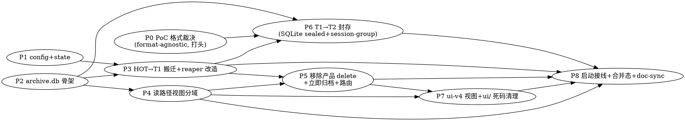

# History Tiered Archive Implementation Plan

> **实施状态（2026-07-14，全 8 阶段 landed，待合并 master）**：worktree `.worktrees/tiered-archive/` @ `feat/history-tiered-archive`。**P0-P8.1 全部实现 + 各阶段测试绿**（P0 PoC 格式裁决 SQLite sealed+session-group ✅ / P1 config 5 触点 369 pass ✅ / P2 archive.db 骨架 6 pass ✅ / **P3 HOT→T1 搬迁承重 + reaper 分流 10 pass**（GPT reviewer 用真实 32GB 库实测复现 2 BLOCKER〔SELECT * 列序错位 + verify 不比内容〕、已治根修复 + legacy-shape 回归测试）✅ / P4 读路径视图分域 5 pass ✅ / P5 移除产品 delete + archive-now 17 pass ✅ / P6 T1→T2 session-group 封存 + 归档读 7 pass ✅ / P7 ui-v4 归档文案 + ui/ 死码 + leak 修复 ✅ / P8.1 启动接线 4 pass ✅ / P8.3 doc-sync 全 landed ✅）。广 history 套件 510 pass。**待收尾**：P8.2 合并态评审（GPT reviewer 后台进行）+ merge master（分支落后、有 peer WIP 并发）。承重教训见 ADR `2026-07-14-tiered-archive-cold-format` + 记忆 `project-history-tiered-archive`。**4 个测试失败（ConsoleSink thinking×3 + resetReaperDiagnosticsForTests）是并发 peer WIP、不在本 diff。**

> **For agentic workers:** REQUIRED SUB-SKILL: Use superpowers:subagent-driven-development (recommended) or superpowers:executing-plans to implement this plan task-by-task. Steps use checkbox (`- [ ]`) syntax for tracking. **每 task 的逐字节 bite-sized TDD 步骤在执行期由 per-task subagent 即时展开**——本 plan 给出每 task 的文件/接口/测试 oracle/不变量/验收，Phase 0 附全套 bite-sized 模板。

**Goal:** 把 History 从「单库 history.db + 到量硬删（真丢失）」升级为 **HOT（history.db，近 3d + pinned）→ TIER-1（archive.db，SQLite）→ TIER-2（archive-NNNN 封存，SQLite sealed + session-group）** 三层单向降温、产品面无删除、按视图分域访问的归档体系。

**Architecture:** 新增 `archive.db`（复用 entries_v2/entry_stages/msg_blob/req_msg/req_aux schema + tier2_manifest）承 tier-1；reaper 的到量 DELETE 改为「先写 archive + 多子表校验 + 才删 HOT」的 move 语义；tier-1 撞 size_cap 后按 session_id 分组封存为编号不可变 SQLite sealed 冷单元（单 zstd 流、9× 压缩）+ manifest 富索引。**视图分域**：HOT 视图只查 history.db、归档视图（独立 URL `tier=archive`）只查 archive.db，两者绝不同列。tier-2 载体经 Phase 0 PoC 实测裁决为 SQLite sealed（否决 Parquet）。

**Tech Stack:** Bun 1.3.14（主）/ Node 24.16（compat），`bun:sqlite`/`node:sqlite`（无 better-sqlite3），Umzug hybrid forward-runner，`node:zlib` zstd（`compression.ts`，tier-2 用 max level L19）。**零新运行时依赖**（Phase 0 否决 Parquet/hyparquet）。

**权威依据：** spec [docs/spec/2026-07-14-history-tiered-archive.md](../../spec/2026-07-14-history-tiered-archive.md)（三轮 GPT 对抗评审 3 BLOCKER + 8 HIGH + 2 MEDIUM + 2 LOW 全吸收、判可进 plan）。现状 skill `history-sqlite-schema` / `history-backfill` / `persistence-async-invariants` / `test-isolation`。

## Global Constraints（每 task 隐含继承，逐字复制自 spec）

- **永不真删（红线）**：生产代码路径无 `DELETE FROM entries_v2`，唯一例外是 §3.4 move 语义「多子表校验通过后删 HOT 副本」（且副本已完整落 archive）。`deleteEntries`/`clearAllEntries`/`clearHistory` 保留为 **test-only 内部原语**（`resetTestRuntime` + 13+ 集成测试 + `scoped-delete.unit.test.ts` 依赖），**移除其 HTTP 路由 + 用户入口**。
- **move 语义严格顺序**：**先写 archive.db（单库事务）→ 多子表校验（head + 全 entry_stages 行数/hash + req_msg/req_aux 完整 + 全 req_msg.hash 在 archive.msg_blob 有对应行）→ 才删 HOT**。绝不「先删后写」。幂等恢复：archive 已存在该 id → 跳过写入但**仍完整走 verify→delete-HOT**（非跳过整行）。
- **msg_blob 复制非移动**：`INSERT OR IGNORE INTO archive.msg_blob`（内容寻址跨请求共享，绝不因 HOT 仍引用而跳过复制到 archive，否则 archive 侧 INNER JOIN 静默丢搜索）。HOT 侧 GC 现状不动、archive 侧独立同构 GC 挂 tier1-migrate 每批收尾。
- **pinned 完全豁免**：pinned 行永不降温（时间搬迁 + 数量安全阀 + 手动「立即归档」谓词均含 `pinned = 0`），永驻 HOT。
- **视图分域**：HOT 视图（`tier=hot`）与归档视图（`tier=archive`）从不同库查、绝不同列；单次查询只打一个库，故无跨库 UNION 去重需求。切视图短暂双现窗口是已知非缺陷（§9），跨 tier 聚合须按 id 防重复计数。
- **archive.db schema 演进**：archive.db 跑**独立** `applyForwardMigrations`（独立 `history_meta` 账本），与 history.db schema 同源同步、防 drift。
- **runtime**：Bun 主 / Node compat；SQLite 分流 `typeof globalThis.Bun`；封存格式两 runtime 加载读写须实测（bun-first ADR）。tier-2 若采候选 A，`hyparquet`/`hyparquet-writer` 须实测 Bun+Node 原生可跑。
- **never-throw 后台**：搬迁/封存仿现有 backfill 骨架——async/chunked/resumable/yield between batches/never-throw，绝不阻塞启动或饿死请求（skill `history-backfill` + `persistence-async-invariants`）。
- **config 5 触点**（DESIGN.md 惯例）：`schema.ts`（`HistoryConfigSchema` 加 `archive` 子节）+ `config.ts`（apply）+ `state.ts`（字段 + `historyLimitListeners` 热重载）+ bundled `config.yaml`（双语注释）+ 运行时选项表，缺一不可。warn-continue、留旧键兼容、绝不因配置杀进程（记忆 `feedback-config-philosophy-separate-compat-and-warn-continue`）。
- **测试隔离**：DI 注入临时 `db_path` + `archive.dir`（skill `test-isolation`，Bun `os.homedir()` 忽略 `env.HOME`）；**绝不碰 4141 主服务器**（起测试服务器用非 4141 端口、按 PID 精确清理，CLAUDE.md `protect-user-main-server`）。
- **提交**：细粒度显式 pathspec（`git commit -- <精确路径>`）、conventional commits、无模型署名。隔离 worktree `.worktrees/tiered-archive/` + 分支 `feat/history-tiered-archive`（并发会话隔离，CLAUDE.md `concurrent-sessions`）。

## 阶段 DAG（依赖 + 格式门）

**Phase 0 已解格式门**：tier-2 = SQLite sealed（否决 Parquet）+ 按 session_id 分组单 zstd 流（9× 压缩，权威 `exp/tiered-archive-format/FINDINGS.md`）。P6 任务已按此展开。

## 文件结构（decomposition 锁定）

**新建：**
- `src/lib/history/sqlite/archive-db.ts` — archive.db 打开/schema/tier2_manifest DDL/独立 `applyForwardMigrations`/连接管理。`openArchiveDb(dir)` / `getArchiveDb()` / `isArchiveOpen()` / `closeArchiveDb()`。
- `src/lib/history/sqlite/tier1-migrate.ts` — HOT→TIER-1 搬迁（可恢复骨架 + 多子表 move+verify + msg_blob 复制 + archive 侧 GC + 手动「立即归档」）。`runTier1MigrationOnce(opts)` / `migrateEntriesToTier1(ids)` / `startTier1Migration()` / `stopTier1Migration()`。
- `src/lib/history/sqlite/tier2-seal.ts` — TIER-1→TIER-2 封存编排（session-group、manifest 写 + 删 tier-1 源行同 archive.db 单库事务）。`runTier2SealOnce()` / `startTier2Seal()`（P6）。
- `src/lib/history/sqlite/tier2-archive.ts` — 封存单元格式（SQLite sealed + session-group，Phase 0 裁决）。`writeSealUnit(sessionId, entries) → fileName` / `readSealedEntry(sealFile, indexInSession) → HistoryEntry`（P6）。
- `exp/tiered-archive-format/` — Phase 0 PoC 实验代码 + `FINDINGS.md`（keep-poc-in-project）。

**修改：**
- `src/lib/history/sqlite/reaper.ts` — `evictBucket` DELETE → move-to-tier1（`enabled` 时）；谓词含 `pinned=0`。
- `src/lib/history/sqlite/read.ts` — `queryEntries`/`querySummaries`/`getEntryById` 加 `tier` 参数分域。
- `src/lib/history/sqlite/search-query.ts` — `searchInbound`/`searchAux` 按 `tier` 分域（archive 加 `archive.` 前缀）。
- `src/lib/history/sqlite/schema.ts` — 加 `tier2_manifest` DDL（archive.db 用）。
- `src/lib/history/sqlite/write.ts` — `deleteEntries`/`clearAllEntries` 保留 test-only、移除产品面暴露。
- `src/routes/history/handler.ts` — 移除 DELETE 路由（`:177-193`）；加「立即归档」端点 + `tier` 查询参数路由。
- `src/lib/history/entries.ts` — `clearHistory()` 保留 test-only；加「立即归档」编排。
- `src/lib/config/schema.ts` / `config.ts` / `state.ts` — `history.archive.*` 5 触点。
- `config.yaml` — bundled `history.archive` 节（双语注释）。
- `src/start.ts` — 启动接线：两库 floor + `applyForwardMigrations` + archive 连接 + 启动搬迁 + 启动封存（`startHistoryBackfills` 一带）。
- `ui-v4/src/components/requests/HistoryListShadcn.tsx` + `HistoryList.tsx` — 「清空历史」改「立即归档」文案 + 归档视图入口。
- `ui/src/api/http.ts` + `ui/src/composables/history-store/useHistoryData.ts` — 清理指向待删 DELETE 端点的死引用。

---

## Phase 0 — PoC 格式裁决（✅ 已完成，裁决 SQLite sealed + session-group）

> **实施状态**：landed（commit c88fd735）。裁决权威 `exp/tiered-archive-format/FINDINGS.md`。下方 bite-sized 步骤为存档记录。

**目标**：用**真实 history blob** 实测裁决 tier-2 载体（候选 A Parquet vs 候选 B SQLite sealed），并交付容量锚点 / dedup 膨胀 / warn 默认值。产出 `exp/tiered-archive-format/FINDINGS.md`。**GATES P6**。

**Files:**
- Create: `exp/tiered-archive-format/probe.ts`（PoC 驱动）
- Create: `exp/tiered-archive-format/FINDINGS.md`（结论）

**Interfaces:**
- Consumes: 现有 `assembleFullEntry`（`serialize.ts:506`）/ `deserializeEntry`（`serialize.ts:455`）/ `compression.ts` 的 `compress`/`decompress` / `driver.ts` `createDatabase`。真实 blob 源：运行中 4141 `GET /history/api/entries/:id`（全腿全量）或直读**副本**库（绝不对运行中主库直读，torn snapshot）。
- Produces: FINDINGS.md 的裁决结论（采 A 或 B）+ 6 项数字，供 P6 展开采纳候选。

- [ ] **Step 1: 取真实样本** — 从 4141 History API 拉 N≥200 条真实 entry（覆盖 streaming/non-streaming、多 attempt、大 sse_events），存 `exp/tiered-archive-format/samples.jsonl`。命令：`curl -s localhost:4141/history/api/entries?limit=200` 取 id 列表 → 逐条 `GET /history/api/entries/:id`。

- [ ] **Step 2: 候选 B（SQLite sealed）落盘 + 测字节/读延迟** — 写 `probe.ts`：把样本经 `serializeHeadEntry`+`compress` 存进一个新 `:memory:`/临时 SQLite（VACUUM + max-zstd），测总字节、单条 `getEntryById` 等价读延迟（p50/p99）。

- [ ] **Step 3: 候选 A（Parquet）落盘 + 测字节/读延迟** — `bun add -D hyparquet hyparquet-writer`（-D：PoC 期不进生产依赖）；probe.ts 加：meta 列拆分 + `full_gz`（我方 zstd）BYTE_ARRAY 列写 Parquet，测总字节、单行读（hyparquet 按 row 读）延迟。

- [ ] **Step 4: round-trip 保真（两候选）** — `assembleFullEntry` → 写 → 读回 → `deserializeEntry`，与原 entry **深等**（独立 oracle，逐字段 deep-equal，非自洽）。任一候选 round-trip 失败即出局。

- [ ] **Step 5: Bun+Node 双运行时（候选 A）** — 若 A 在字节/延迟不出局，`bun build --target node` 打 probe bundle，真 Node 跑 hyparquet 读写（bun-first 合规，参考 skill `history-sqlite-schema` 的 Umzug 跨-runtime e2e 手法）。

- [ ] **Step 6: 容量锚点（M2）** — 对真实 `history.db` 副本 `SELECT COUNT(*), SUM(LENGTH(blob_gz)) FROM entries_v2 WHERE ended_at > (now-3d) AND status IN (终态)`，估 HOT 稳态体积 + 对 startup VACUUM（`VACUUM_WARN_BYTES=1GB`）/ 搬迁 tick 耗时影响。

- [ ] **Step 7: dedup 膨胀 + 合并帧（§3.5/§6.5）** — 量化跨库复制 msg_blob 的 tier-1 膨胀幅度；测「封存单元保留 request_group 合并帧 vs 摊平进单 blob」压缩比差。

- [ ] **Step 8: tier2_warn_count 默认值（O1）** — 按 Step 6 实测 entry 均字节换算「500MB / 均字节 = 每封存单元条数」→ 合理 `tier2_warn_count`。

- [ ] **Step 9: 写 FINDINGS.md + 裁决** — 6 项数字表 + **明确裁决「采候选 A 或 B」+ 理由**。若 B 相近或更优 → 采 B（零依赖、复用现有栈、更简单）。`bun remove hyparquet hyparquet-writer`（若裁决采 B）。

- [ ] **Step 10: Commit** — `git add exp/tiered-archive-format/ && git commit -m "poc: tier-2 archive format decision (Parquet vs SQLite sealed) findings"`

---

## Phase 1 — config + state（`history.archive.*` 5 触点）

**Files:** Modify `src/lib/config/schema.ts`（`HistoryConfigSchema` 加 `archive: nullableSection(HistoryArchiveConfigSchema)`）、`config.ts`（apply 6 键 → `setHistoryConfig`）、`state.ts`（字段 + `historyLimitListeners` 复用）、`config.yaml`（bundled `history.archive` 节双语注释）；运行时选项表。
**Test:** `tests/config/history-archive-config.unit.test.ts`

**Interfaces:**
- Produces: `state.historyArchiveEnabled: boolean` / `historyArchiveHotDays: number` / `historyArchiveTier1SizeCap: number`（bytes）/ `historyArchiveTier2WarnCount: number` / `historyArchiveTier2WarnBytes: number` / `historyArchiveDir: string`。默认 §3.7（`tier2_warn_count` 用 P0 Step 8 值）。

**Task 1.1** — schema + state 字段 + 默认。**Oracle**：zod 解析合法/非法 config，非法值 warn-continue 不抛（复用 `nullableSection`+`.strict()`）；旧键无 → 默认。**不变量**：`enabled=false` 时行为退回现状（数量 reaper 硬删）。
**Task 1.2** — config.ts apply + bundled config.yaml 节 + 热重载 listener（改 `hot_days`/`size_cap` 触发 listener，同 reaper 三输入）。**Oracle**：热重载改 `hot_days` 后 `state` 更新、listener 触发。

---

## Phase 2 — archive.db 骨架

**Files:** Create `src/lib/history/sqlite/archive-db.ts`；Modify `schema.ts`（加 `tier2_manifest` DDL）。
**Test:** `tests/history/sqlite/archive-db.unit.test.ts`

**Interfaces:**
- Consumes: `driver.ts` `createDatabase`、`schema.ts` `SCHEMA_SQL`/`HISTORY_META_DDL`、`migrations/run.ts` `applyForwardMigrations`。
- Produces: `openArchiveDb(dir: string): Database` / `getArchiveDb(): Database` / `isArchiveOpen(): boolean` / `closeArchiveDb(): void` / `attachArchive(main: Database, dir: string): void`（`ATTACH ? AS archive`）。`tier2_manifest` schema：`(entry_id TEXT PRIMARY KEY, session_id, model, endpoint, status, started_at, ended_at, ...全 meta 列, preview_text, parquet_file TEXT, row_index INTEGER)` + 索引（started_at DESC / session / model / status）。

**Task 2.1** — `tier2_manifest` DDL + archive-db open（复用 SCHEMA_SQL 建同构 entries_v2 等 + manifest）。**Oracle**：裸 `:memory:` open archive.db → 全表存在（entries_v2/entry_stages/msg_blob/req_msg/req_aux/tier2_manifest/history_meta）。**不变量**：archive.db 与 history.db schema 同源（同 `SCHEMA_SQL`）。
**Task 2.2** — archive.db 独立 `applyForwardMigrations`（独立账本，storage 双 guard 复现真实接线，参考 skill `history-sqlite-schema` chicken-egg 教训）。**Oracle**：archive.db 跑迁移后 `history_meta.schema_migrations` 账本独立于 history.db；partial-DDL wedge 回归（多语句迁移中途抛可重试）。

---

## Phase 3 — HOT→TIER-1 搬迁 + reaper 改造（承重、最高风险）

**Files:** Create `src/lib/history/sqlite/tier1-migrate.ts`；Modify `reaper.ts`（`evictBucket` → move）。
**Test:** `tests/history/sqlite/tier1-migrate.it.test.ts`（含崩溃注入）、`tests/history/sqlite/reaper-move.it.test.ts`

**Interfaces:**
- Consumes: `archive-db.ts` `getArchiveDb`/`attachArchive`、`serialize.ts` `assembleFullEntry`、`write.ts` `GC_ORPHAN_MSG_BLOB_SQL`、`connection.ts` `getDatabase`。
- Produces: `runTier1MigrationOnce(opts: { hotDays: number; batchSize: number }): number`（搬迁行数）/ `migrateEntriesToTier1(ids: string[]): number`（手动「立即归档」，供 P5 编排）/ `startTier1Migration()` / `stopTier1Migration()` / `migrateOverflowToTier1(successLimit, failureLimit): number`（数量安全阀，供 reaper 调）。

**Task 3.1** — 单条 move 原语（§3.4 四步：写 archive 单库事务 → 多子表校验 → 删 HOT → 幂等恢复）。**Oracle**：move 后 archive 侧 `assembleFullEntry` 与原 HOT entry **深等**（全 stages/全消息/引用完整）；HOT 侧该 id 已删。**不变量**：先写后删、校验含全子表。
**Task 3.2** — msg_blob 复制语义（§3.5：INSERT OR IGNORE 复制、共享 hash 不跳过）。**Oracle**：hash H 同被待迁 entry X + 留 HOT entry Y 引用 → move X 后 archive.msg_blob 有 H、HOT.msg_blob 仍有 H（Y 引用），archive 侧 `searchInbound` 命中 X 的该消息（正样本先证搜索触达）。
**Task 3.3** — 崩溃注入 + 幂等恢复（在步骤 1/2/3 各点注入崩溃，重跑）。**Oracle**：崩溃在「写完 archive、没删 HOT」→ 重跑不留「两头有」重复、不丢；崩溃在「写 archive 中途」→ 重跑重写、无半行。**连跑 10 次证确定性**（skill `empirical-verification`）。
**Task 3.4** — archive 侧独立 msg_blob GC 挂每批搬迁收尾（§3.5）。**Oracle**：archive 侧孤儿 msg_blob（req_msg 已删）被 GC；HOT 侧 GC 不受影响。
**Task 3.5** — reaper `evictBucket` DELETE → `migrateOverflowToTier1`（`enabled` 时；`enabled=false` 保留旧 DELETE）。谓词含 `pinned=0`（复用 `SUCCESS_WHERE`/`FAILURE_WHERE`）。**Oracle**：超量行搬去 tier-1 而非删（archive 侧找得到）；pinned 行任意 tick 后仍在 HOT；`enabled=false` 时行为逐字节同现状硬删。
**Task 3.6** — 时间搬迁主机制 `runTier1MigrationOnce`（`started_at < now-hot_days` 终态非 pinned，chunked/resumable/never-throw）。**Oracle**：>hot_days 行搬走、<hot_days + pinned 留 HOT；cursor 中断重跑续。

---

## Phase 4 — 读路径视图分域（B1 + 视图裁定）

**Files:** Modify `read.ts`（`tier` 参数）、`search-query.ts`（按 tier 分域）、`queries.ts`（透传 tier）。
**Test:** `tests/history/sqlite/read-tier-split.it.test.ts`、`tests/history/search-tier.it.test.ts`

**Interfaces:**
- Consumes: `archive-db.ts`、Phase 3 搬迁产物。
- Produces: `queryEntries`/`querySummaries`/`getEntryById`/`searchInbound`/`searchAux` 加 `tier?: "hot" | "archive"`（默认 `hot`，现状不变）。`QueryOptions` 加 `tier` 字段。

**Task 4.1** — list 分域（`tier=hot` 查 history.db 现状 / `tier=archive` 查 archive.db + tier2_manifest meta-only）。**Oracle**：搬迁一条后 `tier=hot` 列表不含它、`tier=archive` 含它；两视图绝不同列同一 id。**不变量**：单次查询只打一个库。
**Task 4.2** — detail 分域（`tier=archive` 先查 archive head/stages → 未命中查 tier2_manifest 定位封存单元、`readSealedEntry`（P6 提供，P4 期先 stub 抛 not-implemented 或 gate 在 tier-2 存在性））。**Oracle**：tier-1 entry `tier=archive` detail 复原深等。
**Task 4.3** — 深度搜索分域（`search-query.ts` 五 facet 按 tier 加 `archive.` 前缀；plan 给 `searchInbound` 归档库内 GROUP BY hash + 最早 owner 子查询 SQL 骨架）。**Oracle**：entry 降温后 `tier=archive` search 五 facet 仍命中（正样本先证 HOT 搜索触达、再证降温后归档命中）；`tier=hot` 不含已降温。

---

## Phase 5 — 移除产品面 delete + 立即归档 + 路由（H2）

**Files:** Modify `write.ts`（delete 保留 test-only）、`handler.ts`（移除 DELETE 路由 + 加立即归档端点 + tier 参数）、`entries.ts`（clearHistory test-only + 立即归档编排）。
**Test:** `tests/infra/management-routes.http.test.ts`（改：DELETE 路由 404 + 立即归档 200）

**Interfaces:**
- Consumes: Phase 3 `migrateEntriesToTier1`、Phase 4 tier 参数。
- Produces: HTTP `POST /history/api/archive-now`（body: 可选 filters；无 filters=全部合格）→ 触发 `migrateEntriesToTier1`；list/detail/search 端点加 `?tier=` query。

**Task 5.1** — 移除 DELETE 路由（`handler.ts:177-193` clear-all + scoped 分支）、`write.ts` delete 原语标注 test-only（不再 HTTP 暴露）。**Oracle**：`DELETE /history/api/entries` → 404/405；`bun test` 全绿（`resetTestRuntime`/`scoped-delete.unit.test.ts` 仍用内部原语）。**不变量**：test-only 原语签名不变。
**Task 5.2** — 「立即归档」端点 + 编排（§3.6 边界：排除 pinned、不受 hot_days、默认全部/有筛选 scoped）。**Oracle**：POST archive-now 后合格行进 tier-1、pinned 留 HOT、未到 3d 的也归档（不受门槛）。
**Task 5.3** — list/detail/search 端点加 `?tier=` query 路由。**Oracle**：`?tier=archive` 命中归档视图、缺省=hot。

---

## Phase 6 — TIER-1→TIER-2 封存（**Phase 0 已裁决：SQLite sealed + session-group**）

> **Phase 0 FINDINGS 已解格式门**（`exp/tiered-archive-format/FINDINGS.md`）：tier-2 = **SQLite sealed**（否决 Parquet，零新依赖）+ **按 session_id 分组的单 zstd 流**（9× 压缩 vs per-entry：28.20→3.16 MB）。下方任务已按此裁决展开。

**Files:** Create `tier2-seal.ts` + `tier2-archive.ts`；Modify `schema.ts`（tier2_manifest 已在 P2，locator 列 `seal_file`/`session_id`/`index_in_session`）。
**Test:** `tests/history/sqlite/tier2-seal.it.test.ts`（含崩溃注入）

**Interfaces:**
- Produces: `writeSealUnit(sessionId: string, entries: HistoryEntry[]): { fileName: string }`（session 分组、单 zstd 流、编号 sealed SQLite 文件 `archive-NNNN.db`）/ `readSealedEntry(sealFile: string, indexInSession: number): HistoryEntry`（解压 session blob 取第 i 条）/ `runTier2SealOnce(): number` / `startTier2Seal()`。
- `tier2_manifest` locator = `(seal_file, session_id, index_in_session)`。

**Task 6.1** — `writeSealUnit`：按 session 收集 tier-1 待封存 entry → `assembleFullEntry` 数组 → **单 zstd 流（max level L19）** → 写编号 sealed SQLite 文件；临时文件 → fsync → 原子 rename。**大 session 有界**：单 seal unit 上限 ~50 MB 解压后 / N≈100 条，超则同 session 拆多子单元（`index_in_session` 连续跨单元）。**Oracle**：session 分组封存字节 ≈ Phase 0 session-group 数量级（≪ per-entry）；round-trip 深等。**不变量**：封存单元不可变、编号 NNNN。
**Task 6.2** — manifest 写 + 删 tier-1 源行**同 archive.db 单库事务**（§M1）。**Oracle**：崩溃在「写完 seal 文件、没写 manifest」→ 重跑不重复封存（manifest 已存在则跳过该 session）。**连跑 10 次证确定性**。
**Task 6.3** — `readSealedEntry`：manifest 定位 → 解压 session blob → 取第 i 条 → `deserializeEntry`。**Oracle**：封存后归档视图 detail 复原深等；可选 session-blob LRU 缓存摊薄 665ms 单条读。
**Task 6.4** — size_cap 触发（archive.db > `tier1_size_cap` 默认 2GB）+ tier2_warn 告警（超 `tier2_warn_count`=200 / `tier2_warn_bytes`=500MB 仅 `consola.warn` 绝不删）。**Oracle**：archive.db > cap 触发封存最旧 session；tier-2 超阈值 warn、文件不删。

---

## Phase 7 — ui-v4 视图 + 文案 + ui/ 死码清理

**Files:** Modify `ui-v4/.../HistoryListShadcn.tsx` + `HistoryList.tsx`；清理 `ui/src/api/http.ts` + `ui/src/composables/history-store/useHistoryData.ts`。
**Test:** `ui-v4` vitest（skill `debugging-frontend-tests`）；权威门 `typecheck:ui-v4` + rollup（记忆 `feedback-verify-ui-with-build-not-just-typecheck`）。

**Task 7.1** — 「清空历史」对话框改「立即归档」（文案 + 去 `variant="destructive"` + "已删除 N 条"→"已归档 N 条"，`HistoryListShadcn.tsx:280/656/671`）。**Oracle**：点击调 archive-now 而非 DELETE。
**Task 7.2** — 归档视图入口（复用列表 UI、`tier=archive` URL、与 HOT 视图互斥切换）。**Oracle**：切归档视图只列 archive 数据、不含 HOT。
**Task 7.3** — 清理 legacy Vue `ui/` 死引用（`http.ts:101-107` deleteEntries/deleteSession、`useHistoryData.ts:197` clearAll，无 .vue 接线的死码）。**Oracle**：`build:ui` 通过、无指向已删端点引用。

---

## Phase 8 — 启动接线 + 合并态 + doc-sync

**Files:** Modify `start.ts`；Modify `docs/DESIGN.md`（活的架构现状加行）、`docs/API.md`（archive-now 端点 + tier 参数）、`docs/history.md`（三层降温节）、新 ADR `docs/decisions/2026-07-14-tiered-archive-cold-format.md`（tier-2 格式裁决记录）、`docs/todo/deferred-backlog.md`（O3/O4）。

**Task 8.1** — start.ts 启动接线：两库 floor + `applyForwardMigrations`（history + archive）+ archive 连接/ATTACH + 启动搬迁（`startTier1Migration`）+ 启动封存（`startTier2Seal`），`startHistoryBackfills` 一带、never-throw。**Oracle**：启动后 archive.db 建、搬迁后台跑、不阻塞 listen。
**Task 8.2** — 合并态评审（whole-branch，专抓跨 phase 集成缝：搬迁↔读路径↔搜索↔封存↔启动的接线、reaper move 与 in-flight 交互、config enabled 全路径生效）。派 subagent（记忆 `methodology-cross-phase-integration-seam-only-caught-at-merged-state`）。
**Task 8.3** — doc-sync：DESIGN.md 活的架构现状行 + L1 存在性守卫、API.md 端点、history.md、ADR、backlog O3/O4；跨文档 grep 验证（skill `session-closeout`）。

---

## Self-Review（against spec）

- **诉求① 永不真删**：P3 move 语义 + P5 移除 delete + Global Constraint 红线 ✅
- **诉求② 高压缩比**：P0 格式裁决 + P6 封存 ✅
- **诉求③ 富可索引/全文检索**：P4.3 search 分域（B1）+ tier2_manifest 富索引 ✅
- **诉求④ 低访问代价**：P4 视图分域 + manifest 定位单条读 ✅
- **spec §3.1-3.7 全决策**：reaper move(P3.5)/格式(P0,P6)/pinned(P3.5,P3.6)/move 原子性(P3.1,P3.3)/dedup(P3.2,P3.4)/移除 delete(P5)/config(P1) 各有 task ✅
- **spec §4 全读路径**：list/detail/search(P4) + in-flight 不变 ✅
- **spec §6 Phase 0 六项**：P0 Step 1-9 全覆盖 ✅
- **spec §10 评审台账 B1/B2/B3/H1-H5/M1/M2/2LOW**：B1(P4.3)/B2(P3.1,3.3)/B3(P3.2,3.4)/H1(P2.2)/H2(P5)/H3(P3.5,3.6)/H4(P4 视图分域消解)/H5(P0)/M1(P6.2)/M2(P0.6)/LOW-ui(P7.3)/LOW-验收(P8.3 doc) ✅
- **格式门**：Phase 0 已裁决 SQLite sealed + session-group，P6 按此展开 ✅
</content>
