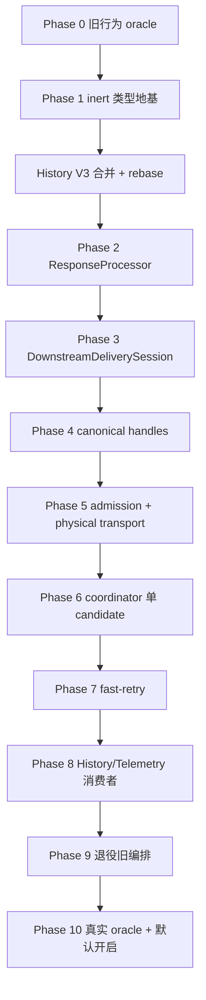

# 上游生成运行时重构——分阶段 TDD 实施计划

日期：2026-07-16｜状态：**待评审**｜权威规格：[RFC](../../rfc/2026-07-16-upstream-generation-runtime.md)

## 0. 目标与红线

本计划把冻结 RFC 转成可逐 commit 执行的 TDD 工作。最终形态包含三个正交 engine：

1. `Upstream Connection Liveness`：只负责 socket／session 的 TCP keepalive、HTTP/2 PING 与 transport cleanup，不产生语义进展，不控制下游 heartbeat。
2. `Upstream Retry & Competition`：只负责 generation／candidate／dispatch 拓扑、reactive retry、429 replay、WS fallback、buffered recovery 与 fast-retry winner 选择，不拥有下游 timer／block ledger／sink。
3. `Downstream Delivery Liveness`：每个客户端 generation 一个长寿命 session，跨所有上游 attempt 持续存在；只读取已经实际写给客户端的 block ledger；在 generation 仍可重试时只保活，在成功、重试用尽、generation-global nonretryable、request cancel 或 client abort 时执行唯一终止协议。

全程红线：

- History V3 是 canonical SSOT。Commit 2 起必须基于 `feat/history-v3` 合并态，禁止在旧 `HistoryEntry` 上造平行 generation 模型。
- 判胜前 candidate 不得直接写 sink；禁止 buffer cap retreat 把半截帧写给客户端。
- 所有可能改写／drop client-shaped frame 的逻辑必须在 candidate-local `postRenderTransform`，随后才做 boundary classification。`client.outbound` 是 observe-only wire hook。
- `DownstreamDeliverySession` 跨 candidate／dispatch，不因 attempt 开始、失败、重试或切换而重建、停表或清 block ledger。
- `terminate()` 是 delivery 唯一终止入口；单个 candidate nonretryable 但仍有可行 sibling／recovery 时不得结束下游。
- HTTP/2 loser disposal 只关闭自有 stream；WS loser connection 必须标 unusable并由 pool owner关闭，绝不提前回池。
- Canonical History 只在所有 dispatch quiesce，或强制 disposal barrier resolve 后 seal；cleanup grace 到期本身不是 seal 条件。
- 不杀 4141 主服务器。HTTP／E2E 验证使用隔离 runtime 或非 4141 端口。

## 1. 依赖 DAG

Phase 0 可立即执行。Phase 1 只有在新增 inert 类型、不触碰当前 producer 时可在 History V3 前执行。Phase 2 及以后必须等待 History V3 合并到 master，再把本分支 rebase／merge 到该合并态并重新审计全部锚点。

## 2. 全局 commit invariants

每个 commit 结束必须满足：

1. `bun run typecheck` 绿色，相关 `.unit`／`.it`／`.http` 测试绿色。
2. 未启用新 runtime 时 byte-critical client SSE golden 保持不变；若纠正旧缺陷，必须有独立 SDK oracle与文档化覆盖。
3. 一个请求只有一条权威 production path；过渡 adapter 必须显式 `legacy | new-runtime`，不得双写 sink／History／Telemetry。
4. 所有异步 transport／candidate／finalizer 工作进入 operation/finalization tracking，fire-and-forget 只能走 crash-safety observer。
5. 三个 engine 依赖方向保持单向：retry engine可以命令 delivery，delivery 不读取 retry state；transport liveness 不 import generation／delivery。
6. 每个真实 GHC 调用最终映射到一个 dispatch；在 physical transport cutover 前，旧 transport 作为 opaque adapter，不伪称已有完整 physical truth。
7. 每个 commit 都用显式 pathspec 提交，Conventional Commit，不带模型署名。

## 3. Phase 0——预捕获旧行为 oracle

### P0-T1：共享帧顺序与 translation flush golden

**Files**：

- 新增 `tests/pipeline/generation-runtime-baseline.http.test.ts`
- 复用 `tests/helpers/anthropic-frames.ts`、`tests/helpers/sse.ts`、现有 hook mock harness

**RED**：先写 fixture normalization 与 inline snapshot，覆盖 Anthropic direct、Anthropic→Responses、Responses→Anthropic、CC direct、Gemini translation。测试必须先因 snapshot 未生成失败。

**GREEN**：在未改生产代码的旧路径上捕获帧顺序，锁定 post-loop `flushResponse()`、`[DONE]`、tool block、usage 与 terminal。

**Mutation check**：临时在测试 fixture 里删除一个 terminal frame，确认 golden 精确失败，再恢复。

**Commit invariant**：零生产代码改动，oracle 全绿。

**Commit**：`test(pipeline): capture generation runtime frame baselines`

### P0-T2：下游 heartbeat／anchor／terminal golden

**Files**：

- 新增 `tests/pipeline/delivery-lifecycle-baseline.http.test.ts`
- 扩现有 `tests/anthropic/keepalive-buffered-anchor-e2e.http.test.ts`

**RED/GREEN cases**：

1. pre-response synthetic message_start + anchor + empty delta；
2. 真实 block 到来后的 anchor close、index +1 remap；
3. open thinking／text／tool_use block 的 heartbeat delta index/type；
4. upstream retry 前后 heartbeat cadence连续、forwarded synthetic markers连续；
5. exhausted／nonretryable error 的 scaffold close→terminal 顺序；
6. client abort 后无 terminal bytes；
7. terminal 后推进 fake clock不再有 heartbeat。

**Truth domain**：`.http` 断 exact bytes；真实 SDK 容忍度留 P10。

**Commit**：`test(streaming): lock downstream delivery lifecycle`

### P0-T3：transport cancel／fallback／cleanup fault oracle

**Files**：

- 新增 `tests/transport/dispatch-cleanup-baseline.it.test.ts`
- 扩 `tests/responses/upstream-ws-connection.unit.test.ts`

**Cases**：pending headers、pending frame、WS pending first event、rate-limit queue、backoff。每例先证坏实现能留下 active iterator／busy connection／queued request，再断现有行为与未来目标差异。

**特殊正样本**：模拟 WS abort 后旧远端继续发帧，再发同 conversation 新请求；旧实现若污染新 queue，测试必须能抓到，作为 Phase 5 的红测资产。

**Commit**：`test(transport): capture dispatch cleanup gaps`

### P0 Review Gate

独立 reviewer 检查 golden 是否覆盖真实 live path，而不是自己 encode/decode 的自洽测试。通过后提交 Phase 0。

## 4. Phase 1——inert frame／policy 类型地基

### P1-T1：FrameEnvelope 与 additive signals

**Files**：

- 新增 `src/lib/pipeline/stream/frame-envelope.ts`
- 新增 `src/lib/pipeline/stream/protocol-policy.ts`
- 新增 `tests/pipeline/frame-envelope.unit.test.ts`

**Types**：`UpstreamFrameEnvelope`、`ClientFrameEnvelope`、provenance、monotonic timing、`ClientFrameSignals`。Raw frame 保留为事实源，不建厚 IR。

**RED**：synthetic frame永不被判为 semantic boundary；raw unknown字段完整保留；post-render frame identity不丢。

**GREEN**：仅类型和纯 helper，无 production consumer。

**Commit**：`refactor(pipeline): define inert frame policy contracts`

### P1-T2：CandidateStateFactory contract

**Files**：

- 新增 `src/lib/pipeline/generation/candidate-state.ts`
- 新增 `tests/pipeline/candidate-state.unit.test.ts`

先只定义接口与纯 snapshot helper，不接 production。测试逐字段锁 RFC 九字段归属：deep-frozen generation state、candidate-local `prepareHints`／`betaProbe`／mapper／fallback scratch。Mutate primary state不能影响 hedge。

**Commit**：`refactor(pipeline): define candidate state fork contract`

### P1 Review Gate／History V3 Barrier

Phase 1 后停止。确认 History V3 已合并 master；否则不得执行 P2。合并后：

1. `git merge master` 或 rebase 到 V3 合并态；
2. 读取 V3 `ModelOperationRecord`、driver capture、client-sink capture、terminal bus；
3. 更新本计划的 file anchors；
4. 跑 `bun run typecheck`、History V3 canonical tests、Phase 0 goldens；
5. 独立 reviewer确认没有把 V3 arena capture留在错误 wrapper。

## 5. Phase 2——branch-local ResponseProcessor

### P2-T1：Processor factory 与 upstream policy adapter

**Files**：

- 新增 `src/lib/pipeline/stream/response-processor.ts`
- 新增 `src/lib/pipeline/stream/response-processor-factory.ts`
- 修改 `src/lib/pipeline/driver.ts`
- 修改 `src/lib/pipeline/cell-assembly.ts`
- 新增 `tests/pipeline/response-processor.unit.test.ts`

**RED**：每个 processor 独立 rewrite/translator/accumulator state；同 candidate boundary 后 processor identity保持；`finish()` 四 variant完整。

**GREEN**：旧 `runResponse()` 委托 processor，外部接口不变。V3 frame arena capture迁入 processor边界，wrapper不双采样。

**Commit invariant**：Phase 0 exact-byte golden全绿。

**Commit**：`refactor(pipeline): extract branch-local response processor`

### P2-T2：吸收 Responses fallback／Gemini finish

**Files**：

- 修改四 codec／handler 的 `flushResponse` 接线
- 修改 `src/lib/pipeline/stream/response-processor.ts`
- 新增 `tests/pipeline/response-processor-finish.it.test.ts`

**RED cases**：Gemini `FINISH_REASON_UNSPECIFIED` 输出 partial tool frames但抑制伪 terminal；Responses fallback terminal进入同一 processor；S5 buffered rewrite在 error/EOF时先 drain再分类；合法 refusal／empty／incomplete走 `valid-terminal-without-boundary`。

**GREEN**：删除 handler post-loop flush旁路，所有 terminal进入 processor。

**Commit**：`refactor(pipeline): centralize response finish semantics`

## 6. Phase 3——DownstreamDeliverySession

### P3-T1：Delivery session 与 ClientBlockLedger

**Files**：

- 新增 `src/lib/pipeline/delivery/session.ts`
- 新增 `src/lib/pipeline/delivery/types.ts`
- 新增 `src/lib/pipeline/delivery/serializer.ts`
- 修改 `src/lib/pipeline/client-sink.ts`
- 新增 `tests/pipeline/delivery-session.unit.test.ts`

**RED**：ledger 只从真正 wire write 更新；candidate buffer／upstream frame不更新；index是 post-reconcile wire index；attempt切换不清 ledger或heartbeat anchor。

增加可提前执行的多轮注入场景：同一 delivery session 先接收一个 processor `truncated`／dispatch failure，再接收新的模拟 recovery processor并成功 `commitWinnerBlock`；断言 session identity、ledger、heartbeat cadence与scaffold state连续，未因上游轮次重建。

**GREEN**：先在单 candidate路径接入，现有 sink adapter作为底层 writer。

**Commit**：`refactor(streaming): add generation-owned delivery session`

### P3-T2：单写者 queue、heartbeat、terminate fence

**Files**：

- 修改 delivery session／serializer
- 各 client protocol policy增加 scaffold、heartbeat、`terminateFromLedger()`
- 新增 `tests/pipeline/delivery-terminal-race.unit.test.ts`
- 扩 Phase 0 heartbeat golden

**RED cases**：tick 已进入异步 observer但未写时调用 terminate；terminal 后迟到 tick/frame不能写；first-command-wins；client abort零字节；真实 block与synthetic anchor同时open时按policy终止。

**GREEN**：heartbeat、scaffold、winner frame、observe-only egress hook、terminal全部走单写者 queue。`client.outbound` 类型改为 `void` observer；旧可改写逻辑移到 `candidate.postRenderTransform`。

**SDK gate**：Anthropic ledger-aware terminal通过真实 `@anthropic-ai/sdk` 累积；Claude CLI真计时留P10。

**Commit**：`refactor(streaming): unify downstream liveness and terminal fence`

### P3-T3：三 engine import boundary guard

**Files**：

- 修改 `eslint.config.js` 或新增 architecture test
- 新增 `tests/architecture/generation-engine-boundaries.unit.test.ts`

断言 transport liveness不 import generation/delivery；delivery不 import candidate/dispatch/retry；retry只依赖delivery port，不依赖sink实现。

**Commit**：`test(architecture): enforce generation engine boundaries`

## 7. Phase 4——History V3 branded handles 与显式 recording

### P4-T1：CandidateHandle／DispatchHandle canonical model

**Files**：以合并后 V3 实际文件为准，预期修改 `src/lib/context/model-operation-record.ts`、arena origin、terminal types。

**RED**：candidate多dispatch可按handle join；arena upstream source必须有dispatch；terminal显式winner candidate+committed dispatch；数组重排不改变关联。

先用全仓 grep 枚举 `AttemptHandle|attempts[` 消费者，至少覆盖 search／calibration／usage backfill、History REST／projection、TUI/detail。P4-T1 同commit完成 producer + consumer 适配；不允许编译通过但运行时按旧数组位置取 `undefined`。Commit invariant：除迁移说明／旧行读适配外，代码中的 `AttemptHandle` 零残留。

**GREEN**：`AttemptHandle` 强制迁为 `DispatchHandle`，不保留永久 alias；新增 `CandidateHandle`。

**Commit**：`refactor(history): model candidates and physical dispatches`

### P4-T2：RequestContext 显式 handles

**Files**：合并后 `src/lib/context/request.ts`、driver recording adapter、observability events。

**RED**：两个并发 handle交错写 headers/timing/error/frames不串线；任何 response path调用无 handle setter应类型失败或 runtime拒绝。

**GREEN**：删除 producer 对 `_attempts.at(-1)`／`currentAttempt` 的依赖。

**Commit**：`refactor(context): require explicit dispatch recording handles`

## 8. Phase 5——Cancelable admission 与 single-call transport

### P5-T1：UpstreamAdmissionController

**Files**：

- 重构 `src/lib/adaptive-rate-limiter.ts`
- 新增 `src/lib/transport/admission-controller.ts`
- 新增 `tests/transport/admission-controller.unit.test.ts`

**RED**：per-item cancel、`rejectAll`、sleep中cancel、admission后dispatch前二次gate、429 decision不执行fetch。

**GREEN**：`acquire(signal)`只管排队／节流，`observe(429)`返回下一dispatch决策；旧 wrapper保留短期 adapter但同一请求只有一条活路径。

**Commit**：`refactor(transport): split cancelable admission from dispatch`

### P5-T2：PhysicalTransport 单调用 contract

**Files**：

- 重构 `src/lib/transport/http-transport.ts`、`responses-transport.ts`、`send.ts`
- 修改 upstream WS connection／pool
- 新增 `tests/transport/physical-transport.it.test.ts`

**RED**：一次 `open()`最多一次网络调用；typed stream/json/fallback/failed result；`cancel()`协作；`dispose()` barrier后无late callback。

**HTTP/2 cases**：dispose只关闭自有stream，共享session sibling继续，H2 PING仍由pool owner管理。

**WS cases**：loser mark unusable/draining；旧远端迟到帧不进入下一请求queue；pool owner close后 barrier resolve；连接绝不提前复用。

直接复用／扩展 P0-T3 的 WS 污染 fixture，不重写一套同源夹具。注入 pool-owner close delay，断言 delay期间 `dispose()` 与 `quiesced` 均不 resolve；close、listener detach、queue isolation、busy-state barrier完成后才resolve。

**Commit invariant**：同commit建立最小 scheduler接管429 replay与WS fallback，不能出现失去重试的中间态。

**Commit**：`refactor(transport): expose single-call dispatch lifecycle`

### P5-T3：上游 connection liveness ownership

**Files**：HTTP2 session pool／proxy config docs／architecture tests。

锁定 TCP keepalive与session PING随connection lifetime；dispatch retry不重建／停止shared ping；control ping不产生 semantic event、不更新delivery ledger或hedge clock。

**Commit**：`refactor(transport): isolate upstream connection liveness`

## 9. Phase 6——GenerationCoordinator 单 candidate

### P6-T1：CandidateRuntime 与 recovery topology

**Files**：

- 新增 `src/lib/pipeline/generation/candidate.ts`
- 新增 `src/lib/pipeline/generation/dispatch-scheduler.ts`
- 新增 `tests/pipeline/candidate-runtime.it.test.ts`

Reactive/429/WS fallback是同candidate新dispatch；buffered recovery是新candidate。Processor boundary后candidate runtime暂停拉下一帧等待winner决定。

**Commit**：`refactor(pipeline): add candidate and dispatch runtime`

### P6-T2：Coordinator 单 candidate cutover

**Files**：

- 新增 `src/lib/pipeline/generation/coordinator.ts`
- 修改 driver及四handler入口
- 新增 `tests/pipeline/generation-coordinator.it.test.ts`

Hedge关闭，primary-only。旧 `runExchange`／`runResponseSink`／`runResponseBufferedSink` 委托coordinator。Delivery session跨reactive/recovery持续存在。

**RED**：retry仍可行时不terminate；全recovery exhausted→一次 `upstream-exhausted`；generation-global nonretryable→一次terminal；candidate nonretryable但sibling可行时delivery继续。

**Commit**：`refactor(pipeline): cut over to generation coordinator`

### P6-T3：两阶段 delivery／observability terminal

**Files**：generation finalizer、History V3 terminal bus、shutdown finalization barrier。

**RED**：client terminal立即完成wire；loser cleanup晚到仍进入canonical；grace expiry→force dispose→barrier→seal；seal后无late local fact；shutdown等待generation finalizer。

**Commit**：`refactor(lifecycle): separate delivery and observability terminal`

## 10. Phase 7——Fast-retry／hedging

### P7-T1：HedgePolicy 与 server execution risk

**Files**：

- 新增 `src/lib/pipeline/generation/hedge-policy.ts`
- 新增 endpoint-specific server tool classifiers
- 新增 `tests/pipeline/hedge-policy.unit.test.ts`

Fake monotonic clock。300s从首次 `transport.open()`前起算，不含admission queue。Synthetic scaffold不算semantic block。Server tools默认禁用；custom/client tools正负样本。Timeout=0按∞；budget在generation创建时冻结。

**Commit**：`feat(pipeline): define fast-retry eligibility`

### P7-T2：Secondary、winner CAS 与 loser cancel

**Files**：coordinator、candidate runtime、delivery port。

**RED cases**：primary不cancel、secondary胜、primary在hedge后仍胜、同时boundary只有一winner、error不抢成功、valid terminal延后仲裁、loser无sink capability。用fake monotonic clock + controllable coordinator queue构造两个candidate同一tick入列；固定first-observed序号，若入列序号相同则primary按candidate sequence胜，连跑不flake。

**GREEN**：串行coordinator event queue first-observed winner；立即cancel loser，不等cleanup才flushwinner；同processor继续winner live stream。

**Commit**：`feat(pipeline): race hedged generation candidates`

### P7-T3：Caps 与总预算

实现 active/total candidates、active/total dispatches、candidate/generation bytes、recovery budget。超限不live retreat；先拒新recovery、再拒hedge、再fail超cap candidate。

**Commit**：`feat(pipeline): bound generation competition resources`

## 11. Phase 8——History／Telemetry 消费者

### P8-T1：V3 persistence/projection

按canonical candidate/dispatch model落存储、API和UI类型。Search/calibration/backfill显式读winner candidate+committed dispatch，物理fact读全dispatch。

**Tests**：V3 round-trip、arena provenance、数组重排、loser partial usage、cleanup-timeout、client delivery snapshot。

**Commit**：`feat(history): persist generation candidate topology`

### P8-T2：Telemetry双口径

Client-effective request telemetry在delivery terminal；upstream-physical dispatch telemetry在每dispatch settle。Observed complete精确总成本、partial为下界、unknown-after-cancel单计数，不把unknown当零。

**Commit**：`feat(telemetry): separate client and physical generation metrics`

## 12. Phase 9——退役旧编排与配置收敛

### P9-T1：Handler 收缩与 dead path 删除

删除旧pump编排、旧 `src/lib/request/pipeline.ts`、legacy strategy adapter和永久双轨flag。Handler只保留HTTP/WS route边界、driver调用、协议response对象。

**Gate**：grep旧符号零残留；knip/typecheck；whole-branch review。

**Commit**：`refactor(routes): retire legacy generation orchestration`

### P9-T2：Config 强制迁移与文档

配置统一：

- `generation.hedge.*`
- `generation.recovery.*`
- active/total/cap/cleanup budgets
- `delivery.heartbeat_sec`
- `upstream_liveness.tcp_keepalive_sec`／`h2_ping_sec`

旧 buffered/protect keys一次明确迁移日志后删除runtime字段。同步 bundled config、schema、state、config apply、DESIGN运行时表、README、lifecycle、streaming docs。

**Commit**：`refactor(config): unify generation runtime policies`

## 13. Phase 10——独立验收与默认开启

### P10-T1：Mock client-proxy E2E

真实 Anthropic SDK、OpenAI SDK消费winner-only wire。重点：anchor+真实block并存终止、tool input、thinking signature、Responses item continuity。测试真相是客户端反应，不重复断server bytes。

### P10-T2：真实 GHC靶向验证

使用非4141隔离server、独立History DB、便宜模型、小max_tokens。只验证mock无法裁决的事实：physical cancellation、真实usage观察、WS close/fallback、真实frame结构。Primary快不hedge；受控长静默secondary胜；primary hedge后胜；loser connection无污染。

### P10-T3：默认开启与最终评审

通过真实oracle后把 `generation.hedge.enabled` bundled默认翻true。连跑时序测试25次；独立 verifier按RFC推导黑盒oracle；whole-branch reviewer 0 blocker/major后合并。

**Commit**：`feat(pipeline): enable fast-retry generation runtime`

## 14. 每 task 执行模板

1. 记录 `BASE=$(git rev-parse HEAD)`。
2. 从本计划提取当前task完整brief，不让实现者自行扫整份plan猜scope。
3. 先写红测并运行，保存红因；测试必须能用正样本／mutation证明有牙。
4. 写最小但完整实现到绿，随后重构。
5. 运行目标测试、`bun run typecheck`、`git diff --check`；byte-critical跑golden，时序连跑。
6. 实现者自审后以显式pathspec提交。
7. 独立 reviewer按spec compliance + code quality双视角审查；Critical/Important清零。
8. 更新进度 ledger；方向无分叉时连续下一task，不询问用户。

## 15. 计划完成定义

- 三 engine ownership被类型／import guard钉死。
- 每个真实GHC调用都有dispatch，History V3可按handle回放全部物理事实。
- 下游heartbeat仅由committed client block ledger驱动，跨所有上游attempt保持；retry exhausted/nonretryable时只终止一次且协议结构合法。
- Primary超过300s且无真实完整block时启动secondary；primary不取消；首完整blockwinner；loser disposal安全。
- 无half loser泄漏、无WS跨请求污染、无terminal后heartbeat、无seal后late local fact。
- Mock/SDK/真实GHC三个oracle层全部通过，文档与配置同步，旧编排退役。
