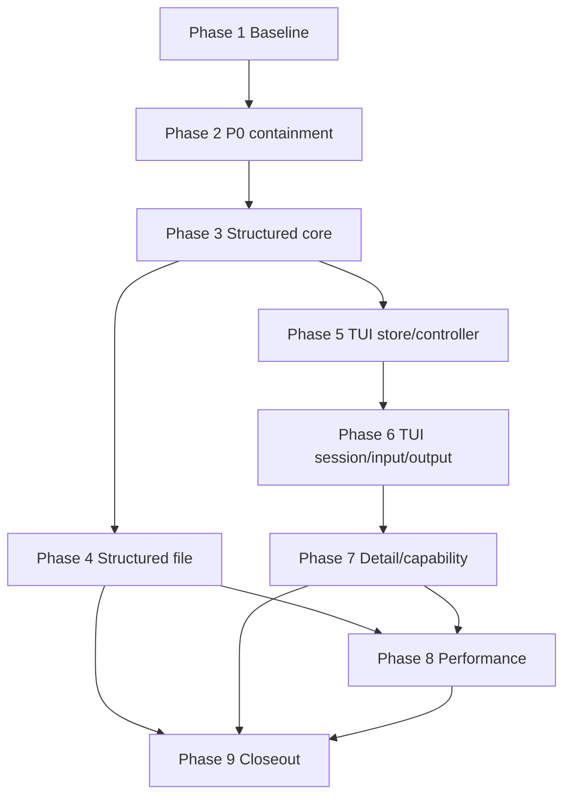

# TUI 模块化与结构化诊断日志实施计划

- 状态：Implemented（Phase 1–9 完成；合并态评审 major 已闭环）
- 日期：2026-07-17
- 冻结设计：[RFC：TUI 模块化与结构化诊断日志](../../rfc/2026-07-17-tui-structured-logging.md)
- 详细计划：[implementation-plan.md](implementation-plan.md)
- 实施分支：`feat/tui-structured-logging`
- 实施 worktree：`.worktrees/tui-structured-logging`

## 目标

本目录把冻结 RFC 的九个阶段转换为可执行、tests-first、逐提交保持终态不变量的实施计划。计划不重新裁决 RFC 已定选择，不创建 phase prompt，也不包含生产代码实现。

## 执行红线

1. 每个 task 必须先写 oracle 并亲眼观察预期红态，再写生产实现；同一 task 的提交必须以 typecheck 与对应测试全绿结束，禁止提交“下一 commit 才修”的编译中间态。
2. 行为保持型迁移先在旧实现上预捕获 golden；结构化事件原子切换、旧 FileSink 退役和 stdout owner 切换均不得拆成跨 commit 的半切换。
3. 服务模式 stdout 始终只有一个 owner；Pino、pino-roll、consola 与 file sink 均不得直接写 stdout。one-shot 子命令不属于服务 TUI owner invariant，但敏感 token 只能经过 `SensitiveOutputPort.writeOnce()`。
4. 任意 credential probe 必须先用故意关闭 redaction 的正样本证明 oracle 能捕获泄漏，再验证默认、verbose、rotated、emergency 全轨零命中；显式 `--show-github-token` 只允许 terminal sensitive-once 恰命中一次。
5. 任意 sink/filter/writer/stdout/stderr 故障不得影响后续 subscriber 或业务 producer；stdout 与 stderr 同时故障时不得递归写第三条通道。
6. 每个进程只修改本进程 per-boot diagnostic artifact；retention 对 owner 存活、manifest 不足、`/proc` 不可裁决均采取保留。
7. raw-mode 的 shutdown、destroy、异常、SIGTSTP 与 SIGCONT 路径都必须恢复 cooked terminal；第二信号继续立即强退，不等待 diagnostic durability barrier。
8. 所有 Git 提交使用精确 pathspec 与 Conventional Commits；每个阶段先复核 `git status --short`、`git diff --check` 与 staged diff，避免并发工作混入。

## 依赖 DAG



RFC 编号顺序仍是默认集成顺序。Phase 4 与 Phase 5 只有逻辑并行性；同一 worktree 实施时按 4→5 串行执行，避免 `src/start.ts`、`src/lib/tui/terminal-ui.ts`、事件联合与测试夹具发生共享树冲突。

## 阶段索引

| 阶段 | 结果 | 主要硬 gate |
|---|---|---|
| 1 | 可信、可移植、已锁定旧行为的基线 | stale tests 绿、PTY cwd 无绝对路径、golden 在旧实现上绿、oracle 正样本会红 |
| 2 | P0 止血且不引入临时双 owner | credential 四轨安全、bus filter 隔离、legacy adapter never-throw、stdout/stderr fault 熔断 |
| 3 | canonical `DiagnosticEvent` 与 `system.diagnostic` 原子切换 | tagged snapshot、redact→freeze→publish、全 consumer exhaustiveness、Terminal golden 等价 |
| 4 | per-boot NDJSON 与可恢复 durability 生命周期 | Bun+Node 顺序 oracle、manifest crash matrix、双进程 25 轮、旧共享 FileSink 删除 |
| 5 | request-id 驱动的 store/controller | reducer 纯度、selected sibling/row/last-row reconciliation、q 契约 |
| 6 | stateful input、stdout arbiter 与 terminal session | split CSI/UTF-8、sync/async EPIPE、backpressure、shutdown cooked restore |
| 7 | viewport、安全渲染、capability 与 job control | 50+ attempts 全可达、恶意 ANSI 被阻断、TERM/no-tui plain、真 PTY WIFSTOPPED |
| 8 | 由实测数据驱动的有界性能治理 | workload probe、50–100ms coalesce、terminal 前 flush、队列 cap 与 health 可见 |
| 9 | 合并态验收与文档收口 | 全量绿、PTY 8–25 连跑、双进程 25 轮、Bun+Node、文档与 backlog 同步、独立 review |

## 最终验收证据

- Backend：全量单进程套件 `5451 pass / 0 fail`；删去 legacy FileSink 专属测试后总数相应减少，后续复跑仍为 0 fail。
- PTY：9 个测试全绿；no-eaten/footer/detail/resize 各连跑 10 次，job-control 独立 controlling PTY 连跑 8 次并以 `WIFSTOPPED` 证明真 suspend。
- Structured file：两个独立进程并发 size roll，25 轮共 5000 个标识 exactly-once、零 ENOENT；drop/error 是 sticky durability failure，close reject 并驱动 shutdown failed。
- Credential：随机 secret-key 正样本在 raw source 可命中，canonical/terminal/NDJSON 全轨零命中；GitHub token 与 device user_code 仅走 `SensitiveOutputPort.writeOnce()`。
- Performance：production-wired 10k stream-progress probe 约 21ms、最大 event-loop gap约 11ms、terminal 输出 65 bytes；75ms latest-value coalescer 在 terminal 前按 request id 强制 flush。
- Static/build：typecheck、changed-files lint、backend build 通过。全仓 `lint:all` 仍有 133 个既有文件的 469 个基线问题；本特性变更文件零 lint error。

## 全局验证命令

```sh
bun run typecheck
bun run lint:all
bun run test:backend
bun run test:pty
git diff --check
git status --short
```

不得对用户的 4141 主服务器执行任何终止操作。需要真实服务探针时只能启动其他端口的隔离实例，并按自己记录的 PID 精确清理。
