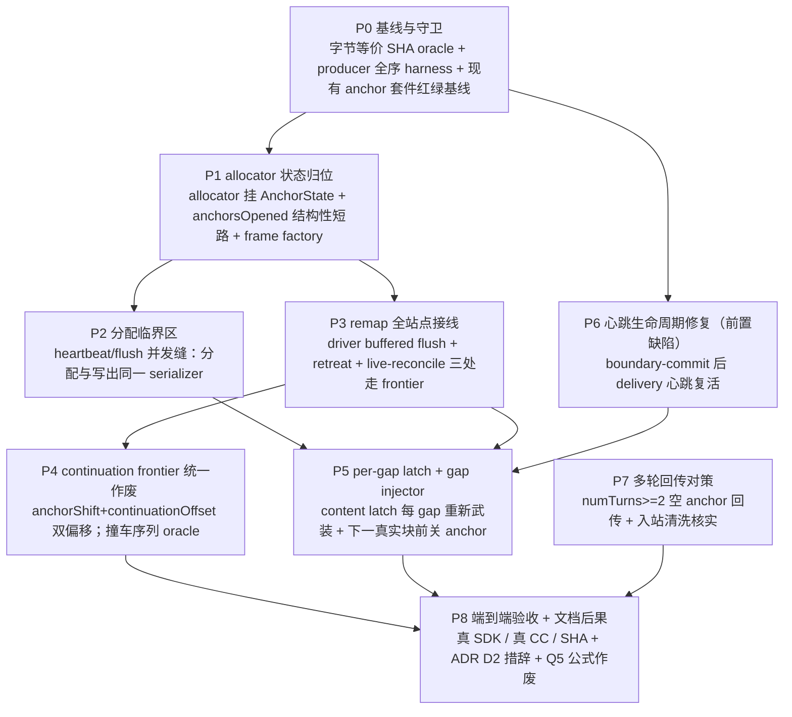

# Plan: generation-scoped 单调 wire-index allocator（方案 A 全链接线）

- 状态：**计划待审**（异模型 plan review 前）。设计已定稿并过审，用户已裁决选方案 A。
- 日期：2026-07-27
- 冻结设计（唯一权威）：[docs/spec/2026-07-27-inter-block-keepalive-carrier.md](../../spec/2026-07-27-inter-block-keepalive-carrier.md)（分支 `fix/client-proxy-keepalive-300s` commit `dcaf72a6`；合并 master 前用绝对路径 `/home/xp/src/copilot-api-js/.worktrees/keepalive-300s/docs/spec/2026-07-27-inter-block-keepalive-carrier.md`）
- 配套审查：同目录 `2026-07-27-inter-block-keepalive-carrier-review-claude.md`（其 blocker/major 已逐条映射进下方承重表）
- 关联 ADR：[2026-07-22-continuation-retry-sequential-anchor](../../decisions/2026-07-22-continuation-retry-sequential-anchor.md)（D2 第 3 点本计划要改措辞）
- 姊妹 plan（allocator 原始设计）：[plan-1-sequential-anchor.md](../2026-07-22-continuation-retry-sequential-anchor/plan-1-sequential-anchor.md) Task 1.1–1.3
- 记账 SSOT（本计划要作废其公式）：[plan-Q5-three-way-overlap.md](../2026-07-22-max-tokens-continuation/plan-Q5-three-way-overlap.md)

## 一句话

把 wire block index 的分配权从「分散的常量 `ANCHOR_INDEX=0` + 固定 `+1` offset + 独立 `continuationOffset`」收敛为**单一 generation-scoped frontier**，使 gap 保活 anchor 能在「客户端无 open block」的窗口里合法占据一个新 index，从而闭合 Claude Code 300s watchdog 在块级 buffered 终态下首块提交后的暴露面。

## 目标问题（设计 §3 的复述，不重新论证）

块级 buffered 下 driver 只在 `content_block_stop` 边界原子 flush（`driver.ts:1139` `flushBufferedFrames`、边界谓词 `commit-boundaries.ts`），所以**正在生成的上游块在客户端轨上根本不存在**——首块提交后的任何长生成，客户端看到的都是「无 open block 的静默」。当前 master + `fix/client-proxy-keepalive-300s` 已落地的是 **pre-content-only 升级**（`delivery/session.ts` 的 `semanticBlockCount === 0` 门），首块后仍只发裸 ping，>300s 必断。本计划就是该门的解除条件。

## 相位 DAG



**并行机会**（是否并行由主会话编排决定，本计划只标依赖）：
- P6 只依赖 P0，与 P1–P5 无代码重叠（`delivery/session.ts` 的心跳复活 vs allocator 的 index 记账），可与 P1 并行起。
- P7 的**核实部分**（入站清洗是否已存在、真 CC 多轮）不依赖任何代码改动，可在 P0 后立刻起；其**兜底实现部分**只有在核实为 FAIL 时才需要，且依赖 P5 能真正产出 gap anchor。
- P1→P2→P3→P4→P5 是**串行链**：P3 的 remap 依赖 P1 的 allocator 归位，P4 的 continuation 依赖 P3 的单一 remap 权威，P5 的 gap anchor 依赖 P2 的临界区与 P3 的 remap。

## 冻结契约表（实施期不得自行更改；要改回主会话）

| # | 契约 | 精确表述 | 权威来源 |
|---|---|---|---|
| C1 | 单调 frontier | 一个 generation 内，**所有** wire content block index（真实块、synthetic anchor、continuation 块）由**唯一** `AnchorIndexAllocator` 单调递增分配，永不复用、永不跳号 | 设计 §4.1 |
| C2 | maxOpen===1 | 任一时刻客户端轨至多一个 content block open；gap anchor 必须在下一个真实 `content_block_start` **之前**关闭 | 设计 §4.1；ADR D2 第 3 点（本计划扩其论域） |
| C3 | 结构性短路 | `anchorsOpened === 0` 时**完全旁路**动态 remap，代码路径与今天同构；不是「记账恰好算出 0」而是结构分支 | 审查 F6；设计 §4.4 第 2 点 |
| C4 | 双偏移作废 | `wireIndex(i) = i + anchorShift + continuationOffset` **作废**。frontier 是 wire index 的唯一权威，两个独立偏移不得继续叠加 | 审查 F5；设计 §4.4 第 3 点 |
| C5 | 分配临界区 | index 分配必须发生在 delivery serializer 内部（与写出同一临界区），或沿用「首个 `await` 前同步分配 + 提交」模式 | 审查 F7；设计 §4.4 第 4 点 |
| C6 | anchor 绕 buffer | anchor 帧走 `sink.writeAnchor` 绕过 buffer，**不**进 `extractCommittedBlocks` 的续写合成 assistant 前缀（已核实成立，勿重复怀疑） | 审查「机械核对」第 6 条 |
| C7 | 合成帧打标记 | 每个 anchor 帧进 forwarded 轨必带 `synthetic:"anchor"`，keepalive delta 带 `synthetic:"keepalive"`；绝不进上游原始轨 | ADR `2026-07-05-richest-data-flow` |
| C8 | 字节等价基线 | 短请求（未开过 anchor）默认配置下 SSE 字节流 SHA-256 = `8691db71ca3b692468ae91dfc2df108871c8f5f684acc73f3832975d60f2a6a0`，1675 bytes | 设计 §2.1；GPT 代码审「独立重跑短流字节等价」 |

## 承重项 → task 映射（设计 + 审查的 8 项，逐条落成具名 task）

| # | 承重项 | 落成 task | 验收 oracle |
|---|---|---|---|
| 1 | allocator 全链接线（含 live 腿——设计漏了，审查 F8 补） | P1.2 / P1.3 / P3.1 / P3.2 / P3.3 | O-1 producer 全序；每个 remap 站点独立 mutation |
| 2 | `anchorsOpened === 0` 结构性短路 | P1.4 | O-6 字节等价 SHA + 正/负样本对照（开过 anchor 必走记账、没开过必走短路） |
| 3 | continuation 撞车序列 | P4.1 / P4.2 | O-1 + 专门的撞车重放 oracle（wire 3 不得被占两次） |
| 4 | heartbeat vs flush 分配并发缝 | P2.1 / P2.2 | O-1 + FakeClock 让 tick 恰落在 flush 的 `await sink.write` 让点 |
| 5 | per-gap latch（一次性 → 每 gap 重新武装） | P5.1 | 多 gap 场景断言 anchor 数 = gap 数 |
| 6 | gap anchor 下一真实块前关闭 | P5.2 | O-2 `maxOpen===1` |
| 7 | 文档后果（ADR D2 措辞 + Q5 公式作废） | P8.4 / P8.5 | 跨文档 grep：全仓无残留 `anchorShift` 公式表述 |
| 8 | 多轮空 anchor 历史回传 | P7.1 / P7.2 / P7.3 | O-5 真 CC `numTurns>=2` |

## 验收 oracle 总表（reviewer 要求 >= 5 项）

| ID | oracle | 层级 | 怎么测 | 归属 |
|---|---|---|---|---|
| O-1 | wire index 严格单调、无复用、无跳号 | producer 全序 | 驱动真实 `runResponseBufferedSink` + 真 anchor injector + `anthropicCommitBoundaries`，收集**全部**客户端帧，断言 `content_block_start` 的 index 序列 === `[0,1,2,...,n-1]`（无洞无重复） | P0.2 建 harness，各相位复用 |
| O-2 | 任一时刻至多一个 block open | producer 全序 | 同 harness，逐帧维护 openSet，断言 `max(|openSet|) === 1` | P0.2 |
| O-3 | `real@0 → gap-anchor@1 → real@2` 形状 | producer 全序 | gated upstream：首块 → 静默过 deadline → 次块；断言帧序类型+index 精确等于该形状 | P5.3 |
| O-4 | 真 `@anthropic-ai/sdk` 累积顺序与 wire 一致，anchor 不被重排到末尾 | 独立 SDK oracle | `tests/e2e-client/anthropic-sdk.it.test.ts` 同款 in-process 真 proxy + 真 SDK；断言 `finalMessage().content` 的顺序与 wire index 顺序一致，空 anchor 块位置正确（**不在末尾**） | P8.1 |
| O-5 | 真 CC inter-block >300s，连跑多次 | 真客户端 e2e | `exp/` 新探针（hook 产 `real → >310s 静默 → real`），真 `claude -p`；断言 `numTurns===1`、`isError:false`、含 marker；**连跑 >=3 次**证确定性 | P8.2 |
| O-6 | 短请求默认配置字节等价 | 字节 golden | 隔离端口起自己的测试服务器（非 4141），deterministic upstream hook，`sha256sum` 对照基线 `8691db71...2f6a0` / 1675 bytes | P0.1 建基线脚本、P8.3 复跑 |
| O-7 | 真 CC `numTurns>=2` 历史回传不被上游拒 | 真客户端 e2e | 两轮对话：第一轮触发 gap anchor，第二轮携历史回上游；断言第二轮不 400 | P7.3 |
| O-8 | boundary-commit 后心跳仍活 | 单元 + producer | FakeClock：真实块提交后推进 >= 心跳间隔，断言仍产出 keepalive 帧 | P6.1 |

## 已发现的前置缺陷（planner 实测，非设计/审查所列）

**P6 的存在理由**：`driver.ts` 的 block-level boundary commit 做 `suspendHeartbeat()`（:1269/:1293）→ `flushBufferedFrames` 内部 `sink.freezeHeartbeat?.()`（:1145）→ `resumeHeartbeat()`（:1271/:1326）。在**生产的 delivery-session sink** 上，`freezeHeartbeat` 被映射为 `closeHeartbeat`（`delivery/session.ts:167`），它置 `heartbeatStopped = true`（:98）——而 `resumeHeartbeat` 的守卫是 `if (!heartbeatSuspended || state !== "open" || heartbeatStopped) return`（:173），**`heartbeatStopped` 为真时直接 return，心跳永久死亡**。

实测（FakeClock 探针，正样本对照）：

```text
CONTROL   (suspend->resume,        raw sink):        ["ping","ping","ping","ping"]
CONTROL   (suspend->resume,        delivery session):["keepalive:ping" x10]
PRODUCTION(suspend->freeze->resume, delivery session):[]        ← 心跳死亡
```

raw sink（`makeSseSink`）的 `freezeHeartbeat` 只 `clearTimeout` 不置 stopped 标志，所以 raw sink 上 resume 能复活——**现有 anchor 测试套件全部用 raw sink**（`anchor-multiblock-lifecycle.it.test.ts` 等 import `makeSseSink`），故这个缺陷被结构性地测不到。生产走 `makeDeliverySseSink`。

**为什么这是 A 的前置门而非独立 backlog**：A 的 gap anchor 由心跳 tick 注入。若首个真实块提交后心跳已死，gap anchor 永远不会被注入，A 的全部机制在生产上是死码——O-3/O-5 会假绿（因为测试用 raw sink）。故 P6 必须在 P5 之前落地，且其测试必须建在 delivery session 上。

## 反驳设计/审查的一处事实（planner 复核）

审查 F4 断言「本仓库**没有**入站空 text block 清洗（`src/lib/anthropic/request-preparation.ts` 无相关处理，全仓 grep 未见）」。**该断言为假**：

- `src/lib/anthropic/sanitize/content-blocks.ts:13` `filterEmptyAnthropicTextBlocks` 就是这个清洗，`block.text.trim() !== ""` 逐块过滤。
- 接线：`sanitize/result.ts:53` 在 `finalizeAnthropicSanitization` 里**无条件**调用 → `sanitize/index.ts:81` `sanitizeAnthropicMessages` → `payload-rewrites.ts:117` 的 `sanitize-messages` rewrite（`appliesTo: () => true`，order 300）→ `ANTHROPIC_PAYLOAD_REWRITES` → `codec/anthropic/{codec,request-rewrite-adapter}.ts`。即**生产 Anthropic 入站路径始终跑这个清洗**。
- 被清空 content 的整条 message 也有兜底：`sanitize/tool-blocks.ts:141/168` 的 `newContent.length === 0 → continue`（丢弃整条 message）。

**对计划的影响**：P7 的定位从「实现兜底清洗」降级为「**核实**既有清洗在 gap-anchor 回传形状下确实触达 + 真 CC 多轮实证」。这不是砍范围——若核实发现不触达（例如 CC 回传的形状绕过该 rewrite、或跨格式桥接腿不走 Anthropic sanitize），兜底实现仍在 P7 范围内，见 P7.2 的分叉。审查该条的**风险方向仍成立**（多轮回传从未实测），只是补救成本很可能已为零。

## 不采纳记录

- **方案 B（延迟 `content_block_stop`）**：CC 是 eager per-block 工具执行（`app.pretty.js:298301-298310, 293787, 291016-291028`），扣 stop = 确定性推迟整段 gap 的工具执行。**复活条件**（审查要求落账）：若未来 CC 改为非 eager 执行，或 A 落地后只想给 text/thinking 加更干净载体，B 值得重估（它无合成块、失败模式可见）。
- **方案 C（仅 pre-content）**：块级 buffered 终态下首块后覆盖率随块数下降，只可作临时解阻门；当前分支已是此形状，本计划就是其解除。
- **D/J/K/L 载体**：见设计 §7。其中 **J（长 text 块 idle 分块）** 是 A 落地后的下游收益，本计划完成后应登记进 `docs/todo/deferred-backlog.md`（P8.6）。

## 全局纪律（每相位适用）

- **TDD**：每个 task 一律「写失败测试 → 跑，红 → 实现 → 跑，绿 → 提交」。若某步预测的红没咬（`methodology-plan-red-green-mutation-prediction-can-be-wrong-verify`），**不得**提交假绿，降级为 characterization 测试并在 plan 里注明。
- **commit invariants**：每个 commit 的终态必须满足——① `bun run typecheck` 绿；② `bun run test:fast` 绿；③ **C1/C2 两条不变量不得处于半坏态**。具体到本改造：`allocator` 的引入与三处 remap 的切换若拆成多个 commit，则**每个中间 commit 必须让未切换的站点仍走旧的固定 offset 且与 allocator 记账一致**（P3 给出显式的等价桥接手法）。绝不允许「已经开始按 frontier 分配，但某个 remap 站点还在算 +1」的中间态落盘。
- **golden 重捕纪律**：wire 变化会按设计打红 `tests/pipeline/buffered-anchor-golden.it.test.ts` / `tests/anthropic/c0-live-anchored-direct-stream-golden.http.test.ts` 等逐字节 golden。正确流程是①先用 O-1/O-2 独立验证新 wire 结构正确 → ②再 re-capture golden → ③**绝不**为让 golden 绿而扭曲实现。
- **绝不碰 4141**：需要真服务器的 oracle（O-5/O-6/O-7）一律用自己启动的非 4141 端口实例，按 PID 精确 kill，绝不 `pkill`/`killall`。
- **测试真相域命名**：新测按 `{unit,it,http,pty,e2e}` 后缀归位，改 `.unit → .it` 的唯一充分条件是实测确认真集成。

## 相位文档

- [plan-0-baseline-and-guards.md](plan-0-baseline-and-guards.md)
- [plan-1-allocator-state.md](plan-1-allocator-state.md)
- [plan-2-allocation-critical-section.md](plan-2-allocation-critical-section.md)
- [plan-3-remap-sites.md](plan-3-remap-sites.md)
- [plan-4-continuation-frontier.md](plan-4-continuation-frontier.md)
- [plan-5-gap-anchor-lifecycle.md](plan-5-gap-anchor-lifecycle.md)
- [plan-6-heartbeat-lifecycle-fix.md](plan-6-heartbeat-lifecycle-fix.md)
- [plan-7-multi-turn-replay.md](plan-7-multi-turn-replay.md)
- [plan-8-acceptance-and-docs.md](plan-8-acceptance-and-docs.md)
- [kickoff.md](kickoff.md)

## 风险登记

| # | 风险 | 影响 | 缓解 | 归属 |
|---|---|---|---|---|
| R1 | remap 漏点/重复调 → 静默重排客户端内容 | 最高：用户拿到的答案被悄悄改序，SDK 不报错（已被真 SDK probe 证实） | C3 结构性短路把爆炸半径限回「开过 anchor 的请求」；O-1/O-4 双层 oracle；每个 remap 站点独立 mutation | P1.4 / P3 / P8.1 |
| R2 | 心跳死亡使 A 在生产上全程死码 | 高：所有 oracle 用 raw sink 会假绿 | P6 先修 + 其测试建在 delivery session 上；O-3/O-5 必须走生产 sink | P6 |
| R3 | continuation 撞车产生重复 wire index | 高：与本轮 blocker 同型故障 | C4 单一 frontier；P4.2 专门的撞车重放 oracle | P4 |
| R4 | 分配并发缝（tick vs flush） | 中高：重复/跳号，概率性 | C5 同临界区；P2.2 FakeClock 让点 oracle | P2 |
| R5 | 空 anchor 回传被上游拒 400 | 中：多轮对话第二轮失败 | P7 先核实既有清洗（很可能已覆盖），FAIL 则兜底载体/清洗 | P7 |
| R6 | golden 重捕掩盖真实回归 | 中 | 重捕前必须先过 O-1/O-2；重捕 commit 与实现 commit 分离，diff 可审 | P3 / P5 |
| R7 | 与并发会话（`fix/client-proxy-keepalive-300s` 等分支）冲突 | 中 | 隔离 worktree + 行级共存；实施前 rebase/merge 到当时 master，`comm -12` 核 WIP∩FF | P0.0 |
