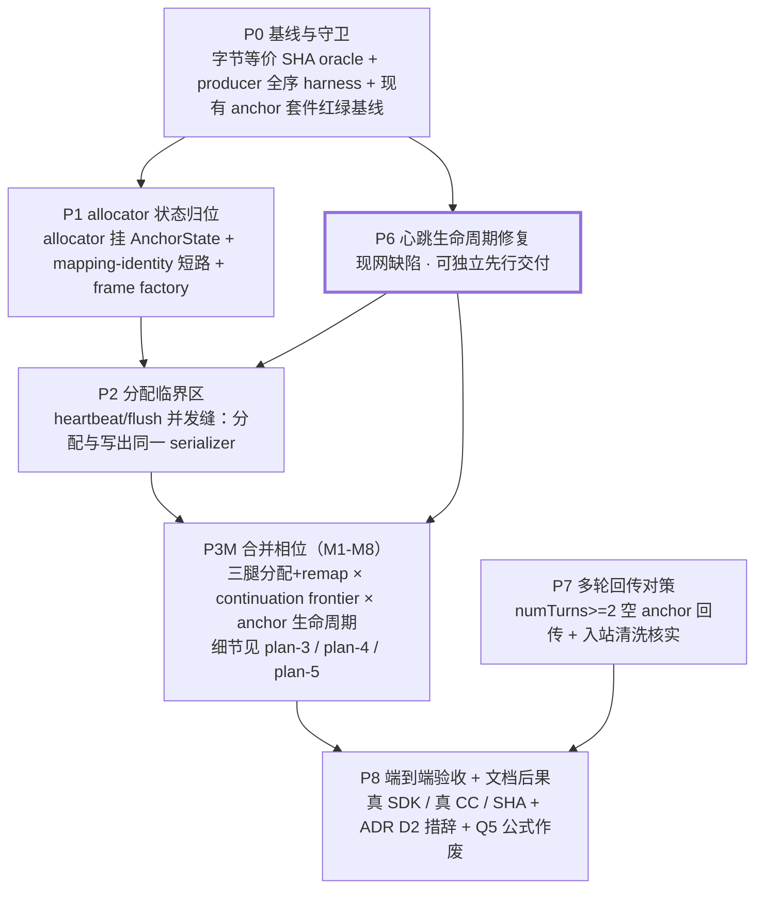

# Plan: generation-scoped 单调 wire-index allocator（方案 A 全链接线）

- 状态：**计划待审**（异模型 plan review 前）。设计已定稿并过审，用户已裁决选方案 A。
- 日期：2026-07-27
- 冻结设计（唯一权威）：[docs/spec/2026-07-27-inter-block-keepalive-carrier.md](../../spec/2026-07-27-inter-block-keepalive-carrier.md)（分支 `fix/client-proxy-keepalive-300s` commit `dcaf72a6`；合并 master 前用绝对路径 `/home/xp/src/copilot-api-js/.worktrees/keepalive-300s/docs/spec/2026-07-27-inter-block-keepalive-carrier.md`）
- 配套审查：同目录 `2026-07-27-inter-block-keepalive-carrier-review-claude.md`（其 blocker/major 已逐条映射进下方承重表）
- 关联 ADR：[2026-07-22-continuation-retry-sequential-anchor](../../decisions/2026-07-22-continuation-retry-sequential-anchor.md)（D2 第 3 点本计划要改措辞）
- 姊妹 plan（allocator 原始设计）：[plan-1-sequential-anchor.md](../2026-07-22-continuation-retry-sequential-anchor/plan-1-sequential-anchor.md) Task 1.1–1.3
- 记账 SSOT（本计划要作废其公式）：[plan-Q5-three-way-overlap.md](../2026-07-22-max-tokens-continuation/plan-Q5-three-way-overlap.md)

## 一句话

把 wire block index 的分配权从「分散的常量 `ANCHOR_INDEX=0` + 固定 `+1` offset + 独立 `continuationOffset`」收敛为**单一 generation-scoped frontier**，使 gap 保活 anchor 能在「客户端无 open block」的窗口里合法占据一个新 index，从而闭合 Claude Code 300s watchdog 在块级 buffered 终态下首块提交后的暴露面。

## 目标问题（设计 §3 的复述，不重新论证）

块级 buffered 下 driver 只在 `content_block_stop` 边界原子 flush（`driver.ts:1139` `flushBufferedFrames`、边界谓词 `commit-boundaries.ts`），所以**正在生成的上游块在客户端轨上根本不存在**——首块提交后的任何长生成，客户端看到的都是「无 open block 的静默」。当前 master + `fix/client-proxy-keepalive-300s` 已落地的是 **pre-content-only 升级**（`delivery/session.ts` 的 `semanticBlockCount === 0` 门），首块后仍只发裸 ping，>300s 必断。本计划就是该门的解除条件。

## 相位 DAG



**并行机会**（是否并行由主会话编排决定，本计划只标依赖）：
- **P6 可独立交付**（用户 2026-07-27 裁决）：它修的是**当前现网缺陷**（Responses HTTP 默认配置即受影响，见下「现网影响面」），自身即有生产价值，不必等 A 的其余相位。独立路径 = **P0 → P6 → 合并**。
- **P6 → P2 是硬依赖**（plan review major；原「P6 与 P1–P4 无代码重叠、可并行」是**事实错误**）：两者都改 `delivery/session.ts`，且改的是**同一组语义**——heartbeat operation 的入队 / 挂起 / 恢复与 flush 交接。P6 改变「boundary commit 后 heartbeat 是否继续入队」，直接扩大 P2 竞态的可达状态。若 P6 已独立合并 master，allocator worktree 必须 **rebase / merge 到含 P6 的 master 后**再做 P2——否则会在旧 heartbeat 生命周期上写竞态 oracle，合并后测试语义失效。交叉门见 Task 2.2b。
- P7 的**核实部分**（入站清洗是否已存在、真 CC 多轮）不依赖任何代码改动，可在 P0 后立刻起；其**兜底实现部分**只有在核实为 FAIL 时才需要，且依赖 P3M 的 M6 能真正产出 gap anchor。
- 主链 **P0 → P1 → P2 → P3M → P8** 全串行。**P3M 是合并相位**（round-3 blocker：原 P3/P4/P5 在测试可满足性上不可分——见 plan-3 头部），其内部 8 个原子 commit（M1–M8）各有终态不变量与可满足的门，硬序约束只有一条：**M6（特性开门）必须晚于 M2–M4（三腿迁移）**。

## 冻结契约表（实施期不得自行更改；要改回主会话）

| # | 契约 | 精确表述 | 权威来源 |
|---|---|---|---|
| C1 | 单调 frontier | 一个 generation 内，**所有** wire content block index（真实块、synthetic anchor、continuation / recovery 块）由**唯一** `GenerationWireIndexAllocator` 单调递增分配，永不复用。**「永不跳号」只对成功交付的健康流成立**——commit point 之后失败的块会永久消费其 index（C9 ②），此时流已终止，跳号不构成缺陷 | 设计 §4.1；round-3 限定 |
| C2 | maxOpen===1 | 任一时刻客户端轨至多一个 content block open；gap anchor 必须在下一个真实 `content_block_start` **之前**关闭 | 设计 §4.1；ADR D2 第 3 点（本计划扩其论域） |
| **C3** | **恒等短路（2026-07-27 修订，原表述有 blocker）** | 短路判据是**映射恒等**，不是 anchor 计数：当且仅当该块的 `WireBlockMapping` 满足 `wireIndex === upstreamIndex` 时，remap 才可返回**原 frame 对象**。等价的充分条件 = **无任何 synthetic 插入且该块属主腿**。**原表述「`anchorsOpened === 0` 即无条件短路」与 C4 冲突，会让无-anchor 续写腿复用 wire 0——已作废** | 审查 F6 提出、GPT plan review blocker 推翻并修订 |
| C4 | 双偏移作废 | `wireIndex(i) = i + anchorShift + continuationOffset` **作废**。frontier 是 wire index 的唯一权威，两个独立偏移不得继续叠加 | 审查 F5；设计 §4.4 第 3 点 |
| C5 | 分配临界区 | index 分配必须与其帧写出在**同一个 serializer operation** 内完成（单一 owner API，见 P2「Interfaces」）。「分配后再分别调用 `write*`」**不满足**本契约——那是队列外分配 + 两个 operation。`beginLeg` 同样是 serializer command | 审查 F7；设计 §4.4 第 4 点；plan review round-1/2 major |
| **C9** | **分配的 commit point = 首次外部 write（round-3 重写，round-4 补边界）** | 已发出的字节**不可撤销**，故「多帧全回滚」物理上不成立。两段语义：**① commit point 之前**（session 拒绝 / build callback 抛错 / 尚未尝试任何 wire write）→ 零副作用、预留不可见、**全回滚**。**② commit point 之后**（任一帧已尝试或已成功）→ index **永久消费绝不复用**，失败即**终止 delivery** + 禁止后续分配 + 忠实记录。**两类边界**：queued-未执行 → 属 ①（不得在 enqueue 时预留，执行时重查 session）；abort 于首帧 promise **pending** 期间 → 属 ②（commit 标志须在调 `writeToSink` **前同步置位**）。**C1 的「永不跳号」只对健康流成立** | round-3 blocker + round-4 major |
| **C10** | **mapping token 生命周期（round-4 新增）** | 存放 = `GenerationWireState` 的 `Map<LegToken, Map<upstreamIndex, WireBlockMapping>>`（非 allocator ambient 单槽、非各腿局部 Map）；登记 = start 帧成功 commit 后；查询 = 按 (leg token, upstream index) 精确查，**须支持同腿多块并存**；释放 = 该块 `content_block_stop` 成功写出后；retreat **不换 leg、沿用同一 map**。**missing mapping 必须显式报错，绝不原样透传** | plan review round-4 major |
| C6 | anchor 绕 buffer | anchor 帧走 `sink.writeAnchor` 绕过 buffer，**不**进 `extractCommittedBlocks` 的续写合成 assistant 前缀（主腿已核实；**续写腿由 P5.4 独立复验**） | 审查「机械核对」第 6 条 |
| C7 | 合成帧打标记 | 每个 anchor 帧进 forwarded 轨必带 `synthetic:"anchor"`，keepalive delta 带 `synthetic:"keepalive"`；绝不进上游原始轨 | ADR `2026-07-05-richest-data-flow` |
| **C8** | **字节等价（措辞修订）** | 权威基线 = **P0 在实施 base 上捕获的 pre-change 字节**；P8 必须与该捕获物逐字节相同。历史值 `8691db71…2f6a0` / 1675 bytes 仅作 **provenance / sanity check**，不是跨 master 前进的永久需求。重捕前必须先证明 hook、请求、配置相同，并记录造成差异的 base change | GPT plan review minor |

## C3 的修订：短路判据从「anchor 计数」改为「映射恒等」（blocker 修复）

**原表述的失败序列**（GPT plan review blocker，planner 复核成立，**不需要任何 anchor**）：

```text
主腿：real@0 已交付客户端        → allocator frontier = 1
      mid-stream cut → 进入续写腿
续写腿：upstream index 从 0 重启
      C4 要求：allocator 分配 wire@1
      C3 原表述：anchorsOpened()===0 → 原 frame 引用直返 → 仍写 real@0
      结果：wire 0 被写两次 —— 与本轮 blocker 同型的 index 复用
```

这是**默认路径**（`stream_keepalive_mode: ping` + 从未 idle 升级），比「有 anchor」的撞车序列常见得多；而原 P4.1 的撞车 oracle 只构造了「pre-anchor + gap-anchor」的序列，**恰好漏掉这个分支**。

**修订后的判据**：短路成立当且仅当该块的 `WireBlockMapping` 满足 **`wireIndex === upstreamIndex`**（映射恒等）。判据只读**该块自己的不可变 token**，不读任何 ambient「当前腿」状态（P2 冻结的 token 模型，round-2 major）。于是：

| 场景 | 该块 mapping | 恒等？ | 行为 |
|---|---|---|---|
| 无 anchor 主腿（绝大多数请求） | upstream0 → wire0 | 是 | **原对象直返**（O-6 字节等价成立） |
| 无 anchor 续写腿 | upstream0 → wire1 | **否** | **必须 remap**（blocker 修复点） |
| 无 anchor recovery 腿（前面写过 anchor） | upstream0 → wire1 | 否 | remap（见 P2「recovery / leg 边界语义」） |
| 有 anchor 主腿 / 续写腿 | upstream i → wire i+k | 否 | remap |

**这条修订必须同时改三处**（不能只补一条测试）：README C3（本表）、P1.4 的 primitive 实现与测试、P4.1 的 oracle 覆盖面。O-6 的「引用相等」要求相应收窄为**只对无-anchor 主腿**成立。

### 教训（用户 2026-07-27 要求记入）：**为降风险而加的机制，本身要过同样的对抗检验**

C3 的来历是：上一轮**设计 reviewer** 提出「A 把死 remap 路径变成每请求热路径，爆炸半径扩到全部请求」，建议加结构性短路作为缓解；用户采纳并写进本计划的要求。结果这条缓解措施**自己在默认路径引入了新的 index 复用**——它把「无 anchor」误当成「无重映射需求」，而 continuation 的 leg-local index 重启同样需要重映射。

可推广的形式：**缓解措施是新增的代码路径，不是免费的安全网**。凡是「为降低风险 X 而引入的机制 M」，M 必须与被它保护的主路径接受同等强度的对抗检验（同样的 red-first oracle、同样的 mutation、同样的边界枚举）。尤其当 M 的形式是「某条件下跳过主逻辑」时，要穷举「该条件成立但主逻辑仍必需」的场景——那正是 M 的盲区。此教训在 P8.6 提炼进记忆库。

| # | 承重项 | 落成 task | 验收 oracle |
|---|---|---|---|
| 1 | allocator 全链接线（含 live 腿——设计漏了，审查 F8 补） | P1.2 / P1.3 / **P2.1 / P2.2**（owner API）/ P3.1 / P3.2 / P3.3 | O-1 producer 全序；**6 格** mutation 矩阵（三腿 × 分配/remap 两维） |
| 2 | **恒等**短路（原「anchorsOpened===0」有 blocker，已修订） | P1.4 | O-6 字节等价 + 四场景对照（无 anchor 主腿短路 / **无 anchor 续写腿必须 remap** / 有 anchor 两腿） |
| 3 | continuation 撞车序列 | P4.1（**两分支**）/ P4.2 | O-1 + 零 anchor 续写腿 & 有 anchor 撞车两条重放 oracle，各配 positive control |
| 4 | heartbeat vs flush 的分配并发缝 | P2.1 / P2.2 / **P2.2b**（P2×P6 交叉门）/ P2.3 | O-1 + FakeClock 让点 + **C9 三档 commit-point oracle**（2.2c）+ 连跑 15 次 |
| 5 | per-gap latch（一次性 → 每 gap 重新武装） | P5.1 | 多 gap 场景断言 anchor 数 = gap 数 |
| 6 | gap anchor 下一真实块前关闭 | P5.2 | O-2 协议状态完整性 + anchor stop **exactly-once**（终局站点两两组合） |
| 7 | 文档后果（ADR D2 措辞 + Q5 公式作废 + **spec 状态同步**） | **P0.0 Step A**（spec 状态，开工硬门）/ P8.4（**停点在写文件前**）/ P8.5 | 跨文档**分类审计**（无未标注作废的规范性消费者），非字面零命中 |
| 8 | 多轮空 anchor 历史回传 | P7.1 / P7.2（**β 为停点**）/ P7.3 | O-7 **exact tool-use / tool_result / 上游命中恰为 2**（`numTurns>=2` 已是 stall 签名，不可单用） |

**计划自加的四项**（不在原 8 项承重表内，同等对待）：

| # | 项 | 落成 task | 验收 oracle |
|---|---|---|---|
| 9 | 心跳跨 boundary-commit 存活（现网缺陷） | P6.1 / P6.2 / P6.3 / **P6.3b**（Responses HTTP 回归锁） | O-8 + 两层正样本对照 |
| 10 | 续写腿 × gap anchor 跨相位集成缝（用户裁决升格为独立 task） | **M7**（plan-5 Task 5.4） | O-9 交叉 mutation 矩阵（同一测试对两侧 mutation 以不同原因失败）+ 两条单侧 control |
| 11 | **wire 副作用不可逆的 commit 语义**（round-3 blocker） | P2「Interfaces」C9 + Task 2.2c | 三档 oracle（build 抛错 / 首帧失败 / 首帧成功次帧失败）+ 双向 mutation |
| 12 | **allocator 注入路径唯一性**（round-3 major） | P2「注入路径」+ P1.3 | identity oracle（四处引用相等）+ 架构守卫（唯一创建点，带正样本对照） |
| 13 | **owner close 权威 + 10 个站点迁移**（round-4 blocker） | P2 `closeOpenAnchor` + **M1** 逐站点表 | 8 handler + 2 driver 站点各自回归 + exactly-once（终局站点两两组合）+ 架构守卫（owner 外不得写 anchor stop / 读写 `openAnchorIndex`） |
| 14 | **迁移期 bridge 使每步可编译**（round-4 blocker） | **M1** 引入 / M2–M4 逐腿删 / M5 删旧字段 | 每个 M-commit 的 typecheck + `test:fast` + **O-6**；M4 后 bridge 判据 grep 零命中 |

## 验收 oracle 总表（reviewer 要求 >= 5 项，实际 9 项）

| ID | oracle | 层级 | 怎么测 | 归属 |
|---|---|---|---|---|
| O-1 | wire index 严格单调、无复用、无跳号 | producer 全序 | 驱动真实 `runResponseBufferedSink` + 真 anchor injector + `anthropicCommitBoundaries`，收集**全部**客户端帧，断言 `content_block_start` 的 index 序列 === `[0,1,2,...,n-1]`（无洞无重复） | P0.2 建 harness，各相位复用 |
| O-2 | **块协议状态完整性**（原「maxOpen===1」过弱，plan review major 升级） | producer 全序 | 逐帧维护协议状态机，断言全部四条：① 任一时刻 open 集合大小 <= 1；② **每个 delta / stop 引用的 index 必须是当前唯一 open 的那个**；③ stop 后集合为空；④ **终局 open 集合必须为空**（无悬挂块）。正样本对照覆盖：两块并存、orphan delta、错误 stop index、终局悬挂、重复 stop | P0.2 |
| O-3 | `real@0 → gap-anchor@1 → real@2` 形状 | producer 全序 | gated upstream：首块 → 静默过 deadline → 次块；断言帧序类型+index 精确等于该形状。**必须走生产 delivery sink**（raw sink 已被 P6 证明会假绿） | P5.3 |
| O-4 | 真 `@anthropic-ai/sdk` 累积顺序与 wire 一致，anchor 不被重排到末尾 | 独立 SDK oracle | `tests/e2e-client/anthropic-sdk.it.test.ts` 同款 in-process 真 proxy + 真 SDK；断言 `finalMessage()` 深等值且 content 顺序与 wire index 一致、空 anchor 块**不在末尾**。positive control 须**先断言 wire 上确有 duplicate index**（防 mock 未生效） | P8.1 |
| O-5 | 真 CC inter-block >300s，连跑多次 | 真客户端 e2e | `exp/` 新探针（hook 产 `real → >310s 静默 → real`），真 `claude -p`；断言 `numTurns===1`、`isError:false`、含 marker；**连跑 >=3 次**；`escalate=0` 对照组须 FAIL。**并记录 anchor 帧确实出现 + 上游静默实测时长**（防 PASS 来自 hook 没真等）。与 O-1/O-3 联合裁决，不单独证明 allocator 正确 | P8.2 |
| O-6 | 短请求（无 anchor **主腿**）字节等价 | 字节 golden | 隔离端口起自己的测试服务器（非 4141），deterministic upstream hook，与 **P0 在实施 base 捕获的 pre-change 字节** `cmp`。注意 C3 修订后「引用相等」只对无-anchor **主腿**成立，续写腿即使无 anchor 也必须 remap | P0.1 建基线、P8.3 复跑 |
| O-7 | **真 CC 多轮回传**（原 `numTurns>=2` 会假绿，plan review major 重写） | 真客户端 e2e | 确定性 tool-use mock：第一轮固定返回**唯一** `tool_use`；断言 ① CC 确实执行工具并在第二轮回传**匹配 tool_id** 的 `tool_result`；② **上游命中恰为 2**（排除 stall 重问）；③ 第二轮 messages 含正确 tool_result **且无空 anchor 块**；④ 最终 marker 非空且**无第三轮**。**不得**只断 `numTurns>=2`——该值在本仓库已是 **stall 签名**（`anthropic-cli.e2e.test.ts:50`）。另加 mutation：故意绕过 sanitize 使 mock 按真实校验规则 400，证明测试能咬住空块泄漏 | P7.3 |
| O-8 | boundary-commit 后心跳仍活 | 单元 + producer | FakeClock：真实块提交后推进 >= 心跳间隔，断言仍产出 keepalive 帧。**两条端点各一份**：Anthropic（P6.3）+ Responses HTTP（P6.3b，默认中招的那条） | P6.1 / P6.3 / P6.3b |
| O-9 | 续写腿内 gap 静默的交叉行为 | producer 全序 | 续写腿进行中过 deadline → 断言 anchor 从 frontier 分配、在续写首块前关闭、不进合成 assistant 前缀、latch 跨腿重新武装 | P5.4 |

## 已发现的现网缺陷（planner 实测，非设计/审查所列）

**P6 的存在理由**：`driver.ts` 的 block-level boundary commit 做 `suspendHeartbeat()`（:1269/:1293）→ `flushBufferedFrames` 内部 `sink.freezeHeartbeat?.()`（:1145）→ `resumeHeartbeat()`（:1271/:1326）。在**生产的 delivery-session sink** 上，`freezeHeartbeat` 被映射为 `closeHeartbeat`（`delivery/session.ts:167`），它置 `heartbeatStopped = true`（:98）——而 `resumeHeartbeat` 的守卫是 `if (!heartbeatSuspended || state !== "open" || heartbeatStopped) return`（:173），**`heartbeatStopped` 为真时直接 return，心跳永久死亡**。

实测两层，均带正样本对照：

```text
层一（sink 契约）
  CONTROL   (suspend→resume,        raw sink):         ["ping"×4]
  CONTROL   (suspend→resume,        delivery session): ["keepalive:ping"×10]
  PRODUCTION(suspend→freeze→resume, delivery session): []          ← 心跳死亡

层二（真 driver：runResponseBufferedSink + 真 commitBoundaries + 120s 块间静默）
  RAW SINK      keepalives: 5
  DELIVERY SINK keepalives: 0                                      ← 现网形状
```

raw sink（`makeSseSink`）的 `freezeHeartbeat` 只 `clearTimeout` 不置 stopped 标志，所以 raw sink 上 resume 能复活——**现有 anchor 测试套件全部用 raw sink**（`anchor-multiblock-lifecycle.it.test.ts` 等 import `makeSseSink`），故这个缺陷被结构性地测不到。生产三条 buffered 路径全部走 `makeDeliverySseSink`。

### 现网影响面（用户 2026-07-27 要求写明；planner 逐条核实）

触发条件 = 走 `runResponseBufferedSink` **且** `commitBoundaries` 命中 **且** sink 是 `makeDeliverySseSink`。

| 端点 | buffered 默认 | `commitBoundaries` | 当前是否受影响 |
|---|---|---|---|
| **Responses HTTP** | **`true`**（`state-defaults.ts:243`） | 有（`candidate-response-session.ts:140`，边界含 `response.output_item.done`——多 item 响应逐 item 提交） | **是，默认配置即中招** |
| Chat Completions | **`true`**（`state-defaults.ts:100`） | 退化：`ccCommitBoundaries` 只认上游 `error` 帧 | 仅 error 路径，实际影响极小 |
| Responses WS | `true`（同 key） | **故意省略**（`ws.ts:376-394`） | 否 |
| Anthropic | `false`（`state-defaults.ts:84`） | 有（`anthropicCommitBoundaries`） | 默认否；**开启 `protect_streaming_generation` 即中招**（正是 A 的目标制度） |
| Gemini | 无 buffered | — | 否 |

**即 Responses HTTP 在 bundled 默认配置下就受影响**：一个多 output_item 的响应，首个 `response.output_item.done` 提交后心跳即永久死亡，其后任意长的上游静默都无保活帧。这与 A 无关，是当前现网行为——**故 P6 可独立于 A 先行落地与合并**（详见 plan-6 的「独立交付」小节）。

**为什么这是 A 的硬前置门**：A 的 gap anchor 由心跳 tick 注入。若首个真实块提交后心跳已死，gap anchor 永远不会被注入，A 的全部机制在生产上是死码——O-3/O-5 会假绿（因为测试用 raw sink）。故 P6 必须在 P5 之前落地，且其测试必须建在 delivery session 上。

## 反驳设计/审查的一处事实（planner 复核）

审查 F4 断言「本仓库**没有**入站空 text block 清洗（`src/lib/anthropic/request-preparation.ts` 无相关处理，全仓 grep 未见）」。**该断言为假**：

- `src/lib/anthropic/sanitize/content-blocks.ts:13` `filterEmptyAnthropicTextBlocks` 就是这个清洗，`block.text.trim() !== ""` 逐块过滤。
- 接线：`sanitize/result.ts:53` 在 `finalizeAnthropicSanitization` 里**无条件**调用 → `sanitize/index.ts:81` `sanitizeAnthropicMessages` → `payload-rewrites.ts:117` 的 `sanitize-messages` rewrite（`appliesTo: () => true`，order 300）→ `ANTHROPIC_PAYLOAD_REWRITES` → `codec/anthropic/{codec,request-rewrite-adapter}.ts`。即**生产 Anthropic 入站路径始终跑这个清洗**。
- 被清空 content 的整条 message 也有兜底：`sanitize/tool-blocks.ts:141/168` 的 `newContent.length === 0 → continue`（丢弃整条 message）。

**对计划的影响**：P7 的定位从「实现兜底清洗」降级为「**核实**既有清洗在 gap-anchor 回传形状下确实触达 + 真 CC 多轮实证」。这不是砍范围——若核实发现不触达（例如 CC 回传的形状绕过该 rewrite、或跨格式桥接腿不走 Anthropic sanitize），兜底实现仍在 P7 范围内，见 P7.2 的分叉。审查该条的**风险方向仍成立**（多轮回传从未实测），只是补救成本很可能已为零。

## 不采纳记录

- **方案 B（延迟 `content_block_stop`）**：CC 是 eager per-block 工具执行（`app.pretty.js:298301-298310, 293787, 291016-291028`），扣 stop = 确定性推迟整段 gap 的工具执行。**复活条件**（审查要求落账）：若未来 CC 改为非 eager 执行，或 A 落地后只想给 text/thinking 加更干净载体，B 值得重估（它无合成块、失败模式可见）。
- **方案 C（仅 pre-content）**：块级 buffered 终态下首块后覆盖率随块数下降，只可作临时解阻门；当前分支已是此形状，本计划就是其解除。
- **D/J/K/L 载体**：见设计 §7。其中 **J（长 text 块 idle 分块）** 是 A 落地后的下游收益，本计划完成后应登记进 `docs/todo/deferred-backlog.md`（P8.6）。

## 全局纪律（每相位适用）

- **TDD**：每个 task 一律「写失败测试 → 跑，红 → 实现 → 跑，绿 → 提交」。若某步预测的红没咬（`methodology-plan-red-green-mutation-prediction-can-be-wrong-verify`），**不得**提交假绿，降级为 characterization 测试并在 plan 里注明。
- **commit invariants**：每个 commit 的终态必须满足——① `bun run typecheck` 绿；② `bun run test:fast` 绿；③ **C1/C2 两条不变量不得处于半坏态**。具体到本改造：`allocator` 的引入与三处 remap 的切换若拆成多个 commit，则**每个中间 commit 必须让未切换的站点仍走旧的固定 offset 且与 allocator 记账一致**（P3 给出显式的等价桥接手法）。绝不允许「已经开始按 frontier 分配，但某个 remap 站点还在算 +1」的中间态落盘。
- **golden 重捕纪律**：wire 变化会按设计打红 `tests/pipeline/buffered-anchor-golden.it.test.ts` / `tests/anthropic/c0-live-anchored-direct-stream-golden.http.test.ts` 等逐字节 golden。正确流程是①先用 O-1/O-2 独立验证新 wire 结构正确 → ②再 re-capture golden → ③**绝不**为让 golden 绿而扭曲实现。
- **绝不碰 4141**：需要真服务器的 oracle（O-5/O-6/O-7）一律用自己启动的非 4141 端口实例，按 PID 精确 kill，绝不 `pkill`/`killall`。
- **测试真相域命名**：新测按 `{unit,it,http,pty,e2e}` 后缀归位，改 `.unit → .it` 的唯一充分条件是实测确认真集成。

## 相位文档

- [plan-0-baseline-and-guards.md](plan-0-baseline-and-guards.md)
- [plan-1-allocator-state.md](plan-1-allocator-state.md)
- [plan-2-allocation-critical-section.md](plan-2-allocation-critical-section.md)
- **P3M 合并相位**（三份同属一个相位，plan-3 为权威）：
  - [plan-3-remap-sites.md](plan-3-remap-sites.md) —— 相位权威：commit 序列 M1–M8、三腿矩阵、S3 专节
  - [plan-4-continuation-frontier.md](plan-4-continuation-frontier.md) —— M5 的任务细节
  - [plan-5-gap-anchor-lifecycle.md](plan-5-gap-anchor-lifecycle.md) —— M1/M6/M7/M8 的任务细节
- [plan-6-heartbeat-lifecycle-fix.md](plan-6-heartbeat-lifecycle-fix.md)
- [plan-7-multi-turn-replay.md](plan-7-multi-turn-replay.md)
- [plan-8-acceptance-and-docs.md](plan-8-acceptance-and-docs.md)
- [kickoff.md](kickoff.md)

## 风险登记

| # | 风险 | 影响 | 缓解 | 归属 |
|---|---|---|---|---|
| R1 | remap 漏点/重复调 → 静默重排客户端内容 | 最高：用户拿到的答案被悄悄改序，SDK 不报错（已被真 SDK probe 证实） | C3 结构性短路把爆炸半径限回「开过 anchor 的请求」；O-1/O-4 双层 oracle；每个 remap 站点独立 mutation | P1.4 / P3 / P8.1 |
| R2 | 心跳死亡（**当前现网缺陷**，非仅 A 的风险） | 高：Responses HTTP 默认配置下首个 item 提交后即无保活；且会使 A 在生产上全程死码，而 raw-sink oracle 假绿 | P6 先修（可独立交付）+ 其测试建在 delivery session 上；受影响端点各有回归锁（P6.3 / P6.3b）；O-3/O-5 必须走生产 sink | P6 |
| R3 | continuation 撞车产生重复 wire index | 高：与本轮 blocker 同型故障 | C4 单一 frontier；P4.2 专门的撞车重放 oracle | P4 |
| R4 | 分配并发缝（tick vs flush） | 中高：重复/跳号，概率性 | C5 同临界区；P2.2 FakeClock 让点 oracle | P2 |
| R5 | 空 anchor 回传被上游拒 400 | 中：多轮对话第二轮失败 | P7 先核实既有清洗（很可能已覆盖），FAIL 则兜底载体/清洗 | P7 |
| R6 | golden 重捕掩盖真实回归 | 中 | 重捕前必须先过 O-1/O-2；重捕 commit 与实现 commit 分离，diff 可审 | P3 / P5 |
| R7 | 与并发会话（`fix/client-proxy-keepalive-300s` 等分支）冲突 | 中 | 隔离 worktree + 行级共存；实施前 rebase/merge 到当时 master，`comm -12` 核 WIP∩FF | P0.0 |
| R8 | **跨相位集成缝**（leg 语义 × gap anchor）只在合并态才暴露 | 中高：本项目吃过亏的形状，逐 task 审看不到，代价最高 | 升格为独立 task（M7 / plan-5 Task 5.4，red-first + **交叉 mutation 矩阵**），**不**依赖 P8.7 兜底 | M7 |
| **R11** | **相位切分本身让红绿门失真** | 高：两轮 review 各抓到一次——门不可满足时，mutation 全绿会被误读为「实现正确」 | 合并为 P3M 单相位 + 每个 M-commit 显式写出「可满足的门」；门实测不可满足即**停下回报**，禁止手工补状态凑绿 | P3M |
| **R12** | **不可逆副作用被当成可回滚**（C9 原表述） | 高：partial write 后复用客户端已见的 index = 确定的协议损坏 | commit point 两段语义 + 三档 oracle + 双向 mutation；C1「永不跳号」限定为健康流 | P2 Task 2.2c |
| **R13** | **迁移中间态不可编译**（M1 原方案删字段） | 高：违反 commit invariants，且会诱导实施者提前做后续 M 步或临时发明 API | M1 只新增不删 + bridge 判据（等价性已证，含 `enveloped_ping` 分支）+ 逐腿删除 + M4 后 grep 零命中 | M1–M5 |
| **R9** | **缓解措施本身引入新缺陷** | 高：C3 短路即实例——为降低 R1 而加的机制，自己在默认路径造成 index 复用（本轮 blocker） | 凡「为降风险 X 而引入的机制 M」，M 必须与主路径接受**同等强度**的对抗检验；M 形如「某条件下跳过主逻辑」时，须穷举「条件成立但主逻辑仍必需」的场景 | 全相位；教训见上文 |
| **R10** | **测试准备替实现完成关键动作** | 中高：手工推进 allocator 的测试会让生产漏分配照样绿（plan review 指出的 P3.1 假绿） | 多 anchor / 多 leg 状态一律由**生产路径**驱动产生（FakeClock + gated upstream），禁止手工 `allocate*`；mutation 矩阵加「删除 allocate 调用」维度 | P3.1 / P3.4 |

## 命名（实施期采纳，plan review 建议）

`AnchorIndexAllocator` 实际分配的是**真实块 + anchor + continuation 块的全部 wire index**，anchor 只是它的一个消费者。继续叫 "Anchor allocator" 会弱化「generation wire frontier 是唯一权威」这一架构事实（C1/C4）。

**裁决**：实施期重命名为 **`GenerationWireIndexAllocator`**（文件与导出名一并迁移）。旧名 `createAnchorIndexAllocator` 已有的三条测试同步改名。**不保留双名**（项目「不留双轨包袱」）；若迁移面过大需分步，也必须在 P8 之前统一完成，不得长期并存。
