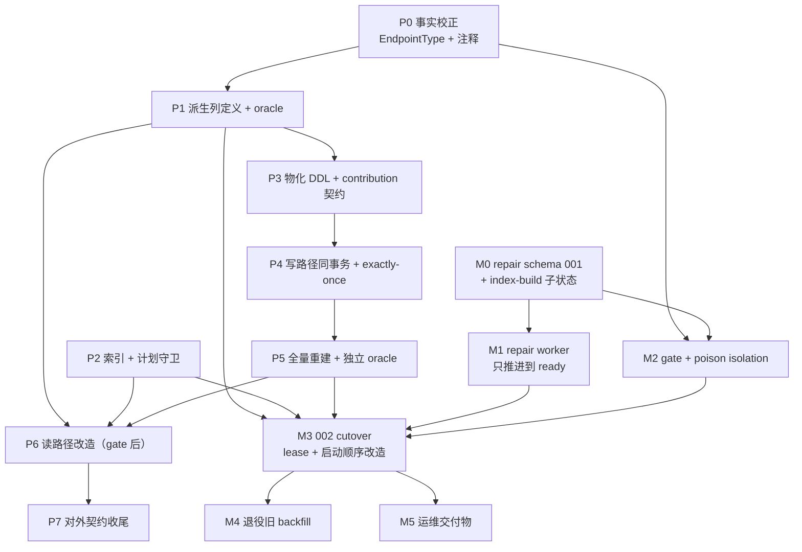

# 实施计划：History 读路径性能核心重构（Spec A）

> **状态：迁移拓扑已裁决（Spec A 于 `6304e553` 冻结），P0–P7 与 M0–M4 全部可执行。**
>
> 五轮异模型对抗评审推翻了两处迁移设计，用户已就两个 BLOCKER 裁决完毕（Spec A §10-1 / §10-5 / §10-6），本计划据此转正：
> - **cutover 推迟到下一次启动**，由运维触发一次**专门的维护重启**——不复用日常 blue-green 编排。
> - **writer ownership lease 取代 DB capability gate**，防线前移到进程启动时（还没有数据会丢的时点）。
> - **A/B 接缝定为分批 keyset**，「保守遍历」不再是同等可选项。
>
> 裁决过程中的代价对比表保留在 §1——它是决策依据，且未来任何人想改动迁移拓扑时需要先读懂当初为什么排除了另外几条路。
>
> **仍有一项待用户裁决**：P7 的「ui-v4 全局请求列表页退役」范围（删路由 vs 隐藏入口）。它是 UI 决策，不阻塞 P0–P6 与全部 M 阶段，见 §3.8。

- 源规格：[docs/spec/2026-07-28-history-read-path-core.md](../spec/2026-07-28-history-read-path-core.md)（Spec A，**已冻结**，§10 六项裁决）
- 姊妹规格：[Spec B 过滤语义收敛](../spec/2026-07-28-history-filter-semantics.md)（依赖 A，不阻塞 A）、[待办 C 任意 filter exact total](../todo/history-filtered-exact-total.md)（已排期，排在 A/B 之后）
- PoC 证据：[exp/history-read-path/FINDINGS.md](../../exp/history-read-path/FINDINGS.md)
- 相关 skill：`history-sqlite-schema`（schema SSOT）、`history-backfill`（可恢复 backfill 方法论）、`persistence-async-invariants`、`empirical-verification`、`choosing-test-type`
- kick-off 提示词：**§9（P 阶段）** 与 **§10（M 阶段）** 各一份，分开是因为两者的风险等级与验证方式完全不同

---

## 1. 裁决记录（迁移拓扑，已定案）

下面两个问题不是「实现细节」，它们决定：migration runner 的入口在哪、restart 脚本与进程边界怎么改、listener 何时启动、terminal subscriber 何时注册、backfill 的静态快照点在哪、e2e 需要几个真实进程、失败时怎么回滚。用户已于 2026-07-28 就两者裁决（Spec A §10-1 / §10-5 / §10-6，commit `6304e553`）。

**本节保留当初的代价对比表**——它是决策依据，未来任何人想改动迁移拓扑，需要先读懂当初为什么排除了另外几条路，否则会重走一遍已被证伪的设计。

### 1.1 Q1：002 cutover 的触发时机 → **裁决：推迟到下一次启动**

**事实（已核实）**：Spec §5.7.1 要求 repair worker 达到 `ready` 后执行 002 schema cutover。而 `gracefulShutdown()`（`src/lib/shutdown.ts:416-625`）是**终态 latch**：入口两行

```ts
if (shutdownPhase === "stopped") return
if (shutdownPhase !== "idle" && shutdownPhase !== "stopping") return shutdownCompletion.promise
```

进入后一路推到 `finalize()` → `closeDatabase()` → `shutdownPhase = "stopped"`（`:702-740`），**没有任何「暂停 accept → 做 migration → 重开 DB → 恢复 accept」的返回路径**。`_isShuttingDown = true` 也让 `getIsShuttingDown()` 中间件永久拒绝新请求。也就是说「本进程内先静默再 cutover 再恢复服务」需要新造一条**可逆的 quiesce 状态机**，不是复用现有关机。

| | **选项 A：下次启动 cutover**（评审建议） | **选项 B：本进程 ready 后立即 cutover** |
|---|---|---|
| plan 形状 | 001 + repair worker 在**本次运行**推进到 `ready`；002 在**下一次进程启动**、listener 起来**之前**执行。migration runner 只需一个入口：启动路径。 | 需新增可逆 quiesce 原语：`pauseAccept()` / `resumeAccept()` + DB 重开 + subscriber 重注册，且必须与 `gracefulShutdown` 的 latch **互不污染**（并发信号：quiesce 中收到 SIGTERM 怎么办？） |
| 代码改动面 | `initHistory()` 内一处分支（构造 Umzug 前读 phase）+ repair worker 模块。**不动 shutdown.ts** | 新模块 + 改 `shutdown.ts` 的 phase 机（引入非终态 `quiescing`）+ 改 `serve.ts` 的 listener + 改 `state.ts` 的 open/close 顺序 |
| 用户可见代价 | repair 完成后**需要一次重启**才吃到新读路径。8.3 GB 库的 repair 走多久取决于 poison 行数（当前生产 `summary_json IS NULL` = 0 行 → repair 预期是空转 + gate 校验，秒级）。所以实际代价≈「装完新版本后再重启一次」 | 无需额外重启，但引入一条**只在迁移当天走一次**的高风险代码路径，它与关机、takeover、config 热重载三者都有并发面 |
| 风险 | 低。失败模式是「没升级成」，不是「服务坏了」 | 高。`long-termism` 不站在 B 这边——为省一次重启造一条永久存在但只跑一次的状态机，是**结构性负债**而非结构性改善 |
| 测试形状 | 迁移状态机全部可在 `.it` 层用 `:memory:` / temp file DB 驱动真 runner（现有 `tests/history/sqlite/migrations.it.test.ts` 骨架直接可用）。**不需要多进程 e2e** | 需要真实进程 e2e 证明「quiesce 期间 `/health` 与新请求的行为」，且要覆盖 quiesce×shutdown 竞态 |
| 与 Q2 的耦合 | 弱：cutover 发生在 listener 之前，天然没有「本进程边服务边迁移」问题 | 强：立即 cutover 必须先解决 Q2 的排他 quiesce，否则旧 writer 问题原样存在 |

**planner 当初推荐 A，用户裁决 A。** 理由不是「B 太贵」（那是 ROI 论证，本项目不采纳），而是 **B 造出的机制在迁移完成后永久无消费者**——它不是一条「长远正确的路径」，只是一次性迁移的脚手架被强行做成常驻状态机。A 的「需要重启一次」不是功能缺失，是迁移的自然形状（`002` 是 forward migration，forward migration 的标准触发点就是启动）。

**裁决落地的确切协议（Spec A §5.7.3，plan 不得再选）**：

1. repair worker 只推进到 durable `ready`，**本进程继续按旧 schema 正常服务、不执行 002**
2. 由运维在自选时机触发**一次专门的维护重启**
3. 该次启动：在任何 writer 注册、任何 listener 打开**之前**，完成 predecessor quiesce 确认 → 最终 backfill → 002
4. 002 成功后才 `subscribeModelOperationTerminals` → `listen` → `notifyReady`
5. 002 失败则**不启动新服务**，保留旧 schema 并报告，提供重试路径

### 1.2 Q2：排他 quiesce 的跨部署可执行协议 → **裁决：协议 A + writer ownership lease**

**事实（已核实）**：Spec §5.7.3 要求「旧进程停 accept → drain → 确认无旧 writer → cutover → 新进程才接流量」。而**当前三条部署路径的顺序全部相反**——都是先启动新进程（新进程在 `packages/cli/src/start.ts:389` 就 `await initHistory(historyEnabled)` 打开了 History DB），再让旧进程 drain：

| 路径 | 现状顺序 | 证据 |
|---|---|---|
| bare manual | 新进程 boot（含 `initHistory` 开库）→ 绑定 reusePort → `notifyReady()` → **才**向前任发 SIGUSR2 | `packages/cli/src/start.ts:367-389`（decide+initHistory）、`:578-582`（notifyReady 后 signalPredecessorHandoff） |
| systemd blue-green | `systemctl start @NEXT`（阻塞到 READY=1，此时新槽已开库监听）→ `systemctl kill -s SIGUSR2 @CUR` | `contrib/systemd/copilot-api-deploy.sh:15-25` |
| pm2 blue-green | `pm2 start --only green`（`wait_ready` 等 READY）→ `pm2 sendSignal SIGUSR2 blue` | `contrib/pm2/ecosystem.config.cjs:10-26` + `contrib/pm2/README.md` |

另外两条硬事实：
- `signalPredecessorHandoff()`（`src/lib/restart/takeover.ts:43-56`）是 **never-throw、无 ack**——发完 SIGUSR2 就返回，新进程无从得知前任是否真的停 accept、更不知道它何时 drain 完。
- 前任 drain 上限 = `shutdown.graceful_wait`(60s) + `shutdown.abort_wait`(120s) **默认 180 秒**（`ecosystem.config.cjs:19` 的 `kill_timeout: 200000` 就是按这个对齐的）。

所以「排他 quiesce」目前**没有可执行协议**：新进程无法知道旧 writer 何时消失，最长要盲等 180 秒。

| | **选项 A：cutover 前置到「上一代进程已完全退出」之后** | **选项 B：新进程主动等待前任退出（带 ack/探活）** | **选项 C：单进程停机窗口（放弃零停机）** |
|---|---|---|---|
| 协议 | 迁移不在 takeover 窗口做。规定：升级到含 002 的版本时，**先完整停掉旧实例**（`systemctl stop` / `pm2 delete` / Ctrl-C 等它退出），**再**启动新实例。新实例启动时 DB 上只有它一个 writer | 新进程 boot 时若检测到 `phase=ready` 且存在 live 前任 → **阻塞等待前任进程消失**（`isProcessAlive` 轮询，pidfile 或 supervisor 提供 pid），前任死后才 cutover 再起 listener | 迁移那次不用 blue-green：新进程启动即执行「停 accept → cutover → 起 listener」的显式停机窗口（数秒） |
| plan 改动面 | **零代码**（只改部署文档 + 一条 startup guard：cutover 前检测到 live 前任就跳过 cutover、留到下次） | bare 路径有 pidfile 可用；**systemd / pm2 路径没有 pidfile**（`isSupervised()` → 跳过整个 pidfile 机制，`src/lib/restart/supervisor-env.ts`），需要为 supervised 路径新造一条前任发现机制 | 与 Q1-B 同构：需要 listener 延后启动 + 显式窗口，但**不需要**可逆 quiesce（listener 从未起过） |
| 覆盖三部署 | 是（三条都只是「先停后起」的运维顺序） | **否**——supervised 两条缺前任发现，要么新造机制要么留缺口 | 是（三条都只是新进程内部多了个启动前窗口） |
| 与 Q1 的组合 | 与 Q1-A 完美相容：cutover 在启动路径、且被 guard 保证独占 | 与 Q1-A 相容，与 Q1-B 叠加则复杂度相乘 | 蕴含 Q1-A 的一半（cutover 在 listener 前） |
| 残留风险 | 运维必须遵守「先停后起」。若违反：guard 检测到 live 前任 → 跳过 cutover（**降级为不迁移，不是写坏**） | 盲等最长 180s 的启动阻塞；supervisor 的 `Type=notify` / `wait_ready` 超时（systemd 无默认上限但脚本会卡、pm2 `listen_timeout: 30000` **会先超时**）→ 需同步调大 | 迁移那一次服务不可用（见下方「代价的更正」——当初写成"数秒"是低估） |

**planner 当初推荐 A+C，用户裁决 A + writer ownership lease**（即 A 的协议 + 补法 (ii)）。落地形状：

1. **协议 = 「先停旧、后起新」的专门维护重启**——**不复用日常 blue-green 脚本**（三条部署路径顺序全都相反）。部署文档 + `contrib/` 三份脚本各加一段迁移专用编排说明。
2. **代码 = writer ownership lease**（下述），把协议从「靠人记住」变成「机器强制」。
3. **listener 延后**：002 在 `initHistory()` 内、`startServer()` 之前完成（这本来就是 forward migration 的位置），天然满足「窗口在 listener 之前」。

这样「排他」由**进程边界 + lease** 共同保证，而不是由一个新协议保证。

#### writer ownership lease（取代 DB capability gate，Spec §10-5）

**为什么 capability gate 被从 spec 中删除、而不是降级为「最后防线」**：gate 命中时拒绝 terminal INSERT，而那条 INSERT **横跨 journal / CAS / operations / tracks / timeline 五张表**，单个 trigger 无法把完整 operation 捕获到隔离区。加上 `publishModelOperationTerminal`（`terminal-bus.ts:20-39`）不延迟代理响应、rejection 被 `.catch(() => undefined)` 吞掉、writer drain 失败只计入 `failedOperations`（`store.ts:830-929`）——结果是：请求已交付客户端 → terminal record 被拒 → 静默吞掉 → 旧进程退出 → **该 operation 永久消失**。这不是 fail-loud，是 silent loss，且**没有重建源**。

**lease 的关键差别是时点**：防线前移到进程启动、writer 注册**之前**。冲突时**阻止该进程开始服务并报错退出**，而不是在 terminal commit 时拒绝数据。**报错发生在没有任何数据会丢的时点**——进程还没开始服务，不存在「已交付客户端却写不进去」的 record。

lease 同时是 supervised 路径（systemd/pm2 无 pidfile，`isSupervised()` → 跳过整个 pidfile 机制，`src/lib/restart/supervisor-env.ts`）确认前任已停的**确定性判据**，取代了当初考虑过的启发式补法 (i)（查 `committed_at` 近期写入——旧进程恰好空闲就会误判为「无 writer」）。

**已被裁决排除的补法 (i)（DB 层探活）**：零新机制但是启发式，误判方向是「以为没 writer 其实有」——正好是会导致数据损坏的那个方向。不采纳。

#### 用户可见代价（已知并接受，不得软化）

Spec §10-1 明确更正了早期的低估。**这不是「短暂的写入停顿」，而是整个代理服务中断**：

- 期间**端口没有 listener**，新请求**直接连接失败**（不是排队等待）
- 窗口 = 旧槽 drain（**在飞长流式请求可能拖很久，上限 180 s**）+ 最终 backfill + 002 建索引（1–2.4 s/条 × 3 条）+ 新进程网络初始化
- 该次重启**失去 blue-green 的失败保护**——旧槽已停，新代码有 bug 时无法回退到「旧槽持续服务」

代价换取的是**绝不丢 canonical History**。用户在得知真实代价后仍选择接受。计划与运维文档必须如实保留这个描述。

### 1.3 裁决对阶段顺序的影响（已钉死）

Q1=A + Q2=A+lease 的组合让 M 阶段全部落在**启动路径单点**：

- migration runner 只有**一个入口**（`initHistory()` 内构造 Umzug 前读 phase），不需要第二条调用路径。
- 迁移状态机的绝大部分可在 `.it` 层用 `:memory:` / temp file DB 驱动**真** runner 验证（现有 `tests/history/sqlite/migrations.it.test.ts` 骨架直接可用），**不需要多进程 e2e**；「跨重启」在 `.it` 层用同进程内 `closeDatabase()` + 重新 `initHistory()` 模拟。
- lease 的冲突分支需要**两个真实进程**才能证伪「第二个进程真的拒绝启动」——这是 M 阶段唯一需要真实多进程的测试项（M3.4）。
- **M 阶段与 P 阶段的顺序**：P1、P2、P5 是 M3 的**硬前置**（cutover 要用到派生列定义、索引定义与 rebuild）；除此之外 M0/M1/M2 与 P 阶段**互不阻塞**，可并行推进。完整依赖见 §2.2。

P 阶段全部只增不改语义（新表、新列、新函数、新测试），落地后读路径仍走旧实现（P6 的 read-path 切换由 `v3_meta(read_path_phase)` gate 控制，见 §3.7），所以 P 与 M 的落地先后不会互相返工。

### 1.4 其余两项的裁决

- **§5.8.1 A/B 接缝 → 裁决：分批 keyset**（Spec §10-6）。**「保守遍历」不再是同等可选项**——它对 `model`/`success` 仍需遍历完整候选集、在主线程线性扫描，**不满足「交互请求期间 `/health < 50 ms`」这一核心目标**。Spec §5.8.1 已列出算法必须定义的六点，本计划 §3.7-P6.3 逐条固化。
- **`direction` 是一个从未实现的契约（已确认）**：`QueryOptions.direction`（`types.ts:577`）被 handler 解析（`handler.ts:65`）、被 `ui/` 传递（`http.ts:73`、`useHistoryData.ts:119-126`），但 **`queries.ts` 中无任何 `direction` 引用**（planner 发现、协调者独立核实、已写进 Spec §5.8.1 注记）——当前 `direction=newer` 与 `older` 行为完全相同。Spec §5.9 要求两个方向都可用，所以 P6 按**「实现一个新契约」**处理，不是「保持现状」。

### 1.5 仍待用户裁决（不阻塞任何阶段）

- **P7 的「ui-v4 全局请求列表页退役」范围**：删路由 vs 隐藏入口。这是 UI 决策，planner 与协调者都不替用户定。它**不阻塞** P0–P6 与全部 M 阶段；执行到 P7 时若仍未定，先做 P7 的其余项（`activeSessions` / `recentActivity` / keyset 改造），把退役单独留一个 commit。


---

## 2. 阶段总览与依赖

### 2.1 阶段清单

| 阶段 | 目标 | 硬前置 | 可与之并行 |
|---|---|---|---|
| **P0** | 前置事实校正：`EndpointType` 补 `openai-embeddings`；清理三处失真注释 | — | M0 |
| **P1** | 派生列表达式与空值规范化的**纯定义 + oracle**（不 ALTER 生产表） | P0 | P2、M0、M1 |
| **P2** | 索引定义 + `UNION ALL` MERGE 查询计划守卫（含正样本对照） | — | P1、M0、M1 |
| **P3** | `v3_sessions` / `v3_stat_*` DDL + `OperationProjectionContribution` 契约与 producer | P1 | M0、M1、M2 |
| **P4** | 写路径接线：同事务 upsert + exactly-once + 回滚 + `clearV3Store` | P3 | M0、M1、M2 |
| **P5** | 全量重建（rebuild）路径：复用同一 producer，独立 fixture oracle | P3、P4 | M1、M2 |
| **P6** | 读路径改造（gate 后）：sessions / entries / status / logs / stats / export / replay | P1、P2、P5 | M1、M2、M3 |
| **P7** | 对外契约收尾：`activeSessions` 语义变更、`recentActivity` 移除、ui-v4 keyset | P6 | M1–M4 |
| **M0** | repair-state schema（001）+ diagnostics + 持久 cursor/phase + index-build 子状态 | — | P0–P4 |
| **M1** | repair worker：分批推进、协作停、`blocked`→`ready`（**只到 ready，不 cutover**） | M0 | P1–P7、M2 |
| **M2** | migration gate（§5.7.4 全集）+ poison isolation（§5.7.5） | M0、**P0** | P1–P7、M1 |
| **M3** | 002 cutover：writer lease + 逐条建索引 + per-index phase + 最终 backfill + 启动顺序改造 | M1、M2、**P1、P2、P5** | P6、P7 |
| **M4** | 退役 `startV3SummaryBackfill` 家族 + `v3_summary_backlog` | M3 | P7 |
| **M5** | 运维交付物：维护重启编排脚本 + 三部署路径文档 + 回退预案 | M3 | P7、M4 |

> **P0 是 M2 的硬前置**（不是「顺带」）：M2 的 gate 有一条 `endpoint ∈ 有效枚举`，若 `EndpointType` 还没补 `openai-embeddings`，**合法的 embeddings record 会被判成 poison**（Spec §5.7.4 明文）。
> **P1/P2/P5 是 M3 的硬前置**：cutover 要用 P1 的派生列定义（ADD COLUMN 的 DDL 来源）、P2 的索引定义与 `verifyIndexDefinition`（per-index 验证的判据）、P5 的 `rebuildMaterializedProjections`（最终 backfill 的实现）。**M3 不重写这三样，它消费它们。**

### 2.2 依赖图



### 2.3 串行 / 并行

- **必须串行**：
  - `P0 → P1 → P3 → P4 → P5 → P6 → P7`（每一环都是下一环的前提）
  - `M0 → M1 → M3 → M4`、`M0 → M2 → M3`（迁移状态机本身有序）
  - `P1, P2, P5 → M3`（M3 消费三者的产物）
  - **M3 内部严格有序**：lease 抢占 → quiesce 确认 → 最终 backfill → ADD COLUMN → 逐条建索引（每条独立窗口 + 独立 phase）→ 全部 verified → 切 read-path phase。**这个顺序不是风格问题，每一步都是下一步的正确性前提。**
- **可并行**：
  - P1 与 P2（一个管列表达式、一个管索引与计划，互不 import）
  - M1 与 M2（repair 推进与 gate 校验各自独立，只共享 M0 的 schema）
  - **整个 M0–M2 与 P1–P7 可并行推进**（除 P0→M2 一条边）——M0/M1/M2 只碰 `migrations/` 与新的 repair worker 模块，P 阶段碰 `v3/` 的读写路径与投影，文件面几乎不重叠
- **绝不并行**：任何两个改同一文件的阶段。P3/P4/P5 全部集中在 `src/lib/history/v3/store.ts` 附近；M3 会改 `state.ts` 与 `packages/cli/src/start.ts` 的启动顺序。并发会话请走隔离 worktree（→ CLAUDE.md `concurrent-sessions`）。

### 2.4 建议的推进路线

两条链可以并行（若只有一个执行者，按 P 链优先——它交付实际性能改善，M 链只是让它能落到生产库上）：

```
链 A（读路径能力）：P0 → P1 ∥ P2 → P3 → P4 → P5 → P6 → P7
链 B（迁移拓扑）：  M0 → M1 ∥ M2 ────────────────┐
                                                  ├→ M3 → M4 ∥ M5
链 A 的 P1/P2/P5 完成后 ───────────────────────────┘
```

**M3 是唯一的汇合点**，也是唯一会改动生产启动顺序的阶段——它应当是**最后一个落地的高风险阶段**，且落地前 P 链应已全绿（否则 cutover 完成后读路径切过去却发现物化数据有问题，回退代价是又一次维护重启）。

### 2.4 全局纪律（每阶段都适用）

1. **红→绿→重构**：每条新测试先证明它会红（把对应源码改动还原 / 注掉，确认变红），再实现。**计划里的红绿预测可能不咬**（→ 记忆 `methodology-plan-red-green-mutation-prediction-can-be-wrong-verify`）：执行期真跑一遍 mutation，不咬就别提交假绿，降级为 characterization 并在计划里注明。
2. **测试后缀 = 真相域**（→ CLAUDE.md 测试分档 + skill `choosing-test-type`）：
   - `.unit` = 纯函数逻辑（列表达式生成、bucket 分类、cursor 编解码、查询计划字符串断言）
   - `.it` = 多模块经真 store/DB 的接线与真 oracle（物化正确性、事务回滚、keyset 分页、迁移状态机）
   - `.http` = `app.request()` 断言端点响应形状（`/api/status`、`/api/logs`、`/history/api/*` 的 wire 契约）
   - 不按速度命名。一条测试要不要升 `.it`，唯一充分条件是**实测确认它真的跨模块/碰真 DB**。
3. **交付门**：每阶段结束跑 `bun run test:backend`（不是 `bun run test`——后者是快速档，不含 `.it`）+ `bun run typecheck` + `bun run lint:all`（**不带 `--cache`**，→ 记忆 `tooling-eslint-cache-false-pass`）。
4. **不碰 4141**：需要真实服务器验证时用非 4141 端口起自己的测试实例、按 PID 精确 kill（→ CLAUDE.md `protect-user-main-server`）。
5. **ground truth 不同源**：任何断言物化值正确性的测试，期望值必须从 canonical fixture **独立声明**，不得调用 contribution producer 或现有 JS 聚合来生成（Spec §5.5 明文）。
6. **每阶段一提交**，显式 pathspec（`git commit -F <msgfile> -- <精确路径>`），conventional commits，无模型署名。

---

## 3. 可执行阶段（P0–P7）

### 3.1 P0 — 前置事实校正

**目标**：把 Spec §5.7.4 明文要求的 canonical producer 事实校正、以及三处已失真的注释先修掉。这是 M2 的 gate 依赖，也是 P1 派生列枚举校验的依赖。**独立成立**，不依赖任何后续阶段。

**改哪些文件**

| 文件 | 改动 |
|---|---|
| `src/lib/history/types.ts:33` | `EndpointType` 增加 `"openai-embeddings"`。这是**事实校正**：`src/routes/embeddings/route.ts:51` 确实写 `format: "openai-embeddings"`，而类型不含它——今天 `recordToHistoryEntry` 靠 `as HistoryEntry["endpoint"]` 断言把它偷渡进去（`projection.ts:379`）。 |
| `src/lib/history/endpoint-format.ts` | `formatFromEndpoint` 的 `switch` 有 `default` 分支，新值自动落到 `"openai"`——**语义正确**（embeddings 是 OpenAI 形状），但要显式加 `case` 并写注释，别让它靠 default 蒙对。 |
| `src/lib/observability/projections/log-line.ts:44` | `INPUT_FORMAT_LABEL: Record<EndpointType, string>` 是**穷尽 Record**，加值即编译错——补 `"openai-embeddings": "openai-emb"`。 |
| `src/routes/debug/dry-run-pipeline.ts:83` | `ENDPOINT_TO_FORMAT: Record<EndpointType, DryRunFormat>` 同上穷尽。embeddings **没有** dry-run 形状（它不进 driver/管线，→ DESIGN.md 第 7 条），所以这里不能瞎映射：把类型改成 `Partial<Record<...>>` 或显式标注该键不支持并在消费点 fail-loud。**执行者必须先读消费点**再决定，别为了让它编译乱填一个值（→ 记忆 `methodology-broken-reference-supply-vs-delete`）。 |
| `src/lib/context/request.ts:2077` 附近 | 同名的 endpoint→label 映射，检查是否也是穷尽 Record。 |
| `ui-v4/src/types/index.ts:10` re-export 链 | `EndpointType` 经 `~backend/*` re-export（→ DESIGN.md 类型架构）。加值后跑 `bun run typecheck:ui-v4` 确认没有 ui-v4 侧的穷尽 Record 被打爆（→ 记忆 `methodology-plan-verify-interface-location-and-wiring-channel`：新 union 打爆 ui-v4 穷尽 Record 是已发生过的坑）。 |
| `src/lib/history/queries.ts:84-88` | 删除那条声称「persisted list path filters `search` in SQL (`preview_text LIKE`)」的**陈旧注释**（指向已退役 V2 路径，Spec B §1.1 与 §6-1 都要求删）。**只删注释，不改行为**——`search` 的行为变更属 Spec B。 |
| `src/routes/history/handler.ts:149-151` | 那条提到 `DELETE /api/sessions/:id` / `DELETE /api/entries` 的注释已失真（V3 没有这些路由，PoC FINDINGS Q4 与 Spec §5.6-4 各自核实过）。改写成「V3 只有 test-only `clearV3Store`」。 |

**先写什么测试（红）**

1. `tests/history/history-types.unit.test.ts`（既有文件追加）：断言 `EndpointType` 包含 `"openai-embeddings"`——用一个 `const x: EndpointType = "openai-embeddings"` 的**类型级**断言 + 一个运行时枚举表（若引入枚举表则断言其成员）。改前红（TS 编译失败即红）。
2. `tests/history/model-operation-bypass.http.test.ts`（既有）：追加一条——走 embeddings 端点产出一条 operation，断言其 `endpoint` 投影为 `"openai-embeddings"` 且**不经过任何 `as` 断言路径**（即 `recordToHistoryEntry` 的返回类型里它是合法值）。
3. 注释类改动**不可测**：用 `grep`/lint 层守卫替代——`tests/history/v3/read-consumer-guard.unit.test.ts` 追加两条 `expect(text).not.toMatch(/preview_text LIKE/)` 与 `expect(text).not.toMatch(/DELETE \/api\/sessions/)`。**正样本对照**：先确认这两条 pattern 当前**能**匹配到（证明守卫咬到了目标文本），再改源码让它变绿。

**验收**：`bun run typecheck` + `bun run typecheck:ui-v4` 双绿；`bun run test:backend` 无新红；两条 grep 守卫经正样本对照。

**风险与回滚**：加 union 值可能打爆未预料的穷尽 Record。**回滚 = 撤这一个 commit**，无数据面影响。

---

### 3.2 P1 — 派生列定义与空值规范化（纯定义 + oracle）

**目标**：把 Spec §5.1 的列表变成**代码里的单一定义**（一张表达式表），并用独立 oracle 证明「SQL 侧 `json_extract` 求值结果 == JS 侧从同一 canonical record 读出的值」。**此阶段不 ALTER 任何生产表**——只在测试用的临时 DB 上 ALTER，证明定义正确。

**为什么先做定义而不先做 ALTER**：ALTER 生产表属于 M3 的 cutover（要在维护重启的排他窗口内、逐条带锁窗口地做）；而「列叫什么、表达式是什么、NULL 怎么规范化」是纯定义，**M3 与 P6 都消费同一份定义**。先冻结定义，M3 才有可靠的 DDL 来源，不必自己再写一遍表达式。

**改哪些文件**

- **新增** `src/lib/history/v3/derived-columns.ts`：导出 `DERIVED_COLUMNS`，一个 `ReadonlyArray<{ name, type, expression, nullPolicy }>`，以及由它生成 `ALTER TABLE ... ADD COLUMN ... GENERATED ALWAYS AS (...) VIRTUAL` 语句的纯函数 `derivedColumnDdl(col)`。**VIRTUAL 是硬约束**（PoC Q1：`STORED` 实测 `cannot add a STORED column`）。
- 同文件导出 `probeExistingDerivedColumns(db)`：用 **`PRAGMA table_xinfo`** 探测（**不是 `table_info`**——PoC/Spec §5.7 双方实测确认 `table_info` 不返回 VIRTUAL generated column，用它探测会导致第二次 `ADD COLUMN` 报 `duplicate column name`）。

**列表（照 Spec §5.1 逐条，不增不减）**

| 列 | 表达式 | 空值 |
|---|---|---|
| `session_id` | `json_extract(summary_json,'$.sessionId')` | 保持 NULL |
| `started_at` | `json_extract(summary_json,'$.startedAt')` | 承重，gate 保证非 NULL |
| `state` | `json_extract(summary_json,'$.state')` | 保持 NULL，过滤按 `IS NULL` 显式处理 |
| `endpoint` | `json_extract(summary_json,'$.endpoint')` | 同上 |
| `agent_id` | `json_extract(summary_json,'$.agentId')` | **NULL 是语义值（主 agent）** |
| `pid` | `json_extract(summary_json,'$.pid')` | 保持 NULL |
| `response_success` | `json_extract(summary_json,'$.responseSuccess')` | 保持 NULL（三态） |
| `request_model` / `response_model` | `$.requestModel` / `$.responseModel` | 保持 NULL |
| `effective_model` | `COALESCE(json_extract(...,'$.responseModel'), json_extract(...,'$.requestModel'))` | 与 `stats.ts:127` 对齐 |
| `input_tokens` | `COALESCE(json_extract(summary_json,'$.usage.input_tokens'),0)` | **必须 COALESCE** |
| `output_tokens` | `COALESCE(...,'$.usage.output_tokens'),0)` | 同上 |
| `cache_read_input_tokens` | `COALESCE(...,'$.usage.cache_read_input_tokens'),0)` | 同上 |
| `cache_creation_input_tokens` | `COALESCE(...,'$.usage.cache_creation_input_tokens'),0)` | 同上 |
| `duration_ms` | `COALESCE(json_extract(summary_json,'$.durationMs'),0)` | 同上 |
| `preview_text` | `COALESCE(json_extract(summary_json,'$.previewText'),'')` | 同上 |
| `response_preview_text` | `COALESCE(json_extract(summary_json,'$.responsePreviewText'),'')` | 同上 |

> **两侧 token 语义不同、绝不互相复用**（Spec §5.4）：`v3_stat_counters.total_input_tokens` **不含** cache（照 `stats.ts:121-122`），而 `v3_sessions.input_tokens` **包含** cache read/creation（照 `sessions.ts:40`）。所以四个 token 列都必须**分开**存在，由消费方各自组合——不能只存一个"input_tokens"。

**先写什么测试（红）**

`tests/history/v3/derived-columns.it.test.ts`（新增，`.it` 因为它开真 DB 做真 ALTER）：

1. **表达式求值等价（正向）**：构造 N 条 canonical `ModelOperationRecord` fixture（覆盖每个字段的非平凡值），经真 `prepareModelOperation` → `commitPreparedOperation` 落进临时 DB；ALTER 加全部派生列；对每一列断言 `SELECT <col> FROM v3_operations WHERE operation_id=?` 的结果 == **从 fixture 独立声明的期望值**。
   - **期望值必须写死在 fixture 旁边**，不得调用 `recordToEntrySummary` 来生成（同源自证）。
2. **空值规范化（Spec 明文的契约部分）**：三组 fixture ——(a) `summary_json` 为 NULL 的行、(b) `summary_json` 存在但缺 `usage` 整个对象、(c) `usage` 存在但缺 `cache_read_input_tokens`。断言：四个 token 列与 `duration_ms` 恒为 `0`（不是 NULL）、两个 preview 列恒为 `''`、而 `session_id`/`state`/`endpoint`/`agent_id`/`pid`/`response_success`/`两个 model 列` 为 SQL NULL。
   - **必须显式断言 `SUM(input_tokens)` 在含这些行时不为 NULL**——这正是 Spec 说「不规范化会让 SUM 得到 NULL」的那个坑。
3. **`agent_id IS NULL` 是语义值**：主 agent（无 `agentId`）与子 agent 各一条，断言 `WHERE agent_id IS NULL` 恰好命中主 agent 那条，`WHERE agent_id = ?` 命中子 agent 那条。
4. **`table_xinfo` vs `table_info` 的负向实证**：断言 `PRAGMA table_info(v3_operations)` 的列名集合**不含**任何派生列，而 `PRAGMA table_xinfo` **含**且其 `hidden` 为 `2`。再断言 `probeExistingDerivedColumns` 用后者、且第二次调用 `derivedColumnDdl` 全集不会重复 ADD。
   - 这条是**防复发闸**：它把「用错 PRAGMA 会怎样」固化为可执行知识。
5. **`responses_ws` 与 `embeddings` kind 的派生列**（Spec §7 明文要求覆盖）：这两个 kind 的 record 落库后派生列同样正确（尤其 `embeddings` 的 `endpoint` = `openai-embeddings`，依赖 P0）。

**红绿预测**：测试 1/2/3/5 在 `derived-columns.ts` 不存在时**编译失败即红**；测试 4 的正样本对照是「把 `probeExistingDerivedColumns` 换成 `table_info` 实现 → 断言第二次 ADD 抛 `duplicate column name`」，执行期实跑确认。

**验收**：上述 5 组全绿 + 正样本对照记录在测试注释里。`derived-columns.ts` 是**唯一**定义处，全仓 grep 无第二份表达式字面量。

**风险**：`json_extract` 对 `$.usage.input_tokens` 这种嵌套路径的支持已由 PoC Q1 在 bun 1.3.14 / SQLite 3.53.0 + Node 24.16 双侧实测（成功，读回 10181）。若执行期的 SQLite 版本不同，测试 1 会当场红——这正是要它的原因。**回滚 = 删新文件 + 撤测试**，零数据面影响。

---

### 3.3 P2 — 索引定义与 `UNION ALL` MERGE 查询计划守卫

**目标**：冻结索引定义，并建立**能真的咬到 temp B-tree 的**查询计划守卫。与 P1 并行（P1 管列、P2 管索引与计划，互不 import）。

**改哪些文件**

- **新增** `src/lib/history/v3/indexes.ts`：导出 `V3_READ_PATH_INDEXES`，每项 `{ name, table, columns: [{col, dir}], ddl }`，以及 `verifyIndexDefinition(db, spec)`。
- **新增** `src/lib/history/v3/query-plan.ts`：`explainQueryPlan(db, sql, params)` → 结构化行数组 + `assertNoTempBTree(plan)` / `assertUsesIndex(plan, name)` 谓词。

**索引清单（Spec §5.2 + PoC Q1/Q2）**

| 索引 | 列 | 服务的查询 |
|---|---|---|
| `idx_v3_operations_kind_list` | `(kind, created_at DESC, operation_id DESC)` | 全局列表 / kind 过滤；**取代**既有 `idx_v3_operations_kind(kind, created_at DESC)` |
| `idx_v3_operations_session_list` | `(session_id, kind, created_at DESC, operation_id DESC)` | 会话内请求列表 |
| `idx_v3_operations_kind_state_list` | `(kind, state, created_at DESC, operation_id DESC)` | state 过滤列表 |
| `idx_v3_sessions_last_started` | `v3_sessions(last_started_at DESC, session_id DESC)` | 会话列表（P3 建表时一并建） |

> **两个承重陷阱（Spec §5.2，逐字遵守）**
> 1. 扩展 `idx_v3_operations_kind` **不能**靠 `CREATE INDEX IF NOT EXISTS`——同名索引已存在时是 **no-op**，会静默保留旧的两列定义。所以清单里用**新名字** `idx_v3_operations_kind_list`，旧索引后续独立 `DROP`（属 M3）。
> 2. 消除 temp B-tree **只能扩索引，绝不能砍 `ORDER BY` 末项 `operation_id`**——砍掉会破坏 tie-break 确定性，分页下静默丢行/重复。

**`kind IN (...)` 的 `UNION ALL` 归并**：既有语义 `operationKind='generation'` 实际匹配 `kind IN ('generation','responses_ws')`（`queries.ts:92-98`、`projection.ts:448-454`）。直接写 `IN` 会重新引入 temp B-tree（Spec 评审实证）。所以生成 SQL 时对多 kind 展开成 `UNION ALL` 两腿。

- **新增** `src/lib/history/v3/kind-merge.ts`：`buildKindMergedQuery({ kinds, filters, order, limit })` 纯函数，输出 SQL + 参数。单 kind 时不套 UNION（避免无谓包装）。

**先写什么测试（红）**

`tests/history/v3/query-plan-guard.unit.test.ts`（新增，`.unit` —— 它断言的是「给定 SQL 与索引集合，SQLite 产出的计划字符串」，是确定性的纯输入输出；虽然要开 `:memory:` DB，但没有跨模块接线，真相域是计划本身）：

1. **索引定义完整性先于计划**（Spec §5.7.2 明文：「查询计划守卫必须先断言索引定义完整，再信查询计划」）：`verifyIndexDefinition` 读 `sqlite_schema.sql` **或** `PRAGMA index_xinfo`，逐列核对**列名与方向**。
   - **正样本对照（必做）**：先建一个**故意少了 `operation_id DESC` 尾键**的索引 → 断言 `verifyIndexDefinition` 返回失败。再建正确的 → 通过。
2. **单 kind 列表查询无 temp B-tree**：`SEARCH v3_operations USING INDEX idx_v3_operations_kind_list (kind=?)`，无任何 temp 节点。
3. **多 kind `UNION ALL` 的 MERGE 计划**：断言外层出现 `MERGE (UNION ALL)`，**且整个 plan 的每一行都不含 `TEMP B-TREE`**（含各腿内部）。
   - **正样本对照（承重，必做）**：Spec §5.2 明确警告「看到 `MERGE` 就判绿是错的」——评审实测两腿仅有 `(kind, created_at DESC)` 时外层仍显示 `MERGE (UNION ALL)`、**每条腿却带 `USE TEMP B-TREE FOR LAST TERM OF ORDER BY`**。所以这条测试必须：先用**只到 `created_at` 的索引**建库 → 断言守卫**变红**（证明它看的是全部行不是外层）→ 再换成含 `operation_id DESC` 的索引 → 变绿。
4. **`kind IN (...)` 的负向对照**：同一查询写成 `IN` 而非 `UNION ALL` → 断言守卫红（重现 temp B-tree）。这条把「为什么不用 IN」固化。
5. **会话列表（P3 后追加）**：`SCAN v3_sessions USING INDEX idx_v3_sessions_last_started` 是**允许**的计划（Spec §6 明文：判据 per-query，不做全局禁 SCAN），断言无 temp B-tree、且**不扫 `v3_operations`**。
6. **exact count**：`SCAN ... USING COVERING INDEX` 是**允许**的正确计划（Spec §6 明文）。守卫必须放行它——**这条本身就是防止后人写成「全局禁 SCAN」的对照**。
7. **禁读 `manifest_gz`**：所有列表/过滤查询的 SQL 文本级断言不含 `manifest_gz`。这条是 R-1 的防复发闸。

**红绿预测**：3 与 4 的正样本对照是本阶段的核心价值；执行期若发现「少尾键时守卫居然没红」，说明守卫只看了外层——**当场修守卫，不要放过**。

**验收**：7 组全绿；3、4、1 三条的正样本对照实跑记录写进测试注释（不是只写"应该会红"）。

**风险**：SQLite 计划文本跨版本可能措辞变化。缓解：守卫按**结构化行的 `detail` 字段做 pattern 匹配**（`/TEMP B-TREE/`、`/MERGE \(UNION ALL\)/`），不做整串相等；且 1 号测试（索引定义核对）不依赖计划文本，是独立的第一道判据。

---

### 3.4 P3 — 物化表 DDL 与单一 contribution 契约

**目标**：建 `v3_sessions` / `v3_stat_counters` / `v3_stat_model_counts` / `v3_stat_endpoint_counts` 四张表，并落地 Spec §5.5 的**单一** `OperationProjectionContribution`——四类物化对象的更新只消费这一份 record。**此阶段建表 + 建 producer，不接线到写路径**（接线是 P4）。

**为什么 contribution 必须先于接线**：Spec §5.5 的存在理由是「若各自在 commit 事务里独立拼装参数，会重演本 spec 正在消灭的平行语义漂移」。先接线再抽 contribution，等于先造漂移再修。

**改哪些文件**

- **新增** `src/lib/history/v3/materialized-schema.ts`：四张表的 DDL（照 Spec §5.3/§5.4 逐字）+ `ensureMaterializedSchema(db)`。
  - `v3_stat_counters` 的 `singleton INTEGER PRIMARY KEY CHECK(singleton = 1)` **是必需的**（Spec §5.4）：无主键的单行表在 SQLite 里可以有 0 行或多行，而 0 行时 `UPDATE` **静默不更新**。建表时原子插入固定行。
- **新增** `src/lib/history/v3/contribution.ts`：
  - `interface OperationProjectionContribution`（照 Spec §5.5 的字段清单）
  - `buildContribution(record: ModelOperationRecord, stored): OperationProjectionContribution` —— **唯一** producer。
  - `applyContribution(db, contribution)` —— 消费它更新四类物化对象（本阶段可先只导出、由 P4 接线）。
- **修改** `src/lib/history/stats.ts`：`requestBucket` 保持原样（**收紧属 Spec B**），但 contribution 必须**调用它**而不是复制它的 switch。

**contribution 的字段（Spec §5.5 + 契约边界）**

```
operationId
kind                       // 四值枚举 OperationKind，不是布尔
sessionContribution?       // { sessionId, startedAt, operationId, agentId?, previewText, models: effectiveModel? , state }
requestBucket              // RequestBucket，来自 stats.ts 的既有原语
usage                      // { netInput, netOutput, cacheRead, cacheCreation } —— 区分 net 与 cache
durationMs                 // 缺失按 0
endpoint
requestModel? / responseModel? / effectiveModel?
```

**契约边界（Spec §5.4，写死在 contribution.ts 的文档注释里）**

- `requestBucket = none` 导致四桶之和 < `total_requests` 是**合法状态**，不是 bug。
- `v3_stat_counters.total_input_tokens` = Σ `usage.netInput`（**不含** cache）；`v3_sessions.input_tokens` = Σ (`netInput` + `cacheRead` + `cacheCreation`)。两者语义不同、不得互相复用。
- `duration_ms` 缺失按 0。
- SQLite INTEGER 累加映射 JS number 的 **2^53 精度边界**须在注释里显式记录（→ 记忆 `project-telemetry-tiered-storage` 里同族的 `cost 防 2^53`）。
- **session eligibility（Spec §10-2 已裁决）**：`v3_sessions` **纳入 `responses_ws`**——它同样是带 sessionId 的真实对话轮次。所以 `sessionContribution` 在 `kind ∈ {generation, responses_ws}` 且有 `sessionId` 时非空。
- `v3_sessions` 只投影 committed terminal records，**不合并 in-flight**（与 `sessions.ts:18-25` 现状一致）。
- 集合字段存**集合**（`agent_ids_json` / `models_json`）而非计数，以便 distinct 聚合可增量维护（PoC Q4 实证：append-only + exactly-once 下，存了集合就能只靠新行维护 distinct；只存 count 不行）。对外投影时才折算成 `agentCount` / `models[]`。

**先写什么测试（红）**

`tests/history/v3/contribution.it.test.ts`（新增）：

1. **contribution 字段逐条正确**：N 条 canonical fixture（覆盖 `generation` / `responses_ws` / `count_tokens` / `embeddings` 四种 kind；有/无 sessionId；有/无 agentId；usage 全字段/缺字段），断言 `buildContribution` 的每个字段 == **fixture 旁独立声明**的期望值。
2. **带 sessionId 的 `responses_ws` 正样本**（Spec §10-2 明文要求）：断言它**产生** `sessionContribution`。**正样本对照**：把 eligibility 判据改成只认 `generation` → 断言这条变红。
3. **`count_tokens` / `embeddings` 不产生 sessionContribution**，但**仍进** `v3_stat_*`（因为 `getStats` 的 `visitV3Summaries(consume)` 不传 kind，覆盖所有 kinds，`stats.ts:132`）。这条区分是承重的，两个方向都要断言。
4. **分桶等价（Spec §7 明文）**：SQL 分桶 vs `requestBucket`，覆盖 `state` × `responseSuccess` **全组合**，**含 `state=failed && responseSuccess=true`**（上游 200 但代理判失败）。断言四桶之和 ≤ total **恒成立**。
   - **正样本对照**：把分桶改回 `state==="completed" || responseSuccess===true` 的双条件旧形状 → 断言"和 > total"被抓到。这重现了 `requestBucket` 注释里记录的那个真实 bug。
5. **两侧 token 语义不混**：一条带 cache 的 fixture，断言 counters 侧 = netInput、sessions 侧 = netInput+cacheRead+cacheCreation，两个数**不相等**。
   - **正样本对照**：让两侧共用一个字段 → 断言变红。这条专治「复用共享原语时选了小版导致静默丢字段」（→ 记忆 `methodology-full-primitive-not-partial-else-silent-field-drop`）。
6. **`singleton` 约束**（Spec §7 明文）：`v3_stat_counters` 恒有且仅有一行；**0 行时 `UPDATE` 必须报错而非静默 no-op**——测试要显式 `DELETE FROM v3_stat_counters` 再调用更新，断言抛错（`applyContribution` 检查 affected row count）。
   - **正样本对照**：去掉 affected-row 检查 → 断言这条变红（静默 no-op 被放过）。

**验收**：6 组全绿；四张表 DDL 与 Spec §5.3/§5.4 逐字对照；`buildContribution` 是全仓唯一的 contribution 拼装点（grep 证明）。

**风险**：contribution 字段设计不足会在 P4/P5 暴露。缓解：本阶段就把四类物化对象的 `applyContribution` 全写出来（哪怕还没接线），字段不够当场就编译不过。

**回滚**：新文件 + 新表，撤 commit 即可。**新表在 `clearV3Store` 未接线前不会被清**——所以 P3 与 P4 之间不要留长窗口（否则测试库里会残留脏数据）。

---

### 3.5 P4 — 写路径接线：同事务 + exactly-once + 回滚

**目标**：把 `applyContribution` 接进 `commitPreparedOperation` 的**同一事务**，并满足 Spec §5.6 的五条一致性契约。

**改哪些文件**

| 文件 | 改动 |
|---|---|
| `src/lib/history/v3/store.ts:691-717`（`commitPreparedOperation` 的 `db.transaction(() => {...})` 内） | 在 `INSERT INTO v3_operations` **成功之后**、事务提交之前，调 `applyContribution(db, buildContribution(...))`。位置很关键：必须在 operation insert 之后，才能保证「只在真的插入了新 operation 时才累加」。 |
| 同上，`commitPreparedOperation` 顶部的 `existing` 分支（`:659-672`） | 已存在且 revision/digest 相同 → 返回 `"idempotent"`，**不得**触碰任何物化表。这是 exactly-once 的第一道闸。 |
| `src/lib/history/v3/store.ts:1127`（`clearV3Store`） | 在**同一事务内**一并清空四张物化表（Spec §5.6-4）。 |
| `src/lib/history/v3/store.ts:277`（`ensureV3Schema`） | 调 `ensureMaterializedSchema(db)`。**注意**：`ensureV3Schema` 每次读写都调用，所以这里只能放 `CREATE TABLE IF NOT EXISTS` 级别的幂等地板，**不能**放长事务/backfill（那属 M3）。 |

> **exactly-once 的硬门（PoC Q4 实证）**：PoC 实测「同一 operation 再喂一次，`request_count` 从 250 变 251」。防线是**按 `operation_id` 去重**——由「只在 `INSERT INTO v3_operations` 真的插入了新行时才 apply」保证。`v3_operations.operation_id` 是 PRIMARY KEY，重复插入会抛约束错、整个事务回滚，所以物化表不会被污染。但**测试必须显式证明**，不能靠推理。

**先写什么测试（红）**

`tests/history/v3/materialized-write.it.test.ts`（新增）：

1. **同事务原子性（Spec §5.6-1，明文要求「任一方失败时整体回滚」）**：注入一个让 `applyContribution` 抛错的 seam（复用既有 `setV3CommitFailureInjectorForTests` 的模式，或新增等价 seam），断言：`v3_operations` **没有**该行、四张物化表也没有该行的贡献。**反向**：让 operation insert 抛错，断言物化表同样无贡献。
   - **正样本对照**：把 `applyContribution` 挪到事务**外**（`tx()` 之后）→ 断言这条变红（operation 回滚了但计数留下了）。
2. **exactly-once（Spec §5.6-2 + PoC 实证）**：同一 `prepared` 提交两次，断言第二次返回 `"idempotent"` 且 `v3_sessions.request_count`、`v3_stat_counters.total_requests`、model/endpoint 计数**全部不变**。
   - **正样本对照**：把去重条件改成「无条件 apply」→ 断言 `request_count` 从 N 变 N+1（复现 PoC 那个 250→251）。
3. **`clearV3Store` 清空全部物化表（Spec §7 明文）**：提交若干 operation → `clearV3Store()` → 断言四张表**全空**、且 `v3_stat_counters` **仍恰有一行**（singleton 行不能被删掉，只能归零）。
   - 这两条是不同的：「清空」对 counters 意味着**归零而非删行**（否则触发 §5.4 的 0 行静默 no-op 陷阱）。测试必须分别断言。
   - **正样本对照**：漏掉某一张表 → 断言变红（对四张表逐一做）。
4. **首尾元组与 preview 的增量维护**（PoC Q4 的字段判定表）：同一 session 依次提交三条 `startedAt` 乱序的 operation，断言 `first_started_at`/`first_operation_id`/`first_preview` 与 `last_*` 恒等于**按 (startedAt, operationId) 排序后**的真实首尾——而不是"最后写入的那条"。
   - `first_preview` / `preview` 必须在**元组更小/更大时同时替换**（PoC 明确：不能靠 `MIN/MAX(preview_text)`，那是字典序）。
5. **distinct 集合的并集维护**：同 session 多个 agentId / 多个 effectiveModel，断言 `agent_ids_json` / `models_json` 是**集合并集**、重复值不重复计入、`agentCount` 从集合长度算。
6. **写路径代价复测（Spec §5.6-3 + §9 风险明文要求）**：在**真实** `commitPreparedOperation` 事务内做配对基准（baseline = 不 apply、treatment = apply），报告 difference-of-medians。PoC 的 0.08–0.18 ms **未含** CAS/track/timeline/journal 完整写链与 `v3_stat_*`，所以这里的数字才是可引用的。
   - **测试形态**：不作为 pass/fail 断言（会 flaky），写成一条**打印结果的 characterization**，数字记进本计划的「实施记录」节。若中位增量 > 5 ms 则当场停下报告——那是量级异常，不是噪声。

**验收**：1–5 全绿且各自有正样本对照；6 的数字落盘。`bun run test:backend` 全绿。

**风险**：
- **bun:sqlite 的 `db.transaction` 回调必须同步**（skill `history-sqlite-schema` 明文；跨 `await` 不回滚）。`applyContribution` 必须是**同步函数**——若不小心写成 async，回滚会静默失效。**测试 1 就是抓这个的**。
- 写路径每请求都走，改坏会影响所有落盘。**回滚 = 撤 commit**；因为 P4 只增加物化表的写入、不改 canonical `v3_operations` 的任何字段，撤销后旧数据仍完整（物化表变成孤儿数据，由 P5 的 rebuild 修复）。

---

### 3.6 P5 — 全量重建路径

**目标**：从 canonical `v3_operations` 完整重建四张物化表，**复用同一个 contribution producer**（Spec §5.5 明文：这保证「增量维护」与「全量重建」不会漂移）。

**改哪些文件**

- **新增** `src/lib/history/v3/rebuild.ts`：`rebuildMaterializedProjections(db, opts)`。
  - **必须可恢复**（照 skill `history-backfill` 的可恢复骨架 + 记忆 `methodology-recoverable-backfill-cooperative-stop-and-keyset`）：`(created_at, operation_id)` keyset 分批、每批短事务、协作 stop flag、批间 `await sleep(0)` 让出、每 N 批 `PRAGMA wal_checkpoint(PASSIVE)`。
  - **靶向读**：`SELECT operation_id, summary_json, ... FROM v3_operations`——**绝不 `SELECT *`**（会白读 `manifest_gz`，正是 R-1 那个 2.0 GB 白读；→ 记忆 `methodology-derived-column-backfill-targeted-and-nonblocking`）。
  - **重建前必须先清空**（在同一批次序列的第一步、独立事务），否则会在既有值上二次累加。
  - `summary_json IS NULL` 的行 → 不能 hydrate 就交给 poison 通道（M2 范畴）；本阶段先**记录并跳过**，返回 `{ skipped: [operationId...] }`，由 M2 接管。

**先写什么测试（红）**

`tests/history/v3/rebuild.it.test.ts`（新增）：

1. **重建 == 增量（Spec §7「contribution 单一性」）**：库 A 走增量写路径提交 N 条；库 B 提交同样 N 条但物化表被清空后 `rebuild`。断言两库四张表**逐行逐字段相等**。
2. **重建 == 独立 oracle（Spec §5.5 明文警告）**：**不能**只做测试 1（那是 producer 与自己比）。必须再有一组：从 canonical fixture **独立声明**每个 session 的期望聚合（手写期望值表），断言 rebuild 结果与之逐字段相等。
   - 覆盖：`requestCount`、`agentCount`、两个 token 和、first/last 元组与两个 preview、三个 state 计数、`models[]`。
   - **正样本对照（PoC 已示范）**：故意把一个 `request_count + 1` → 断言 oracle 立刻报 mismatch；恢复 → 回 0。这排除「比较器没咬到」的假绿。
3. **可恢复性**：跑到第 k 批中途设 stop flag → 断言进程能干净退出且 cursor 已持久化；再次调用从 cursor 续跑 → 最终结果与一次跑完**完全相同**。
4. **重建前清空**：在**已有**物化数据的库上 rebuild → 断言结果**不是**二倍值。
   - **正样本对照**：去掉清空步骤 → 断言 `request_count` 翻倍被抓到。
5. **不读 `manifest_gz`**：SQL 文本级断言 + 计划断言（复用 P2 的 `explainQueryPlan`）。

**验收**：5 组全绿，2 与 4 的正样本对照实跑。

**风险**：rebuild 在大库上的耗时。PoC 一次性 backfill 33,896 行 → 1,225.9 ms（但那是纯聚合、未含分批与事务开销）。本阶段的 characterization 要在**接近生产规模**的合成库上跑一次并记录。**注意**：PoC 的合成库只复制了 `v3_operations`（2.07 GB），不等价于完整 8.3 GB 生产文件的页缓存竞争（PoC Q5 诚实结论）——数字用于量级判断，不冒充生产 benchmark。

---

### 3.7 P6 — 读路径改造（gate 后）

**目标**：把七条读路径切到新基础设施。**全程由一个 read-path gate 控制**——gate 未开时走旧实现，开了走新实现。gate 的**开启条件**是「派生列 + 索引 + 物化表都已就位」，这个判据由 M3 的 cutover 置位；但 gate **本身**与它的两条分支属于 P6，可以先写好、先测好。

> **gate 不是 feature flag，是 schema 能力探测**：读 `v3_meta(read_path_phase)`，值为 `legacy` / `materialized`。M3 cutover 成功后置为 `materialized`。这样 P6 落地后即使 M 阶段还没裁决，生产行为**完全不变**（gate 恒为 `legacy`），而新路径已被测试完整覆盖。

**七条路径的改造（Spec §5.8 表格逐条）**

| # | 函数 / 入口 | 新实现 |
|---|---|---|
| P6.1 | `getSessionSummaries`（`sessions.ts:18`） | `SELECT ... FROM v3_sessions ORDER BY last_started_at DESC, session_id DESC LIMIT ?`。一次拿完（PoC 实测 0.365 ms / 101 行）。投影时把 `agent_ids_json`/`models_json` 折算成 `agentCount`/`models[]` |
| P6.2 | `visitV3Summaries`（`store.ts:999`） | SELECT **去掉 `manifest_gz`**（R-1）。快路径（`summary_json` 非空）不需要它；`summary_json IS NULL` 的行走**单独一次点查**拿 blob 再 hydrate。**这条独立成立**，可以最先做、gate 无关 |
| P6.3 | `persistedSummaryCandidates`（`queries.ts:136`） | 下推**语义已一致的**维（`sessionId`/`state`/`endpoint`/`pid`/`agentId`/`from`/`to`）+ keyset；`model`/`search`/`success` 留 Spec B。A/B 接缝算法见下 |
| P6.4 | `getSessionEntries`（`sessions.ts:134`） | session 索引 + keyset；**保持升序返回契约**，见下 |
| P6.5 | `getStats`（`stats.ts:78`） | persisted 部分读 `v3_stat_*`；**保留三源合并去重**（`stats.ts:41-81` 的 `seen` Set 逻辑不动） |
| P6.6 | `/api/status` 的 `total`（`status/route.ts:126`） | `v3_stat_counters.total_requests` + 内存两源增量，**按 ID 去重**。见下 |
| P6.7 | `exportHistory`（`stats.ts:138`） | 保持 O(N)，改**流式**，内存与总量解耦 |

**P6.3 的 A/B 接缝算法（Spec §5.8.1 + §10-6 已裁决：分批 keyset，「保守遍历」不是可选项）**

- **禁止**：SQL 按 A 维取一页 `LIMIT n` 再在 JS 里按 B 维过滤。后果是页面不足、cursor 错位、`total` 错误，且后续本应匹配的行已被前一页 SQL limit 截断。
- **采用**：SQL 按 A 维做 keyset **分批**扫描（批大小 e.g. 512），在 JS 侧应用 B 维谓词，**持续拉取直到填满一页或候选耗尽**。

Spec §5.8.1 明文列出**算法必须定义清楚、不得留给实现自行发挥**的六点，逐条固化如下：

| # | Spec 要求 | 本计划的固化形态 |
|---|---|---|
| 1 | SQL 按 A 维 keyset 分批扫描，JS 侧应用 B 维谓词，持续拉取直到填满一页或候选耗尽 | 一个显式的 `scanUntilFilledOrExhausted(batchSize, pageSize)` 循环，不是「取一批碰运气」 |
| 2 | **内部 scan frontier 用 SQL 列 `(created_at, operation_id)`**，不是 `summary_json` 里的字段 | frontier 类型独立命名（e.g. `ScanFrontier`），字段直接取自 SQL 行，**不经过 `EntrySummary` 投影**——后者的 `startedAt` 来自 JSON，与 `created_at` 是两个来源（M2 的 gate 才保证它们相等，读路径不能预设） |
| 3 | **API 用户 cursor 与内部 batch frontier 必须分离** | 两个不同的类型 + 不同的命名（`UserCursor` vs `ScanFrontier`）。用户 cursor 是**对外契约**（wire 上是 entry ID），frontier 是**实现细节**（tuple）。混用会让翻页错位 |
| 4 | **`total` 统计所有 filter 匹配项，不受用户 cursor 限制** | 填满页面后**仍需继续扫到候选耗尽**才能得出 exact total。这意味着「页面已满」不是循环的终止条件，只是「停止收集行」的条件——计数要继续 |
| 5 | **`direction=newer` 需要反向谓词、反向扫描，并在输出前恢复顺序** | keyset 谓词与 `ORDER BY` **同时**翻转，收集完再翻回展示顺序。**这是实现一个从未实现的契约**（§1.4） |
| 6 | `search` 当前 persisted 不生效，**不得混进 B 维的谓词求值** | B 维谓词集合显式定义为 `{model, success}`——`search` **不在其中**。它在 Spec B 落地前保持当前真实行为（persisted 不过滤），Spec §5.8.1 明文「不得默默改变」 |

> Spec B §6-1 裁决的「带 `search` 时 persisted 返回空 + 显式标记」属 **Spec B 的范围**，不在本计划。本计划只保证 `search` **不被混进 B 维谓词**（否则会在 Spec B 落地前就悄悄改变行为）。

- 请求**不含**任何 B 维时走纯 SQL 单页 + 单条 count 查询（这才是快路径，也是绝大多数请求的形状）。

**P6.4 的升序契约（Spec §5.8 明文标为「承重」）**

现状返回**升序**（`sessions.ts:140`），`rebuildConversationMessages`（`src/routes/responses/conversation-rebuild.ts:54-89`）按该顺序 flatten 成对话消息——顺序反了会让重建的对话时序错乱。改造后必须：**SQL 按 DESC 取最新 N 条（利用索引），返回前反转为升序**。

> UI 游标分页与 replay 的「取最新 N、升序返回」是**两套契约**，不能共用同一函数的原始输出。执行时要么拆成两个函数，要么用显式参数区分——但**返回值的顺序语义必须在类型/命名上可见**，不能靠调用方记住。

**P6.6 的三源语义（Spec §5.4 明文，承重）**

`/api/status` 的 `total` 当前来自 `getHistorySummaries({operationKind:"all", limit:1}).total`，含 in-flight + terminal bus + persisted 并**按 operation ID 去重**（`queries.ts:217-269`；terminal bus 在落盘前就把 record 放进 recent map，`terminal-bus.ts:20-35`）。

改成裸 `COUNT(*)` 只数 durable persisted，会让异步 writer 未落盘时计数**短暂下降**，而这个数字 UI 直接展示（`ui-v4/.../OverviewShadcn.tsx:44-58`、`ui/.../VDashboardPage.vue:82-94`）。正确形状：`v3_stat_counters.total_requests` + 内存两源增量，按 ID 去重。

**`direction` 参数（→ §1.4 第二条）**：`QueryOptions.direction` 被 handler 解析、被 `ui/` 传递，但 `queries.ts` **从未读取**——`newer` 与 `older` 当前行为相同。Spec §5.9 要求「`ui/` 的双向游标两个方向都必须可用」，所以 P6.3 要**真正实现** `direction=newer`（keyset 谓词与 ORDER BY 同时翻转，返回前再翻回展示顺序）。

**cursor wire（Spec §5.9）**：现有客户端传 **entry ID**（`ui/src/api/http.ts:69-84`、`ui-v4/.../useHistoryInfinite.ts:63-70`）。**维持传 ID**（服务端按 ID 反查 cursor tuple，一次点查），避免 UI 契约变更。必须定义 **invalid / 已删除 cursor 的行为**——planner 建议：反查不到 → 视作无 cursor 从头开始，并在响应里带一个可识别的标记（不静默）。这条需在实现时确认最终形状。

**先写什么测试（红）**

1. `tests/history/v3/keyset-pagination.it.test.ts`（新增，Spec §7 明文清单）：
   - 并列 `started_at`（同毫秒多条）
   - **页间插入新行**：断言「第一页之后插入、排序上位于游标之前的新行，在后续『更旧』页中永不出现」——Spec §5.9 明文说这是 keyset 固有行为、**要显式声明并让 UI 知晓**。所以这条是 characterization 而非 bug。
   - **两个 `direction`** 各自可用且互为逆
   - 刷新语义（重新从头拉能看到新行）
   - 同毫秒 UUID 两侧（cursor tuple 的 `operation_id` tie-break 生效）
   - invalid / 已删除 cursor
   - **正样本对照**：把 ORDER BY 末项 `operation_id` 砍掉 → 断言同毫秒簇下出现丢行/重复。这把 Spec §5.2 陷阱 2 固化。
   - > **静态数据抓不到 live mutation**（Spec §5.9 明文）：「同 `started_at` 连跑多次」这类静态测试抓不到并发插入语义。所以「页间插入」那条必须**真的在两次取页之间插入行**，不是构造静态数据集。
2. `tests/history/v3/session-entries-order.it.test.ts`（新增，Spec §7「Responses replay 顺序」）：断言 `getSessionEntries` 返回**最新 N 条**且**升序**。
   - **正样本对照**：去掉反转 → 断言变红。再加一条端到端：`rebuildConversationMessages` 对同一 session 产出的消息序列与改造前**逐条相同**（characterization oracle：先在旧实现上录一份 golden）。
3. `tests/history/v3/ab-seam.it.test.ts`（新增，Spec §5.8.1 的六点**逐点**覆盖）：构造一个 A 维匹配很多、B 维（`model`）只匹配少数的数据集，请求 `limit=10`：
   - **(点 1)** 断言返回**恰好 10 条**（不是"SQL 取了 10 条再过滤剩 3 条"）
   - **(点 2)** frontier 用 SQL 列：构造一条 `summary_json.startedAt` 与 `created_at` **故意不一致**的行（M2 的 gate 尚未运行时这是可能的），断言分页不因此错位——即实现读的是 `created_at` 不是 JSON 字段
   - **(点 3)** 用户 cursor 与内部 frontier 分离：断言返回的 `nextCursor` 是 **entry ID**（wire 契约），而不是内部 tuple 的序列化
   - **(点 4)** 断言 `total` 是**真实匹配总数**，且**带 cursor 的第二页请求返回的 `total` 与第一页相同**（total 不受用户 cursor 限制）
   - **(点 5)** `direction=newer` 与 `older` 在同一数据集上互为逆序，且各自的输出顺序都是展示顺序（不是扫描顺序）
   - **(点 6)** 带 `search` 的请求：断言 persisted 侧行为与**改造前逐条相同**（characterization golden 先录后改）——证明 `search` 没被混进 B 维谓词
   - 断言翻到第二页不丢行不重复
   - **正样本对照（承重）**：把实现改成「SQL LIMIT 一页再 JS 过滤」→ 断言页面不足 + total 错误 + cursor 错位三个症状**都**被抓到。Spec 把这个错误做法单独列出来警告，守卫必须能抓。
4. `tests/history/logs-route.http.test.ts`（既有文件追加）与新增 `tests/routes/status-total.http.test.ts`：
   - `/api/logs?limit=N` 返回形状不变
   - `/api/status` 的 `total` 在「terminal bus 有记录但尚未落盘」时**不下降**——构造：publish 一条 terminal record 但**不 drain writer**，断言 total 已含它；drain 后 total **不变**（去重生效，不是 +2）。
   - **正样本对照**：把 total 改成裸 `COUNT(*)` → 断言第一条变红（未落盘时 total 少 1）。
5. `tests/history/v3/stats-three-source.it.test.ts`（新增）：`getStats` 的三源合并去重仍成立；`modelDistribution`/`endpointDistribution` 与旧实现在同一数据集上**逐键相等**（characterization：先在旧实现录 golden）。
6. `tests/history/export-streaming.it.test.ts`（新增）：`exportHistory` 的**内存**与总量解耦——用一个远大于内存预算的行数，断言峰值 RSS 不随行数线性增长（或更稳妥：断言实现不再构造全量数组，用 SQL 文本/结构断言 + 一条 characterization 记录峰值）。输出内容与旧实现**逐字节相同**（JSON 与 CSV 两种 format 各一条 golden）。
7. **gate 双分支**：每条改造路径都要有「gate=legacy 走旧实现」与「gate=materialized 走新实现」两个臂，且**在同一数据集上产出相同结果**（除 §10-3/§10-4 已裁决的语义变更外）。这是 P6 最重要的一条——它让 P6 能在 M3 的 cutover **之前**安全落地：生产库上 gate 恒为 `legacy`，行为与今天完全一致，而新路径已被测试完整覆盖，等 cutover 把 phase 切成 `materialized` 时不必再动代码。

**验收判据（Spec §6，生产库复测属 M 阶段后）**

本阶段在**接近生产规模的合成库**上测：`/history/api/sessions` p50 < 50 ms、`/api/status` p50 < 50 ms、`/api/logs?limit=N` p50 < 50 ms、`/history/api/stats` p50 < 50 ms、`/history/api/entries?sessionId=X` p50 < 50 ms、带**高选择性**过滤 p50 < 100 ms、任一交互请求进行中 `/health` < 50 ms。

> **低选择性过滤的 exact total 明确不承诺与总量解耦**（Spec §4 非目标 + §6）。测试**不得**为它写一个会 flaky 的阈值断言，只写 characterization 记录。

**风险**：
- 七条路径同时改，爆炸半径大。缓解：**逐条落地、逐条提交**，P6.2（去 BLOB）可以最先独立做且 gate 无关。
- `getStats` 与 `/api/status` 的三源去重逻辑微妙，改坏会让 UI 数字跳变。缓解：测试 4/5 的 characterization golden 先录后改。

**回滚**：gate 置回 `legacy` 即可全量回退，无需撤码。这正是引入 gate 的理由。

---

### 3.8 P7 — 对外契约收尾

**目标**：落地 Spec §10-3 / §10-4 两项**已裁决的对外可见变更**，并把 ui-v4 切到 keyset。

**改哪些文件**

| 变更 | 文件 |
|---|---|
| **`activeSessions` 重新定义为 `COUNT(v3_sessions)`**（§10-3） | `src/lib/history/stats.ts:134`（改来源）+ `src/lib/history/types.ts:638`（改 TSDoc，写明新语义与它**不再**包含 `count_tokens`/`embeddings` 等非对话操作的 session）+ `docs/API.md`（端点 SSOT）+ ui-v4 的展示文案（若有「活跃会话」字样需与「会话列表所示会话数」一致） |
| **`recentActivity` 移除**（§10-4） | `src/lib/history/stats.ts:90`（删初始化）+ `src/lib/history/types.ts:637`（删字段）+ `ui/tests/e2e/history-mocks.ts:337,530` 与 `ui/tests/store.test.ts:66`（三处 mock 里的该字段）。**注意**：这三处在 `ui/`，按 Spec §5.10「不改动 `ui/` 代码」——但**测试 mock 不是产品代码**，删字段后它们会类型报错，必须同步改。`ui-v4` 侧 grep 无消费者（已核实）。 |
| **ui-v4 `useSessionEntries` 改 keyset `useInfiniteQuery`**（§5.10） | `ui-v4/src/hooks/useSessionEntries.ts` —— 当前是 `limit=1000` 的一次性 `useQuery`（**硬编码 1000**，这本身就是「与总量不解耦」的活证据）。改成与 `useHistoryInfinite.ts:63-70` 同构的 `useInfiniteQuery` + cursor |
| **`useSessions` 形状不变**（§5.10 明文） | 不动 |
| **全局请求列表页退役**（§5.10） | ui-v4 的全局请求列表页退役、**端点保留为 API**。**⚠️ 退役范围仍待用户裁决**（删路由 vs 隐藏入口，见 §1.5）——它是 UI 决策不是后端决策。**不阻塞 P7 的其余项**：若执行到此处仍未定，先完成上面三项并提交，把退役单独留一个 commit |

**先写什么测试（红）**

1. `tests/history/stats-verdict-buckets.unit.test.ts`（既有）追加：`activeSessions` == `v3_sessions` 行数，且在有 `count_tokens`-only session 时**不计入**它。
   - **正样本对照**：换回旧语义（三源全 kinds 的 distinct sessionId）→ 断言变红（数字偏大）。
2. `HistoryStats` 类型不含 `recentActivity`：类型级断言 + `bun run typecheck` + `bun run typecheck:ui` + `bun run typecheck:ui-v4` 三绿。
   - > **UI 交付必跑 build**（→ 记忆 `feedback-verify-ui-with-build-not-just-typecheck`）：根 `typecheck` **不覆盖** ui-v4，权威门是 `typecheck:ui-v4` + rollup build。
3. `ui-v4` 的 keyset 改造：`bun run test:ui-v4` + `bun run build:ui-v4`。ui-v4 测试**必须显式单独触发**（CLAUDE.md 测试分档：后端档位脚本一律不聚合前端）。
4. `docs/API.md` 的 `activeSessions` 描述已更新——用一条跨文档 grep 验证（`activeSessions` 出现处的语义描述一致）。

**验收**：三个 typecheck + `test:backend` + `test:ui-v4` + `build:ui-v4` 全绿；`docs/API.md` 与 `docs/DESIGN.md` 已同步。

**风险**：`ui/` 的 Dashboard 会看到 `activeSessions` 数字变小、`recentActivity` 字段消失。Spec §5.10 明文这是**已裁决、可接受**的变化。但要在 CHANGELOG / docs 里写清楚，不能让它看起来像 bug。

---

## 4. 迁移阶段（M0–M5，已裁决，可执行）

> 本节按 Spec A §5.7 + §10-1 / §10-5 的**已裁决协议**编写。**协议是单一路径，plan 不得再选**（Spec §5.7.3 明文）。

**贯穿全节的协议回顾**（每个阶段都在这条时间线上的某一格）：

```
【日常运行的某次启动】
  001 建 repair schema  →  repair worker 推进到 ready  →  本进程继续按旧 schema 正常服务
                                                            （不执行 002）
【运维自选时机：一次专门的维护重启，单独编排，不复用 blue-green 脚本】
  停旧实例（等它 drain 完、进程真的退出）
     ↓
  启新进程 → 抢 writer lease（失败则报错退出，不开始服务）
           → quiesce 确认
           → 最终 backfill
           → 002（ADD COLUMN → 逐条建索引 → 全部 verified → 切 read-path phase）
           → 002 成功？
                是 → subscribe → listen → notifyReady   【服务恢复】
                否 → 不启动新服务，保留旧 schema，报告并提供重试路径
```

### 4.1 M0 — repair-state schema（001）

**目标**：001 只创建 **repair-state、diagnostics 与 index-build 子状态**的 schema，快、幂等、无长事务。

**改哪些文件**

- **新增** `src/lib/history/sqlite/migrations/001-repair-state.ts`
- **修改** `src/lib/history/sqlite/migrations/index.ts:64` 的 `MIGRATIONS` 数组（当前**故意为空**，注释明写「第一条真实 001+ migration 落在这里」）

```sql
CREATE TABLE IF NOT EXISTS v3_repair_state (
  singleton INTEGER PRIMARY KEY CHECK(singleton = 1),
  phase TEXT NOT NULL,             -- pending | repairing | blocked | ready
  cursor_created_at INTEGER,       -- keyset 续跑游标（SQL 列，不是 JSON 字段）
  cursor_operation_id TEXT,
  updated_at INTEGER NOT NULL
);
CREATE TABLE IF NOT EXISTS v3_repair_diagnostics (
  operation_id TEXT PRIMARY KEY,
  reason TEXT NOT NULL,
  updated_at INTEGER NOT NULL
);
CREATE TABLE IF NOT EXISTS v3_index_build_state (
  index_name TEXT PRIMARY KEY,
  phase TEXT NOT NULL,             -- pending | building | built | verified
  updated_at INTEGER NOT NULL,
  last_error TEXT
);
CREATE TABLE IF NOT EXISTS v3_writer_lease (
  singleton INTEGER PRIMARY KEY CHECK(singleton = 1),
  pid INTEGER NOT NULL,
  boot_time INTEGER NOT NULL,
  mode TEXT NOT NULL,              -- serving | migrating
  heartbeat_at INTEGER NOT NULL,
  acquired_at INTEGER NOT NULL
);
```

- 走 `sqlMigration("001-repair-state", body)`（`migrations/index.ts:47`）—— 它把 body 包进事务，规避 **partial-DDL wedge**（skill `history-sqlite-schema` 记录的真坑：Umzug **不**把 `up` 包事务且**只在 `up` resolve 后才记账**，SQLite 未显式开事务时每条 DDL 自动 commit，所以多语句 DDL 中途抛会「前缀已 commit 但迁移未记账」→ 下次重启从头重跑撞 `table already exists` → **永久卡死每次启动**）。
- 三张 singleton 表都用 `PRIMARY KEY CHECK(singleton = 1)`，理由同 Spec §5.4（**无主键的单行表在 SQLite 里可以有 0 行或多行，而 0 行时 `UPDATE` 静默不更新**）。
- **cursor 用 `(created_at, operation_id)`**（SQL 列），与 P6.3 的 frontier 同一判据——不用 `summary_json` 里的 `startedAt`，因为 gate 尚未运行时两者未必相等。

**先写什么测试（红）**

`tests/history/sqlite/migrations.it.test.ts`（既有文件追加）：

1. **001 幂等**：跑两次不抛，第二次不重复插入 singleton 行。
2. **记账正确**：`applyForwardMigrations` 后 `history_meta(schema_migrations)` 含 `001-repair-state`；再跑一次不重复执行（用一个会计数的 spy body 证明）。
3. **partial-DDL wedge 的回归守卫**：构造一个中途抛错的多语句 body → 断言**整体回滚**（前面的表也没建出来）且**未记账** → 再跑一次能从头成功。
   - **正样本对照**：把 `sqlMigration` 换成裸 `up`（不包事务）→ 断言第二次跑撞 `table already exists`。这条把 skill 里记录的真坑固化成可执行知识。
4. **singleton 0 行时 UPDATE 不静默**：`DELETE FROM v3_repair_state` 后调用 phase 更新 → 断言抛错而非静默 no-op（与 P3 测试 6 同族）。
5. **`table_xinfo` 探测**（与 P1 测试 4 同源）：001 不加 generated column，但 repair worker 与 002 都要探测它们——把探测原语的测试放在 P1，这里只断言 001 自身用的是幂等 `IF NOT EXISTS`。

**验收**：5 组全绿；`MIGRATIONS` 数组非空后 `initHistory()` 的既有 wiring 测试（`tests/history/v3/migrations-wiring.it.test.ts`）仍绿——那个文件当初就是为「第一条真实 migration 落地」准备的。

**风险**：低。纯增表。**回滚 = 撤 commit**；已建的表成为无消费者的空表，无害（但若已发布过，撤销后 ledger 里仍记着 `001-repair-state`——所以 M0 一旦发布就不要撤，要改就往前加 002+）。

### 4.2 M1 — repair worker（只推进到 `ready`）

**目标**：把 `summary_json IS NULL` 的行补齐并跑 gate 校验，把 phase 推到 `ready`。**本阶段绝不执行 cutover**——这是裁决的核心（§1.1）。

**改哪些文件**

- **新增** `src/lib/history/v3/repair-worker.ts`
- **修改** `src/lib/history/state.ts:232-237`（`startHistoryBackfills`）：改为启动 repair worker（`startV3SummaryBackfill` 的退役在 M4）

**行为**（Spec §5.7.1）

- 按持久 cursor **分批**推进；每批**短事务**；批间 `await sleep(0)` 让出；**协作停** flag（在 `stopHistoryBackgroundWork` 里调用，**关 DB 之前**——post-close prepare 会抛）。
- phase 机：`pending` → `repairing` → (`blocked` | `ready`)。全部行通过 gate → `ready`；存在不可修复行 → `blocked` + diagnostics 逐行记录 `operation_id` 与原因。
- 崩溃后从 cursor 续跑（keyset，不是 OFFSET）。
- **靶向读**：只 SELECT 需要的列，**绝不 `SELECT *`**（会白读 `manifest_gz`——正是 R-1 那个 2.0 GB 白读）。补齐一行确实需要 hydrate 其 manifest，那就**单行点查**拿 blob，不要批量拉。
- **双重 never-throw**（skill `history-backfill` 的骨架）：每个 DB op try/catch（DB 在脚下关掉时优雅退出）+ 顶层 catch（背景任务逃逸 reject 会崩进程）。
- **达到 `ready` 后什么都不做**——只把 phase 落盘。日志打一行「repair 已就绪，002 将在下一次维护重启时执行」，给运维一个可观测的触发信号。

**先写什么测试（红）**

`tests/history/v3/repair-worker.it.test.ts`（新增）：

1. **分批续跑**：跑到第 k 批设 stop flag → 断言干净退出且 cursor 已持久化；再次启动从 cursor 续跑 → 最终结果与一次跑完**完全相同**，且**没有重复处理**（用处理计数 spy 断言）。
2. **`blocked` → `ready`**：构造一条不可修复行（manifest 损坏）→ 断言 phase 变 `blocked` 且 diagnostics 有该行；修复该行后重跑 → 断言进入 `ready`。
3. **`ready` 后不 cutover（承重，直接对应裁决）**：phase 到 `ready` 后，断言 `v3_operations` **没有**任何派生列（`PRAGMA table_xinfo` 检查）、**没有**新索引、read-path phase 仍是 `legacy`。
   - **正样本对照**：让 worker 在 ready 后调用 cutover → 断言这条变红。这条守卫把「不在本进程 cutover」从文档承诺变成机器强制。
4. **不白读 BLOB**：SQL 文本级 + 计划断言（复用 P2 的 `explainQueryPlan`），批量扫描查询不含 `manifest_gz`。
5. **never-throw**：DB 在 worker 运行中被关闭 → 断言进程不崩、worker 干净退出。

**验收**：5 组全绿，3 的正样本对照实跑。

**风险**：worker 在生产库上的实际耗时。当前生产 `summary_json IS NULL` 与 `v3_summary_backlog` **均为 0 行**（Spec §1 实测），所以预期是「空转 + gate 全表校验」，秒级。**但这是数据现状，不是不变量**——worker 必须能处理非零的情况。

**回滚**：worker 是纯派生维护，撤 commit 即可。已推到 `ready` 的 phase 留在库里无害（002 不会因此自己跑起来——它由 M3 的启动路径 gate 控制）。

### 4.3 M2 — migration gate + poison isolation

**目标**：实现 Spec §5.7.4 的 gate 全集与 §5.7.5 的 poison isolation。**硬前置 P0**（否则合法 embeddings record 被判 poison）。

**gate 全集**（Spec §5.7.4，逐条实测通过后才允许移除 canonical fallback）

- `json_extract(summary_json,'$.id') = operation_id`
- `json_extract(summary_json,'$.startedAt') = created_at`
- `json_extract(summary_json,'$.operationKind') = kind`
- `endpoint` / `state` ∈ 有效枚举（**依赖 P0**）
- `usage` / `pid` / `durationMs` 的 JSON 类型正确
- 承重字段（`startedAt`）非 NULL

> **gate 必须在 DDL 之前**：SQLite 3.53 的 `ALTER TABLE ... SET NOT NULL` 在存在 NULL 时**整条失败**。
> 评审在生产库上跑过 cross-column 一致性探针，当前结果为 0 不一致——**这是数据现状，不能替代迁移不变量**（Spec 明文）。

**poison isolation**（Spec §5.7.5，参考 `search/daemon.ts:70-87` 的既有设计）

- diagnostics 持久记录 `operation_id` 与错误原因
- 健康行继续可读，**不因个别坏行整体不可用**
- 产品面返回**显式 partial 标记 + 受影响 ID 列表**，不是静默少数据
- 提供**不 hydrate 的 raw manifest/CAS forensic export** 通道
- **不把会抛错的旧读取器称作可用 fallback**（Spec 明文：canonical manifest/CAS 真损坏时旧路径也会在 `hydrateManifest` 抛错，`store.ts:1149-1240` 对 unsupported format、缺 object、sequence 不完整均 fail-loud；`exportHistory` 同样 hydrate 全库、可能被同一 poison row 卡死）

**改哪些文件**

- **新增** `src/lib/history/v3/migration-gate.ts`：gate 全集的逐条谓词 + `runMigrationGate(db)` 返回 `{ ok, violations: [{operationId, rule}] }`
- **新增** `src/lib/history/v3/forensic-export.ts`：raw manifest/CAS 导出（**不 hydrate**）
- **修改** `src/routes/history/handler.ts` + `src/lib/history/types.ts`：产品面的 partial 标记字段（`SummaryResult` 加可选 `partial?: { affectedIds: string[] }`）

**先写什么测试（红）**

`tests/history/v3/migration-gate.it.test.ts`（新增）：

1. **每条 gate 规则各一个违例 fixture**（六条 → 至少六个负样本），断言各自被抓到且 `violations` 指名正确的规则与 `operation_id`。
   - **正样本对照**：全部健康的数据集 → `ok: true`、`violations` 为空。
2. **embeddings 不被误判（承重，直接对应 P0 依赖）**：一条合法的 `openai-embeddings` record → 断言 gate **通过**。
   - **正样本对照**：把 `EndpointType` 的枚举还原成不含它 → 断言这条变红（被判 poison）。这条把 P0→M2 的依赖固化成可执行证据。
3. **poison 行不让整体不可用**：一个含 N 条健康行 + 1 条 poison 行的库，断言列表端点**返回 N 条**且带 partial 标记与该 poison 的 ID——不是抛错、也不是静默返回 N 条。
4. **forensic export 不 hydrate**：对 poison 行调用 forensic export → 断言**成功返回原始 blob**（而普通 `getEntry` 对同一行会抛）。
   - 这条同时证伪了「保留旧的慢但正确路径」——旧路径对真损坏行同样会抛。
5. **gate 在 DDL 之前**：断言 `runMigrationGate` 的调用点在任何 `ALTER TABLE` 之前（M3 接线后由 M3 的顺序测试覆盖；本阶段用单元级断言 gate 函数不含任何 DDL）。

**验收**：5 组全绿，1 的六条负样本与 2 的正样本对照齐备。

**风险**：partial 标记是**新的对外字段**，两个 UI 都会看到。ui-v4 需要能忽略未知字段（React Query + TS 可选字段，安全）；`ui/` 同理。但要在 `docs/API.md` 记一笔。

**回滚**：撤 commit。gate 未接线到启动路径前（M3 才接），它只是一个可独立调用的校验函数。

### 4.4 M3 — 002 cutover（含启动顺序改造与 writer lease）

**目标**：实现裁决的完整协议。**这是全计划风险最高的阶段**，也是唯一改动生产启动顺序的阶段。

**硬前置**：M1（`ready`）、M2（gate）、**P1**（派生列定义）、**P2**（索引定义 + `verifyIndexDefinition`）、**P5**（`rebuildMaterializedProjections`）。M3 **消费**这三样，不重写。

#### M3.1 writer ownership lease

**新增** `src/lib/history/v3/writer-lease.ts`：

- `acquireWriterLease(db, { mode: "serving" | "migrating" })` —— 在 **writer 注册 / 进入请求服务之前**调用。
- 冲突判据：存在**非自己的**租约，且它**仍然有效**。有效性用**双判据**（缺一不可）：
  - `isProcessAlive(pid, bootTime)` —— 进程真的还在（`bootTime` 防 pid 复用）
  - `heartbeat_at` 未过期 —— 进程活着但已不再持有 DB 的情况（例如它已 `closeDatabase`）
- 冲突时：**抛错并阻止进程开始服务**（`start.ts` 捕获 → 打印诊断 → `process.exit(1)`）。**不是**在 terminal commit 时拒绝数据。
- 正常关闭时释放租约（`shutdownHistory` 内，`closeDatabase` 之前）。
- 心跳：低频（e.g. 30 s）更新 `heartbeat_at`，`unref()` 的 timer。

> **为什么这个时点是关键（Spec §10-5）**：报错发生在**没有任何数据会丢的时点**——进程还没开始服务，不存在「已交付客户端却写不进去」的 record。而被删除的 capability gate 命中时会拒绝 terminal INSERT，那条 INSERT 横跨 journal / CAS / operations / tracks / timeline 五张表，单个 trigger 无法把完整 operation 捕获到隔离区；加上 `publishModelOperationTerminal` 不延迟代理响应、rejection 被吞（`terminal-bus.ts:20-39`）、drain 失败只计入 `failedOperations`（`store.ts:830-929`），结果是 **silent loss 且没有重建源**。

#### M3.2 002 的调度：runner 改造

**002 的调度必须靠 runner 改造**（Spec §5.7.1 明文）：不能靠「什么都不做的 `up()`」——`run.ts:49-64` 无条件执行传入的 migrations，空 `up()` 同样会被记为 applied。

**采用形状 (a)**：**构造 Umzug 前读取 repair phase，未 `ready` 时不把 002 放进 migrations 列表**。改动落在 `src/lib/history/state.ts:143` 的 `applyForwardMigrations(getDatabase())` 调用处——传入按 phase 过滤后的列表。这让 `applyForwardMigrations` 保持**单一入口**，不新增第二条调用路径。

（不采纳形状 (b)「由 repair orchestrator 在 ready 后单独调用」：它会让 migration 有两个入口，账本读写分散，且与「cutover 只在启动路径发生」的裁决不契合。）

#### M3.3 启动顺序改造

**改哪些文件**：`src/lib/history/state.ts`（`initHistory`）、`packages/cli/src/start.ts`

裁决要求的顺序（Spec §5.7.3 步骤 3–5）：

```
openDatabase
  → acquireWriterLease({ mode: "migrating" })      ← 冲突则退出，不开始服务
  → ensureV3Schema
  → applyForwardMigrations（001 恒跑；002 仅当 phase=ready）
       ├─ 002 需要执行：quiesce 确认 → 最终 backfill → ADD COLUMN → 逐条索引 → verified → 切 phase
       └─ 002 不需要执行：直接过
  → 002 失败？ → 不启动新服务，报告并提供重试路径（进程退出，非 listen）
  → recoverV3Journal
  → 降级 lease 为 { mode: "serving" }
  → subscribeModelOperationTerminals              ← 此刻起才有 writer
  → ...
  → startServer / listen                          ← 此刻起才接流量
  → notifyReady
```

**承重点**：`subscribeModelOperationTerminals`（`state.ts:146`）是 writer 注册点，**必须在 002 之后**；`notifyReady()` + `signalPredecessorHandoff()`（`start.ts:578-582`）**必须在 002 之后**。今天的顺序是 `initHistory` 内就 subscribe——需要把 subscribe 拆到 migration 之后。

#### M3.4 cutover 不是「一次原子元数据切换」

SQLite **没有** `ALTER INDEX ... RENAME`（Spec 作者实测 `near "INDEX": syntax error`），generated column 也必须先加到真实表才能在其上建索引。所以「影子对象预建 + 一次纯元数据切换」**不可实现**（Spec §5.7.2）。可实施形状：

1. `ADD` generated columns（快，元数据操作；PoC 实测 44.4–112.5 ms/列）——DDL 来自 **P1 的 `derivedColumnDdl`**
2. 用**最终索引名**逐条构建，**每条有自己的停写/锁窗口**（PoC 实测 1–2.4 s/条，冷态 1.7–2.4 s）——定义来自 **P2 的 `V3_READ_PATH_INDEXES`**
3. 新索引可以先存在而不被读路径依赖——read-path gate 尚未切换
4. 最终 backfill 物化表（复用 **P5 的 `rebuildMaterializedProjections`**），然后切换 read-path phase 为 `materialized`
5. 旧索引（`idx_v3_operations_kind`）后续独立 `DROP`

> **为什么逐条、不能包成一个大事务**：连接 `busy_timeout` 只有 5 s（`sqlite/connection.ts:18-29`），而三条索引 + backfill 串行下界约 4.2 s、冷态可达 8.4 s。
>
> **per-index 持久 phase 是必需的**：若第二条索引失败，DB 处于「部分新索引」状态；下次启动若只用 `CREATE INDEX IF NOT EXISTS` 判断**名字**，会重蹈「同名旧定义 no-op」的覆辙（Spec §5.2 陷阱 1）。验证**不只检查名字存在**，还要核对 `sqlite_schema.sql` 或 `PRAGMA index_xinfo` 与预期列、方向逐一相符（这正是 **P2 的 `verifyIndexDefinition`**）。**全部 verified 后才允许 002 完成**。
>
> 另需防止旧 `ensureV3Schema` 把 `schema_version` 写回旧值（`store.ts:277-299` 的 `INSERT OR REPLACE`）。

#### M3 的测试

`tests/history/v3/cutover.it.test.ts`（新增）：

1. **未 `ready` 时 002 不执行、不记账、也不阻止启动**（Spec §7 明文，三条**分别**断言）：
   - 不执行：`PRAGMA table_xinfo` 无派生列
   - 不记账：`history_meta(schema_migrations)` **不含** 002
   - 不阻止启动：`initHistory()` 正常返回、服务可用
   - **正样本对照**：用「什么都不做的空 `up()`」实现 → 断言「不记账」那条**变红**（空 up 同样被记为 applied）。这条把 Spec 特意警告的错误做法固化。
2. **002 中途失败可重试**：让第二条索引建到一半抛错 → 断言 phase 停在该条的 `building`、其余已 `verified` 的不重建；重跑从失败那条续建 → 全部 `verified`。
   - **正样本对照**：把验证换成「只查名字存在」+ 预先建一个同名但少尾键的索引 → 断言 cutover 误判为已完成（守卫必须抓到这个假绿）。
3. **顺序不变量（承重，直接对应裁决）**：用 spy 记录调用序列，断言 `acquireWriterLease` < `002` < `subscribeModelOperationTerminals` < `listen` < `notifyReady`。
   - **正样本对照**：把 subscribe 挪回 002 之前 → 断言变红。
4. **002 失败则不启动服务**：注入 002 失败 → 断言进程**不进入 listen**、且 DB 仍是旧 schema（可继续用旧版本启动）。
5. **lease 冲突阻止启动**：**这是 M 阶段唯一需要真实多进程的测试**（`.e2e`）。进程 A 持 `serving` lease → 进程 B 启动 → 断言 B **报错退出**（非零退出码 + 可识别的诊断输出），且 **A 完全不受影响**（继续正常服务，**没有任何 record 丢失**）。
   - **正样本对照**：去掉 lease 检查 → 断言 B 起来了（两个 writer 并存）。
   - 端口：B 用**非 4141** 端口；A 也用非 4141 的自建实例。按 PID 精确 kill，**绝不 `pkill`**（→ CLAUDE.md `protect-user-main-server`）。
6. **lease 的崩溃残留**：pid 已死的租约 → 断言新进程能抢到；pid 活着但 heartbeat 过期 → 同样能抢到；pid 活着且 heartbeat 新鲜 → 抢不到。三条**分别**断言（双判据缺一不可）。
7. **迁移期锁窗口实测**：**双连接持续写探针**——一条连接持续写入，另一条执行逐条建索引，实测每条索引的**锁持有窗口**并记录。
   - 裁决后这条的性质变了：单 writer 已由 lease + 进程边界保证，所以它**不再是「验证并发安全」**，而是**「量化维护窗口时长」**——为运维文档（M5）提供真实数字。
8. **最终 backfill 的正确性**：cutover 后的物化表与 P5 的独立 fixture oracle 逐字段相等（复用 P5 的 oracle，不新写一份）。

**验收**：8 组全绿；1、2、3、5 的正样本对照实跑；7 的实测数字写进 §8 实施记录**并同步到 M5 的运维文档**。

**风险与回滚**

| 风险 | 缓解 | 回滚 |
|---|---|---|
| 002 中途失败，DB 处于部分新索引状态 | per-index 持久 phase + `verifyIndexDefinition` 按列与方向核对 | 下次启动从失败那条续建；或删掉不完整索引重来。**旧 schema 仍可用**，可退回旧版本启动 |
| 启动顺序改动影响所有日常启动（不只迁移那次） | 顺序不变量测试（测试 3）覆盖**所有**启动，不只迁移路径 | 撤 commit |
| lease 逻辑错误导致**正常启动被误拒** | 测试 6 的三条双判据 + 崩溃残留场景 | **提供一个显式的 lease 强制释放通道**（CLI flag 或直接 SQL），并在报错信息里告诉运维怎么用——不能让一条陈旧租约永久锁死服务 |
| 维护窗口比预期长（在飞长流式请求拖 drain） | 测试 7 量化；M5 文档写明上限 180 s + backfill + 索引时间 | 无（这是已接受的代价） |

### 4.5 M4 — 退役旧 backfill

**目标**：`startV3SummaryBackfill` / `stopV3SummaryBackfill` / `drainV3SummaryBackfill` / `v3_summary_backlog` 由 repair worker 取代并退役（Spec §5.7.5 末句）。

**改哪些文件**：`store.ts:1023-1074`（三个函数 + backlog 表的读写）、`state.ts:187-237`（`startHistoryBackfills` / `stopHistoryBackgroundWork` / `shutdownHistory` 三处接线）、`store.ts:942`（`getV3StoreStatus` 的 `summaryBacklog` 字段）。

**硬前置 M3**：只有 cutover 完成、repair worker 成为唯一补齐通道后才能退役。**在此之前退役会留下补齐缺口**。

**先写什么测试（红）**

1. `tests/history/v3/read-consumer-guard.unit.test.ts` 追加：源码级断言 `store.ts` 不再含 `startV3SummaryBackfill` / `v3_summary_backlog`。**正样本对照**：改前这些 pattern 能匹配到（证明守卫咬到目标）。
2. `v3_summary_backlog` 表本身：**保留还是 DROP？** —— 按 CLAUDE.md `no-destructive-workspace-loss` 与「绝不以清理死代码为名擅自删」，**保留表、只退役代码路径**，并在 M5 文档里记一笔「该表已无写者，历史内容供取证」。若要 DROP 需单独裁决。
3. 既有引用 `summaryBacklog` 的测试（`getV3StoreStatus`）同步更新。

**验收**：`bun run test:backend` 全绿；grep 证明无残留调用。

**回滚**：撤 commit（代码退役是可逆的，因为表被保留了）。

### 4.6 M5 — 运维交付物

**目标**：把「单独编排的维护重启」从计划里的一段文字，变成运维**真的能照着做**的东西。**这不是文档补齐，是交付物的一部分**——协议如果没有可执行的编排，运维只能凭理解操作，而理解偏差的后果是数据损坏。

**交付**

1. **`contrib/maintenance-restart.sh`**（新增）：单独的维护重启编排，**不复用** `copilot-api-deploy.sh`。它必须：
   - 停旧实例并**等它真的退出**（不是发完信号就返回——`signalPredecessorHandoff` never-throw 且无 ack）
   - 确认进程消失后才启新实例
   - 新实例启动失败时**明确报告**（此时端口无 listener，运维需要立刻知道）
   - 三种部署路径各给一段（bare / systemd / pm2），因为停实例的命令不同
2. **`docs/lifecycle.md` 新增一节**：「维护重启（schema cutover）」，写明它与日常 blue-green 的**顺序相反**、为什么、以及代价。
3. **代价如实记录**（不得软化）：整个代理服务中断；端口无 listener、新请求直接连接失败；窗口 = drain（上限 180 s）+ backfill + 002 + 网络初始化；**失去 blue-green 的失败保护**（旧槽已停，新代码有 bug 时无法回退到「旧槽持续服务」）。
4. **回退预案**：002 失败时怎么退回旧版本启动（旧 schema 仍完整，这是 002 设计成「失败则不启动」的收益）；lease 卡死时怎么强制释放。
5. **`docs/API.md`** 补 M2 的 partial 标记字段；**skill `history-sqlite-schema`** 补四张物化表 + 派生列 + repair-state / index-build / writer-lease 三张表。

**验收**：脚本在**非 4141 端口**的自建实例上实跑一遍（三种部署路径至少 bare 一条真跑，systemd/pm2 两条至少做命令级 review）；文档经跨文档 grep 验证无矛盾。

**风险**：脚本没被真跑过就交付 = 假交付。**必须实跑**。

---

## 5. 风险与回滚

| 风险 | 缓解 | 回滚 |
|---|---|---|
| P0 加 union 值打爆未预料的穷尽 Record | 三个 typecheck（根 / ui / ui-v4）+ `build:ui-v4` | 撤单个 commit，无数据面 |
| P4 写路径每请求都走，改坏影响全部落盘 | 同事务原子性测试 + 配对基准；`applyContribution` 必须**同步**（bun:sqlite `transaction` 回调跨 await 不回滚） | 撤 commit；canonical `v3_operations` 未被改字段，物化表变孤儿由 P5 rebuild 修 |
| P6 七条路径同时改，UI 数字跳变 | gate 双分支 + characterization golden 先录后改 | **gate 置回 `legacy`**，无需撤码 |
| M3 建索引锁持有 1–2.4 s/条，busy_timeout 只有 5 s | 逐条独立窗口 + per-index phase；双连接探针**量化**窗口时长供 M5 文档引用 | per-index phase 支持从失败那条续建 |
| M3 部分新索引后重启，`IF NOT EXISTS` 静默 no-op | `verifyIndexDefinition` 核对 `sqlite_schema.sql`/`index_xinfo` 的列与方向，不看名字；M3 测试 2 的正样本对照专抓这个假绿 | 删掉不完整索引重建 |
| cutover 与重叠旧 writer 导致**永久丢 operation** | **进程边界（先停后起）+ writer lease 双重保证**（§1.2 已裁决）。lease 在 writer 注册前抢占，冲突则阻止进程开始服务——报错发生在没有数据会丢的时点。**capability gate 已从 spec 删除**（命中时仍会丢 canonical record，是 silent loss） | 无法回滚（丢失没有重建源）—— 必须靠**预防**，这正是 lease 时点前移的全部理由 |
| M3 改动的启动顺序影响**所有**日常启动，不只迁移那次 | 顺序不变量测试（M3 测试 3）覆盖所有启动路径；lease 的崩溃残留三判据（测试 6） | 撤 commit |
| lease 陈旧租约**误拒正常启动** | 双判据（`isProcessAlive` + heartbeat 过期）+ 三场景测试 | **必须提供显式的强制释放通道**，并在报错信息里告诉运维怎么用——不能让一条陈旧租约永久锁死服务 |
| 维护重启期间**整个代理服务中断**（非「短暂写入停顿」） | 无法缓解，这是已裁决接受的代价。M5 必须如实文档化：端口无 listener、新请求连接失败、窗口含最长 180 s drain、失去 blue-green 失败保护 | 002 失败则不启动新服务、旧 schema 完整，可退回旧版本启动 |
| M5 脚本没被真跑过就交付 = 假交付 | **必须在非 4141 端口的自建实例上实跑** bare 路径；systemd/pm2 至少命令级 review | — |
| PoC 保真度边界：合成库只复制 `v3_operations`（2.07 GB），非完整 8.3 GB 生产文件 | 数字只作量级裁决；**落地后须在生产库复测** §6 验收判据（只读探针 + `/health` 并发探测） | — |
| `exportHistory` 仍 O(N) 同步 hydrate，导出期间事件循环仍被占用 | Spec §9 已**明确接受并记录**为「不做 L1」的已知代价 | — |
| 低选择性 filtered count 仍线性于匹配行数 | Spec §4 非目标 + 待办 C | — |

**不采纳方案（承自 Spec §8，此处只记 plan 层新增的）**

- **P6 不用 feature flag 配置项、用 `v3_meta` 的 schema 能力探测**：读路径能不能走物化表是**库的客观状态**，不是用户偏好。做成配置项会允许「schema 没就位却被打开」这个不可能安全的组合。
- **M3 不采纳形状 (b)「由 repair orchestrator 在 ready 后单独调用 002」**：会让 migration 有两个入口、账本读写分散，且与「cutover 只在启动路径发生」的裁决不契合。采用形状 (a)（构造 Umzug 前按 phase 过滤 migrations 列表）。
- **M4 不 DROP `v3_summary_backlog` 表，只退役代码路径**：按 CLAUDE.md `no-destructive-workspace-loss` 与「绝不以清理死代码为名擅自删」。表保留供取证，在 M5 文档记一笔「已无写者」。若要 DROP 需单独裁决。
- **P5 的 rebuild 不做「按 session 增量重扫」**：PoC Q4 推荐的「受影响 session 原子回扫」是为**将来恢复 scoped delete/move** 准备的形状（Spec §5.6-5）；当前 V3 没有 scoped delete（唯一删除是 test-only `clearV3Store`），所以本阶段只做全量 rebuild，不预建 N=1 的抽象（→ 记忆 `methodology-verify-extraction-state-and-seam-before-pluginizing`）。**若将来恢复 delete/move**，Spec §5.6-5 已写明应对是「同一事务内按受影响 session 原子回扫重建」（PoC 实测：平均 319 行 session 中位 8.84 ms，最大 3,356 行 58.75 ms），而非引用计数。

---

## 6. 测试清单汇总（按 Spec §7 逐条对账）

| Spec §7 条目 | 落在本计划的哪个阶段 / 文件 | 正样本对照 |
|---|---|---|
| 查询计划守卫（unit），per-query 断言 | P2 / `query-plan-guard.unit.test.ts` | **必做**：故意错的索引（少尾键）证明守卫会红；`IN` vs `UNION ALL` 对照 |
| 聚合正确性（it），ground truth 独立声明 | P3 / `contribution.it.test.ts` + P5 / `rebuild.it.test.ts` | 故意 `request_count+1` → oracle 报 mismatch |
| 覆盖 NULL/缺字段、`responses_ws`/`embeddings` kind | P1 测试 2/5 + P3 测试 1/2/3 | eligibility 只认 `generation` → 变红 |
| 分桶等价（it），含 `state=failed && responseSuccess=true` | P3 测试 4 | 换回双条件旧形状 → 和 > total 被抓 |
| contribution 单一性：增量 == 全量重建 | P5 测试 1 | — |
| exactly-once + 回滚（it） | P4 测试 1/2 | 挪出事务 / 无条件 apply → 各自变红 |
| singleton 约束：0 行时 update 必须报错 | P3 测试 6 | 去掉 affected-row 检查 → 变红 |
| keyset 分页（it）全清单 | P6 测试 1 | 砍 ORDER BY 末项 → 丢行/重复 |
| Responses replay 顺序：最新 N 条且升序 | P6 测试 2 | 去掉反转 → 变红 |
| 迁移状态机（it）：001 幂等 | M0 测试 1/2 | partial-DDL wedge：裸 `up` → 第二次撞 `table already exists` |
| 迁移状态机：repair 第 k 批后退出 → 从 cursor 续跑 | M1 测试 1 | — |
| 迁移状态机：`blocked` 修复后进入 `ready` | M1 测试 2 | — |
| 迁移状态机：**未 ready 时 002 不执行、不记账、不阻止启动** | M3 测试 1（三条**分别**断言） | **必做**：空 `up()` 实现 → 「不记账」那条变红 |
| 迁移状态机：002 中途失败可重试 | M3 测试 2 | 只查名字存在 + 同名少尾键索引 → 误判已完成被抓 |
| **predecessor 在 cutover 边界完成旧格式写入**（§5.7.3） | M3 测试 5（lease 冲突，**唯一真实多进程 `.e2e`**） | 去掉 lease 检查 → 两个 writer 并存被抓 |
| 迁移并发：双连接持续写探针 | M3 测试 7 | 裁决后性质变为**量化窗口时长**（单 writer 已由 lease + 进程边界保证），数字供 M5 文档引用 |
| `clearV3Store` 一并清空全部物化表 | P4 测试 3 | 漏掉某张表 → 逐一变红 |

**Spec §7 之外、本计划新增的必要测试**（这些是 plan 层发现的缺口，不是范围扩张）：

- **A/B 接缝**（P6 测试 3）：Spec §5.8.1 把「先 LIMIT 再 JS 过滤」列为必须避免，但 §7 没给它测试项。守卫必须能抓到页面不足 + total 错误 + cursor 错位三个症状。
- **`/api/status` 三源不下降**（P6 测试 4）：Spec §5.4 把它标为承重契约，§7 未列。
- **`direction=newer` 可用**（P6 测试 1）：Spec §5.9 要求，而当前代码**从未实现**（→ §1.4）。
- **`table_xinfo` vs `table_info` 负向实证**（P1 测试 4）：Spec §5.7 反复强调，值得固化成防复发闸。
- **两侧 token 语义不混**（P3 测试 5）：Spec §5.4 明文「不得互相复用」，§7 未列。
- **`exportHistory` 逐字节不变**（P6 测试 6）：改流式是行为保持的重构，需要 golden。
- **A/B 接缝六点逐点覆盖**（P6 测试 3）：Spec §5.8.1 列了六条「必须定义清楚、不得留给实现自行发挥」，测试逐点对应（尤其点 2「frontier 用 SQL 列不用 JSON 字段」需要一条 `created_at` 与 `summary_json.startedAt` 故意不一致的 fixture）。
- **`ready` 后不 cutover**（M1 测试 3）：裁决的核心是「repair 只推进到 ready」，必须有机器强制而非文档承诺。
- **启动顺序不变量**（M3 测试 3）：`lease < 002 < subscribe < listen < notifyReady`。这条覆盖**所有**启动，不只迁移那次。
- **002 失败则不启动服务**（M3 测试 4）：Spec §5.7.3 步骤 5 明文，§7 未列。
- **lease 崩溃残留三判据**（M3 测试 6）：pid 死 / pid 活但 heartbeat 过期 / pid 活且新鲜——双判据缺一不可，三条分别断言。
- **embeddings 不被 gate 误判**（M2 测试 2）：把 P0→M2 的依赖固化成可执行证据。
- **poison 行不让整体不可用 + forensic export 不 hydrate**（M2 测试 3/4）：Spec §5.7.5 明文，§7 未列。

---

## 7. 与其它文档的关系

- **Spec B**（过滤语义收敛）：本计划**不做** `model`/`search`/`success` 三维的下推与语义收敛，也**不改** `requestBucket` 的输入类型。P0 只删那条陈旧注释（Spec B §6-1 与 Spec A 都要求），不改行为。`EndpointType` 补 `openai-embeddings` 已由 round 4 评审从 Spec B **移入 Spec A**（本计划 P0）。
- **待办 C**（任意 filter exact total）：本计划建立的 `OperationProjectionContribution` 是它的地基。C **不得另起一套 contribution 拼装**（待办 C 明文）。
- **docs/DESIGN.md**「活的架构现状」：P6 落地后需更新 History 读路径一行。
- **docs/API.md**（端点 SSOT）：P7 的 `activeSessions` 语义与 `recentActivity` 移除必须同步。
- **docs/lifecycle.md**：M5 新增「维护重启（schema cutover）」一节——它与「优雅重启（零停机换代）」一节的顺序**相反**，两节必须互相指路，否则运维照着零停机那节做会走错。
- **`contrib/`**：M5 新增 `maintenance-restart.sh`；三份既有部署交付物（`systemd/copilot-api-deploy.sh`、`pm2/ecosystem.config.cjs` + README）各加一段「schema cutover 时不要用本脚本」的指路。
- **skill `history-sqlite-schema`**：M0/M3 落地后需补——四张物化表、派生列（含 VIRTUAL 与 `table_xinfo` 探测）、repair-state / index-build / writer-lease 三张表，以及「002 由 phase 过滤调度」这条 runner 行为。
- **skill `history-backfill`**：其描述的 V2 backfill 机制已退役，但 **P5 与 M1 正是「V3 真的需要引入等价可恢复 backfill」的那一天**——落地后应把 V3 的可恢复骨架回写进该 skill（它的 frontmatter 已预留了这个场景）。

---

## 8. 实施记录（执行期填写）

> 每阶段完成后在此追加：实际改了哪些文件、mutation 对照的真实结果（**不是计划里的预测**）、characterization 数字（写路径增量、rebuild 耗时、七条路径的 p50）、以及计划与实现的偏差。
> 若某条「计划说会红」的 mutation 实际没咬，**在这里如实记录并说明改成了什么**（→ 记忆 `methodology-plan-red-green-mutation-prediction-can-be-wrong-verify`）。

（待填）

---

## 9. Kick-off 提示词 A（P 阶段：读路径能力）

> P 阶段与 M 阶段的 kick-off **分开**，因为两者的风险等级与验证方式完全不同：P 阶段全部只增不改语义、读路径由 gate 兜底；M 阶段改动生产启动顺序、且迁移那一次会中断服务。**不要用一份 prompt 同时启动两条链。**

```
你要执行 docs/plan/2026-07-28-history-read-path-core.md 的 P 阶段（P0–P7），实现 Spec A（History 读路径性能核心重构）的读路径能力部分。

## 先读（按顺序，别跳）
1. docs/plan/2026-07-28-history-read-path-core.md —— 本计划。特别注意 §2.4（全局纪律）与 §2.3（串行/并行）。
2. docs/spec/2026-07-28-history-read-path-core.md —— Spec A（已冻结），尤其 §5.1–5.6、§5.8–5.9、§6、§7、§10 六项裁决。
3. exp/history-read-path/FINDINGS.md —— PoC 实测证据（哪些数字可引用、哪个 23.20 分钟是实验污染禁止引用）。
4. CLAUDE.md —— 项目纪律。特别是「测试分档」「protect-user-main-server」「细粒度每阶段提交」。
5. skill choosing-test-type、empirical-verification、history-sqlite-schema。

## 判据轴（与你的默认倾向可能冲突，以此为准）
本项目是 long-termism + against-YAGNI，不是 ROI/YAGNI：
- 长远正确、架构健康、可维护性、可观测性 优先于 向后兼容与回归风险。
- 绝不以「成本/收益/范围太大」为由把 spec 里已定的东西降级为「可选/以后再说」。
- Spec 已经四轮异模型对抗评审并由用户裁决冻结，不要重新设计它。发现 spec 有问题 → 停下报告，不要自行改范围。

## 执行方式
- 严格 TDD：每条测试先证明它会红（把对应实现还原/注掉，实跑确认变红），再实现转绿。
  计划里写的「正样本对照」是硬要求，不是建议。如果某条 mutation 实际没让测试变红，说明测试证明不了任何东西——当场修测试或降级为 characterization，并写进 §8 实施记录。
- 阶段顺序：P0 →（P1 ∥ P2）→ P3 → P4 → P5 → P6 → P7。P1 与 P2 互不 import，可并行。
- 注意 P1、P2、P5 是 M3（cutover）的硬前置——M3 会消费你的 derivedColumnDdl / V3_READ_PATH_INDEXES / verifyIndexDefinition / rebuildMaterializedProjections。把它们做成可被外部调用的干净导出，不要藏在测试里。
- 每阶段一提交，显式 pathspec（git commit -F <msgfile> -- <精确路径>），conventional commits，不加模型署名。
- 每阶段结束跑：bun run typecheck && bun run lint:all && bun run test:backend
  （注意 bun run test 是快速档、不含 .it；lint:all 不带 --cache）
  P0/P7 额外跑：bun run typecheck:ui-v4 && bun run build:ui-v4
- 绝不 kill 4141 端口的用户主服务器。需要真实服务器时用其它端口起自己的实例，按 PID 精确 kill。
- 不要动 src/lib/history/v3/store.ts 之外的写路径；不要改 Spec B 范围内的东西（model/search/success 三维过滤、requestBucket 的输入类型收紧）。

## 承重的几条（最容易做错，逐条核对）
1. 派生列只能 VIRTUAL（STORED 实测 "cannot add a STORED column"）；幂等探测必须用 PRAGMA table_xinfo，table_info 不返回 VIRTUAL 列。
2. 索引的 ORDER BY 尾键 operation_id DESC 绝不能砍——砍了会静默丢行/重复。扩展同名索引不能靠 CREATE INDEX IF NOT EXISTS（no-op），用新名字。
3. kind IN (...) 会重新引入 temp B-tree，必须用 UNION ALL；而且「看到 MERGE 就判绿」是错的——每条腿内部也可能有 temp B-tree，守卫必须断言整个 plan 无任何 temp 节点，且先核对索引定义完整（列+方向）再信计划。
4. 测试 ground truth 必须从 canonical fixture 独立声明，不得调用 contribution producer 或现有 JS 聚合生成期望值（同源自证）。
5. v3_stat_counters 的 total_input_tokens 不含 cache；v3_sessions.input_tokens 含 cache read/creation。两者语义不同，不得互相复用。
6. applyContribution 必须是同步函数并在 commitPreparedOperation 的同一事务内（bun:sqlite 的 transaction 回调跨 await 不回滚）。
7. A/B 接缝：请求含 model/search/success 任一时，禁止「SQL LIMIT 一页再 JS 过滤」。按计划 §3.7 走分批 keyset。
8. getSessionEntries 必须保持升序返回（rebuildConversationMessages 依赖它）；SQL 按 DESC 取最新 N，返回前反转。
9. /api/status 的 total 必须保持三源语义（persisted + in-flight + terminal bus，按 ID 去重），不得改成裸 COUNT(*)。
10. P6 的所有读路径改造由 v3_meta(read_path_phase) gate 控制，gate 未开时行为与今天完全一致。这是 P6 能在 M 阶段裁决前安全落地的唯一理由——不要绕过它直接切换。

## 交付
- 每阶段的实际改动、mutation 对照的真实结果、characterization 数字，写进计划的 §8「实施记录」。
- 完成后回到主会话报告：哪些阶段绿了、哪些正样本对照没咬（如有）、发现的任何 Spec 与代码的事实差异。
- 不要自行启动 M 阶段（迁移链有独立的 kick-off，见计划 §10）。P7 的「ui-v4 全局请求列表页退役」范围仍待用户裁决，未定就先做 P7 其余项。
```

---

## 10. Kick-off 提示词 B（M 阶段：迁移拓扑）

> **风险等级高于 P 阶段。** M3 改动生产启动顺序（影响每一次启动，不只迁移那次），且迁移那一次会**中断整个代理服务**。启动前确认 P1、P2、P5 已落地——M3 消费它们的产物。

```
你要执行 docs/plan/2026-07-28-history-read-path-core.md 的 M 阶段（M0–M5），实现 Spec A 的迁移拓扑。

## 先读（按顺序，别跳）
1. docs/plan/2026-07-28-history-read-path-core.md —— 本计划。§1 是裁决记录（含当初排除其它路线的理由，别重走）、§4 是 M 阶段正文、§2.3 是串行/并行约束。
2. docs/spec/2026-07-28-history-read-path-core.md —— Spec A（已冻结），尤其 §5.7 全节、§10-1、§10-5。
3. docs/lifecycle.md —— 「优雅关闭」四阶段与「优雅重启（零停机换代）」三部署路径。你要新增的维护重启与后者顺序**相反**。
4. exp/history-read-path/FINDINGS.md —— PoC 实测（建索引 1–2.4 s/条、ADD COLUMN 44–112 ms/列、backfill 1.2 s；以及哪些数字是实验污染禁止引用）。
5. CLAUDE.md —— 尤其「protect-user-main-server」（绝不杀 4141）与「测试分档」。
6. skill history-sqlite-schema（partial-DDL wedge 那节是承重）、history-backfill（可恢复骨架三铁律）、empirical-verification。

## 判据轴（与你的默认倾向可能冲突，以此为准）
本项目是 long-termism + against-YAGNI，不是 ROI/YAGNI：
- 长远正确、架构健康、可观测性 优先于 向后兼容与回归风险。
- 绝不以「成本/收益/范围太大」为由把 spec 里已定的东西降级为「可选/以后再说」。
- Spec 已经五轮异模型对抗评审并由用户裁决冻结。迁移拓扑是裁决产物，不是可优化的实现细节——发现问题停下报告，不要自行改协议。

## 已裁决、不得再选的协议（Spec §5.7.3 明文「单一路径」）
1. cutover 推迟到下一次启动。repair worker 只推进到 durable ready，本进程继续按旧 schema 服务、绝不执行 002。
2. 由运维触发一次专门的维护重启，走单独编排，不复用日常 blue-green 脚本（三种部署路径顺序全都相反）。
3. 该次启动的顺序：抢 writer lease → quiesce 确认 → 最终 backfill → 002 → 成功后才 subscribe → listen → notifyReady。
4. 002 失败则不启动新服务，保留旧 schema 并报告，提供重试路径。
5. writer ownership lease 取代 DB capability gate（gate 已从 spec 删除）。lease 在 writer 注册前抢占，冲突则阻止进程开始服务并报错退出——关键是报错发生在没有任何数据会丢的时点。绝不在 terminal commit 时拒绝数据。

## 用户可见代价（已知并接受，写文档时不得软化）
这不是「短暂的写入停顿」，是整个代理服务中断：期间端口没有 listener、新请求直接连接失败；窗口 = 旧槽 drain（在飞长流式请求可能拖很久，上限 180 s）+ backfill + 002 + 新进程网络初始化；且该次重启失去 blue-green 的失败保护。用户在得知真实代价后仍选择接受，换取绝不丢 canonical History。M5 的文档必须如实写这些。

## 执行方式
- 严格 TDD，正样本对照是硬要求。若某条 mutation 实际没让测试变红，说明测试证明不了任何东西——当场修测试，并写进 §8 实施记录。
- 阶段顺序：M0 →（M1 ∥ M2）→ M3 →（M4 ∥ M5）。M3 前必须确认 P1/P2/P5 已落地。
- M3 内部严格有序：lease → quiesce → backfill → ADD COLUMN → 逐条索引（每条独立窗口+独立 phase）→ 全部 verified → 切 read-path phase。每一步都是下一步的正确性前提。
- 每阶段一提交，显式 pathspec，conventional commits，不加模型署名。
- 每阶段结束跑：bun run typecheck && bun run lint:all && bun run test:backend
- 绝不 kill 4141 端口的用户主服务器。M3 测试 5（lease 冲突）与 M5 的脚本实跑都要起真实进程——一律用非 4141 端口，按 PID 精确 kill，绝不 pkill/killall。

## 承重的几条（最容易做错，逐条核对）
1. 001 必须用 sqlMigration（包事务）。Umzug 不把 up 包事务且只在 resolve 后记账，SQLite 未显式开事务时每条 DDL 自动 commit——多语句 DDL 中途抛会「前缀已 commit 但未记账」，下次重启撞 table already exists，永久卡死每次启动。
2. 002 的调度靠 runner 改造：构造 Umzug 前读 repair phase，未 ready 就不把 002 放进 migrations 列表。绝不能用「什么都不做的 up()」——那同样会被记为 applied。
3. SQLite 没有 ALTER INDEX RENAME（实测语法错误）。不存在「影子对象一次原子切换」。逐条建索引，每条独立锁窗口 + 独立持久 phase。
4. 索引验证不能只看名字存在——必须核对 sqlite_schema.sql 或 PRAGMA index_xinfo 的列与方向。同名旧定义会让 CREATE INDEX IF NOT EXISTS 静默 no-op，然后计划守卫在一个定义错误的索引上给出假绿。
5. 幂等探测用 PRAGMA table_xinfo，不是 table_info（后者不返回 VIRTUAL generated column，会导致第二次 ADD COLUMN 报 duplicate column name）。
6. gate 必须在 DDL 之前：SQLite 3.53 的 ALTER TABLE SET NOT NULL 在存在 NULL 时整条失败。
7. gate 的「endpoint ∈ 有效枚举」依赖 P0 已补 openai-embeddings，否则合法 embeddings record 会被判成 poison。
8. repair worker 达到 ready 后什么都不做，只落盘 phase + 打一行日志。绝不在本进程 cutover（M1 测试 3 是这条的机器强制）。
9. lease 的有效性判据是双重的：isProcessAlive(pid, bootTime) 且 heartbeat 未过期。缺一不可——前者漏掉「进程活着但已关库」，后者漏掉「进程崩了但心跳还没过期」。
10. 必须提供 lease 的显式强制释放通道，并在冲突报错信息里告诉运维怎么用。一条陈旧租约永久锁死服务是不可接受的失败模式。
11. 不 DROP v3_summary_backlog 表，只退役代码路径（no-destructive-workspace-loss）。
12. M5 的脚本必须真跑过（非 4141 端口），没跑过就交付是假交付。

## 交付
- 每阶段的实际改动、mutation 对照的真实结果、M3 测试 7 的锁窗口实测数字（要同步进 M5 的运维文档），写进计划的 §8 实施记录。
- 完成后回到主会话报告：哪些阶段绿了、哪些正样本对照没咬、锁窗口的真实数字、以及维护重启窗口的实测总时长。
```
