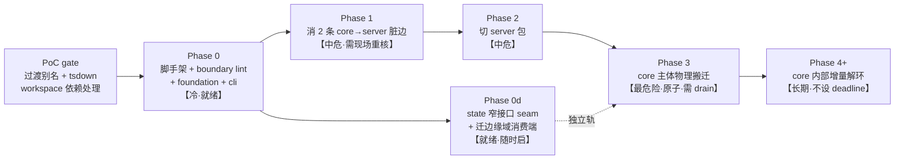

# Monorepo Workspace Split — 实施计划索引

> **面向 agentic worker**：本目录是 monorepo 拆分的分阶段计划集。REQUIRED SUB-SKILL：用 `superpowers:subagent-driven-development`（推荐）或 `superpowers:executing-plans` 按 task 执行。步骤用 `- [ ]` checkbox 跟踪。
>
> **单一事实源 spec**：[../../spec/2026-07-22-monorepo-workspace-split.md](../../spec/2026-07-22-monorepo-workspace-split.md)。本计划只写 how、不重述 why——决策/理由回 spec。

## 目标（一句话）

把 copilot-api-js 后端按模块拆成 monorepo workspace 子项目（`@hsupu/ghc-proxy-{foundation,core,server,cli}`），包间依赖方向由 lint 机械硬强制，粗粒度先切（19 模块 SCC 整块留 core）、之后增量剥离。

## 架构（2-3 句）

分层 DAG `foundation ← core ← server ← cli`（+ 已有 ui/ui-v4）。19 模块巨型 SCC 整体塞进 `core` 包内部（包内成环允许、边界检查器看不见）。边界用 ESLint `no-restricted-imports` 硬强制（非 day-1 TS project references），过渡期 `~/*` 别名继续解析到搬迁后真实位置以避免一次性大改 import。

## 全局约束（Global Constraints，每个 task 隐含包含）

- **包命名**：`@hsupu/ghc-proxy-foundation` / `-core` / `-server` / `-cli`。发布根包 `@hsupu/copilot-api` + bin `copilot-api` **均不改**。
- **运行时**：Bun-first / Node-compatible。测试用 `bun test`（非 `npm`/`vitest`，ui-v4 除外）。
- **每 commit 通用 invariant**（spec §7.3，全阶段强制）：① typecheck + `bun run test:backend` 绿（涉包边界必须全后端、fast 档不够）；② 行为字节不变——**冻结 oracle = pre-move HEAD 已通过的 `test:backend` + `GET /openapi.json` 快照，无需新增 golden**；③ 跨包回边只减不增（机械 oracle：`rg 'from "~/routes"' src/lib` 等）；④ **边界 lint 绿**（`bun run lint:all` 无新增违规，与 typecheck 同等地位）；⑤ 显式 pathspec 提交（`git commit -- <精确路径>`）。
- **回滚**：高危步骤隔离 worktree 内做，未合并前 master 零风险；已合并用 `git revert` 单 commit。
- **并发纪律**：并发 worktree 常在改 history/context/pipeline；物理搬迁前 `git worktree list` + `git log --oneline -5 -- <目标路径>` **现场重核**，绝不机械等具名分支（spec §7.1）。
- **判据**：长远正确 + 完整 > 短期省事（禁 ROI/YAGNI 砍范围）。

## 阶段 DAG 与就绪度

**红线**：
- **Phase 0 前必过 PoC gate**（过渡别名子路径映射 + tsdown workspace 依赖内联/外联）——见 plan-0 Task 1；未验证前不搬任何文件。
- **Phase 3（大搬迁）前必 drain**：目标路径（`src/lib/*`、`src/routes/*`）无活跃 worktree 近期提交才做；原子提交、独立 worktree、`ts-morph` codemod。
- **Phase 4+ 不预先展开为 TDD task**——它是长期 ratchet，随每次剥离单独起 plan。

## 各阶段计划文件

| 阶段 | 文件 | 状态 |
|---|---|---|
| Phase 0 | [plan-0-scaffold-foundation-cli.md](plan-0-scaffold-foundation-cli.md) | ✅ 已详细展开 |
| Phase 0d | plan-0d-state-seam.md | ⏳ Phase 0 落地后展开 |
| Phase 1 | plan-1-sink-dirty-edges.md | ⏳ 现场重核后展开 |
| Phase 2 | plan-2-server-package.md | ⏳ Phase 1 后展开 |
| Phase 3 | plan-3-core-body-move.md | ⏳ drain 窗口 + PoC 结论后展开 |
| Phase 4+ | 每次剥离单独起 plan | ⏳ 长期 |

**首个 Phase-4 领域包剥离**：[plan-token-package.md](plan-token-package.md) —— 把 `token/auth` 域抽成 `@hsupu/ghc-proxy-token`（评审中）。Phase 0d（state 视图 seam）token 域已落地 `54b32200`（`src/lib/state-readers/token.ts` 的 `TokenReadView`，立「依赖视图/角色接口非裸字段」范式）。

## 各阶段 kick-off prompt

> Phase 0 的完整 kickoff 在 [plan-0](plan-0-scaffold-foundation-cli.md) 末尾。以下是后续阶段的启动种子（展开成完整 plan 时细化）。

**Phase 0d kickoff**：「按 spec §5 + §7.2 阶段 0d 建 `core/state/reader-*.ts` 窄读接口（纯新增、零撞行），并把边缘域消费端（telemetry/models/token 优先序）从 `import { state }` 迁到窄接口、不留双轨。每迁一域 typecheck + test:backend 绿、已迁域 ratchet 只增不减。」

**Phase 1 kickoff**：「先 `git log --oneline -5 -- src/routes/responses src/lib/pipeline/router.ts src/lib/codec/openai-responses` 现场重核无活跃占用。下沉 `routes/responses/conversation-rebuild::rebuildConversationMessages` → core lib、`routes/responses/fallback::shouldForceChatCompletionsFallback` → core lib；两侧改 import。验收 oracle：`rg 'from \"~/routes\"' src/lib` 归零、两函数行为字节不变、test:backend 绿。独立 worktree、逐函数单 commit。」

**Phase 2 kickoff**：「切 `@hsupu/ghc-proxy-server` 包：`server.ts`（Hono app 组装）+ routes 薄壳归入；深入 SCC 的 handler 留 core。验收：`packages/server`→core 单向、core 无 `@hsupu/ghc-proxy-server` 运行时 import、`GET /openapi.json` 端点表面逐字节不变。」

**Phase 3 kickoff**：「【最危险·先 drain】确认目标路径无活跃 worktree。独立 worktree 内：`src/lib/*`→`packages/core/src/`、`src/routes/*`→`packages/server/src/`，`ts-morph` codemod 批改 import（不用 sed）。同步改 `tests/architecture/*.unit.test.ts` 硬编码 `import.meta.dir` 路径。原子提交、一次性合并。验收：`GET /openapi.json` + test:backend 字节/行为不变、跨包回边只减不增。」
