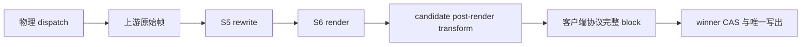
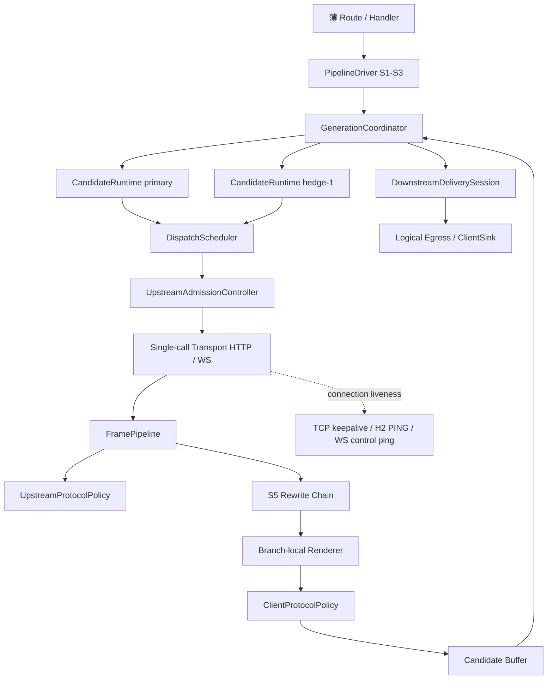
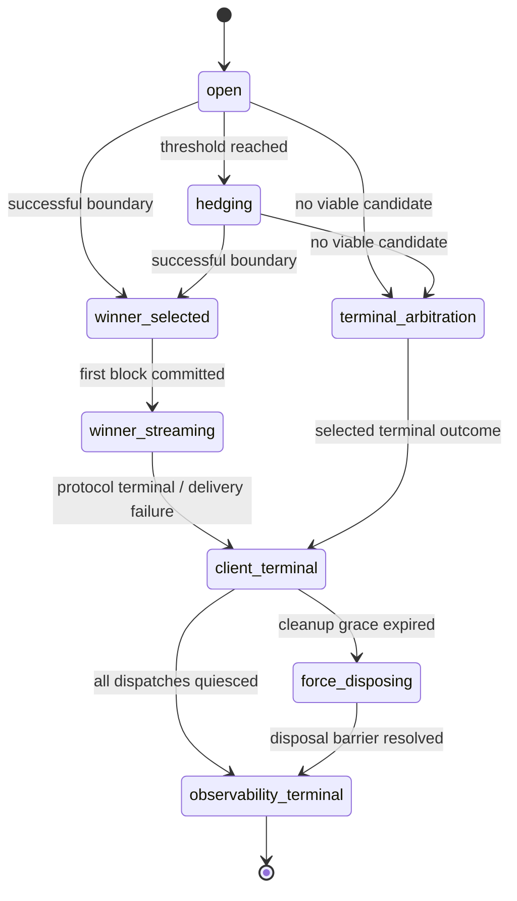
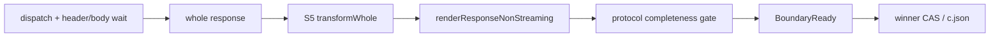
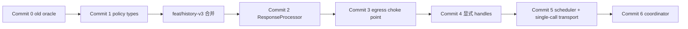

# RFC：上游生成运行时重构——显式物理调用、共享帧管线与 fast-retry 竞速

日期：2026-07-16｜状态：**定稿 v4，用户裁决已并入；最终异模型对抗评审 PASS，可交 planner**

关联架构：[DESIGN.md](../DESIGN.md)、[v4 目标架构](../v4/01-architecture.md)、[S4 Retry 与 Transport](../v4/03-spec/retry-transport.md)、[CellAssembly 2D 装配 RFC](2026-07-13-inbound-codec-outbound-leg-split.md)、[对称四点 hook RFC](2026-07-14-symmetric-four-point-hooks.md)、[block 级 buffered retry ADR](../decisions/2026-07-11-block-level-buffered-retry.md)。

## 0. 决策摘要

本 RFC 把当前“driver 的串行 S4 exchange + handler 的响应 pump + transport 内部隐藏重试”重构成一个显式的**上游生成运行时（Upstream Generation Runtime）**。它拥有从物理上游调用开始，到响应帧解释、客户端协议边界识别、候选分支竞速、唯一写出和资源静默退出为止的完整生命周期。

核心决策如下：

1. **保留薄请求信封与 2D CellAssembly。** S1～S3、路由和请求改写不是本轮重写对象；上游生成运行时从 S4 开始接管。现有 `clientFormat × targetEndpoint` 两轴继续作为装配键。
2. **取消“一个请求只有一个 currentAttempt”的隐式模型。** 新模型是 `Generation → Candidate → Dispatch`。`Candidate` 是 primary／hedge 等竞赛候选；`Dispatch` 是每次真实发往 GHC 的 HTTP 或 WS 调用。所有写入经显式 handle 定位，不再靠 `_attempts.at(-1)`。
3. **Transport 退化为一次物理调用。** Adaptive rate limiter 的排队与 429 重试、Responses 的 WS→HTTP fallback、反应式错误重试均移到运行时的显式调度层；每一次真实调用都有独立记录、取消信号和成本状态。
4. **SSE 不做厚规范化 IR。** 原始 `SseFrame` 始终保留；共享帧管线只附加 provenance、时间和语义信号。协议差异通过按上游 endpoint 与客户端格式装配的 policy 分类，避免把 Anthropic／Responses／CC／Gemini payload 压成有损公共形状。
5. **判胜依据是最终 wire-effective 客户端协议的完整语义 block。** 所有可能改 payload、drop frame、改 block identity 的变换必须在 candidate-local `postRenderTransform` 中完成，再由 `ClientProtocolPolicy` 分类和判胜。判胜后的 delivery-owned `client.outbound` 改为只读 observer，不能改变 wire。合成 keepalive／anchor／synthetic envelope 不构成语义提交。
6. **fast-retry 是 hedged generation，而非普通 RetryStrategy。** Primary 真正 dispatch 后超过可配阈值，且仍无完整语义 block 已提交时启动 secondary；primary 保持运行。首个产出成功、完整、客户端可见 block 的 candidate 原子获胜，其他 candidate 被取消。
7. **下游 sink 只有一个 owner。** Candidate 在判胜前只能写 branch-local buffer，永远不能直接 flush 客户端。`GenerationCoordinator` 完成 winner CAS 后才允许 winner buffer 进入逻辑请求级 egress；因此不存在双写 sink。
8. **所有成本事实保留，不“去重” loser。** Winner usage 是 client-effective usage；每个 dispatch 实际观察到的 usage 都是 observed upstream cost。Loser 在 usage 前被取消时记为 `unknown-after-cancel`，绝不伪造零成本。
9. **无 hedging 时仍走同一运行时。** 不保留永久双轨；迁移期间允许 legacy 与新实现对照，但最终删除旧 `runExchange`／`runResponseSink`／`runResponseBufferedSink` 编排。
10. **`upstream.outbound` 保持每 generation 一次。** 它继续位于 S3 后、candidate 分叉前；primary 与 hedge 共享其返回的语义 envelope snapshot。真正的 per-dispatch wire 派生仍由 `prepareWire()` 完成，`exchange` hook 才是每 physical dispatch 一次。
11. **Streaming 与 non-streaming 都进入同一 generation runtime。** Streaming 以完整 client block 为 commit boundary；non-streaming 以通过 completeness gate 的完整 whole response 为唯一 boundary，并可按同一 threshold hedging。
12. **“没有内容发往下游”解释为没有非 synthetic 的完整语义 block。** 现有 20s keepalive 会真实写出 synthetic message envelope／anchor／空 delta；这些协议脚手架字节可见但语义为空，不关闭 hedge 窗口。用户已在 2026-07-16 裁决允许 synthetic scaffold，并在 300s 无真实完整 block 时启动 fast-retry。
13. **客户端交付终态与 canonical observability 终态分离。** Winner 可立即完成客户端输出；History V3 canonical record只在所有 dispatch quiesce，或 cleanup grace 到期后完成强制 disposal barrier、确认本地 handle 不再产生 late fact时 seal。Grace 到期本身绝不直接 seal。物理 dispatch telemetry 按 dispatch settlement 增量记录，不依赖请求 terminal 才看见 loser。
14. **上游连接保活、上游重试、下游保活是三个正交 engine。** 上游连接保活只维护物理 transport session；上游重试只管理 candidate／dispatch 拓扑；下游保活只观察实际发往客户端的 blocks 与客户端连接，不读取“当前上游 attempt”或在 attempt 切换时重置。
15. **下游交付有独立生命周期。** 从下游流打开到客户端终态之间，同一个 `DownstreamDeliverySession` 跨 primary／hedge／reactive retry／buffered recovery 持续存在。上游仍可重试时它只保活、不结束；重试用尽或不可重试错误时，由 coordinator 向它提交唯一 terminal outcome，它按客户端协议平衡代理自有 scaffold、写 terminal、停止心跳并关闭 sink。

## 1. 动机与经代码确认的结构债务

### 1.1 S4 与完整 block 判定被拆在两套生命周期中

当前 `runExchange()` 在 `transport.send()` 返回 `UpstreamStream` 后立即结束，只记录响应头并把惰性 frame iterable 交给后续响应阶段。HTTP 下这通常只表示收到响应头，尚未消费任何 SSE 帧。完整 block 只有在 `runResponse()`／handler accumulator 处理时才能知道，见 [driver.ts](../../src/lib/pipeline/driver.ts) 的 `runExchange` 与 `runResponse`。

因此 fast-retry 不能只放在 transport 或现有 S4 retry loop。它需要跨越：



### 1.2 `RequestContext.currentAttempt` 是严格串行假设

`beginAttempt()` 向 `_attempts` 追加一项，而 `setAttemptWireRequest()`、`setAttemptResponse()`、`setAttemptError()`、`commitAttemptSseEvents()` 等全部通过 `ctx.currentAttempt` 修改 `_attempts.at(-1)`，见 [request.ts](../../src/lib/context/request.ts)。两个 candidate 并发时，primary 很容易把 header、timing、frame 或 error 写进 secondary 最新追加的 attempt。

这不是加锁能修的局部问题。正确模型必须让记录调用携带显式 `DispatchHandle`。

### 1.3 Transport 隐藏了多个真实调用

当前 adaptive rate limiter 接收一个 `fn`，遇到 429 后在内部排队和再次执行；Responses transport 又把 WS-first→HTTP fallback 隐藏在一次 `Transport.send()` 内，见 [adaptive-rate-limiter.ts](../../src/lib/adaptive-rate-limiter.ts) 与 [responses-transport.ts](../../src/lib/transport/responses-transport.ts)。于是一个 `Attempt` 可能对应多个真实上游调用，History 和成本遥测无法忠实回答“到底发了几次”。

fast-retry 会放大这个缺陷：若 secondary 已启动，而 primary 的 WS 随后 fallback HTTP，表面两条 branch 实际可能有三条并发物理调用。

### 1.4 响应状态散落在 driver、codec 和 handler

共享行为已经部分下沉：原始 SSE 采样、S5 rewrite 和 S6 render 在 driver；forwarded 采样和 heartbeat 在 sink；但 accumulator、terminal 判断、截断检测、translation flush、错误塑形和部分 post-render transform 仍在四个 handler。Responses fallback 和 Gemini 的终末 flush 甚至发生在 driver 返回后。

结果是“某个 candidate 是否已经产出完整客户端 block”没有一个权威对象能回答。

### 1.5 当前 cancel 只有请求级，没有 candidate／dispatch 级

`RequestContext.operationSignal`／`lifecycleSignal` 会取消整个请求，适合 client abort、reaper、deadline 和 shutdown，但不能表达“取消 loser，winner 继续”。Transport contract 也没有 per-dispatch signal。Adaptive rate limiter 的队列只有全局 shutdown 批量拒绝，没有单项取消。

### 1.6 共享 mutable request state 不能直接并发复用

`RequestEnvelope.requestState` 含 mutable `betaProbe`、reverse mapper holder、Responses fallback scratch 等跨阶段引用，见 [request-state.ts](../../src/lib/pipeline/request-state.ts)。这些状态在串行 retry 下成立，在并发 candidate 下必须逐字段声明为 immutable-shared、concurrency-safe shared、candidate-local 或 winner-commit-only，不能默认浅拷贝共享。

## 2. 目标与非目标

### 2.1 目标

1. 建立一个覆盖 streaming 与 non-streaming、HTTP 与 WS、direct 与 translation 的统一上游生成生命周期。
2. 每次真实上游调用可定位、可取消、可观测、可归因，隐藏的 429 replay 与 WS fallback 变为显式 dispatch。
3. 把格式无关的异步帧迭代、provenance、timing、hook、rewrite/render 编排、buffer 与唯一写出从具体 handler 中剥离。
4. 把不可泛化的协议语义收敛为小而明确的 policy，不重写已成熟的 accumulator／translator／rewrite 算法核。
5. 实现用户要求的 fast-retry，并保证 primary 不因 hedge 启动而取消、winner 唯一、loser 真正退出、下游不见半截 loser。
6. History／Telemetry 同时提供 client-effective 视图与全部物理成本真相。
7. 最终删除旧编排双轨，让新增格式只需提供 policy 与 cell 装配，不复制 pump。

### 2.2 非目标

1. 不把四种协议 payload 规范化成可往返的厚 IR；原始 body／frame 继续是事实源。
2. 不改变现有请求路由矩阵、S3 sanitize 算法或响应 rewrite 算法语义。
3. 不以 fast-retry 解决上游过载背压；hedging 仍必须经过 admission controller，不能绕过限流。
4. 不声称取消 loser 等于免计费；上游在取消前已经执行的工作可能计费，且 usage 未到时无法精确获知。

## 3. 术语与层级模型

### 3.1 Generation

一次客户端请求对应的一次客户端可见生成。它拥有唯一 egress、客户端协议 scaffold、最终 winner 和终态。

### 3.2 Candidate

竞争成为 generation winner 的候选生成。初始为 `primary`，fast-retry 启动 `hedge-1`。未来 buffered recovery 也可以创建 `recovery-N` candidate，但它与 hedging 的并发关系由 policy 决定。

Candidate 拥有独立的：

- request envelope snapshot；
- response rewrite state；
- renderer／translator state；
- upstream 与 client accumulator；
- pre-commit buffer；
- cancel controller；
- observability lane。

### 3.3 Dispatch

一次真实上游 HTTP 请求或 WS request。每个 dispatch 有唯一 id、独立 signal、wire snapshot、transport kind、起止时刻、响应头、原始帧、usage 与终态。

以下行为都必须产生新 dispatch，而不是隐藏在旧 dispatch 内：

- 反应式 4xx／5xx／network retry；
- adaptive 429 replay；
- WS→HTTP fallback；
- buffered recovery 再请求；
- fast-retry secondary。

### 3.4 Egress commit

任意真实客户端帧被写到下游的不可逆动作。Synthetic scaffold 与 semantic commit 分开记：

```ts
interface EgressState {
  downstreamBytesSent: boolean
  syntheticScaffoldSent: boolean
  semanticContentCommitted: boolean
  winnerCandidateId?: string
}
```

Fast-retry eligibility 只看 `semanticContentCommitted`，不把 keepalive／anchor 误当真实内容。

本 RFC 采用以下精确定义：`downstreamBytesSent` 可因 synthetic scaffold 为 true；`syntheticScaffoldSent` 只描述协议脚手架；`semanticContentCommitted` 仅在非 synthetic 的完整 client block 被写出后变 true。Hedge eligibility 要求 `semanticContentCommitted === false`，不要求绝对零字节。

判胜前**禁止 live retreat**。Candidate 或 generation buffer cap 超限时，不得把半截 primary 写给客户端：该 candidate 以 `buffer-cap-exceeded` 失败；若尚无 secondary，立即启动一个符合 policy 的替代 candidate；若仍有其他 candidate 则继续等待；全部 candidate 都失败才返回错误。

### 3.5 Candidate state fork

S3 后的 generation semantic snapshot 经显式 `CandidateStateFactory.fork()` 建 candidate，禁止直接浅拷贝 `RequestEnvelope.requestState`：

```ts
interface CandidateStateFactory {
  fork(input: { generationEnv: RequestEnvelope; candidateId: string; role: CandidateRole }): CandidateEnvelope
}
```

| 状态 | 归属与 fork 规则 |
|---|---|
| S3 后 semantic body、resolved model | generation 创建时 deep snapshot／freeze；fork 只读共享 |
| `truncateBaseline` | generation-shared deep-frozen snapshot；candidate truncation从此基线派生，不原地改 |
| `resanitize` | 不共享捕获 mutable mapper 的闭包；改成接收 candidate-local mapper/context 的纯 factory，每 candidate 建实例 |
| `clientAnthropicBeta` | generation-shared immutable string seed |
| `clientRequestHeaders` | generation 创建时复制并 freeze，candidate 只读 |
| `initialSanitizationInfo` | generation 初始 transform diagnostic，冻结一次；candidate 后续 diagnostic 单独记录，不再通过 ctx 第二载体覆盖 |
| `preprocessInfo` | generation-shared deep-frozen diagnostic／mapping input |
| `prepareHints`、reactive retry 后的 env／body | candidate-local copy-on-write |
| `betaProbe` latest outbound | candidate-local；从同一 client beta seed 新建，dispatch 只写本 candidate probe |
| reverse mapper holder | candidate-local factory；若未来实证 build 后完全 immutable 才允许共享 |
| Responses fallback scratch／responseId／itemId／rebuilt messages | candidate-local，且被该 candidate 的 request preparation 与 response processor 共享 |
| renderer／translator／accumulator／rewrite state | candidate-local；同一 winning processor 跨 boundary 保持实例身份 |
| wire、tracking headers、transport、timing、raw frames、usage | dispatch-local |
| negotiation／quarantine durable cache | process-global concurrency-safe；loser 只有在对应 dispatch 获得明确上游拒绝且 remediation 后成功时才可提交学习 |
| feature／warning／normalization diagnostics | 先写 candidate／dispatch lane；client-effective 投影只取 winner，generation diagnostic 可显示全部 |

## 4. 目标架构

### 4.0 三个正交 engine

| Engine | 唯一 owner | 输入 | 输出 | 明确不拥有 |
|---|---|---|---|---|
| **Upstream Connection Liveness** | `PhysicalTransport`／连接池 | transport config、session/socket 生命周期 | TCP keepalive、HTTP/2 PING、可选 WS control ping、单 dispatch idle/error | retry 决策、candidate、客户端 blocks、下游 heartbeat |
| **Upstream Retry & Competition** | `GenerationCoordinator` + `CandidateRuntime` + `DispatchScheduler` | candidate outcome、retry policy、hedge clock、request cancel | 新 dispatch／candidate、winner、最终 upstream outcome | 下游 timer、open client block、keepalive frame、直接 sink write |
| **Downstream Delivery Liveness** | `DownstreamDeliverySession` | 已实际提交的 client frames／blocks、client abort、唯一 terminal command | block-aware heartbeat、synthetic scaffold、winner frames、terminal wire、delivery snapshot | upstream attempt id、transport session、retry budget、candidate reset |

三个 engine 只通过窄事件交互：retry engine 向 delivery engine 提交 `commitWinnerBlock`／`forwardWinnerFrame`／`terminate`；delivery engine 不反向驱动 retry。上游连接保活完全不参与这条交互。



### 4.1 `GenerationCoordinator`

建议文件：`src/lib/pipeline/generation/coordinator.ts`。

职责：

- 建立 generation-scope egress 与 synthetic scaffold；
- 启动 primary，按 policy 决定是否和何时启动 hedge；
- 接收 candidate 的 `boundary-ready`、`terminal-success`、`terminal-failure`、`cancelled` 事件；
- 原子选 winner；
- 取消 loser，但不等待 loser cleanup 才开始 flush winner；
- 把 loser cleanup 注册到 operation scope，保证 settle 后仍可 drain／quiesce；
- 在所有 candidate 都失败时执行确定性错误仲裁；
- 对 non-streaming 把“完整合法 response”视为唯一 commit boundary。

它是唯一允许调用 generation egress 的对象。



`client_terminal` 关闭下游连接；`observability_terminal` 才 seal canonical record。Winner 一旦提交首块，后续失败只在同一 winner 上终止，loser 永不复活、也不允许切换 candidate。

### 4.2 `CandidateRuntime`

建议文件：`src/lib/pipeline/generation/candidate.ts`。

职责：

- 持有 candidate-local envelope 和 branch-safe state；
- 驱动 `DispatchScheduler` 获得一个上游响应；
- 为每个 dispatch 创建全新的 `ResponseProcessor`；
- 在判胜前缓存最终客户端帧；
- 只向 coordinator 报告 boundary／terminal，不直接触碰 sink；
- 按恢复 policy 选择串行 reactive retry 或 buffered recovery；
- 接受 candidate-level cancel，向所有活跃 dispatch 广播并等待 quiescence。

产出首个 `BoundaryReady` 的 `ResponseProcessor` 在 winner CAS 后**以同一实例**继续消费后续帧；不得重建、replay 或切换 translator。Candidate runtime 在 processor 产出 boundary 信号后暂停自己的 `for await`、不再调用上游 iterator.next()，等待 coordinator 返回 `winner | loser`：winner 原子从 `probing` 进入 `winner-live`，loser 进入 `cancelling` 且不得再 `finish()` 产 client frames。

### 4.3 `DispatchScheduler`

建议文件：`src/lib/pipeline/generation/dispatch-scheduler.ts`。

职责：

1. 每轮从 candidate envelope 重新 `prepareWire()`，因此 secondary 获得独立 `x-request-id`／`X-Agent-Task-Id`；
2. 创建显式 `DispatchHandle` 与独立 `AbortController`；
3. 等待 cancelable admission；
4. 调一次 single-call transport；
5. 把 HTTP error／network error交给 retry policy；
6. 把 429 与 WS fallback 也转成显式下一 dispatch；
7. 为每个 dispatch 记录 reason：`initial | reactive-retry | rate-limit-retry | ws-fallback`。

`upstream.outbound` **不在 scheduler 内执行**。它在 generation 分叉前由 driver 调一次，延续当前 `runRequest()` 的 cardinality；candidate 持有的是该 hook 返回值的 branch-safe snapshot。Scheduler 每 dispatch 只重跑 `prepareWire()` 与 `exchange` hook。若未来确有 per-dispatch 请求 hook，必须另立名称与 API，不能通过给现有 hook 加 `perDispatch` flag 偷换语义。

Dispatch reason 不含 `hedge`：hedge 是 candidate role，hedge candidate 的第一次物理调用仍是 `initial`。这样 role 与“为何重发同一 candidate”两轴不混用。

同理，buffered recovery 是新的 `role:"recovery"` candidate，其首次 dispatch reason 也是 `initial`；不是同 candidate 内的 `buffered-recovery` dispatch。

### 4.4 `UpstreamAdmissionController`

建议从 [adaptive-rate-limiter.ts](../../src/lib/adaptive-rate-limiter.ts) 提取。

目标 API：

```ts
interface UpstreamAdmissionController {
  acquire(input: {
    model: string
    candidateId: string
    dispatchId: string
    signal: AbortSignal
  }): Promise<{ admittedAt: number; queueWaitMs: number }>

  observe(result: {
    model: string
    status?: number
    retryAfterMs?: number
    completedAt: number
  }): AdmissionDecision

  rejectAll(reason: unknown): void
}
```

`acquire()` 只负责 cancelable 排队／节流，不执行 fetch。`observe(429)` 返回下一次允许发送的决策，由 scheduler 创建新 dispatch。这样每次真实调用都进入 History，同时 loser 在 queue 或 backoff 中可精准撤销。

`rejectAll()` 保留当前 shutdown `rejectQueued()` 的全局能力。实现仍需在 admission 返回后、transport 调用前做一次 cancelled gate，封住“排队项刚被全局拒绝却仍开始上游调用”的 RC4 竞态。

### 4.5 Single-call Transport

目标 contract：

```ts
interface PhysicalTransport {
  open(wire: PreparedRequest, ctx: DispatchContext): Promise<PhysicalResponse>
}

type PhysicalResponse =
  | { kind: "stream"; headers: Headers; frames: AsyncIterable<UpstreamFrame>; cancel(reason: string): void; dispose(reason: string): Promise<DisposalResult>; quiesced: Promise<void> }
  | { kind: "json"; headers: Headers; body: unknown; cancel(reason: string): void; dispose(reason: string): Promise<DisposalResult>; quiesced: Promise<void> }
  | { kind: "fallback-before-first-event"; error: unknown; partialHeaders?: Headers; cancel(reason: string): void; dispose(reason: string): Promise<DisposalResult>; quiesced: Promise<void> }
  | { kind: "failed-open"; error: unknown; retryable: boolean; partialHeaders?: Headers; cancel(reason: string): void; dispose(reason: string): Promise<DisposalResult>; quiesced: Promise<void> }

interface DisposalResult {
  quiesced: true
  connectionReusable: boolean
  detail?: string
}
```

约束：

- 一次 `open()` 最多发一次真实请求；
- 不含 rate-limit replay；
- 不含 WS→HTTP fallback；
- signal 同时覆盖 connect／header wait／body iteration；
- cancel 必须唤醒 pending header wait 或 pending `iterator.next()`；
- `quiesced` 在 socket／WS busy state／iterator cleanup 完成后 resolve；
- hook `exchange` 每 physical dispatch 调一次，并收到 dispatch metadata 与 signal。
- JSON variant 的 `open()` 只在 body 已完整解析后 resolve；其 `cancel()` 是 no-op，`quiesced` 已 resolve。Header wait 与 body parse 期间的取消由传入 `DispatchContext.signal` 控制。
- WS transport 只可返回 `fallback-before-first-event`。握手／send／首事件前失败可由 scheduler 新建 HTTP `ws-fallback` dispatch；首事件后的截断归 response processor／recovery candidate，绝不走 HTTP fallback。失败的 WS handle quiesce／释放 busy state 后才能开始 fallback dispatch。
- `open()` 失败也必须返回或附带可等待的 failed handle，不能只 throw 后遗失 cleanup ownership。
- `cancel()` 只发起协作取消；`dispose()` 是幂等强制所有权 barrier，resolve 时保证该 dispatch 不再产生 frame／usage／header／listener callback。`quiesced` 在自然退出或 dispose 完成时 resolve。

#### 上游连接保活边界

Transport connection liveness 保留为完全独立的物理层能力：

- TCP `setKeepAlive` 绑定 socket lifetime；HTTP/2 PING timer 绑定 pooled session lifetime，而不是 dispatch／candidate lifetime。
- GOAWAY 只阻止新 stream 时，已有 stream 仍在跑，session PING 继续到 session close；这不代表任何请求有业务进展。
- 上游 control ping 永远不产生 client frame、不重置 downstream heartbeat，也不影响 hedge threshold／stream semantic progress。
- Dispatch idle guard 检测上游应用帧静默；连接 PING 不重置它，除非 transport 协议明确把收到应用事件定义为 progress。
- Retry engine 只消费 transport outcome，不启动／停止连接保活 timer；downstream delivery 也不读取 transport liveness。
- Session／socket 最终 close 必须清除对应保活 timer并移除 listener；通过 crash-safety primitives 防止迟到 error／rejection 逃逸。

HTTP/2 与 WS disposal ownership 不同：

- HTTP/2 dispatch 的 `dispose()` 只 RST／关闭自有 stream，绝不关闭仍承载其他 active owner 的 pooled session。
- 当前 Responses WS 一条连接同一时刻只承载一个 request，且协议没有可靠的 request-local cancel frame。Loser cancel 后连接**不得**立即 `busy=false` 返回池：先原子标记 `unusable/draining`，由 pool owner 关闭该不可复用 WS 连接，等待 socket close、listener detach、queue隔离与 busy-state barrier，再让 `dispose()`／`quiesced` resolve。
- “不得关闭 pooled socket”只适用于仍有其他 active owner 的共享连接；单 request WS loser 的连接必须由 pool owner关闭并移出池，防旧 generation 迟到帧进入新 request queue。

### 4.6 `FramePipeline`

建议文件：`src/lib/pipeline/stream/frame-pipeline.ts`。

它接管当前 `runResponse()` 的共享骨架，但不把协议 payload 规范化。每帧依次经过：

1. 原始 upstream frame envelope 建立；
2. upstream-original 采样和 timing；
3. `upstream.inbound` hook；
4. S5 response rewrite chain；
5. branch-local renderer／translator；
6. candidate-local `postRenderTransform`；
7. client protocol classification；
8. 交 candidate buffer。

`client.outbound` 不在 candidate frame pipeline 内。它由 `DownstreamDeliverySession` 在唯一 egress serializer 中执行，且是 winner-only／wire-effective **observe-only hook**：接收冻结的 frame envelope，可记录／审计，但无返回值、不能改写或 drop。现有可改写 `client.outbound` 是错误命名的 post-render transform，迁移时强制改名并移入 candidate-local `postRenderTransform`；不保留永久兼容双轨。由此判胜分类与真正 client wire 使用完全相同的变换后帧，不存在 hook 后语义漂移。

`[DONE]` 不再由通用层无条件硬编码丢弃。它属于 OpenAI transport sentinel，是否消费由 `UpstreamProtocolPolicy` 分类，避免未来新增协议时把合法 data 恰好等于 `[DONE]` 的帧误删。

### 4.7 `ResponseProcessorFactory`

当前 codec 对象可能持有 per-request translator／scratch 状态，不能被两个 candidate 并发复用。CellAssembly 应新增一个 response-side factory：

```ts
interface ResponseProcessorFactory {
  create(input: {
    env: RequestEnvelope
    candidate: CandidateContext
    dispatch: DispatchHandle
  }): ResponseProcessor
}

interface ResponseProcessor {
  consume(frame: UpstreamFrameEnvelope): Iterable<ClientFrameEnvelope>
  consumeWhole(body: unknown): WholeResponseResult
  finish(): ResponseFinishResult
  upstreamSnapshot(): UpstreamResponseSnapshot
  clientSnapshot(): ClientResponseSnapshot
}
```

每个 candidate 拿一个全新 processor。Candidate 内因 reactive HTTP retry 尚未收到 response body 时不创建 processor；某 dispatch 成功建立 response stream／whole body后，其 processor 绑定该 dispatch。Winner boundary 前的 buffered recovery 会结束当前 candidate并创建新的 recovery candidate。现有 accumulator、translator、rewrite factory 被包装复用，不重写算法。

`finish()` 不是无条件 drain。它必须先运行协议 completeness／terminal 分类，再返回：

```ts
type ResponseFinishResult =
  | { kind: "complete"; frames: ReadonlyArray<ClientFrameEnvelope>; boundary: BoundaryReady }
  | { kind: "valid-terminal-without-boundary"; frames: ReadonlyArray<ClientFrameEnvelope>; terminal: ValidTerminalOutcome }
  | { kind: "truncated"; partialFrames: ReadonlyArray<ClientFrameEnvelope>; failure: CandidateFailure }
  | { kind: "terminal-failure"; frames: ReadonlyArray<ClientFrameEnvelope>; failure: CandidateFailure }
```

`finish()` 必须先 drain S5 rewrite chain 的 buffered frames，再运行协议 completeness／terminal 分类；drain 产出进入 `frames`／`partialFrames`。Gemini 的 `FINISH_REASON_UNSPECIFIED` 必须走 `truncated`：允许 flush 已完成的工具调用投影，但抑制误导性的 terminal frame。Responses fallback／Gemini 当前在 handler post-loop 的 translator flush 与完整性 gate 都一起迁入 processor，不能只搬 `flushResponse()`。

### 4.8 `DownstreamDeliverySession`

建议文件：`src/lib/pipeline/delivery/session.ts`。

它是每个 streaming generation 唯一、长寿命的客户端交付 owner，创建于下游流打开时，跨全部上游 candidate／dispatch 存活。Non-streaming 使用一次性 `WholeResponseDelivery`，不启动 heartbeat。

```ts
interface DownstreamDeliverySession {
  readonly state: "open" | "terminating" | "closed"
  readonly protocol: ClientProtocolPolicy
  readonly snapshot: DeliverySnapshot

  writeScaffold(frames: ReadonlyArray<ClientFrameEnvelope>): Promise<void>
  commitWinnerBlock(candidate: CandidateHandle, frames: ReadonlyArray<ClientFrameEnvelope>): Promise<void>
  writeWinnerFrame(candidate: CandidateHandle, frame: ClientFrameEnvelope): Promise<void>
  terminate(command: DeliveryTerminalCommand): Promise<DeliveryTerminalResult>
}

type DeliveryTerminalCommand =
  | { kind: "complete"; candidate: CandidateHandle; frames?: ReadonlyArray<ClientFrameEnvelope> }
  | { kind: "upstream-exhausted"; error: CandidateFailure }
  | { kind: "upstream-nonretryable"; error: CandidateFailure }
  | { kind: "request-cancelled"; source: CancellationSource }
  | { kind: "client-aborted" }
```

#### 下游保活输入只来自 committed client wire

Delivery session 内的 `ClientBlockLedger` 只由**真正经过唯一 egress serializer 的帧**更新：

```ts
interface ClientBlockLedger {
  readonly messageEnvelope: "none" | "synthetic" | "real"
  /** Post-reconcile、真正写上 wire 的 index/type；Anthropic anchor remap 后真实 block 已是 +1 index。 */
  readonly openBlocks: ReadonlyArray<{ index: number; type: string; synthetic: boolean }>
  readonly lastWriteAtMonotonic: number
  readonly semanticBlockCount: number
  readonly terminalWritten: boolean
}
```

- Heartbeat frame factory 只读 `ClientBlockLedger` 与 client format：有 open block 时发匹配该 block 的空 delta；无 open block 时按 protocol policy 懒建 generation-owned scaffold；Responses／CC 使用各自合法 keepalive；Gemini policy 可明确 `disabled`。
- Candidate pre-winner buffer、上游原始帧、attempt accumulator、transport PING 都不能更新 ledger。
- Candidate／dispatch 开始、失败、重试、切换、loser cancel 均**不重置** heartbeat cadence、message envelope 或 open-block stack。
- Winner 首块提交时，通过 protocol policy 把 generation-owned scaffold 与 winner 帧对账；随后所有 block 状态继续由真实写出帧推进。
- Heartbeat timer 是 delivery-session resource，只在 client abort 或 `terminate()` 进入 `terminating` 时停止；不是 processor／candidate／dispatch resource。

#### 正确退出

Retry engine 在尚有可行 candidate／retry budget 时不得终止 delivery session。仅当以下任一事实确定时调用 `terminate()`：

1. Winner 正常协议终止；
2. 所有 candidate／recovery 均失败且重试预算用尽；
3. 错误被判为 **generation-global nonretryable**，或该 candidate 不可重试且已无任何可行 sibling／recovery；单个 candidate 的 nonretryable error 只结束该 candidate，下游保活继续；
4. request-level deadline／reaper／shutdown force-abort；
5. client 已断开。

Delivery session 内有一个真正的**单写者队列**，heartbeat、scaffold、winner frame、observer、terminal 全部入同一队列。每项取得写权后重新检查 state；`terminate()` 先原子进入 `terminating` 建立 fence，拒绝尚未开始的普通写，等待当前持锁写完成，再执行 terminal 序列。清 timer 不是终止屏障，已开始但尚未写 sink 的 heartbeat tick也必须被 state recheck 丢弃。

`terminate()` 是幂等的 first-command-wins 状态机：先永久停止 heartbeat，再让 `ClientProtocolPolicy.terminateFromLedger()` 检查完整 ledger，按客户端协议平衡**所有 wire-required open structures**，包括 synthetic scaffold 和 winner 已真实写出的 open block；随后写至多一个 terminal frame／trailer，最后关闭 sink并冻结 `DeliverySnapshot`。不是所有协议都允许为真实半块合成 stop；policy 必须按真实客户端 oracle决定“补 stop 后 error”或“直接 protocol error／close”，但绝不能只关闭 anchor、遗留另一个必闭合 block。`client-aborted` 不写任何额外字节；其余错误只有在客户端连接仍存活时写协议终态。Terminal 完成后队列永久关闭，任何迟到 tick／winner frame／loser frame都不能落在 terminal 之后。

`DeliveryTerminalResult` 只描述客户端交付结果，不等同于 upstream observability terminal；loser cleanup 和 History seal 按 §8.4 继续独立完成。

## 5. “SSE 通用处理”边界

### 5.1 共享机制

以下职责从 codec／handler 剥离：

- async iterator 驱动与结构化 cleanup；
- per-dispatch idle／abort race；
- upstream／client frame 序号、时间、字节和 provenance；
- raw upstream 与 forwarded 两条轨的统一采样；
- hook cardinality 和 metadata；
- rewrite chain 的实例化、逐帧 pass 与 flush；
- renderer 调用顺序；
- pre-commit buffer、双层 cap、超限失败 policy 与唯一 flush；
- candidate boundary 事件；
- sink serialization；
- synthetic 与真实帧可辨识标记。

### 5.2 协议 policy

以下语义必须留在 policy／现有算法核：

```ts
interface UpstreamProtocolPolicy {
  classify(frame: SseFrame): UpstreamFrameSignals
  createObserver(env: RequestEnvelope): UpstreamObserver
  classifyTerminal(observer: UpstreamObserver): UpstreamTerminal
  formatTransportError(error: unknown): UpstreamFailure
}

interface ClientProtocolPolicy {
  classify(frame: ClientFrameEnvelope, state: ClientProtocolState): ClientFrameSignals
  createState(env: RequestEnvelope): ClientProtocolState
  flush(state: ClientProtocolState): Iterable<ClientFrameEnvelope>
  createSyntheticScaffold(input: ScaffoldInput): SyntheticScaffold
  reconcileWinner(frame: ClientFrameEnvelope, scaffold: SyntheticScaffold): Iterable<ClientFrameEnvelope>
  terminateFromLedger(input: {
    command: DeliveryTerminalCommand
    ledger: ClientBlockLedger
    protocolState: ClientProtocolState
  }): DeliveryTerminationPlan
}

interface DeliveryTerminationPlan {
  /** 依次写出的结构平衡帧 + 唯一协议 terminal；client-aborted 时为空。 */
  frames: ReadonlyArray<ClientFrameEnvelope>
  closeMode: "graceful" | "error" | "client-gone"
}

interface ClientFrameSignals {
  synthetic: boolean
  semanticContent: boolean
  blockBoundary: boolean
  terminal: "none" | "success" | "valid-without-boundary" | "failure"
  usage?: unknown
}
```

`ClientFrameSignals` 是附加分类，不替代 raw frame。History 同时保存 raw、分类和 provenance。

Server tool 风险也由 target-endpoint policy 分类：`classifyServerExecutionRisk(wire)`。Anthropic 正样本包括 `web_search_*`、`web_fetch_*`、`code_execution_*`、`tool_search_*`；Responses 正样本包括 `web_search`、`file_search`、`code_interpreter`。普通 custom tool 以及 Anthropic `text_editor_*`、`computer_*`、`bash_*`、`memory_*` 是负样本。未知 API-defined typed tool 默认保守禁用 hedging并记录原因。

### 5.3 当前格式的判胜边界

判胜发生在 client format，且必须经过全部 response transform：

| 客户端格式 | 成功完整 block | 不算判胜 |
|---|---|---|
| Anthropic | 非 synthetic 的完整 `content_block_stop`，且对应 block 在 candidate 内含真实 upstream-derived 内容；thinking／redacted_thinking／text／tool_use 都是合法 block | `message_start`、delta、ping、anchor、synthetic empty block、error |
| OpenAI Responses | 非 synthetic 的 `response.output_item.done`，且 item 来源于真实 candidate 输出 | `response.created`、delta、`response.ping`、failed／incomplete／error |
| Chat Completions | 协议无独立 block close，首个带非空 `finish_reason` 的完整 choice 作为唯一成功边界 | 普通 delta、keepalive chunk、error |
| Gemini | 首个带有效 `finishReason` 的完整 candidate 作为唯一成功边界 | 普通 part delta、synthetic keepalive、error |
| Non-streaming | 完整、通过协议 completeness gate 的 response | HTTP headers、部分或语义残缺 JSON |

注意：用户要求的是“完整 block”，不是首 delta。Thinking block 只要完整并将真实内容提交给客户端，也会参加 winner CAS。若后续终态把它判为 thinking-only refusal，这不撤销已经提交的 winner：它按 winner 后续合法终态处理。Synthetic scaffold 永远不参与判胜。

### 5.4 Non-streaming 数据流

Non-streaming 不经过帧 iterator，但仍由 generation runtime 编排：



- Hedge clock 与 streaming 一样从 primary 首次实际 dispatch 开始；body 尚未形成完整 response 前可启动 secondary。
- 每个 candidate 内的 HTTP／network／reactive retry 仍由 scheduler 串行处理。
- `consumeWhole()` 应用 whole-response rewrite 与 render，并返回完整、截断或终态失败；candidate 只把完整结果交给 coordinator。
- Non-streaming 无预提交 buffer retreat 问题，whole body 自然就是 candidate-local buffer。
- Winner 产生后 loser 的 pending fetch/body parse 由 branch signal 取消；已完整 resolve 的 JSON variant 无需 cleanup。

## 6. Fast-retry／hedging 语义

### 6.1 Eligibility

默认策略：

```ts
interface HedgePolicy {
  enabled: boolean
  thresholdMs: number
  maxSecondaryCandidates: number
  eligible(ctx: HedgeEligibilityContext): boolean
}
```

Primary 的 hedge clock 从第一次调用 `transport.open()` 前的单调时刻开始，不含 limiter queue wait。到阈值时同时满足以下条件才启动 secondary：

- generation 尚未 settle／cancel；
- 尚未选择 winner；
- `semanticContentCommitted === false`；
- primary 尚未报告成功完整 block；
- secondary 数量未超限；
- request deadline 仍有足够完成与 cleanup 余量；
- 前六项同步 gate 通过后，向 admission controller 发起可取消的异步 `acquire()`；排队期间 generation／candidate signal 可撤销，acquire 拒绝则 secondary 未真正启动。

用户可观察的 300s 定义为“primary 首次真实发上游后 300s”，不包含 primary 自己尚未获准 dispatch 的 limiter queue wait。排队期间启动 secondary 只会把同一个过载队列再添一项，既无加速价值又会形成放大器，因此不 hedge。Generation 另记录 `queueWaitMs`，客户端总等待时间可以大于 threshold；这是有意把“上游执行慢”与“本地背压等待”分开。

Eligibility 使用绝对剩余预算而非只验静态配置：`now + expectedHedgeCompletionBudget + cleanupMargin < requestDeadlineAt`，并读取 per-model header／idle override。Generation 创建时同时捕获 `{epochBase, monotonicBase}`，所有仲裁用 monotonic，持久化用固定基准换算。

Secondary 使用同一逻辑请求 body 与同一语义配置，但重新执行 `prepareWire()`，获得独立 tracking headers。它不自动应用 context compression；hedging 的含义是复制同一请求，而不是偷偷改变语义。

#### Server tool gate

含 GHC server-side tool 能力的请求可能已经在 primary 上触发 `web_search`／`tool_search`／`code_execution`。取消 loser 只能停止本地等待，不能撤回已开始的远端工具执行、quota 或外部访问。因此默认 `HedgePolicy.eligible()` 对 wire 中存在 server tool 声明的请求返回 false；operator 可通过显式 `allow_server_tools: true` opt-in，并在配置说明中接受重复远端执行与双倍成本风险。History 记录每个 candidate 是否携带 server tools，但不能声称知道上游是否已经真正执行。

### 6.2 Winner CAS

Candidate 报告一个 `BoundaryReady`：

```ts
interface BoundaryReady {
  candidateId: string
  completedAtMonotonic: number
  bufferedFrames: ReadonlyArray<ClientFrameEnvelope>
  snapshot: CandidateSnapshot
}
```

Coordinator 用串行事件队列处理 boundary，**第一个被 coordinator 观察到的 successful-boundary 获胜**。`completedAtMonotonic` 只作诊断，不允许事后推翻 winner；若同一次队列入列序号相同，primary 再按 candidate sequence 优先。

选中后顺序是：

1. 原子写 `winnerCandidateId`；
2. 同步触发所有 loser candidate abort；
3. 立即把 winner 首个完整 block flush 到 egress，不等待 loser quiesce；
4. loser cleanup promise 注册进 request operation scope；
5. winner 后续帧转为 live pass-through，仍由 coordinator 独占 sink。

### 6.3 错误仲裁

Candidate outcome 分三类：

1. `successful-boundary`：立即参加 winner CAS；
2. `valid-terminal-without-boundary`：合法空结果、refusal、incomplete、content-filtered 等，暂存到所有仍可能成功的 candidate 结束；
3. `failure`：HTTP／protocol／transport／cancel failure。

完整失败帧不是成功 block，不能抢赢仍活着的另一 candidate。

- 一个 candidate pre-boundary 失败：保留其完整事实，其他 candidate 继续。
- 全部 candidate 均失败：按“最具上游语义的失败”选择客户端错误，优先级为明确 upstream HTTP／protocol failure > transport failure > cancellation；同级取最早发生者，并在 History 保留全部失败。
- `refusal`／`incomplete`／content-filtered 的语义由 client protocol policy 判定。若协议把它定义为合法终态但无成功 block，则它是 terminal candidate outcome，不在另一 candidate 仍可能成功时抢赢。
- request-level client abort／deadline／reaper／shutdown 立即取消全部 candidate，不进入 winner 仲裁。

当没有 successful boundary 时，先选最早的 `valid-terminal-without-boundary`，同刻 primary 优先；只有不存在合法终态才按 failure 优先级选择。被选合法终态的完整 buffered frames 写给客户端。

所有终局仲裁只产一个 `DeliveryTerminalCommand`：有合法 terminal 则 `complete`；全部 retry/recovery 用尽则 `upstream-exhausted`；generation-global 不可重试，或 candidate 不可重试且无可行 sibling/recovery，才产 `upstream-nonretryable`。Coordinator 不直接关闭 sink／timer，也不自行拼协议 error frame。

### 6.4 与现有 buffered retry 的关系

Hedging 和 buffered recovery 共用 candidate runtime，但不是同一个概念：

- Hedging：慢而未提交时并发新增 candidate。
- Buffered recovery：candidate 因 transport-close／truncation 失败后串行创建新的 recovery candidate，带 `parentCandidateId`。
- Reactive retry：dispatch 在收到可修复 HTTP error 后更新 env，再串行创建下一 dispatch。

最终运行时用 policy 决定 candidate 拓扑，不再让 `runResponseBufferedSink()` 自己回跳 `runExchange()`。

默认组合规则：

1. Winner 产生前允许 primary 与一个 hedge candidate 并发。
2. 每个 candidate 内允许 reactive dispatch retry。
3. Candidate 已有完整 block ready 后不再启动 recovery；它应参加 winner CAS。
4. 某 candidate pre-boundary 截断时可按 buffered policy 创建 recovery，但 generation-global 活跃 candidate 上限必须限制总并发。
5. 任意语义 block commit 后，全部透明切换／重取能力永久关闭。

Winner 后续若截断、protocol error 或 sink write error，只向客户端表面 winner 的对应 terminal error／delivery failure；loser 不复活，History 记录 candidate `winner` 与最终 delivery outcome 两条正交轴。

Caps 分开配置／记录：`maxActiveCandidates`、`maxActiveDispatches`、`candidateBufferBytes`、`generationBufferBytes`。超限牺牲顺序：先拒绝启动新的 recovery，再拒绝启动 hedge，再让超 candidate cap 的当前 candidate失败；绝不在未选 winner 时 live flush 半截帧。

另有 generation-lifetime 总预算 `maxTotalCandidates`／`maxTotalDispatches` 与 recovery budget；active cap 只限制并发，不能代替总重试上限。旧 buffered `max_retries` 强制迁为 recovery candidate budget。

### 6.5 超时约束

配置必须满足：

$$
T_{hedge} < \min(T_{header}, T_{idle}, T_{requestDeadline} - T_{cleanupMargin})
$$

当前 bundled 默认 `response_header=600s`、`stream_idle=600s`、`request_deadline=1200s`，初始 hedge threshold 300s 有足够余量。若热重载后不满足约束，配置层应拒绝该组合或禁用 hedging 并发出明确 ERROR；不能静默让 primary 在 hedge 前被 timeout 杀死。

所有 generation／candidate／dispatch deadline 使用 monotonic clock；持久化时再记录 epoch 时间，避免 wall-clock 跳变影响仲裁。

Timeout/retry budget 在 generation 创建时按当时 effective config 与 per-model override 冻结；热重载只影响新 generation。配置值 `0` 表示 disabled，在预算公式中按 $+\infty$ 处理。`expectedHedgeCompletionBudget` 默认取 secondary 的有效 response-header timeout 与剩余 request deadline之较小值；两者都 disabled 时，只受 generation 总 deadline／candidate budget约束，若也无界则配置校验拒绝开启 hedging。

## 7. Hooks、翻译与合成 egress

### 7.1 Hook cardinality

Hook context 新增：

```ts
interface HookExecutionContext {
  generationId: string
  candidateId: string
  candidateRole: "primary" | "hedge" | "recovery"
  dispatchId?: string
  dispatchReason?: string
  winnerState: "undecided" | "winner" | "loser"
  signal: AbortSignal
}
```

调用基数：

- `client.inbound`：每 generation 一次；
- `upstream.outbound`：每 generation 一次，位于 candidate 分叉前；primary 与 hedge 共享 post-hook 语义 snapshot；
- `exchange`：每 physical dispatch 一次；
- `upstream.inbound`：每 dispatch 的每 raw frame；
- `candidate.postRenderTransform`：每 candidate 的每 post-render frame，是唯一允许改写／drop client-shaped frame 的点；必须是纯变换，可运行于最终 loser；
- `client.outbound`／full-egress：只读 observer，只对真正写给客户端的 winner／scaffold／terminal frame执行，位于逻辑 sink choke point。

Candidate fact observer 与 client-effective egress observer 分轨。现有 `client.outbound` 在迁移时改成 `void` 返回的真正 egress observer；原 post-render 可改写能力迁为纯 `candidate.postRenderTransform`。现有 hook 不引入 `perDispatch` 模式；需要物理调用级请求改写时使用 `exchange`，避免 cardinality 含混。

### 7.2 Translation state

所有 translator／renderer 必须由 `ResponseProcessorFactory` per candidate 创建。Direct 与 translation 走同一 frame pipeline，唯一差别是装配出的 renderer 与 protocol policy。

Responses fallback／Gemini 目前在 driver 循环之后执行的 `flushResponse()` 必须连同 completeness gate 并入 processor 的 `finish()`。否则 terminal 和最后一个 client block 位于 candidate runtime 之外，fast-retry 无法正确判胜。

### 7.3 Synthetic scaffold 是 generation 级

Anthropic delayed-commit 的 synthetic `message_start`／empty-text anchor 已经改变客户端协议状态，但不代表 primary 有进展。重构后 scaffold 归 generation egress 所有，不绑定任何 candidate。Winner 无论 primary 还是 hedge，都经同一个 `reconcileWinner()` 对 synthetic message id、open anchor 和 block index 做对账。

所有 synthetic 帧继续打明确 provenance，且不进入 upstream-original 轨、不触发 semantic block 判胜。

Anthropic `empty_text` scaffold 的稳定做法沿用现有成熟机制：先关闭 generation-owned anchor block@0，再把 winner 的所有真实 `content_block_*` index 整体 +1。Winner 首块是 thinking、text 或 tool_use 都不复用 text anchor；类型不匹配不会合并成同一 block。Synthetic message_start 去重、anchor close 与 index remap 必须在同一个 `reconcileWinner()` 状态机中完成，并由真实 Anthropic SDK oracle验证。

无 synthetic block scaffold 的格式默认 `reconcileWinner()` 为 identity passthrough：Chat Completions、Responses、Gemini 的 winner frame 原样进入 delivery serializer。若某格式只发无结构 ping，它仍不需要 block remap；未来新增 scaffold 必须显式覆盖 policy，不能让空实现吞帧。

## 8. 取消、cleanup 与 quiesce

### 8.1 分层信号

- Request signal：client abort、deadline、reaper、shutdown，取消所有 candidate。
- Candidate signal：winner 决出后取消 loser，或 candidate policy 放弃该分支。
- Dispatch signal：单次 transport timeout／fallback／retry 时结束该物理调用。

每层 signal 由下层组合，但下层取消不得向上误伤 sibling。

Generation 显式接收：

```ts
interface GenerationSignals {
  client: AbortSignal
  lifecycle: AbortSignal
  getLifecycleSource(): "request_deadline" | "reaper" | "operator" | undefined
  requestDeadlineAt?: number
  shutdown: AbortSignal
}
```

线性化规则：request-level abort 先被 coordinator 事件队列观察时禁止后续 winner；winner CAS 先发生但 client 已断开时归 client delivery abort，不归 upstream failure。并发来源优先级为 shutdown force-abort > client-abort > lifecycle reaper/deadline，其中 shutdown 的自然 drain phase 不 abort request，只有强制 abort phase进入 signal。History attribution 读取结构化 source，不凭裸 signal 猜 deadline／reaper。

### 8.2 Loser cleanup 不变量

Loser 退出必须同时完成：

1. abort pending admission／backoff；
2. abort pending connect／header wait；
3. 唤醒 pending `iterator.next()`；
4. 调用 iterator `return()`；
5. 释放 HTTP/2 stream 或 WS busy state；
6. 移除所有 event listener／timer；
7. resolve dispatch 与 candidate `quiesced`。

只停止消费会泄漏连接；只 abort 而不跟踪 cleanup 会让 History settle 和 shutdown drain 早于真实资源释放。Winner egress 不等 cleanup，但 request operation scope 必须跟踪它。

### 8.3 Crash safety

所有 fire-and-forget cleanup promise 继续使用 rejection observer，EventEmitter／EventTarget lifecycle callback 继续经 crash-safety primitive。取消 loser 是正常控制流，绝不能冒泡成 `unhandledRejection`／`uncaughtException` 杀服务器。

### 8.4 两阶段终态

`client_terminal` 与 `observability_terminal` 是两个真实 barrier：

1. Winner protocol terminal 写出后立即关闭 client delivery，不等待 loser。
2. 异步 generation finalizer 等待所有 dispatch quiesce，等待上限为 `cleanupGrace`。
3. Grace 到期仍未退出者调用 typed `dispatch.dispose("cleanup-timeout")` 并 await `DisposalResult`。HTTP/2 dispatch owner 只关闭**自己拥有的** stream／body iterator并撤销 dispatch-local listener/timer；共享 pooled session／session PING 属 pool owner。WS loser 则按 §4.5 标记连接不可复用、交 pool owner 关闭并等待 close/busy-state barrier。只有 disposal resolve、该 handle 已失去产生 late fact 的能力后，才结算 `cleanup-timeout` + `unknown-after-cancel`。
4. Streaming middleware 不得在 HTTP body callback 返回时自动提前 `ctx.complete()`；generation finalizer 是唯一 terminal owner。
5. Client-effective telemetry 可在 delivery terminal 发；dispatch physical telemetry 在每 dispatch settle 时发；请求级 History terminal只在 observability terminal 发。

Finalizer 被 request finalization coordinator／shutdown durability barrier 跟踪，不能成为裸 fire-and-forget promise。

V3 不支持 terminal 后 revision，故 canonical `ModelOperationRecord` 仍保持单次 immutable seal；本 RFC 不引入 late-dispatch side ledger。若某 transport 无法在 force-dispose 后证明停止产生事实，该 transport 不满足 `PhysicalTransport` contract，不能参与新 runtime。不可观测的远端实际计费继续诚实记为 `unknown-after-cancel`，而不是在本地伪造 late fact。

## 9. Context、History 与 Telemetry 模型

### 9.1 Runtime 模型

```ts
interface GenerationRecord {
  id: string
  winnerCandidateId?: string
  candidates: ReadonlyArray<CandidateRecord>
  egress: EgressState
}

interface CandidateRecord {
  id: string
  role: "primary" | "hedge" | "recovery"
  parentCandidateId?: string
  startedAt: number
  status: "pending" | "active" | "winner" | "loser" | "failed" | "cancelled"
  dispatches: ReadonlyArray<DispatchRecord>
}

interface DispatchRecord {
  id: string
  sequence: number
  reason: "initial" | "reactive-retry" | "rate-limit-retry" | "ws-fallback"
  transport: "http" | "upstream-ws"
  effectiveSource: unknown
  upstreamRequest: unknown
  upstreamResponse?: unknown
  timing: unknown
  usageObservation: "observed-complete" | "observed-partial" | "none" | "unknown-after-cancel"
}
```

Runtime mutation经 `GenerationHandle`／`CandidateHandle`／`DispatchHandle`，不得暴露“取最后一个再写”的 API。

### 9.2 History V3 canonical model

History V3 合并后的 `ModelOperationRecord` 是 canonical SSOT，不在投影后的 `HistoryEntry` 旁造第二套权威。现有 V3 `AttemptHandle`／`attempts[]` 扩展为 candidate + dispatch：

```ts
declare const candidateHandleBrand: unique symbol
declare const dispatchHandleBrand: unique symbol
type CandidateHandle = string & { readonly [candidateHandleBrand]: "CandidateHandle" }
type DispatchHandle = string & { readonly [dispatchHandleBrand]: "DispatchHandle" }

interface ModelOperationCandidate {
  handle: CandidateHandle
  sequence: number
  role: "primary" | "hedge" | "recovery"
  parentCandidate?: CandidateHandle
  dispatches: ReadonlyArray<DispatchHandle>
  verdict?: "winner" | "loser" | "failed" | "cancelled"
}

interface ModelOperationDispatch {
  handle: DispatchHandle
  candidate: CandidateHandle
  sequence: number
  reason: "initial" | "reactive-retry" | "rate-limit-retry" | "ws-fallback"
  transport: OperationTransport
  verdict?: "committed" | "discarded" | "failed" | "cancelled"
}

interface ModelOperationRecord {
  candidates: ReadonlyArray<ModelOperationCandidate>
  dispatches: ReadonlyArray<ModelOperationDispatch>
  terminal: ModelOperationTerminal & {
    winnerCandidate?: CandidateHandle
    committedDispatch?: DispatchHandle
    clientDelivery?: unknown
  }
}
```

- V3 arena／egress 的 client track 只来自 generation egress；
- 每个 dispatch 的 upstream request／response／headers／trailers／raw frames 完整保留；
- synthetic scaffold 只在 clientResponse 轨，带 provenance；
- winner 与 loser 不通过数组位置推断；
- Arena origin 从 `attempt?: AttemptHandle` 迁为 `candidate?: CandidateHandle` + `dispatch?: DispatchHandle`；upstream source node必须带 dispatch，candidate-derived response transform 可同时带 candidate／dispatch；
- 现有 `AttemptHandle` 在迁移 commit 内强制改名为 `DispatchHandle`，不长期保留 alias；旧投影读适配只存在于 V3 migration boundary；
- 一个 candidate 多 dispatch 时，仅 `terminal.committedDispatch` 是 client-effective source，其余仍作为 upstream physical fact 保留；
- Egress 关联 winner candidate 与 committed dispatch；timeline／CAS manifest 以 branded handle join，不按数组位置；
- search／calibration／usage backfill 等消费者通过显式 winner candidate 读取 client-effective dispatch；
- Legacy `HistoryEntry` 只是 canonical record 派生投影，并随 V3 迁移退役，不长期双写。

### 9.3 Telemetry

拆成两类口径：

1. **Client-effective**：请求成功率、client TTFT、winner usage、buffer hold、最终模型。
2. **Upstream-physical**：dispatch 数、hedge 触发率、primary／hedge 胜率、loser cancellation latency、observed tokens／cost、unknown-after-cancel 数、rate-limit replay、WS fallback。

真实成本度量累加所有 `usageObservation="observed-complete"` dispatch；`observed-partial` 作为“至少已产生这些 token”的独立下界口径，不能混入精确总成本；未知计费单独计数，不能当零。避免高基数：candidate／dispatch id 只进 History，不进持久 telemetry dimension key。

`unknown-after-cancel` 仅用于取消时尚未观察到任何 usage 的 dispatch。若已收到 usage 字段则保存为 `observed-partial` 或 `observed-complete`；不能因为后来取消而抹掉已观测成本，也不能把 partial 误当最终 billed total。

## 10. 配置模型

建议配置归 `upstream.generation` 或现有顶层风格下的 `generation`，最终命名在配置重组分支合并后对齐。语义字段：

```yaml
generation:
  hedge:
    enabled: true
    threshold_sec: 300
    max_secondary_candidates: 1
    allow_server_tools: false
  recovery:
    max_candidates: 3
  max_active_candidates: 2
  max_active_dispatches: 2
  max_total_candidates: 5
  max_total_dispatches: 16
  candidate_buffer_bytes: 16777216
  generation_buffer_bytes: 33554432
  cleanup_grace_sec: 10
delivery:
  keepalive_sec: 20
upstream_liveness:
  tcp_keepalive_sec: 15
  h2_ping_sec: 15
```

本项目无永久向后兼容负担，因此不保留旧 `protect_streaming_generation`／`buffered_retry` 双轨配置。迁移完成时把它们强制迁入统一 generation recovery policy，并在兼容层给一次明确迁移日志后删除旧 runtime 字段。

Fast-retry 是用户要求的新机制，目标默认开启；但默认翻转必须经过真实 GHC 小流量验证，确认 duplicate cost 与 cancellation 行为符合预期。测试阶段使用 fake clock／mock upstream，不用真等 300s。

## 11. 迁移与 commit invariants

这是跨 driver、transport、context、handler、history 的大型重构，按 commit 而非“大 phase 一把切”推进。每个 commit 都必须保持以下全局不变量：

1. 对未启用新能力的请求，客户端 byte-critical SSE golden 保持不变，除非 RFC 明确记录并由真实客户端 oracle 证明新输出更正确。
2. 任意时刻只有一条权威生产路径；过渡 adapter 必须显式 `legacy` 或 `new-runtime`，禁止同一请求双写 History／sink／telemetry。
3. 每个真实上游调用最终都能映射到一个 dispatch；在尚未完成显式化前，旧 transport 继续作为整体 adapter，不伪称已获得完整物理真相。
4. 每个 commit 结束时 typecheck、相关 unit／it／http 测试绿色；byte-critical 提取前先在旧实现上捕获 golden。
5. Candidate／dispatch cleanup 始终进入 operation scope；任何 commit 都不能产生 settle 后游离工作。

### Commit 0：旧行为 oracle

新增不改生产代码的 golden／fault-injection：

- 四 client format direct 与 translation 的帧序、post-render flush、forwarded provenance；
- HTTP pending headers、pending frame、WS pending first event 的取消；
- rate-limit queue 与 backoff；
- synthetic scaffold 后真实流 reconcile；
- 当前 buffered retry 的 success／exhausted／retreat／partial-degrade。

### Commit 1：Frame envelope 与 policy 类型

新增 `UpstreamFrameEnvelope`、`ClientFrameEnvelope`、signals 与 policy 接口；adapter 包装现有算法，生产路径不切换。

### Commit 2：抽取 branch-local `ResponseProcessor`

**前置：History V3 已合并。** 从 `runResponse()` 提取帧管线与 per-call state factory；旧 driver 调新 processor，接口与输出不变。把 Responses fallback／Gemini terminal flush 收进 processor。V3 的 arena／frame capture 同步迁入 processor boundary，不留 wrapper 与 processor 双采样。

### Commit 3：统一逻辑 egress choke point

引入单 candidate 模式的 `DownstreamDeliverySession`。所有真实、heartbeat、anchor、synthetic error 帧经同一 egress serializer；post-render 纯变换迁为 `candidate.postRenderTransform`，`client.outbound` 改为 observe-only full-egress 语义。Forwarded／V3 delivery sampling 只在 choke point。Heartbeat 从 processor／buffered mode 脱钩，唯一读取 committed client block ledger；现有无重试路径保持字节等价。

### Commit 4：显式 handles，串行适配

引入 Generation／Candidate／Dispatch runtime handle；先只创建一个 primary candidate。Context 写入全部改显式 dispatch handle，删除 response path 对 `currentAttempt` 的依赖。

### Commit 5：Admission controller 与 single-call transport

把 limiter 从 execute-wrapper 改为 cancelable admission；每个 429 replay 显式 dispatch。把 WS fallback 提升为调度 policy。HTTP／WS transport 一次调用不再隐藏重发。

Commit 5 的原子不变量：同一 commit 建立最小 `DispatchScheduler` 并接管 429 replay／WS fallback；不能先把 transport 内重发删掉、等 Commit 6 才补调度。Commit 6 只是把 response candidate 与 recovery 也交给 coordinator，不负责修补 Commit 5 的中间断层。

### Commit 6：GenerationCoordinator 单 candidate 模式

旧 `runExchange`／`runResponseSink`／`runResponseBufferedSink` 入口委托 coordinator；hedge 尚不启用。迁移 buffered retry 为 recovery candidate policy，行为 oracle保持。Coordinator 只通过 `DeliveryTerminalCommand` 结束下游；重试尚可行时 delivery heartbeat持续、block ledger不重置。

### Commit 7：Fast-retry

实现 threshold、secondary candidate、winner CAS、loser cancel／quiesce、错误仲裁和 generation-global buffer cap。默认先由测试配置开启。

### Commit 8：History／Telemetry 新模型

在 History v3 合并态上落 generation 数据，迁所有消费者，删除扁平 attempt 位置推断；遥测拆 client-effective 与 upstream-physical。

### Commit 9：四 handler 收缩与旧代码退役

Handler 只保留 HTTP／WS route 边界与请求级终态映射；删除旧 pump、legacy `src/lib/request/pipeline.ts` 和不再需要的 adapter。同步 DESIGN／spec／API／config 文档。

### Commit 10：真实 oracle 与默认开启

在隔离非 4141 测试服务器上先跑 mock client-proxy E2E，再用最少量真实 GHC 请求核对：primary 快速不 hedge、secondary 获胜、primary 获胜、loser cancel、observed cost／unknown billing。通过后翻 bundled 默认。

### 11.1 与 History v3 的依赖 DAG



Commit 0 可在隔离 worktree并行推进；Commit 1 仅在完全不触及现有 producer 时可并行。**History V3 合并前置到 Commit 2**：V3 已在 `runResponse()` 与 `client-sink.ts` 接入 arena/frame capture，若先提取 processor／egress 再 rebase 会重拆 producer boundary并产生 provenance 假绿。Commit 2 起直接扩 V3 canonical `ModelOperationRecord` 与 capture API，不造平行 generation SSOT。

## 12. 测试真相域

### Unit／property

- winner CAS 同时完成的确定性；
- semantic block policy；
- error arbitration；
- threshold 与 deadline 约束；
- branch-local buffer cap；
- usage observation 状态；
- policy 对 synthetic frame 永不判胜。
- whole-response completeness 与 stream boundary 共享同一 winner 语义；
- 含 server tool 默认不 eligible，显式 opt-in 才允许。
- candidate fork 后 `betaProbe`／mapper／fallback scratch／translator 状态互不串线；
- `none | unknown-after-cancel | observed-partial | observed-complete` 的 usage 状态边界；
- winner 后续失败永久禁止 candidate 切换。
- delivery heartbeat 只由 client block ledger 决定，candidate／dispatch 切换不重置 cadence／open blocks；
- `terminate()` first-command-wins，terminal 后迟到 tick／frame 永不写出；
- upstream TCP/H2 keepalive 与 downstream heartbeat 的 timer／事件完全隔离。
- egress observer 是 read-only；所有 wire transform 在 boundary classification 前完成；
- dispatch force-dispose 不关闭共享 pooled session／socket／session PING；
- ledger 使用 post-reconcile wire index，heartbeat delta 与实际 open block index/type一致。

### Integration

- 两 candidate 各自多 dispatch，记录不串线；
- limiter queue／429 backoff loser 可取消；
- WS→HTTP fallback 不突破 generation-global 并发上限；
- hook cardinality 与 metadata；
- operation scope 等待 loser quiescence；
- client terminal 后仍能收集 loser dispatch fact，observability terminal 才 seal V3 canonical record；
- cleanup grace 超时落 `cleanup-timeout` 与 `unknown-after-cancel`；
- History V3 candidate／dispatch round-trip。
- reactive retry、429 retry、WS fallback、recovery candidate 期间同一 delivery session 保持活跃；
- retry exhausted／nonretryable error 触发一次 terminal，关闭 heartbeat、平衡 scaffold、关闭 sink；
- client abort 终止 heartbeat但不写 terminal bytes；
- force-dispose barrier 完成后 V3 才 seal，seal 后无法产生 late local fact。
- heartbeat tick 已进入异步 observer但尚未获得写权时触发 terminate，最终 wire仍以唯一 terminal结束；
- winner 真实 block start+delta 后截断，protocol policy按 ledger处理真实 open block，不能只关闭 synthetic anchor；
- loser dispatch disposal 不影响共享 session 上的 winner／sibling request，H2 PING timer仍由 pool owner持有；
- WS loser cancel 后旧远端继续发帧，再启动同 conversation 新请求：旧连接已 unusable 并关闭，旧帧绝不进入新 request queue；
- synthetic anchor 与真实 winner block 同时 open 时截断，`terminateFromLedger()` 输出经真实 Anthropic SDK／Claude Code接受；
- candidate nonretryable 但 sibling仍活时 delivery heartbeat继续、不提前 terminal。

### HTTP golden

- Primary 先完整 block；
- Secondary 先完整 block；
- Threshold 到达并启动 secondary 时 primary signal 未 abort，primary 继续产出且仍可获胜；
- Primary 连续 delta 但不 close block，300s fake clock 后 secondary 启动；
- 两者同时 boundary，只写一次；
- 一个完整 error 先到、另一个随后成功，成功获胜；
- synthetic anchor 已发后 secondary 获胜，Anthropic block index 合法；
- 翻译腿按 client protocol boundary 判胜；
- Winner 首块提交后的 truncation 只终止 winner，loser 不复活；
- `valid-terminal-without-boundary` 在所有成功候选结束后稳定仲裁；
- server tool classifier 的 Anthropic／Responses 正负样本；
- 多次上游 attempt 全程只有一个下游 heartbeat cadence，心跳 frame index/type 始终匹配已提交 open block；
- 重试用尽与不可重试错误时，最后一帧顺序为 scaffold close（若需）→协议 terminal，之后无 heartbeat；
- 类型／编译守卫禁止 `client.outbound` 返回 frame 或 drop；旧可改写 hook 迁到 candidate transform 后，变换结果在判胜前分类，不能形成 winner 循环；
- 无 hedging 路径逐字节等价。

### Client E2E

只验证 golden 证明不了的客户端反应：Anthropic SDK／Claude Code 对 secondary-winner 后的 anchor reconcile、block index、tool input 累积不报错；Responses／OpenAI SDK 对 winner-only 流的累积与终态正确。

### 实证探针

- 正样本先证明 fault injector 能暴露“不 abort loser”坏实现；
- fake clock 测阈值，不真 sleep；
- 真实 GHC 只用于物理取消、真实帧结构和成本观察，使用隔离端口与小 `max_tokens`；
- flaky／时序用例连续跑至少 25 次。

## 13. 风险与缓解

| 风险 | 缓解 |
|---|---|
| 两条 candidate 同时 flush | coordinator 唯一 egress + winner CAS，candidate 无 sink capability |
| Loser 污染 winner accumulator／rewrite state | per-candidate ResponseProcessorFactory，禁止共享 mutable processor |
| Limiter 排队中的 loser 后续仍发请求 | admission `acquire(signal)` 可取消，scheduler dispatch 前二次 gate |
| WS fallback 形成第三条并发调用 | fallback 显式 dispatch，受 generation-global active dispatch cap |
| Synthetic scaffold 被绑到 primary | scaffold generation-owned，winner reconcile 与 candidate 无关 |
| Loser usage 未到导致成本低估 | `unknown-after-cancel`，不记零，单独计数 |
| 两条 candidate 重复执行 server-side tool | 默认禁用含 server tool 请求的 hedging；仅 operator 显式 opt-in，History 诚实记录“可能重复、执行状态未知” |
| Hook 重复副作用 | metadata + 明确 cardinality + client-effective／candidate-fact 分轨 |
| 下游 heartbeat 被上游 retry 重置／泄漏 | generation-owned `DownstreamDeliverySession`，只读 committed block ledger；terminate 原子停 timer + 平衡协议 + close sink |
| 上游 control ping 被误当业务进展 | transport liveness 无 client frame／semantic signal，既不重置 hedge clock也不更新 delivery ledger |
| 双 candidate 内存翻倍 | per-candidate 与 generation-global 双 cap；超限按 §6.4 牺牲顺序失败／拒绝候选，绝不在判胜前 live flush |
| 重构冻结已有错误行为 | byte golden 只作 tripwire；真实 SDK／GHC oracle 可带文档化覆盖纠正错误行为 |

## 14. 不采纳方案

### 14.1 只在 `Transport.send()` 外包 `Promise.race`

不采纳。Transport 不知道完整 client block，translation 后边界也不可见；只能按 headers／首帧竞速，会违背用户需求。

### 14.2 并行运行两个现有 `runResponseBufferedSink()`

不采纳。两个实例都能直接 flush 同一 sink，没有原子 winner owner；且共享 `RequestContext.currentAttempt`、codec state 和 handler accumulator 会串线。

### 14.3 把所有协议转成统一结构化 Event IR

不采纳。Thinking signature、Responses item、CC tool delta 等往返语义不同，厚 IR 会丢字节与未来字段。采用 raw frame + additive signals。

### 14.4 Loser usage 从 telemetry 去重

不采纳。两条上游调用可能都真实计费；去重会把性能优化伪装成零成本。

### 14.5 Hedging 绕过 rate limiter

不采纳。上游过载时绕过 limiter 会形成请求放大器。Secondary 必须走同一 admission policy，只是可单独取消。

## 15. 待评审重点

1. `Generation → Candidate → Dispatch` 是否足以表达 reactive retry、429 replay、WS fallback、buffered recovery 与 hedge，而不需要第四层 transport hop。
2. Client block policy 在 Anthropic translation 与 synthetic anchor 场景是否完整。
3. ResponseProcessorFactory 能否承载当前所有 translator flush 与 handler-side post-render 状态，是否仍有 egress 旁路。
4. Admission controller 从 limiter 拆出后能否保持现有恢复模式语义，同时获得 per-dispatch 可见性。
5. History v3 合并后的 generation 存储如何避免 stage key 依赖扁平 attempt index。
6. Fast-retry 默认开启前的真实成本与 server-side tool 重复执行应如何在 UI／operator 文档呈现。

## 16. 用户裁决

### OQ-1：“没有内容发往下游”是否允许 synthetic keepalive scaffold？——已裁决

两种解释不可同时成立：

1. **语义内容解释（本 RFC 推荐）**：20s 可继续发 synthetic `message_start`／anchor／空 delta 保活；这些字节打 synthetic 标记、不算完整语义 block。300s 时只要仍无真实完整 block，就启动 hedge。优点是 Claude Code 不会先撞 60s／300s idle watchdog，fast-retry 也可工作；代价是下游已看到协议脚手架，严格说不是“零字节”。
2. **绝对零字节解释**：hedge eligibility 要求 `downstreamBytesSent === false`。为此必须把 delayed commit／keepalive 延后到 300s hedge 决策之后；Claude Code 会先在约 60s byte-idle 超时，除非同时改变客户端或另建非 SSE 保活通道，因此当前系统中不可行。

**用户裁决：选择 1。** 用户原需求的意图是“尚无真实回答进展时复制请求”，而非禁止为保持连接存活所需、明确标记的空协议脚手架。该项不再是开放问题。

### OQ-2：三类 liveness／retry 工作如何归属？——已裁决

**用户裁决：上游连接保活、上游重试、下游保活是不同工作。** 下游保活尽可能与上游尝试无关，只与已发往下游的 blocks／client format／client connection 有关；上游仍可重试时持续保活；重试用尽或遇不可重试错误时，正确平衡客户端协议并退出。该裁决已落实为 §4.0 三 engine、§4.8 `DownstreamDeliverySession`、§4.5 上游连接保活边界和 §6.3 单一 terminal command。

## 17. 评审处理记录

第一轮独立 reviewer 报告 0 BLOCKER、5 HIGH、7 MEDIUM。已采纳并回填：

- HIGH-1：`upstream.outbound` 固定为 per-generation，删除含混的 per-dispatch flag。
- HIGH-2：`ResponseProcessor.flush()` 改为带 completeness 分类的 `finish()`，覆盖 Gemini 截断时 partial flush／terminal suppress。
- HIGH-3：增加 server-side tool 默认 hedge gate 与风险说明。
- HIGH-4：增加 History v3 依赖 DAG，Commit 4 明确等待 v3 合并态。
- HIGH-5：补 non-streaming whole-response 数据流与 hedging 语义。
- MEDIUM：补 JSON cancel/quiesce、admission `rejectAll`、dispatch reason 两轴、queue wait 计时、Anthropic anchor 类型不匹配、Commit 5 原子不变量、usage partial 状态。

未采纳建议：按 `max_tokens` 快速跳过 hedge eligibility。阈值 300s 已使短请求自然不触发，提前按 max_tokens 猜延迟会把错误的模型性能假设编码进 policy，且不能处理短输出但长 thinking 的真实场景。

异模型复核另报 3 BLOCKER、9 HIGH。已采纳并回填：

- 明确 synthetic scaffold 与“无语义内容”的产品解释，并提升为 OQ-1；判胜前删除 live retreat。
- 加入 `client_terminal → observability_terminal` 两阶段终态，V3 recorder 延迟 seal，dispatch telemetry 增量记录。
- 加入 `CandidateStateFactory` 与 `requestState` 字段级 fork 表。
- Buffered recovery 固定为新 recovery candidate，不再是 dispatch reason。
- Winner processor 跨 boundary 保持同一实例并暂停等待 CAS。
- 将 pre-winner post-render 纯变换与真实 `client.outbound` egress hook 拆开。
- 增加 `GenerationSignals` 和 abort／winner 线性化规则。
- 增加合法无 boundary 终态仲裁、winner 后续失败不切换、server tool 精确 classifier。
- History V3 前置到 Commit 2，并以 `ModelOperationRecord` 为 canonical SSOT。
- 限定 WS fallback 仅首事件前；补 caps、usage 状态、双时钟、absolute deadline 与测试正样本。

异模型最终复核仍报 2 BLOCKER、6 HIGH；结合用户 OQ-2 裁决继续回填：

- 消除 `client.outbound`／winner 循环：candidate 纯 post-render transform在判胜前，boundary-preserving full-egress hook在 delivery session 内。
- V3 单次 seal 前增加 force-dispose barrier，明确无 late local fact 后才 observability terminal；不造 late side ledger。
- 补齐 `RequestState` 九字段 fork 规则、合法无 boundary finish variant、V3 branded candidate／dispatch handles 与 arena／terminal关联。
- 增加 cancellation provenance、WS typed fallback／failed-open result、generation 总 candidate／dispatch/recovery budget与 timeout=0／hot-reload冻结语义。
- 依据用户裁决新增三 engine strict ownership；delivery heartbeat 跨全部上游尝试持续存在，只读 committed client block ledger，并在 exhausted／nonretryable terminal正确退出。

三 engine 定向评审出现分歧：同模型 reviewer 判 PASS，异模型 reviewer 仍报 2 BLOCKER、3 HIGH。按独立代码事实继续修正，不以多数票裁决：

- `client.outbound` 降为 observe-only wire hook，所有改写/drop 强制前移到 candidate transform，彻底消除判胜循环。
- 状态图改为 grace expiry→force-dispose→disposal barrier→observability terminal，删除 grace 直接 seal。
- Delivery 增加单写者 queue 与 terminate fence；从 post-wire ledger 处理 synthetic／真实 open structures，terminal 后禁止迟到 tick。
- Dispatch disposal 限定为 stream/request-local，不得关闭 pooled session/socket/H2 PING。
- Nonretryable 收紧为 generation-global，或无可行 sibling/recovery；单 candidate failure 不关闭 delivery。
- 补 non-Anthropic identity reconcile、wire index、typed fallback headers、异步 admission、candidate runtime 暂停 owner及相应测试。

最后一轮异模型仅剩 1 BLOCKER + 1 HIGH，已继续闭合：

- `PhysicalResponse` 增加幂等 `dispose()`／`DisposalResult` barrier。HTTP/2 只 dispose 自有 stream；单 request WS loser标 unusable并由 pool owner关闭，绝不提前返回复用池污染下一请求。
- `ClientProtocolPolicy` 正式增加 `terminateFromLedger()`／`DeliveryTerminationPlan`，真实与 synthetic open structures 的终止不再只活在叙述里。

最终异模型定向验收：0 BLOCKER、0 HIGH，明确 PASS，可交 planner。承重验证点为 WS dispose barrier、pool-owner close／不可复用隔离、seal 前无 late local fact，以及 ledger-aware terminal policy 均已进入正式类型和测试契约。
