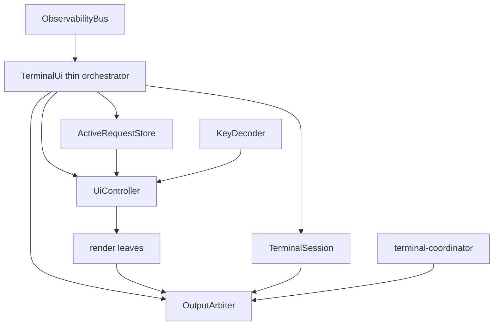

# RFC：TUI 模块化与结构化诊断日志

- 状态：Implemented（Phase 1–9 已完成；验收证据见实施计划 README）
- 日期：2026-07-17
- 来源：[TUI 与终端日志机制全面审计](../audits/2026-07-17-tui-terminal-logging.md)
- 实施分支：`feat/tui-structured-logging`
- 实施 worktree：`.worktrees/tui-structured-logging`

## 1. 背景与目标

现有 TUI 的 DECSTBM、alternate screen、scroll-before-grow、raw-mode restore 和 typed observability bus 已经形成可靠核心，但审计确认四个 P0 与八个 P1：credential 可在 verbose device-auth 中落盘、legacy consola 参数字符串化可抛异常并丢 Error 结构、stdout EPIPE 可沿 bus diagnostics→emergencyWrite 放大为整进程退出、相关测试基线与 PTY checkout path 不可信；同时存在 q 契约漂移、stateless key decoder、detail 无 viewport、selection 收缩失配、双进程共享日志轮转丢数据、终端控制序列注入、bus filter 不隔离，以及同步 I/O/backpressure 缺少治理。

本 RFC 一次性完成四个用户目标：修复全部 P0/P1，并同时给出止血与长期形状；把 1300+ 行 `TerminalUi` 拆成职责独立模块；把 `system.log` 从预拼接字符串升级为结构化诊断事件；全程在独立 worktree 中分阶段 TDD 实施。

## 2. 非目标

- 不改变 request/history/telemetry canonical 数据模型；请求 durable truth 仍归 History。
- 不让 Pino、consola 或任何第三方 logger 接管 stdout；stdout 仍只由 TUI 的 `OutputArbiter` 所有。
- 不在本轮实现 TUI 的 abort/OSC52 copy 破坏性动作；它们仍归既有 P2 backlog。
- 不保留旧的共享 `copilot-api.log` 轮转双轨。项目无向后兼容负担，迁移后直接以 per-boot NDJSON 为唯一 file diagnostic artifact。

## 3. 决策摘要

1. `ObservabilityBus` 继续作为唯一 fan-out 主干。新 canonical 类型是 `DiagnosticEvent`，bus kind 从 `system.log` 原子迁移为 `system.diagnostic`，不长期双轨。
2. 新建项目级 `DiagnosticLogger` facade。新代码使用 native scoped logger；现有大量 `consola.*` 调用先经 compatibility adapter 转成同一个 `DiagnosticEvent`，随后按模块逐步迁 native，不阻塞核心切换。
3. 采用 `pino@10.3.1` + `pino-roll@4.0.0` 作为 file-only NDJSON 编码、缓冲与分段后端；采用 `safe-stable-stringify@2.5.0` 作为 terminal/adapter 的 never-throw fallback，采用 `serialize-error@13.0.1` 保留 Error cause/code/status/custom fields。Pino 不写 stdout、不建第二条事件总线、不使用 worker transport。Pino backend envelope 使用默认 `msg`/数值 `level`，canonical payload 使用 `message`/`severity`，禁止 duplicate JSON keys。
4. 每个进程只拥有自己的 `logs/diagnostic/copilot-api.<bootTime>.<pid>.*.ndjson`，从根本消除 graceful-restart overlap 的 shared rename race。独立 retention sweep 只删除 owner 已死亡且超过保留期的旧 artifact。
5. 日志目录显式 `0700`，artifact 显式 `0600`，并收紧已存在的过宽目录/regular file 权限；symlink/FIFO/device 一律拒绝。credential 在 producer 侧先停止原文日志，在 canonical redactor 再防御一次，Pino path redaction 作第三层。
6. `TerminalUi` 拆成 `ActiveRequestStore`、ID-based `UiController`、`TerminalSession`、`OutputArbiter` 与纯 render/input leaves；`TerminalUi` 只编排。
7. `OutputArbiter` 在取得 stdout 所有权时安装 error sink，吸收同步 throw 与异步 `error`，首次不可恢复 EPIPE/hangup 即熔断、注销 terminal coordinator、停止 redraw，绝不把终端故障抛回 producer。stderr 由独立 `EmergencyOutput` 同样安装 error sink 与 fault latch；stdout+stderr 同时损坏时只累计 silent counter，绝不第三次递归写。
8. 输入改为 stateful `KeyDecoder`；q 显式 graceful shutdown；detail 是可滚 viewport；active set 变化按 request id reconcile；Ctrl-D 保留“请求 graceful shutdown”的现有行为，但显式解析为独立 key 以避免把协议语义藏在 decoder 内。
9. 增加 `--no-tui` 与 `TERM=dumb` capability fallback；raw-mode Ctrl-Z 实现 restore→SIGTSTP→SIGCONT→re-enter/repaint。
10. 普通诊断日志由 Pino/SonicBoom 显式 `maxLength` 有界缓冲；shutdown 将 diagnostic writer 纳入 durability barrier。第二信号仍立即强退，不等待日志。

## 4. 技术选型

### 4.1 为什么 canonical 仍是 typed bus

本项目已有 request/history/system 的 typed event union、sink 顺序、隔离与测试。把 Pino 或 LogTape 设为第二个 router 会造成两套 level、context、生命周期和 fan-out；让 TUI 读取 Pino NDJSON 又会退化为字符串反解析。因此 canonical 事件必须先进入 bus，Terminal/File/未来 OTLP 都是末端消费者。

### 4.2 为什么采用 Pino 作为 file-only backend

临时 Bun 1.3.14 PoC 已验证 Pino + pino-roll：BigInt、循环引用、Error cause/code/status、path redaction、主线程 destination、flush/end/close 和 size rolling 均可工作。Pino 的成熟 serializer、redaction 和 SonicBoom backpressure/drain 取代自建 `fs.WriteStream` writer；pino-roll 取代自建 rotation protocol。唯一承重限制是 destination ready barrier：writer attach 必须 await ready，不能在 ready 前调用 `flushSync()`。

Pino 配置：`base: null`、`timestamp: false`，保留 Pino 默认 `msg` 与数值 `level` 作为 backend envelope；写法固定为 `fileLogger[level]({ record }, humanMessage)`，完整 canonical 数据只在唯一 `record` 判别联合内，形状见 §8。`DiagnosticEvent.timeUnixMs/process` 是 canonical 字段，避免 Pino base 再注入另一份 pid。实现 PoC 必须在 Bun+Node 上拒绝重复 key，并逐行 `JSON.parse`。

### 4.3 为什么不采用 LogTape 主路由

LogTape 的 category/record 形状适合，但会引入第二套路由与 dispose 生命周期；其 JSON formatter 对循环引用/BigInt 仍需另包，file rotation 也不解决跨进程 owner。相较之下，typed bus + Pino file sink 改动边界更清楚。

### 4.4 依赖与 Bun-first

四个新增依赖均为纯 JS、无 node-gyp。实现前后的 CI 增加 `find node_modules -name binding.gyp` 守卫。Pino worker transport 明确禁用；调用 pino-roll 默认导出的 `build(options)` 获得 SonicBoom destination，再 await 其 `ready` 事件，不能把 `build()` 本身误当 async ready barrier。

## 5. 结构化诊断事件

```ts
export type DiagnosticLevel = "trace" | "debug" | "info" | "warn" | "error" | "fatal"

export type DiagnosticValue =
  | null
  | boolean
  | string
  | number // 仅 finite 且非 -0
  | { readonly $type: "number"; readonly value: "NaN" | "Infinity" | "-Infinity" | "-0" }
  | { readonly $type: "bigint"; readonly value: string }
  | { readonly $type: "array"; readonly value: ReadonlyArray<DiagnosticValue> }
  | { readonly $type: "object"; readonly value: Readonly<Record<string, DiagnosticValue>> }
  | { readonly $type: "date" | "buffer" | "typed-array" | "map" | "set"; readonly value: DiagnosticValue }
  | { readonly $type: "undefined" | "symbol" | "function" | "circular" | "truncated" | "unavailable"; readonly value?: string }

export interface DiagnosticError {
  readonly name: string
  readonly message: string
  readonly stack?: string
  readonly cause?: DiagnosticValue
  readonly code?: string | number
  readonly status?: number
  readonly fields?: Readonly<Record<string, DiagnosticValue>>
}

export interface DiagnosticEvent {
  readonly schemaVersion: 1
  readonly timeUnixMs: number
  readonly severity: DiagnosticLevel
  readonly scope: ReadonlyArray<string>
  readonly event: string
  readonly message: string
  readonly correlation?: {
    readonly requestId?: string
    readonly sessionId?: string
    readonly attemptIndex?: number
    readonly transport?: string
  }
  readonly process: Readonly<ProcessIdentity>
  readonly fields: Readonly<Record<string, DiagnosticValue>>
  readonly error?: DiagnosticError
  readonly origin: "native" | "consola-adapter"
}
```

### 5.1 Canonical snapshot boundary

`unknown` 只能存在于 logger facade/adapter 的入口，不能进入 bus。入口执行一次 bounded snapshot：逐属性 try/catch，禁止调用不受信任的 `toJSON()`；depth、breadth、单字符串 bytes、总 bytes 均有硬上限。所有 array/object 也包入 `$type` algebra，因此用户原对象即使含 `$type` 也只会位于 `$type:"object"` 的 value 内，不与 codec tag 碰撞。NaN/±Infinity/-0、BigInt、undefined/Symbol/function/Date/Buffer/typed array/Map/Set/circular/truncation 都使用显式 tagged variant，保证 JSON round-trip 后仍可辨识。对象 dictionary 使用 null prototype，并以 `Object.defineProperty` 写键，阻断 `__proto__` 污染。getter/Proxy/toJSON 抛错只把该值投影成 `$type:"unavailable"`，logger 永不 throw。

顺序钉死为 `snapshot/project → redact → deep-freeze → publish`。因此 producer 发出后修改原对象、前一个 sink 修改嵌套值、Pino 的数值精度策略都不能改变 canonical event。`DiagnosticEvent` 是深层 JSON-safe、已 redacted、deep-frozen 的 value object。

### 5.2 Native logger facade

```ts
export interface DiagnosticLogger {
  child(bindings: DiagnosticBindings): DiagnosticLogger
  emit(level: DiagnosticLevel, event: string, message: string, fields?: Readonly<Record<string, unknown>>, error?: unknown): void
  trace(event: string, message: string, fields?: Readonly<Record<string, unknown>>): void
  debug(event: string, message: string, fields?: Readonly<Record<string, unknown>>): void
  info(event: string, message: string, fields?: Readonly<Record<string, unknown>>): void
  warn(event: string, message: string, fields?: Readonly<Record<string, unknown>>, error?: unknown): void
  error(event: string, message: string, fields?: Readonly<Record<string, unknown>>, error?: unknown): void
}
```

`child()` 在创建时立即 snapshot→redact→freeze scope/correlation/default fields，只做 immutable bindings 合并，不保存 caller 原始引用，也不拥有 formatter、router 或 writer。`initDiagnosticLogger(systemPublisher)` 在 observability bootstrap 后建立唯一 publisher；提前使用时走 never-throw emergency fallback并标记 synthetic process identity，不能递归调用 consola。

### 5.3 Consola compatibility adapter

`installConsolaRepublish` 保留全局 reporter 接口，但不再 `joinArgs`。adapter 先识别第一个 error-like value（不限 `instanceof Error`，覆盖 DOMException/cross-realm/error-like），经 error normalizer 进 `error`；其余 args 经 bounded snapshot 后进 `fields.args`。human `message` 用 safe-stable-stringify never-throw projection。旧 `[scope]` 前缀只作为 message 保留，不尝试不可靠地反解析成 scope。高价值模块迁移 native logger 后才获得机器可读 scope/event。

### 5.4 Error normalization

raw unknown 绝不直接交给 `serialize-error` 或 `safe-stable-stringify`，因为两者都可能触发 throwing getter/toJSON。Error/error-like 先用同一个逐属性 bounded projector 读取安全字段，递归 cause、code、status 与 enumerable custom fields；`serialize-error({useToJSON:false})` 只可作用于已 snapshot 的纯数据，属于非承重 formatter。深度与 breadth 有上限；logger 本身永不 throw。adapter 的 human message 必须从 redacted snapshot 派生，不能从未脱敏原值先拼字符串。

## 6. Credential redaction 与终端数据安全

### 6.1 三层防线

1. Producer：删除 `Device code response` 与 `Polling access token response` 原对象日志，只记录状态、interval、expiry 和 OAuth error code；删除 provider 内 token 显示，仅由命令 orchestration 在最终 token 确定后显示。显式 `--show-github-token` 使用独立 `SensitiveOutputPort.writeOnce("github-token", token)`，全进程 dedupe：服务实现委派给 OutputArbiter，one-shot auth/login 实现直接写健康 TTY。它不进 bus、File、replay queue、History 或 emergency；非 TTY/坏终端下拒绝显示并给不含 token 的提示。
2. Canonical redactor：按 key/path 和 value pattern 深拷贝 redaction。覆盖 access_token、authorization、cookie、device_code、refresh_token、GitHub token families、Bearer 与已知 API key。该层发生在 publish 前，因此所有 sink 看到的都已安全。
3. Pino：重复配置 path redaction，作为 file sink defense-in-depth。

验收分两套：默认/`--verbose` 时 terminal、File、rotated、emergency 全部零命中；显式 `--show-github-token` 时仅 sensitive-once terminal capture 恰命中一次，其余轨零命中。早期 logger fallback 也必须先 snapshot+redact，绝不直接 stringify 原始 fields。

### 6.2 Terminal sanitizer

所有外部数据在 human renderer 末端经统一 sanitizer：剥 C0/C1、CSI、OSC、DCS、BEL，换行按单行或 continuation policy 转义；只有 render 模块自己生成的 ANSI 被标为 trusted。File NDJSON 依靠 JSON escaping，不先拼 ANSI；legacy message 中的 ESC 也在 canonical normalize 阶段转义，避免后续 `cat` 执行。

## 7. StructuredFileSink 与 artifact 生命周期

### 7.1 Artifact 命名与权限

默认目录：`PATHS.APP_DIR/logs/diagnostic`，创建模式 `0700`。base name：`copilot-api.<bootTime>.<pid>.ndjson`，pino-roll 生成 date/count segment，模式 `0600`。不创建跨进程共享 `current.log` symlink，状态 API/启动 banner 暴露本进程 active artifact path。

### 7.2 Writer 状态

```ts
export type DiagnosticWriterState = "starting" | "ready" | "degraded" | "sealing" | "closed" | "failed"

export interface DiagnosticWriterHealth {
  state: DiagnosticWriterState
  queuedBytes: number
  droppedRecords: number
  lastError?: DiagnosticError
  activePath?: string
}
```

bootstrap spool 是同一个 bus 上的临时 **file sink/WAL**，不是第二个 logger 或第二条 bus。最早先初始化 EmergencyOutput、bus、永久订阅的 `TerminalSinkSlot`（delegate 初始为 plain `BootstrapTerminalSink`）与 canonical logger；每个早期 DiagnosticEvent 只 snapshot/redact/freeze/publish 一次，终端发生时恰消费一次，spool 只临时持久化。config/identity 完成后构造 TerminalUi/OutputArbiter，并在一个同步操作中把 slot delegate 原子替换为 TerminalUi；bus 永远只有 slot 一个 terminal subscriber，不存在 unsubscribe→subscribe 空窗或双挂窗口，早期行不回放终端。writer ready/replay/durable 任一步失败且尚未切换时 bootstrap delegate 保持有效；切换后错误由 TUI delegate恰一次消费。

spool 是同 schema NDJSON，process 可标 synthetic，每条带进程级单调 sequence；`O_CREAT|O_EXCL`、0600、canonical redaction。状态机是 `capturing→switching→replaying→retired|fallback`：cutover 在同一串行队列封住 spool ingress，切点前事件全在 spool，切点后事件进有界内存队列；spool close+fsync 后按 sequence **仅 replay 给 StructuredFileSink**，禁止重新 publish 到 bus；structured writer durable barrier成功后才 unlink spool并 fsync父目录。任一步失败都不删 spool，writer degraded，spool继续 file fallback，terminal仍实时消费同一 bus；file logging disabled 时直接 spool close→fsync→unlink→directory fsync，不做 terminal replay。config parse/identity/writer ready 任一点失败都必须终端恰一次且保留 spool。启动时识别本命名协议 orphan spool并恢复/保留/按 retention 清理。per-boot NDJSON 是唯一长期 artifact，spool 是协议定义的临时可恢复 artifact。

SonicBoom 显式设置正值 `minLength`、`maxLength` 与 `mode:0o600`；禁止使用默认 `minLength=0` 的 `flush(callback)` 作为 barrier——Bun 实测 callback 会早于真实 write。`awaitDestinationDurable()` 的正式契约是：CountingDestination 区分 queued/in-flight/dropped bytes→调用底层 flush 触发写→等待 write completion 使 queued+in-flight=0→等待当前 roll generation/path 稳定→对本轮写脏的全部 segment fd 显式 fsync 并传播错误。顺序 oracle 必须满足 `write completion < fsync completion < spool unlink/shutdown success`，Bun+Node 双端运行。SonicBoom 内部 `flushSync()` 会吞 fsync error，不能作最终 durability 真相。

`error/drop` 进入 degraded/failed，并经独立 never-throw `EmergencyOutput` 只通知一次；恢复时通知一次。Pino API 不透传 stream.write 的 backpressure，因此在 Pino 与 pino-roll destination 之间加项目拥有的 `CountingDestination` wrapper：按 UTF-8 精确计入 serialized line bytes，再依据同步 drop、异步 write/drain 更新 queued/in-flight/dropped counters，禁止读 SonicBoom 私有 `_len`。writer 不把错误抛回 bus producer。

### 7.3 Rotation 与 retention

每进程只 rotation 自己 unique base。不给 pino-roll 传 `limit`，只使用 size/time roll；sink 在每次 ready/roll 后读取真实 `destination.file`，登记到自有串行 per-boot segment registry。自有 pruning 完整定义：0=不限，1=只留 active，N≥2=active+最近 N-1；unlink 失败进入 health，shutdown 先 seal maintenance producer，再 drain tracked promises。

启动与每日维护执行 retention sweep：只 `lstat` 匹配命名协议的 regular file，symlink/FIFO/device 跳过；mtime 未过 retention 不动。固定 owner manifest 命名为 `copilot-api.<bootTime>.<pid>.owner.json`，与同前缀 segment 关联，字段含 schemaVersion/pid/bootTime/procStartTicks/createdAt。`initProcessIdentity()` 在 Linux 从 `/proc/<pid>/stat` 最后一个 `)` 之后正确解析 field 22，不能朴素空格 split；非 Linux字段可缺省。

manifest 先以 `O_CREAT|O_EXCL`、0600 写临时文件，file fsync+atomic rename+directory fsync成功后才能启动 writer。retention 只有在 manifest 判 owner dead 且 artifact 过期时才删 segment；manifest 缺失/损坏/字段不足、`/proc` 不可读或权限失败一律保留。所有关联 segment 删除成功后才删 manifest并 fsync目录；manifest 跨 graceful close 保留。两个 sweep 并发时 ENOENT 视作幂等成功。默认目录是本机 APP_DIR，不声明支持跨 PID namespace 的共享 volume。pino-roll 内部 cleanup 不作 durability/retention 真相，所有可裁决维护都归自有 tracked promise 集。验收含 manifest 每个 crash boundary、PID reuse、orphan 与双 sweep。

### 7.4 Shutdown barrier

`shutdownDiagnosticLogging()` 是显式 async barrier：seal retention timer/maintenance 与普通业务 producer→`awaitDestinationDurable()` 排空普通队列→写预留容量的小型 marker `shutdown_diagnostic_sealing` 并确认未 drop→再次 `awaitDestinationDurable()`→`end()` exactly once→await close或error→等待自有 tracked retention promises。marker 不声称整个 shutdown 已成功；writer 为 marker 预留独立容量，不能与普通日志竞争 `maxLength`。

第一次 shutdown signal 在同步认领 `stopping` 时直接调用 idempotent `TerminalSession.beginShutdownRestore()`，不依赖只有 active request 才可能出现的 draining 事件。正常路径 seal redraw/input→drain queued restore frame→trusted restore transaction→`setRawMode(false)`→detach；exit/uncaught fallback 用 `restoreSyncBestEffort()`，控制序列 never-throw，stdin cooked restore 在 finally 中执行，即使 stdout 已 fault 也不能跳过。

`gracefulShutdown.finalize()` 顺序钉死：TerminalSession 已 cooked→seal producers→History 与 Telemetry barrier（全部执行并聚合错误）→无论前两者是否失败都执行 Diagnostic sealing barrier，尽力持久化错误诊断→若任一 barrier 失败，在 WS observer 仍在线时发布 `system.shutdown_failed` 并 flush，再由 EmergencyOutput 输出失败，关闭 WS，phase=failed且不 resolve latch；仅全部成功后发布 `system.shutdown_completed`/finalized 并 flush→关闭 WS observer clients→OutputArbiter 写人类可见“Shutdown complete”并 drain→terminal unregister/destroy→phase=stopped→resolve latch。writer close 后所有 logger 调用只做 dropped-after-close 计数，不触碰 Pino destination。第二信号不等待。

事件联合新增 `system.shutdown_failed { errors: DiagnosticError[] }`；它是观察者的真实失败终态，不允许先发布 finalized 再回退 failed。

## 8. ObservabilityBus 隔离

API 固定为 `subscribe(name: string, handler: EventHandler, filter?: EventFilter): () => void`，name 必填且用于错误报告/指标。filter 与 handler 置于同一 try/catch；thenable 统一用 `Promise.resolve` 跟踪。bus 内部诊断不能再调用 consola，否则会重入主 bus；改用注入的 `onSubscriberError` never-throw hook，默认 `EmergencyOutput`，并记录 `observability_sink_failures_total{sink,phase}`。错误 hook 自身失败只累计内部 silent counter。一个 filter/handler/rejection 绝不阻断后续 subscriber。

`system.request_line` 保留为独立 typed event，继续服务 count_tokens 等无 History durable truth 的 synthetic operation。StructuredFileSink 的 canonical payload 是判别联合：`{recordType:"diagnostic", diagnostic}` 或 `{recordType:"request-line", timeUnixMs, process, parts: LogLineParts}`，两臂互斥。request-line 绕过 terminal/file diagnostic level，terminal 与 NDJSON 均 exactly-once；Pino envelope 只含一个 `record` payload，不同时出现 diagnostic/requestLine。

## 9. TUI 目标模块



### 9.1 ActiveRequestStore

纯 event reducer，拥有 active Map、attempt merge、feature/thinking/recovered tool projection 与 terminal line effect。API：`apply(event): StoreChange`、`get(id)`、`orderedIds()`、`snapshot()`。不读墙钟、不写终端、不管理 UI selection。

### 9.2 UiController

状态真值使用 `selectedRequestId/detailRequestId`，index 仅在 render 时派生。`reconcile(activeIds, change)`：id 仍在则保留；被删则优先旧位置下一个、再上一个；空列表回 collapsed；detail id 消失立即回 panel。拥有 panel/detail viewport offset、help 与 view transition。

### 9.3 KeyDecoder

stateful streaming decoder 保存不完整 CSI/SS3/UTF-8；ESC 使用 50ms disambiguation timer。timer 回调只在 pending buffer 仍是同一 lone ESC generation 时 emit escape；任意后续 chunk 先取消 timer并与 pending 合并，因此 split `ESC`+`[A` 不会产生 spurious escape。支持 arrow、PgUp/PgDn、Home/End、space/tab/enter/escape/help/q、Ctrl-C、Ctrl-D、Ctrl-Z。q/Ctrl-C/Ctrl-D 输出显式 shutdown action，三者都调用 `handleShutdownSignal("SIGINT")`，拆分只为语义与日志清楚；Ctrl-Z 输出 suspend action。未知完整 CSI 整体忽略，不把尾字节泄成 char。decoder destroy 清 timer，timer callback 也须 never-throw。

### 9.4 Detail viewport

`buildDetailDocument()` 产稳定 keyed lines；`layoutDetailViewport(document, state, rows)` 固定 header + scrollable body + keybar，显示 hidden-above/hidden-below。up/down、PgUp/PgDn、Home/End 可达全部 50+ attempts；resize 与内容 revision 后 clamp。

### 9.5 TerminalSession

拥有 stdin/raw/cooked、TTY capabilities、exit hook、SIGTSTP/SIGCONT 与 resize source。`TERM=dumb`、`--no-tui`、非 TTY 或无 `setRawMode` 时退化 plain mode。suspend 顺序：OutputArbiter drain restore bytes→离 alt→reset DECSTBM→显光标→detach input→cooked→移除 SIGTSTP listener→self-send SIGTSTP；只在收到 SIGCONT 且 session state=`suspended` 后重装 SIGTSTP listener、重读 rows/columns、attach input、raw→rebuild→full repaint。Windows/无 SIGTSTP 平台将 Ctrl-Z 作为 no-op并显示一次 capability 提示。Python PTY 用 `waitpid(WUNTRACED)`/`WIFSTOPPED` 证明真挂起。

### 9.6 OutputArbiter

终端所有 stdout 写的唯一 side-effect owner。捕获 sync write throw，安装 Writable `error`/意外 `close` sink，并检查 destroyed/writableEnded；EPIPE/hangup 首次即 faulted，注销 coordinator、停止 redraw，并将故障交给独立 `EmergencyOutput`。后者在最早 bootstrap 前取得 stderr 所有权并持有到进程退出，对 stderr 也有 sync/async error/close fault latch，stdout+stderr 同坏时静默计数。普通 frame 在 backpressure 时只保留最新 repaint + 有界日志队列。`OutputArbiter.writeEmergency` 只是委派给 `EmergencyOutput`，没有第二个 emergency writer。提供 `writeFrame`、`writeLine`、`writeSensitiveOnce`、`drain`、`destroy`。

### 9.7 TerminalUi

只做：bus event→store→controller reconcile→effect/render→output；input action→controller/session/shutdown；timer→render。目标小于 400 行，不再包含业务 projection、raw lifecycle 或直接 stdout.write。

## 10. 配置

新增 bundled config：

```yaml
logging:
  terminal_level: info
  file_level: debug
  file:
    enabled: true
    directory: ""
    max_size_mb: 10
    max_files_per_process: 7
    retention_days: 7

tui:
  enabled: true
```

`directory:""` 解析到 `APP_DIR/logs/diagnostic`。terminal/file level 热重载且只过滤 diagnostic，不过滤 request lifecycle line。`tui.enabled` 是启动期冻结值，CLI `--no-tui` 高于 config；运行中修改只 warn-once 需重启，避免 live acquire/release raw terminal 的双轨复杂度。`logging.file.enabled/directory/max size/max files/retention` 全部启动期冻结，修改需重启。`0` 语义：max size=0 不按 size roll、max files=0 不做 count retention、retention days=0 不按 age 删除。consola success→info、verbose/debug→debug、ready/start/log→info，未知 type→info并保留原 type field。所有键按项目清单同步 schema/config/state/bundled/DESIGN/hot-reload matrix；restart-only 项在 `applyConfigToState()` diff 后 warn-once。

启动顺序改为：EmergencyOutput→bus/canonical logger→永久 TerminalSinkSlot（bootstrap delegate）+ secure bootstrap spool→load config→init process identity→按冻结 config 原子 swap slot delegate 到 TerminalUi 或 plain sink→await structured writer ready→原子将 spool records 只 replay 到 StructuredFileSink→durable barrier→关闭/unlink spool。这样既保留任一时点启动错误终端恰一次与完整 boot file 诊断，也让 artifact config/identity 在创建前冻结。验收在切点前/切点同步操作两侧/切点后注入 sequence，断言每个恰一次；故意双挂 delegate 的正样本必须变红。

## 11. Cutover 与 commit invariants

### 11.1 全阶段不变量

- 每个 commit 结束 typecheck + 对应测试 green；不得留下“下一 commit 才编译”的中间态。
- `start` 服务模式 stdout 永远只有 OutputArbiter/迁移前 TerminalUi 一个 owner，绝不出现 Pino/consola/TUI 双写；one-shot `debug/login/setup` 子命令继续拥有自己的 consola/console 输出，不纳入服务 TUI invariant。
- 从结构化事件切换开始，Terminal golden 在有意 UX 修复之外保持逐字等价；有意差异逐条更新 spec/golden。
- 默认/verbose 的任意 credential probe token 在 terminal、NDJSON、rotated segment、emergency 中字节级零命中；显式 `--show-github-token` 仅 sensitive-once terminal 恰命中一次，其余轨零命中。
- 任意 sink filter/handler/write failure 不影响后续 sink 和业务 producer。
- 每个进程只修改自己的 diagnostic artifact。
- raw-mode 每条退出/suspend/shutdown 路径都恢复终端。

### 11.2 阶段顺序

1. Baseline：修 stale tests 与 PTY cwd，预捕获 golden，增加 P0/P1 红测与 PoC assets。
2. P0 containment：删除 credential 原文日志、FileSink 权限止血、bus filter isolation、legacy joinArgs never-throw、stdout fault containment。
3. Structured core：引依赖，落 DiagnosticEvent/logger/redactor，consola adapter、event kind、全部 consumer filter/switch 与测试在同一原子 commit 切 `system.log→system.diagnostic`，Terminal human projection保持等价。
4. Structured file：Pino/pino-roll per-boot NDJSON、retention、health、shutdown barrier，删除旧共享 FileSink。
5. TUI store/controller：抽 ActiveRequestStore 与 ID controller，修 selection/q。
6. TUI session/input/output：KeyDecoder、OutputArbiter、TerminalSession，消除 TerminalUi 直接 I/O。
7. Detail/capability：viewport、sanitizer、TERM/no-tui、SIGTSTP/SIGCONT、resize。

Phase 5–7 实施状态（2026-07-17）：已完成。`TerminalUi` 为不足 400 行的薄编排；request projection 全归纯 `ActiveRequestStore.apply()`；controller 以 request id 为真值；detail 拆为 keyed document + viewport；输入、session、output 与 terminal view 各有独立 owner。真 PTY oracle 在独立 controlling session 中以 `waitpid(WUNTRACED)`/`WIFSTOPPED` 连跑 8 次，并验证 stop 前 cooked、SIGCONT 后 raw。Bun 1.3 的两个运行时差异已收敛在 `TerminalSession`：JS listener 移除后须恢复 native `SIG_DFL`，且 Bun CLI/JS worker 是同一前台 process group，故通过 libc 向整组发送 SIGTSTP。
8. Performance：真实 workload probe 后定 coalescing/buffer caps，stream_progress 50–100ms coalesce，terminal 前 flush。
9. Closeout：全量/PTY 8–25 连跑、双进程 logs 25 轮、Bun+Node backend、文档/ADR/backlog 同步、合并态对抗 review。

## 12. 验收矩阵

### Structured logging

- BigInt、circular、undefined、Symbol、function、Date、Buffer、Map/Set、throwing getter/Proxy/toJSON、cross-realm Error 不抛且 tagged structure 可辨识；producer/subscriber mutation 不改变 deep-frozen canonical event。
- credential redaction 先用无 redactor 正样本证明 probe 可泄漏，再启用后默认四轨零命中；显式 show-token 仅 terminal 恰一次。
- NDJSON 每行独立 parse、无 duplicate key；BigInt 不降精度；stack newline 保留为 JSON escape；time/process/scope/event/correlation 完整。
- 两进程各写 1000 条并同时 rotation，连续 25 轮 exactly-once、零 ENOENT；自有 pruning 对 N=0/1/2/7 与 unlink EACCES 均符合契约。
- ENOSPC/EACCES/drop/error/oversized record/post-close write 不杀进程，显式 maxLength 生效，health 与一次性 emergency 可见；stdout+stderr 同时 EPIPE 也不退出。
- `shutdown_diagnostic_sealing` exactly once 且未 drop，close 后无未决 writer/自有 retention promise，post-close logger no-op计数；只有 barrier 成功后才出现人类 success，第二信号立即退出。
- Bun+Node 顺序 oracle 证明 write completion < fsync completion < spool unlink/shutdown success；默认 minLength=0 的假 barrier 必须作为正样本失败。
- config parse/identity/writer ready 失败时启动事件 terminal 恰一次且 spool 保留；cutover 不向 bus 重放。
- owner manifest 覆盖每个 crash boundary、PID reuse、缺失/损坏 manifest、orphan 与双 sweep，活 artifact 永不误删。
- `system.request_line` 的 terminal+NDJSON 恰一次，联合 payload 两臂互斥且不受 diagnostic level 过滤。

### TUI

- q/Ctrl-C/Ctrl-D 契约；arrow/UTF-8 按 1/2/3 chunk 拆分；未知 CSI 不泄字节。
- selected sibling/selected row/last row 三种终结均 reconcile。
- 50+ attempts detail 全部可滚达；rows 3/10/24 与多次 resize 后 viewport 正确。
- CSI/OSC8/OSC52/DCS/BEL/CRLF 被 sanitizer 阻断，trusted ANSI 不受影响。
- stdout sync throw、async error、真实 EPIPE 后 producer 与后续 sink 继续运行。
- TERM=dumb、non-TTY、`--no-tui` 无 raw mode/DECSTBM/alt screen。
- Python 真 PTY 用 WIFSTOPPED 验 SIGTSTP→SIGCONT、两信号 shutdown、退出 cooked restore。
- 现有 no-eaten-lines/footer-pinned/detail replay/resize/clean restore oracle 连跑 10–25 次。

## 13. 已定选择与无开放分叉

用户已要求最佳完整方案、允许破坏性长期重构并指定 worktree。依据审计实证与项目原则，本 RFC 直接选择：per-boot NDJSON 而非修 shared rotation；consola adapter 渐进迁移而非一次机械改完全部 call site；Ctrl-D 保持 graceful shutdown 但改为显式 key；Pino 只作 file backend。没有需要暂停询问的用户偏好分叉。
