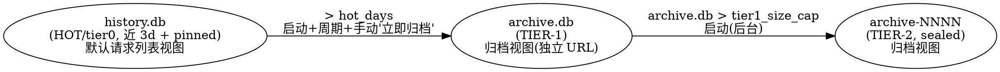

> **SUPERSEDED 2026-07-16** — 内置 tiered archive 已退役。在线服务只写 `history-v3.db`，不读取/迁移旧 History；旧数据库由项目外工具未来自行处理，协议适配不属于本项目。当前权威架构见 [History V3 设计](../DESIGN.md#活的架构现状v4-迁移态) 与 [history.md](../history.md)。

# Spec: History 三层降温归档（tiered archive）

- **状态**：Draft v3（已吸收 GPT reviewer 两轮对抗评审 3 BLOCKER + 8 HIGH + MEDIUM，见 §10 评审台账；待用户审 → 收尾确认 → plan）
- **日期**：2026-07-14
- **归属**：`docs/spec/`（模块契约层）。落地后架构现状进 [DESIGN.md](../DESIGN.md)「活的架构现状」，配置进 [API.md](../API.md) / config 参考，冷存储格式决策另立 ADR。
- **相关**：现状 skill `history-sqlite-schema` / `history-backfill`、ADR [2026-07-05-dependency-selection-bun-first](../decisions/2026-07-05-dependency-selection-bun-first.md)、ADR [2026-07-05-richest-data-flow](../decisions/2026-07-05-richest-data-flow.md)、[docs/history.md](../history.md)。

## 1. 问题与目标

`history.db` 是单一热库，reaper 到**数量上限**（`historySuccessLimit` / `historyFailureLimit`）就 `DELETE` 最旧行——这是**真数据丢失**，与项目 `no-destructive` / `richest-data-flow` 立场相悖：用户的历史请求（含完整 upstream 往返、sse 帧、计费）一旦超量即永久蒸发，无法事后诊断或审计。

本特性引入一条**按时间的降温轴**，与现有「按数量」轴正交，把 History 从「单库 + 到量硬删」升级为「三层降温 + **产品面无删除**」：近期数据留在快速热库，旧数据逐级降温到高压缩比冷存储，全程可检索、可访问、永不丢失。用户裁定：**移除产品面的删除功能**（§3.6），产品里唯一的数据流出方式是「向下降温归档」。

> **诚实脚注（测试基础设施除外）**：`deleteEntries` / `clearAllEntries`（`write.ts`）作为**内部 test-only SQL 原语保留**——`clearHistory()`（→`clearAllEntries`）经 `resetTestRuntime` 被 13+ 集成测试文件用作隔离重置、`scoped-delete.unit.test.ts` 专测 `deleteEntries`。「产品面无删除」指移除 HTTP 路由 + 用户界面入口，**不指**删除这些内部原语（它们只作用于测试的隔离库，从不触碰生产用户数据）。见 §3.6 / §5。

**四个必须同时满足的诉求**（用户原话）：
1. **永不真删**——数据只逐级降温，产品面无任何删除路径（移除 HTTP delete API + 用户入口）。
2. **高压缩比**——冷数据用支持的最好格式压到最小（tier-2 格式经 Phase 0 实测裁决，§6）。
3. **富可索引**——冷数据仍可按 model / session / status / 时间 / **全文检索**（归档视图内的 `/api/search` 五 facet 深度搜索，§4）。
4. **低访问代价**——归档数据经**独立归档视图**（复用列表 UI、独立 URL）低成本访问；深冷数据（tier-2）按需低成本单条打开。

## 2. 三层架构与视图分域（用户裁定：归档数据绝不混入 HOT 请求列表）

**核心视图原则**（用户 v3 裁定）：归档数据（tier-1/tier-2）**绝不自动混入默认请求列表**。复用同一套列表 Web UI，但归档数据走**显式独立 URL**（如 `/history?tier=archive`）；**HOT 视图只列 tier0，归档视图只列 tier-1/tier-2，两者绝不同列**。这推翻了 v1/v2「ATTACH 透明并入主查询」的设想——改为**按视图分域查询**。

| 层 | 载体 | 角色 | 写入 | 可访问视图 |
|---|---|---|---|---|
| **HOT (tier0)** | `history.db`（现状写路径零改动） | 近 `hot_days`（默认 3d）活跃数据 + **全部 pinned 行永久驻留**（§3.3） | 唯一写入端（请求管线） | **默认请求列表视图**：list/detail/search（现状不变，只查 HOT） |
| **TIER-1** | `archive.db`（新，SQLite，**复用** `entries_v2` / `entry_stages` / `msg_blob` / `req_msg` / `req_aux` schema） | 3d 前搬来的温数据，累积至 `tier1_size_cap` | 降温流水线（HOT→T1） | **归档视图**（独立 URL）：list/detail/search 只查 archive.db |
| **TIER-2** | `archive-NNNN.<ext>`（不可变、编号、纯 JS、格式待 PoC 定，§6）+ `archive.db` 内 `tier2_manifest` 表 | tier-1 撞上限后**封存**的深冷数据 | 降温流水线（T1→T2） | **归档视图**：manifest 查/browse/搜 preview；detail 按需读封存单元单条 |

**降温流水线（单向、产品面无删除）：**

**成本分配理由**：HOT→T1 是廉价的 SQLite→SQLite 行搬迁（同 schema、blob 直接转移），故**启动 + 周期 + 用户手动触发**都跑；T1→T2 是昂贵的封存重编码 + max 重压，故**仅启动时后台**跑一次（长跑不重启的 tier-1 无界增长风险见 §8-O3）。

**视图分域的收益**：因 HOT 与归档从不同视图查询、**从不同列**，v2 的 H4（ATTACH+UNION 迁移窗口同 id 重复）**天然消解**——不再需要跨库 UNION 去重（§4）。

## 3. 关键设计决策

### 3.1 reaper「按数量硬删」→「搬去 tier-1」（诉求①）

现 `src/lib/history/sqlite/reaper.ts` 的 `evictBucket` 用 `DELETE FROM entries_v2 …`（真丢）。改为：热库所有淘汰（无论**时间触发**还是**数量安全阀触发**）都先把待淘汰行**搬进 tier-1**，成功写入并**多子表校验通过后**才从热库删本地副本（move 语义，§3.4 保证不丢）。

- **主机制 = 时间搬迁**：`started_at < now - hot_days` 的**终态**行搬走。**排除谓词须同时含活跃态豁免 AND `pinned = 0`**（对齐 reaper 现有 `SUCCESS_WHERE`/`FAILURE_WHERE` 的 `pinned=0` 语义，`reaper.ts:47-48`）——pinned 行永不降温（§3.3）。
- **数量上限降级为安全阀**：`historySuccessLimit` / `historyFailureLimit` 仍生效，但超量行**搬去 tier-1 而非删除**——防热库在 3d 内突发海量请求时无界膨胀，同时保证「永不真删」。复用现有 `SUCCESS_WHERE`/`FAILURE_WHERE`（已含 `pinned=0`）。

### 3.2 tier-2 封存格式与粒度（Phase 0 PoC 已裁决 — 诉求②③④）

History entry 是**深嵌套重 blob 文档**，**不是列式扁平表**。Phase 0 用真实 blob（150 巨型 agent 对话 entry + 真库 32 GB 锚点）实测裁决，权威 [exp/tiered-archive-format/FINDINGS.md](../../exp/tiered-archive-format/FINDINGS.md)：

- **格式 = SQLite sealed**（VACUUM + 只读 + max-zstd，零新依赖、复用现有 serialize/compression/driver）。**否决 Parquet**（候选 A）：实测压缩与 SQLite **统计等同**（A/B=0.994）、单条读**慢 1.56×**、多两个依赖 + 三个陷阱（`utf8:false` / Buffer 池化偏移 / INT64 须 BigInt）。根因坐实 reviewer H5——tier-2 payload 是单个已 zstd 压缩的大 BLOB（占 99.4% 字节），Parquet 列存核心卖点在「manifest 精确定位 + 单条读」访问模式下全部失效。格式决策另立 ADR [2026-07-14-tiered-archive-cold-format](../decisions/2026-07-14-tiered-archive-cold-format.md)。
- **封存粒度 = 按 `session_id` 分组**（用户裁定，9× 压缩杠杆）。per-entry 独立压缩 28.20 MB → **按 session-group 单 zstd 流压缩 3.16 MB（省 88.8%）**。根因：Claude Code 每轮重发增长对话（请求 N 含消息 1..N，且 clientRequest + effectiveSource + upstream_request 三处各带完整消息体），per-entry 把共享前缀在每个独立流各压一遍；session-group 进单一 zstd 流后跨请求冗余坍缩到近零。
- **manifest 富索引**：`tier2_manifest`（SQLite，存 `archive.db`）冗余全部 meta 列 + `preview_text` + 封存单元定位（`seal_file` NNNN + `session_id` + `index_in_session`）——使 list/search-preview 只命中 manifest（SQL 索引全在），detail 才**解压对应 session blob、索引取单条**（`deserializeEntry` 复原）。
- **读代价权衡**：session-group 单条读 665 ms（解压整 session blob，16.6× 慢于 per-entry）——对**冷归档可接受**（罕访问 + 按 session 浏览一次解压展示整组、摊薄）。**大 session 有界**：单 seal unit 上限约 50 MB 解压后 / 或 N≈100 条，超则同 session 拆多子单元（manifest 仍按 session 分组浏览），防单次解压爆内存。

### 3.3 pinned 行永不降温（用户裁定）

pinned（调试固定）行的心智模型是「保留原始数据永久、随手可读」（`reaper.ts:44` "keeps its raw data forever"）。三层下**保持完全豁免**：pinned 行**永远驻留 HOT**，不随时间轴降温、不进 tier-1、不进 tier-2，**手动「立即归档」也豁免**（§3.6）。时间搬迁与数量安全阀的排除谓词均含 `pinned = 0`（§3.1）。

### 3.4 跨库 move 的原子性与可恢复性（BLOCKER 修复 — 复审确认解法架构正确）

WAL 模式**无跨文件事务原子性**（SQLite 官方：跨库 COMMIT 崩溃时部分文件可能落盘、部分不落）。`entry_stages` 对 `entries_v2` 是 `ON DELETE CASCADE`（`schema.ts:86`），一条 entry 有 0..N 子表行（`sse_events` 常为最大 blob）。故 move 语义严格定义为「两个各自单文件原子的事务 + 中间显式 verify」（archive.db 经 ATTACH 挂同一连接，写 archive 全落其单一物理文件、享 WAL 单文件原子）：

1. **写 archive.db**：在 archive.db **单库事务**内写入该 entry 的 head（`entries_v2`）+ **全部** `entry_stages` + `req_msg` + `req_aux` + `msg_blob`（按引用 INSERT OR IGNORE 复制，§3.5）。
2. **多子表校验**（不止 head 存在性）：核对 archive 侧 head 存在 **AND** `entry_stages` 行数/hash 与 HOT 侧一致 **AND** `req_msg`/`req_aux` 完整 **AND** 所有 `req_msg.hash` 在 archive.msg_blob 有对应行（引用完整性）。任一不符 → 不删 HOT、留待重跑。
3. **删 HOT**：校验通过才 `DELETE FROM main.entries_v2 WHERE id=?`（级联清 HOT 子表）。
4. **幂等恢复**（cursor 可恢复骨架）：archive 侧已存在该 id → **跳过写入，但仍完整走 verify→delete-HOT 流程**（绝非「跳过整行处理」——否则崩溃在「写完 archive、没删 HOT」会永久留「两头有」重复行）。

### 3.5 内容寻址 dedup 跨库语义（BLOCKER 修复）

`msg_blob` 是内容寻址、跨请求共享、无 FK（`schema.ts:93-98`）。同一 hash 可能同时被「待迁移旧 entry」与「留 HOT 新 entry」引用。迁移语义严格定为**复制而非移动**：

- `req_msg`/`req_aux`（有 FK、per-request）随 head **移动**（写 archive + 删 HOT）。
- `msg_blob` 按引用 **复制**（`INSERT OR IGNORE INTO archive.msg_blob …`）——**绝不因 HOT 仍需要而跳过复制到 archive**，否则 archive 侧 `req_msg` 会引用不存在的 msg_blob 行，`search-query.ts:160-161` 的 INNER JOIN 使该消息**静默从搜索消失**。
- **两侧各自独立孤儿 GC**：HOT 侧维持现状（`GC_ORPHAN_MSG_BLOB_SQL`，按 HOT 自己的 `req_msg` 判定，`write.ts:217`）；archive.db（tier-1）侧另有一份同构 GC，**挂载点：`tier1-migrate.ts` 每批搬迁事务收尾**（MINOR 收口，§5 点名）。
- **膨胀代价显式承认**：同一消息可能同时活在 HOT 和 archive（tier-1）两份拷贝，tier-1 存储膨胀率高于「自足去重」直觉——这是正确性（搜索不丢）换来的可接受成本，Phase 0 量化其幅度。
- **tier-2 不做内容寻址 dedup（Phase 0 修订，session-group supersede）**：spec 原设想 tier-2 放弃跨 entry dedup 是可接受成本。Phase 0 实测推翻其前提又给出更优解——① 跨 entry 消息 dedup 比达 **10.98×**，但 distinct 消息 zstd 后仅 1.67 MB（**消息非瓶颈，`entry_stages` 才是**）；② **按 session-group 单 zstd 流（§3.2）同时收割消息 AND stage 的跨请求冗余（3.16 MB），远优于只去重消息的内容寻址**。故 tier-2 封存单元**不建** msg_blob/req_msg 内容寻址表，session-group zstd 即可、更简单。tier-1（SQLite 同 schema、warm 层 per-entry 快查）**仍保留**内容寻址。

### 3.6 移除产品面删除，替换为「立即归档」触发（用户裁定，H2 修复 + 复审收口）

现有 `deleteSession` / `deleteEntries` / `clearAllEntries`（`write.ts:219/246/264`，`clearAllEntries` 经 `clearHistory()` 由用户点「清空历史」触发 `entries.ts:346/357`）在三层下会留幽灵数据。用户裁定：**移除产品面删除**——

- **移除**：HTTP delete 路由（`routes/history/handler.ts:177-193` 的 clear-all + scoped-delete 分支）+ ui-v4 用户入口。
- **保留（内部 test-only）**：`deleteEntries` / `clearAllEntries` SQL 原语 + `clearHistory()` 保留供测试隔离（§1 脚注），**不再经 HTTP 暴露**。
- 面向用户的「清空历史」入口**改语义为「立即归档」**——手动触发 HOT→tier-1 搬迁。**语义边界（复审 MEDIUM 收口，按 invariant 自解）**：
  - **对 pinned**：排除（同 §3.3，pin 豁免是绝对的，手动归档不越过）。
  - **对 hot_days**：不受门槛限制——手动触发的直觉是「现在就把这些移出热视图」，故立即归档**全部合格行**（终态、非 pinned），不论年龄。
  - **范围**：默认全部合格行；若 UI 带筛选（`hasFilter`）则归档筛选命中的合格行（复用现有 scoped 语义，只是目标从 delete 改 archive）。

### 3.7 配置（`history.archive.*`）

| 键 | 默认 | 含义 |
|---|---|---|
| `history.archive.enabled` | `true` | 总开关；`false` 时行为退回现状（数量 reaper 硬删，无归档；产品面 delete 移除是独立的、不受此开关影响） |
| `history.archive.hot_days` | `3` | 热库保留天数；此前的终态非 pinned 行降温到 tier-1 |
| `history.archive.tier1_size_cap` | `2GB`（Phase 0 校准） | `archive.db` 大小上限；超限触发 T1→T2 封存。**Phase 0 实测**：500MB 对重度用户太小（>3d 数据可达数 GB、瞬间撑爆触发大量封存）；tier-1 是 SQLite/ATTACH 查询、大些无妨，提高到 2 GB 起 |
| `history.archive.tier2_warn_count` | `200`（Phase 0 校准） | tier-2 seal 单元数告警阈值 |
| `history.archive.tier2_warn_bytes` | `500MB` | tier-2 总量告警阈值 |
| `history.archive.dir` | `<APP_DIR>` | archive.db + 封存文件落盘目录（默认同 history.db 同级） |

配置哲学遵循 [feedback-config-philosophy-separate-compat-and-warn-continue](../memory/feedback-config-philosophy-separate-compat-and-warn-continue.md)：配置不享代码「无向后兼容负担」——留旧键兼容、键问题运行时告警并继续、绝不因配置问题杀进程。热重载支持（复用 `state.ts` 的 `historyLimitListeners` 机制）。

## 4. 读路径改动（按视图分域 — BLOCKER B1 + 复审收口）

**所有触碰 `entries_v2` / dedup 表的读调用方**逐一裁定视图归属（避免「只改 read.ts 两个显眼函数」的同构站点遗漏，教训 [feedback-fix-all-comparison-sites](../memory/feedback-fix-all-comparison-sites.md)）。**视图分域**：HOT 视图查 `history.db`、归档视图查 `archive.db`（ATTACH 或独立连接），二者**从不同列**——`tier` 参数（`hot` | `archive`）路由到对应库。

| 读路径 | 现状 | 视图分域改动 |
|---|---|---|
| **list**（`querySummaries`/`queryEntries`，`read.ts`） | 扫 `entries_v2` | 加 `tier` 参数：`hot`（现状不变、只查 history.db）/ `archive`（只查 archive.db + tier2_manifest meta-only 行）。**因不混列，无需跨库 UNION 去重（H4 消解）** |
| **detail**（`getEntryById`，`read.ts:205`） | 读 head + stages | 归档视图 detail：先查 archive.db head/stages → 未命中查 tier2_manifest 定位封存单元、读单条、`deserializeEntry` 复原。HOT 视图 detail 现状不变 |
| **深度全文搜索**（`searchInbound`/`searchAux`，`search-query.ts:160-231`，**B1**） | 裸表名 `FROM msg_blob`/`JOIN req_msg`/`FROM req_aux` | 按 `tier` 参数路由：`hot` 查 history.db 裸表（现状）/ `archive` 加 `archive.` 前缀查 archive.db（`archive.msg_blob`/`archive.req_msg`/`archive.req_aux`，owner-dedup 在 archive 库内自足）；tier-2 层经 `tier2_manifest.preview_text` 参与（deep-facet 对 tier-2 暂以 preview 粒度，§8-O4）。**plan 阶段给出 `searchInbound` 的 GROUP BY hash + 最早 owner 子查询在归档库内的具体 SQL 骨架**（复审提示的真实复杂点） |
| **in-flight 合并**（`queries.ts`） | in-flight ⊎ persisted，Set 去重 | 不变（in-flight 只在 HOT，归档视图无 in-flight） |

**ATTACH 上限**：SQLite 默认最多 ATTACH 10 库。本设计**最多 ATTACH 一个 `archive.db`**（tier-2 走 manifest + 按需读、不 ATTACH），永不触天花板。

## 5. 模块与文件（预估）

| 文件 | 角色 |
|---|---|
| `src/lib/history/sqlite/archive-db.ts`（新） | 打开/管理 `archive.db`（复用 schema.ts DDL + `tier2_manifest` 新表）、ATTACH/独立连接、**跑独立 `applyForwardMigrations` 账本**（§H1） |
| `src/lib/history/sqlite/tier1-migrate.ts`（新） | HOT→TIER-1 搬迁（可恢复骨架 §3.4；改造 reaper 淘汰为搬迁；含手动「立即归档」触发 §3.6；**archive 侧 msg_blob 孤儿 GC 挂此，每批搬迁事务收尾** §3.5） |
| `src/lib/history/sqlite/tier2-seal.ts`（新） | TIER-1→TIER-2 封存（格式 §3.2 候选 A/B + manifest 写入，manifest 写 + 删 tier-1 源行**同 archive.db 单库事务** §M1） |
| `src/lib/history/sqlite/tier2-archive.ts`（新） | 封存单元格式封装（PoC 裁决后定 Parquet 或 SQLite sealed）：schema + 单条读 + 写 |
| `src/lib/history/sqlite/reaper.ts`（改） | `evictBucket` 的 DELETE → move-to-tier1（`enabled` 时），谓词含 `pinned=0` |
| `src/lib/history/sqlite/read.ts`（改） | list/detail 按 `tier` 参数分域（HOT/archive） |
| `src/lib/history/sqlite/search-query.ts`（改，**B1**） | 深度搜索五 facet 按 `tier` 分域（archive 加前缀） |
| `src/lib/history/sqlite/write.ts`（改，**H2**） | `deleteSession` 移除产品面暴露；`deleteEntries`/`clearAllEntries` **保留为 test-only 原语**（不再经 HTTP） |
| `src/routes/history/handler.ts`（改，**H2**） | **移除** DELETE 路由（clear-all + scoped，`handler.ts:177-193`）；新增「立即归档」触发端点 + `tier` 查询参数路由 list/detail/search |
| `src/lib/history/entries.ts`（改） | `clearHistory()` 保留 test-only；新增「立即归档」编排 |
| `ui-v4/src/components/requests/HistoryListShadcn.tsx` + `HistoryList.tsx`（改，**复审 HIGH**） | 「清空历史」对话框改「立即归档」文案（去 `variant="destructive"`、"已删除 N 条"→"已归档 N 条"）；新增归档视图 URL/入口（复用列表 UI、`tier=archive`）；HOT 视图与归档视图**互斥、绝不同列** |
| `ui/src/api/http.ts` + `ui/src/composables/history-store/useHistoryData.ts`（清理，**复审 LOW**） | legacy Vue `ui/`（根 `build` 仍 `build:ui` 打包）里 `deleteEntries`/`deleteSession`/`clearAll`（`http.ts:101-107`、`useHistoryData.ts:197`）指向待删 HTTP 端点、且无 `.vue` 接线（死代码）——清理这些死引用避免指向已删端点 |
| `src/lib/history/sqlite/schema.ts`（改） | 加 `tier2_manifest` DDL（archive.db 用） |
| `src/lib/config/schema.ts` / `config.ts` / `state.ts`（改） | `history.archive.*` 配置节 + state 字段 + 接线 + 热重载 listener |
| `src/start.ts`（改） | 启动接线：两库 floor + `applyForwardMigrations`（H1）、archive 连接、启动搬迁、启动封存（`startHistoryBackfills` 一带） |
| `tests/helpers/test-bootstrap.ts` 等（核对） | `resetTestRuntime`/`clearHistory` 保持可用（test-only 原语保留，零改动或最小改动）；`scoped-delete.unit.test.ts` 被测对象保留 |
| `package.json`（改，条件） | 若 PoC 采候选 A：加 `hyparquet` + `hyparquet-writer`（纯 JS、零 node-gyp、合 bun-first）；采候选 B：零新依赖 |

## 6. Phase 0 —— PoC 前置（poc-if-unclear + empirical-verification）

正式实现前，用**真实 history blob**（从运行中 4141 History API 或真库拉，非合成）实测，产出 `exp/tiered-archive-format/FINDINGS.md`（keep-poc-in-project）：

1. **【H5 核心裁决门】候选 A（Parquet meta 列拆分 + BLOB 列）vs 候选 B（SQLite sealed 整行 zstd）** 在真实生产分布下的**字节数 + 单条读延迟**——直接回答「Parquet 列存在本访问模式下有无可测收益」。若 B 相近或更优 → 采 B（零依赖、复用现有栈）。
2. **round-trip 保真**：`assembleFullEntry` → 封存写 → 读回 → `deserializeEntry`，与原 entry 深等（独立 oracle，非自洽）。
3. **候选 A 能力边界**（若测 A）：`hyparquet-writer` BLOB 列 + 单条读的真实访问代价、Bun+Node 双运行时加载读写（bun-first 合规）。
4. **【M2 容量锚点】** 用真实 `history.db` 统计「过去 3 天终态行数 + 总字节量」——验 `hot_days=3` 合理性、估 HOT 稳态体积对 startup VACUUM（`connection.ts` `VACUUM_WARN_BYTES=1GB`）/ 搬迁 tick 耗时的影响。
5. **【dedup 膨胀 + 合并帧】** 量化 §3.5 跨库复制 msg_blob 的 tier-1 膨胀幅度；测「封存单元内保留 request_group 合并帧 vs 完全摊平进单 blob」对压缩比的影响，验 §3.5「可接受」。
6. **【tier2_warn_count 默认值】** 按 4/1 实测 entry 体积换算合理默认（Phase 0 强制交付，非实现期拍脑袋）。

PoC 若证伪某假设，据实回炉调整格式/参数。

## 7. 非目标（本特性不做）

- 不改分析型聚合（telemetry.db / DDSketch 的职责，与本特性正交）。
- 不做归档数据自动混入默认请求列表（用户裁定：归档走独立视图，§2）。
- 不做跨 tier-2 封存单元的全局内容寻址 dedup（封存单元自足）。
- 不做自动删除/转移 tier-2（仅告警，删/移交给用户手动离线决策）。
- **产品面不保留任何删除功能**（§3.6，delete HTTP API + 用户入口移除；内部 test-only 原语除外）。

## 8. 风险与开放问题

- **R3 ATTACH/连接与写路径锁交互**：archive.db 挂载是否影响 history.db 的 WAL / busy_timeout。实现期实测（`ss` / 探针）。
- **O1 tier2_warn_count 默认值** → Phase 0 §6.6 交付。
- **O3【长跑服务器 tier-1 无界增长】**：T1→T2 仅启动触发（用户裁定）；若服务长期不重启，tier-1 撞 `tier1_size_cap` 后**无运行期封存触发**，会持续增长——由运行期 `consola.warn`（`tier2_warn_*` 同机制）提示用户重启/手动。**显式记录为已知取舍**（非遗漏），若后续需要可加运行期封存触发点。
- **O4【tier-2 深度搜索粒度】**：tier-2 层深度全文搜索目前以 `manifest.preview_text` 粒度参与（非全五 facet 逐字节）。若需 tier-2 全 facet 搜索，需在封存单元内保留可搜文本或建独立冷索引——暂缓，记 `docs/todo/`。

## 9. 验收（acceptance oracle 提要，供 verifier 独立推导）

- **永不真删**：生产代码路径无 `DELETE FROM entries_v2`（除 §3.4 move 语义「校验通过后删 HOT 副本」，且副本已在 archive）；grep 确认 HTTP delete 路由已移除、test-only 原语仍在。
- **搬迁保真**：move 后 archive 侧 `assembleFullEntry` 与原 HOT entry 深等（含全 stages / 全消息 / 引用完整）；崩溃注入在步骤 1-3 各点，重跑后无丢失、无重复。
- **搜索不丢**：一条 entry 降温后，**归档视图** `/api/search?tier=archive` 五 facet 仍命中（正样本：先证搜索触达 HOT 再证降温后归档命中）。
- **视图互斥**：HOT 视图（`tier=hot`）绝不列出已降温行；归档视图（`tier=archive`）绝不列出 HOT 行；**单次查询内绝不重复**（每次查询只打一个库）。**已知窗口（非缺陷、显式承认）**：§3.4 的「先写 archive → 校验 → 删 HOT」顺序（防丢失所必需，绝不能反过来）意味着 move 完成前有一段非零窗口，该行在 HOT 与归档两视图**各自查询都会命中**——用户切视图会短暂看到同一 entry 各一份（观感问题，非同列重复）。**下游告警**：未来任何**跨 tier 聚合**（全部历史总数 / 跨 tier 会话汇总）须在此窗口防重复计数（按 id 去重），不可简单相加。
- **pinned 豁免**：pinned 行经任意次搬迁 tick + 手动「立即归档」后仍在 HOT。
- **格式裁决**：Phase 0 FINDINGS 给出候选 A/B 的真实字节 + 延迟数字。
- **测试基础设施**：移除 HTTP delete 后 `bun test` 全绿（`resetTestRuntime`/`clearHistory`/`scoped-delete.unit.test.ts` 仍可用）。

## 10. 评审台账（GPT reviewer 两轮对抗评审，2026-07-14）

reviewer 实读源码 + `npm pack` 核对 hyparquet 源码 + grep 核实消费方，两轮共 3 BLOCKER + 8 HIGH + 2 MEDIUM，主会话逐条对照代码复核后处置：

| 编号 | 发现 | 处置 |
|---|---|---|
| B1 | `/api/search` 五 facet 深度搜索遗漏（裸表名不跨库、降温后静默搜不到） | **采纳** → §4 search-query.ts 按 tier 分域 |
| B2 | 跨库 move 无 WAL 原子性、校验粒度未定义、部分复制后级联删的丢失窗口 | **采纳**（复审确认解法架构正确）→ §3.4 多子表校验 + 幂等恢复 |
| B3 | msg_blob 内容寻址跨库须复制非移动，否则 archive 侧 INNER JOIN 静默丢 | **采纳** → §3.5 复制语义 + 两侧独立 GC + 膨胀承认 |
| H1 | archive.db 的 Umzug 迁移账本/schema drift 未提 | **采纳** → §5 archive.db 跑独立 `applyForwardMigrations` |
| H2 | delete 类管理 API 跨层留幽灵数据 | **采纳（用户裁定 + 复审收口）** → §3.6 移除产品面 delete、保留 test-only 原语、改「立即归档」 |
| H2b（复审新增） | 整删 delete 打爆 13+ 测试（`clearHistory`/`resetTestRuntime`）+ `scoped-delete.unit.test.ts` 被测对象消失 | **采纳** → §1 脚注 + §3.6 保留 test-only 原语 + §5 测试文件核对 |
| H2c（复审新增） | ui-v4「清空历史」文案/destructive 未同步，归档后行仍在列表=UX 缺陷 | **采纳（用户 v3 裁定视图分域解决）** → §2 归档独立视图 + §5 ui-v4 改文案/入口 |
| H3 | pinned 豁免未在时间搬迁声明 | **采纳（用户裁定）** → §3.3 pinned 永不降温 + 手动归档也豁免 |
| H4 | ATTACH+UNION ALL 迁移窗口同 id 重复行 | **消解（用户 v3 视图分域）** → §2/§4 HOT 与归档从不同列，无需跨库 UNION 去重 |
| H5 | Parquet 对本访问模式零列式收益、可能只是二进制容器 | **采纳（强化为 PoC 裁决门）** → §3.2 候选 A/B + §6.1 显式可证伪对比 |
| M1 | R2 写 manifest 与删 tier-1 源行应同库单一事务 | **采纳** → §5 tier2-seal 同 archive.db 单库事务 |
| M2 | hot_days=3 缺真实容量锚点 | **采纳** → §6.4 Phase 0 统计真实 3 天量 |
| MEDIUM（复审） | 「立即归档」对 pinned/hot_days 边界未讲清 | **采纳（按 invariant 自解）** → §3.6 排除 pinned、不受 hot_days 门槛 |
| MINOR（复审） | archive 侧 msg_blob GC 挂载点未点名 | **采纳** → §3.5/§5 挂 tier1-migrate 每批收尾 |
| LOW（三轮） | legacy Vue `ui/`（根 build 仍打包）有指向待删 DELETE 端点的死引用 | **采纳** → §5 加 `ui/` 死代码清理项 |
| LOW（三轮） | §9「move 窗口内不跨视图重复」是实现上做不到的假承诺（先写后删必有窗口） | **采纳** → §9 改「单次查询内不重复」+ 显式承认切视图短暂双现窗口 + 跨 tier 聚合防重复计数告警 |

reviewer 三轮整体判断「方向对；原 3 BLOCKER 已真解；H2 删除的测试/前端消费方 + 视图分域收口」——**第三轮判定无残留阻断、可进 plan**。均已修入本 v3。
</content>
