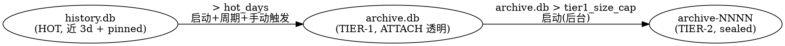

# Spec: History 三层降温归档（tiered archive）

- **状态**：Draft v2（已吸收 GPT reviewer 对抗评审 3 BLOCKER + 6 HIGH + MEDIUM，见 §10 评审台账；待用户审 → 复审 → plan）
- **日期**：2026-07-14
- **归属**：`docs/spec/`（模块契约层）。落地后架构现状进 [DESIGN.md](../DESIGN.md)「活的架构现状」，配置进 [API.md](../API.md) / config 参考，冷存储格式决策另立 ADR。
- **相关**：现状 skill `history-sqlite-schema` / `history-backfill`、ADR [2026-07-05-dependency-selection-bun-first](../decisions/2026-07-05-dependency-selection-bun-first.md)、ADR [2026-07-05-richest-data-flow](../decisions/2026-07-05-richest-data-flow.md)、[docs/history.md](../history.md)。

## 1. 问题与目标

`history.db` 是单一热库，reaper 到**数量上限**（`historySuccessLimit` / `historyFailureLimit`）就 `DELETE` 最旧行——这是**真数据丢失**，与项目 `no-destructive` / `richest-data-flow` 立场相悖：用户的历史请求（含完整 upstream 往返、sse 帧、计费）一旦超量即永久蒸发，无法事后诊断或审计。

本特性引入一条**按时间的降温轴**，与现有「按数量」轴正交，把 History 从「单库 + 到量硬删」升级为「三层降温 + **系统内无删除**」：近期数据留在快速热库，旧数据逐级降温到高压缩比冷存储，全程可检索、可访问、永不丢失。用户裁定：**彻底移除自动/手动删除功能**（§3.6），系统里唯一的数据流出方式是「向下降温归档」。

**四个必须同时满足的诉求**（用户原话）：
1. **永不真删**——数据只逐级降温，绝无任何删除路径（含移除既有 delete API）。
2. **高压缩比**——冷数据用支持的最好格式压到最小（tier-2 格式经 Phase 0 实测裁决，§6）。
3. **富可索引**——冷数据仍可按 model / session / status / 时间 / **全文检索**（含 `/api/search` 五 facet 深度搜索，§4）。
4. **低访问代价**——近期冷数据（tier-1）无缝并入主查询，深冷数据（tier-2）按需低成本单行打开。

## 2. 三层架构

| 层 | 载体 | 角色 | 写入 | 可访问性 |
|---|---|---|---|---|
| **HOT** | `history.db`（现状写路径零改动） | 近 `hot_days`（默认 3d）活跃数据 + **全部 pinned 行永久驻留**（§3.3） | 唯一写入端（请求管线） | list/detail/search 主路径（现状不变） |
| **TIER-1** | `archive.db`（新，SQLite，**复用** `entries_v2` / `entry_stages` / `msg_blob` / `req_msg` / `req_aux` schema） | 3d 前搬来的温数据，累积至 `tier1_size_cap` | 降温流水线（HOT→T1） | 经 `ATTACH` **透明并入** list/detail/**search**，用户无感 |
| **TIER-2** | `archive-NNNN.<ext>`（不可变、编号、纯 JS、格式待 PoC 定，§6）+ `archive.db` 内 `tier2_manifest` 表 | tier-1 撞上限后**封存**的深冷数据 | 降温流水线（T1→T2） | **冷封存**：manifest 可查/browse/**搜 preview**；detail 按需读封存单元的单条记录 |

**降温流水线（单向、系统内无删除）：**

**成本分配理由**：HOT→T1 是廉价的 SQLite→SQLite 行搬迁（同 schema、blob 直接转移），故**启动 + 周期 + 用户手动触发**都跑；T1→T2 是昂贵的封存重编码 + max 重压，故**仅启动时后台**跑一次（长跑不重启的 tier-1 无界增长风险见 §8-O3）。

## 3. 关键设计决策

### 3.1 reaper「按数量硬删」→「搬去 tier-1」（诉求①）

现 `src/lib/history/sqlite/reaper.ts` 的 `evictBucket` 用 `DELETE FROM entries_v2 …`（真丢）。改为：热库所有淘汰（无论**时间触发**还是**数量安全阀触发**）都先把待淘汰行**搬进 tier-1**，成功写入并**多子表校验通过后**才从热库删本地副本（move 语义，§3.4 保证不丢）。

- **主机制 = 时间搬迁**：`started_at < now - hot_days` 的**终态**行搬走。**排除谓词须同时含活跃态豁免 AND `pinned = 0`**（对齐 reaper 现有 `SUCCESS_WHERE`/`FAILURE_WHERE` 的 `pinned=0` 语义，`reaper.ts:47-48`）——pinned 行永不降温（§3.3）。
- **数量上限降级为安全阀**：`historySuccessLimit` / `historyFailureLimit` 仍生效，但超量行**搬去 tier-1 而非删除**——防热库在 3d 内突发海量请求时无界膨胀，同时保证「永不真删」。复用现有 `SUCCESS_WHERE`/`FAILURE_WHERE`（已含 `pinned=0`）。

### 3.2 tier-2 封存格式（核心技术点，格式 Phase 0 裁决 — 诉求②③④）

History entry 是**深嵌套重 blob 文档**（client 请求/响应 + N 个 attempt 各带 upstream 请求/响应/sse_events + 消息数组 + 内容寻址 dedup + zstd 合并帧），**不是列式扁平表**。tier-2 载体经 Phase 0 PoC 在两个候选间实测裁决（§6 H5）：

- **候选 A — 纯 JS Parquet**（`hyparquet` + `hyparquet-writer`，用户初选）：meta 列落原生 Parquet 类型列，重 payload（`assembleFullEntry` 产物）我方先经 `compression.ts` zstd 压成字节、落单个 `BYTE_ARRAY` 列（hyparquet 内建仅 SNAPPY，不依赖其 zstd 编码——已实证 §10-O2）。
- **候选 B — SQLite sealed**（VACUUM + 只读 + max-zstd 整行 blob，零新依赖、复用全部现有 serialize/compression/driver）。
- **共同点**：无论 A/B，`tier2_manifest`（SQLite，存 `archive.db`）**冗余全部 meta 列 + `preview_text` + 封存单元定位（file NNNN + row/rowid）**——使**富可索引 + list/search-preview 只命中 manifest**（SQL 索引全在），**detail 才开封存单元读单条**（低访问代价）。

**Phase 0 裁决问题（H5，源码级质疑）**：本设计对 tier-2 的**实际**访问模式是「manifest 精确定位 → 读单条已压缩 payload」，从不按 meta 列做范围扫描/聚合——故 Parquet 列存的核心卖点（row-group min/max 剪枝、列裁剪）在此**基本兑现不了**，meta 列在 tier-2 文件里是 manifest 的冗余、主字节量集中在已 zstd 压缩的单个 BLOB。Phase 0 **必须**正面回答「候选 A 相对候选 B 在真实分布下有无可测的压缩/访问优势」；若无（大概率），采候选 B（更简单、零依赖、复用现有栈）。

### 3.3 pinned 行永不降温（用户裁定）

pinned（调试固定）行的心智模型是「保留原始数据永久、随手可读」（`reaper.ts:44` "keeps its raw data forever"）。三层下**保持完全豁免**：pinned 行**永远驻留 HOT**，不随时间轴降温、不进 tier-1、不进 tier-2。时间搬迁与数量安全阀的排除谓词均含 `pinned = 0`（§3.1）。

### 3.4 跨库 move 的原子性与可恢复性（BLOCKER 修复）

WAL 模式**无跨文件事务原子性**（SQLite 官方：跨库 COMMIT 崩溃时部分文件可能落盘、部分不落）。`entry_stages` 对 `entries_v2` 是 `ON DELETE CASCADE`（`schema.ts:86`），一条 entry 有 0..N 子表行（`sse_events` 常为最大 blob）。故 move 语义严格定义为：

1. **写 archive.db**：在 archive.db **单库事务**内写入该 entry 的 head（`entries_v2`）+ **全部** `entry_stages` + `req_msg` + `req_aux` + `msg_blob`（按引用 INSERT OR IGNORE 复制，§3.5）。
2. **多子表校验**（不止 head 存在性）：核对 archive 侧 head 存在 **AND** `entry_stages` 行数/hash 与 HOT 侧一致 **AND** `req_msg`/`req_aux` 完整 **AND** 所有 `req_msg.hash` 在 archive.msg_blob 有对应行（引用完整性）。任一不符 → 不删 HOT、留待重跑。
3. **删 HOT**：校验通过才 `DELETE FROM main.entries_v2 WHERE id=?`（级联清 HOT 子表）。
4. **幂等恢复**（cursor 可恢复骨架）：archive 侧已存在该 id → **跳过写入，但仍完整走 verify→delete-HOT 流程**（绝非「跳过整行处理」——否则崩溃在「写完 archive、没删 HOT」会永久留「两头有」重复行）。

### 3.5 内容寻址 dedup 跨库语义（BLOCKER 修复）

`msg_blob` 是内容寻址、跨请求共享、无 FK（`schema.ts:93-98`）。同一 hash 可能同时被「待迁移旧 entry」与「留 HOT 新 entry」引用。迁移语义严格定为**复制而非移动**：

- `req_msg`/`req_aux`（有 FK、per-request）随 head **移动**（写 archive + 删 HOT）。
- `msg_blob` 按引用 **复制**（`INSERT OR IGNORE INTO archive.msg_blob …`）——**绝不因 HOT 仍需要而跳过复制到 archive**，否则 archive 侧 `req_msg` 会引用不存在的 msg_blob 行，`search-query.ts:160-161` 的 INNER JOIN 使该消息**静默从搜索消失**。
- **两侧各自独立孤儿 GC**：HOT 侧维持现状（`GC_ORPHAN_MSG_BLOB_SQL`，按 HOT 自己的 `req_msg` 判定，`write.ts:217`）；archive.db 侧另有一份同构 GC。
- **膨胀代价显式承认**：同一消息可能同时活在 HOT 和 archive 两份拷贝，tier-1 存储膨胀率高于「自足去重」直觉——这是正确性（搜索不丢）换来的可接受成本，Phase 0 量化其幅度。

### 3.6 移除删除功能，替换为「立即归档」触发（用户裁定，H2 修复）

现有 `deleteSession` / `deleteEntries` / `clearAllEntries`（`write.ts:219/246/264`，`clearAllEntries` 经用户点「清空历史」触发 `entries.ts:357`）在三层下会留幽灵数据。用户裁定：**彻底移除这三个删除 API 及其路由**，系统内**无任何删除路径**（贯彻「永不真删」）。

- 面向用户的「清空历史 / 删除会话」入口**改语义为「立即归档」**——手动触发 HOT→tier-1 搬迁（把选中/全部终态行降温到 tier-1，非删除）。
- 移除的路由 / handler 在 §5 清单显式标注（这是对既有已暴露功能的**破坏性迁移**，符合项目「无向后兼容负担、强制迁移旧→新」立场）。

### 3.7 配置（`history.archive.*`）

| 键 | 默认 | 含义 |
|---|---|---|
| `history.archive.enabled` | `true` | 总开关；`false` 时行为退回现状（数量 reaper 硬删，无归档；delete API 移除是独立的、不受此开关影响） |
| `history.archive.hot_days` | `3` | 热库保留天数；此前的终态非 pinned 行降温到 tier-1 |
| `history.archive.tier1_size_cap` | `500MB` | `archive.db` 大小上限；超限触发 T1→T2 封存 |
| `history.archive.tier2_warn_count` | Phase 0 定 | tier-2 文件数告警阈值（按真实 entry 体积换算，§6） |
| `history.archive.tier2_warn_bytes` | `500MB` | tier-2 总量告警阈值 |
| `history.archive.dir` | `<APP_DIR>` | archive.db + 封存文件落盘目录（默认同 history.db 同级） |

配置哲学遵循 [feedback-config-philosophy-separate-compat-and-warn-continue](../memory/feedback-config-philosophy-separate-compat-and-warn-continue.md)：配置不享代码「无向后兼容负担」——留旧键兼容、键问题运行时告警并继续、绝不因配置问题杀进程。热重载支持（复用 `state.ts` 的 `historyLimitListeners` 机制）。

## 4. 读路径改动（BLOCKER B1 修复：补全 search）

**所有触碰 `entries_v2` / dedup 表的读调用方**逐一裁定跨层行为（避免「只改 read.ts 两个显眼函数」的同构站点遗漏，教训 [feedback-fix-all-comparison-sites](../memory/feedback-fix-all-comparison-sites.md)）：

| 读路径 | 现状 | 跨层改动 |
|---|---|---|
| **list**（`querySummaries`/`queryEntries`，`read.ts`） | 扫 `entries_v2` | ATTACH `archive.db`，SQL 改 `main.entries_v2` + `archive.entries_v2` + tier2_manifest（meta-only），保 `started_at DESC` 归并 + cursor 分页；**跨层去重**见下 H4 |
| **detail**（`getEntryById`，`read.ts:205`） | 读 head + stages | 三层 fallback：HOT 命中即返 → 查 archive.db（ATTACH 透明）→ 查 tier2_manifest 定位封存单元、读单条、`deserializeEntry` 复原 |
| **深度全文搜索**（`searchInbound`/`searchAux`，`search-query.ts:160-231`，**B1 原漏**） | 裸表名 `FROM msg_blob`/`JOIN req_msg`/`FROM req_aux` | 加 `archive.` 前缀 UNION（`archive.msg_blob`/`archive.req_msg`/`archive.req_aux`），owner-dedup 覆盖跨库；tier-2 层经 `tier2_manifest.preview_text` 参与（deep-facet 对 tier-2 暂以 preview 粒度，若需全 facet 见 §8-O4） |
| **in-flight 合并**（`queries.ts`） | in-flight ⊎ persisted，Set 去重 | 不变（in-flight 只在 HOT） |

**H4 跨层去重**：move 窗口内同 id 可能同时物理存在于 HOT + archive。`UNION ALL` 不去重会展示两遍——`querySummaries`/`queryEntries` 的跨库 SQL **须显式去重**（`GROUP BY id` 取 HOT 优先，或 UNION 加来源优先级列后应用层去重），不假设「id 全局唯一即无重复行」。

**ATTACH 上限**：SQLite 默认最多 ATTACH 10 库。本设计**只 ATTACH 一个 `archive.db`**（tier-2 走 manifest + 按需读、不 ATTACH），永不触天花板。

## 5. 模块与文件（预估）

| 文件 | 角色 |
|---|---|
| `src/lib/history/sqlite/archive-db.ts`（新） | 打开/管理 `archive.db`（复用 schema.ts DDL + `tier2_manifest` 新表）、ATTACH 到主连接、**跑独立 `applyForwardMigrations` 账本**（§H1） |
| `src/lib/history/sqlite/tier1-migrate.ts`（新） | HOT→TIER-1 搬迁（可恢复骨架 §3.4；改造 reaper 淘汰为搬迁；含手动「立即归档」触发 §3.6） |
| `src/lib/history/sqlite/tier2-seal.ts`（新） | TIER-1→TIER-2 封存（格式 §3.2 候选 A/B + manifest 写入，manifest 写 + 删 tier-1 源行**同 archive.db 单库事务** §M1） |
| `src/lib/history/sqlite/tier2-archive.ts`（新） | 封存单元格式封装（PoC 裁决后定 Parquet 或 SQLite sealed）：schema + 单条读 + 写 |
| `src/lib/history/sqlite/reaper.ts`（改） | `evictBucket` 的 DELETE → move-to-tier1（`enabled` 时），谓词含 `pinned=0` |
| `src/lib/history/sqlite/read.ts`（改） | list/detail 跨层（ATTACH + manifest + 按需读） |
| `src/lib/history/sqlite/search-query.ts`（改，**B1**） | 深度搜索五 facet 跨库 UNION |
| `src/lib/history/sqlite/write.ts`（改，**H2**） | **移除** `deleteSession`/`deleteEntries`/`clearAllEntries` |
| `src/lib/history/entries.ts` + 相关路由（改，**H2**） | 移除删除路由 handler；「清空/删除」入口改接「立即归档」触发 |
| `src/lib/history/sqlite/schema.ts`（改） | 加 `tier2_manifest` DDL（archive.db 用） |
| `src/lib/config/schema.ts` / `config.ts` / `state.ts`（改） | `history.archive.*` 配置节 + state 字段 + 接线 + 热重载 listener |
| `src/start.ts`（改） | 启动接线：两库 floor + `applyForwardMigrations`（H1）、ATTACH、启动搬迁、启动封存（`startHistoryBackfills` 一带） |
| `package.json`（改，条件） | 若 PoC 采候选 A：加 `hyparquet` + `hyparquet-writer`（纯 JS、零 node-gyp、合 bun-first）；采候选 B：零新依赖 |

## 6. Phase 0 —— PoC 前置（poc-if-unclear + empirical-verification）

正式实现前，用**真实 history blob**（从运行中 4141 History API 或真库拉，非合成）实测，产出 `exp/tiered-archive-format/FINDINGS.md`（keep-poc-in-project）：

1. **【H5 核心裁决门】候选 A（Parquet meta 列拆分 + BLOB 列）vs 候选 B（SQLite sealed 整行 zstd）** 在真实生产分布下的**字节数 + 单行读延迟**——直接回答「Parquet 列存在本访问模式下有无可测收益」。若 B 相近或更优 → 采 B（零依赖、复用现有栈）。
2. **round-trip 保真**：`assembleFullEntry` → 封存写 → 读回 → `deserializeEntry`，与原 entry 深等（独立 oracle，非自洽）。
3. **候选 A 能力边界**（若测 A）：`hyparquet-writer` BLOB 列 + 单条读的真实访问代价、Bun+Node 双运行时加载读写（bun-first 合规）。
4. **【M2 容量锚点】** 用真实 `history.db` 统计「过去 3 天终态行数 + 总字节量」——验 `hot_days=3` 合理性、估 HOT 稳态体积对 startup VACUUM（`connection.ts` `VACUUM_WARN_BYTES=1GB`）/ 搬迁 tick 耗时的影响。
5. **【dedup 膨胀 + 合并帧】** 量化 §3.5 跨库复制 msg_blob 的 tier-1 膨胀幅度；测「封存单元内保留 request_group 合并帧 vs 完全摊平进单 blob」对压缩比的影响，验 §3.5「可接受」。
6. **【tier2_warn_count 默认值】** 按 4/1 实测 entry 体积换算合理默认（Phase 0 强制交付，非实现期拍脑袋）。

PoC 若证伪某假设，据实回炉调整格式/参数。

## 7. 非目标（本特性不做）

- 不改分析型聚合（telemetry.db / DDSketch 的职责，与本特性正交）。
- 不做 tier-2 的透明 SQL 合并查询（tier-2 走 manifest + 按需读，刻意不 ATTACH 保证 ATTACH 上限不触）。
- 不做跨 tier-2 封存单元的全局内容寻址 dedup（封存单元自足）。
- 不做自动删除/转移 tier-2（仅告警，删/移交给用户手动离线决策）。
- **不保留任何删除功能**（§3.6，delete API 整体移除）。

## 8. 风险与开放问题

- **R3 ATTACH 与写路径锁交互**：archive.db 的 ATTACH 是否影响 history.db 的 WAL / busy_timeout。实现期实测（`ss` / 探针）。
- **O1 tier2_warn_count 默认值** → Phase 0 §6.6 交付。
- **O3【长跑服务器 tier-1 无界增长】**：T1→T2 仅启动触发（用户裁定）；若服务长期不重启，tier-1 撞 `tier1_size_cap` 后**无运行期封存触发**，会持续增长——由运行期 `consola.warn`（`tier2_warn_*` 同机制）提示用户重启/手动。**显式记录为已知取舍**（非遗漏），若后续需要可加运行期封存触发点。
- **O4【tier-2 深度搜索粒度】**：tier-2 层深度全文搜索目前以 `manifest.preview_text` 粒度参与（非全五 facet 逐字节）。若需 tier-2 全 facet 搜索，需在封存单元内保留可搜文本或建独立冷索引——暂缓，记 `docs/todo/`。

## 9. 验收（acceptance oracle 提要，供 verifier 独立推导）

- **永不真删**：全代码路径无 `DELETE FROM entries_v2`（除 §3.4 move 语义的「校验通过后删 HOT 副本」，且该副本已在 archive）；grep 确认 delete API 已移除。
- **搬迁保真**：move 后 archive 侧 `assembleFullEntry` 与原 HOT entry 深等（含全 stages / 全消息 / 引用完整）；崩溃注入在步骤 1-3 各点，重跑后无丢失、无重复。
- **搜索不丢**：一条 entry 降温后，`/api/search` 五 facet 仍命中（正样本：先证搜索触达 HOT 再证降温后 tier-1 命中）。
- **跨层无重复**：move 窗口内 list 查询同 id 不出现两次。
- **pinned 豁免**：pinned 行经任意次搬迁 tick 后仍在 HOT。
- **格式裁决**：Phase 0 FINDINGS 给出候选 A/B 的真实字节 + 延迟数字。

## 10. 评审台账（GPT reviewer 对抗评审，2026-07-14）

reviewer 实读源码 + `npm pack` 核对 hyparquet 源码，3 BLOCKER + 6 HIGH + 2 MEDIUM，主会话逐条对照代码复核后处置：

| 编号 | 发现 | 处置 |
|---|---|---|
| B1 | `/api/search` 五 facet 深度搜索遗漏（裸表名不跨库、降温后静默搜不到） | **采纳** → §4 补 search-query.ts 跨库 |
| B2 | 跨库 move 无 WAL 原子性、校验粒度未定义、有部分复制后级联删的丢失窗口 | **采纳** → §3.4 多子表校验 + 幂等恢复语义 |
| B3 | msg_blob 内容寻址跨库须复制非移动，否则 archive 侧 INNER JOIN 静默丢 | **采纳** → §3.5 复制语义 + 两侧独立 GC + 膨胀显式承认 |
| H1 | archive.db 的 Umzug 迁移账本/schema drift 未提 | **采纳** → §5 archive.db 跑独立 `applyForwardMigrations` |
| H2 | delete 类管理 API 跨层留幽灵数据 | **采纳（用户裁定升级）** → §3.6 整体移除 delete、改「立即归档」 |
| H3 | pinned 豁免未在时间搬迁声明 | **采纳（用户裁定）** → §3.3 pinned 永不降温 |
| H4 | ATTACH+UNION ALL 迁移窗口同 id 重复行 | **采纳** → §4 跨库 SQL 显式去重 |
| H5 | Parquet 对本访问模式零列式收益、可能只是二进制容器 | **采纳（强化为 PoC 裁决门）** → §3.2 候选 A/B + §6.1 显式可证伪对比 |
| M1 | R2 写 manifest 与删 tier-1 源行应同库单一事务 | **采纳** → §5 tier2-seal 同 archive.db 单库事务 |
| M2 | hot_days=3 缺真实容量锚点 | **采纳** → §6.4 Phase 0 统计真实 3 天量 |
| 建议 | request_group 合并帧 vs 摊平的压缩影响；T1→T2 长跑无触发 | **采纳** → §6.5 测合并帧；§8-O3 显式记录取舍 |

reviewer 整体判断「方向对、两类系统性缺口（读路径覆盖面 + 崩溃校验粒度）」——均已修入本 v2。
</content>
