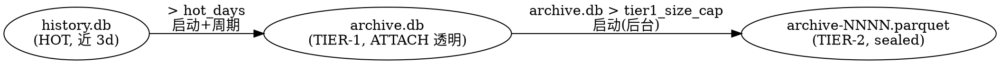

# Spec: History 三层降温归档（tiered archive）

- **状态**：Draft（待用户审 → subagent 对抗评审 → plan）
- **日期**：2026-07-14
- **归属**：`docs/spec/`（模块契约层）。落地后架构现状进 [DESIGN.md](../DESIGN.md)「活的架构现状」，配置进 [API.md](../API.md) / config 参考，冷存储格式决策另立 ADR。
- **相关**：现状 skill `history-sqlite-schema` / `history-backfill`、ADR [2026-07-05-dependency-selection-bun-first](../decisions/2026-07-05-dependency-selection-bun-first.md)、ADR [2026-07-05-richest-data-flow](../decisions/2026-07-05-richest-data-flow.md)、[docs/history.md](../history.md)。

## 1. 问题与目标

`history.db` 是单一热库，reaper 到**数量上限**（`historySuccessLimit` / `historyFailureLimit`）就 `DELETE` 最旧行——这是**真数据丢失**，与项目 `no-destructive` / `richest-data-flow` 立场相悖：用户的历史请求（含完整 upstream 往返、sse 帧、计费）一旦超量即永久蒸发，无法事后诊断或审计。

本特性引入一条**按时间的降温轴**，与现有「按数量」轴正交，把 History 从「单库 + 到量硬删」升级为「三层降温 + 永不真删」：近期数据留在快速热库，旧数据逐级降温到高压缩比冷存储，全程可检索、可访问、不丢失。

**四个必须同时满足的诉求**（用户原话）：
1. **永不真删**——数据只逐级降温，不因超量丢失。
2. **高压缩比**——冷数据用支持的最好格式压到最小。
3. **富可索引**——冷数据仍可按 model / session / status / 时间 / 全文检索。
4. **低访问代价**——近期冷数据无缝并入主查询，深冷数据按需低成本打开。

## 2. 三层架构

| 层 | 载体 | 角色 | 写入 | 可访问性 |
|---|---|---|---|---|
| **HOT** | `history.db`（现状，零改动） | 近 `hot_days`（默认 3d）活跃数据 | 唯一写入端（请求管线） | list/detail/search 主路径（现状不变） |
| **TIER-1** | `archive.db`（新，SQLite，**复用** `entries_v2` / `entry_stages` / `msg_blob` / `req_msg` / `req_aux` schema） | 3d 前搬来的温数据，累积至 `tier1_size_cap` | 降温流水线（HOT→T1） | 经 `ATTACH` **透明并入** list/detail/search，用户无感 |
| **TIER-2** | `archive-NNNN.parquet`（不可变、编号、纯 JS Parquet 列式 + max-zstd）+ `archive.db` 内 `tier2_manifest` 表 | tier-1 撞上限后**封存**的深冷数据 | 降温流水线（T1→T2） | **冷封存**：manifest 可查/browse；detail 按需开单个 Parquet 行 |

**降温流水线（单向、永不真删）：**

**成本分配理由**：HOT→T1 是廉价的 SQLite→SQLite 行搬迁（同 schema、blob 直接转移），故**启动 + 周期**都跑；T1→T2 是昂贵的 Parquet 列式重编码 + max-zstd 重压，故**仅启动时后台**跑一次，不占周期 tick。

## 3. 关键设计决策

### 3.1 reaper「按数量硬删」→「搬去 tier-1」（诉求①）

现 `src/lib/history/sqlite/reaper.ts` 的 `evictBucket` 用 `DELETE FROM entries_v2 …`（真丢）。改为：热库所有淘汰（无论**时间触发**还是**数量安全阀触发**）都先把待淘汰行**搬进 tier-1**，成功写入 tier-1 后才从热库删本地副本（move 语义、事务/校验保证不丢）。

- **主机制 = 时间搬迁**：`started_at < now - hot_days` 的**终态**行搬走（活跃态豁免，同现状 reaper）。
- **数量上限降级为安全阀**：`historySuccessLimit` / `historyFailureLimit` 仍生效，但超量行**搬去 tier-1 而非删除**——防热库在 3d 内突发海量请求时无界膨胀，同时保证「永不真删」。
- **搬迁保真**：blob 逐字节转移（不重解压/重压），meta 列 1:1 复制。dedup 表（`msg_blob` 等）随引用一并迁移；搬迁批内自足去重。

### 3.2 tier-2 的嵌套 blob → Parquet schema（核心技术点，诉求②③④）

History entry 是**深嵌套重 blob 文档**（client 请求/响应 + N 个 attempt 各带 upstream 请求/响应/sse_events + 消息数组 + 内容寻址 dedup + zstd 合并帧），**不是列式扁平表**。Parquet 落盘策略：

- **meta 列落原生 Parquet 类型列**（~30 个：`id` / `session_id` / `model` / `endpoint` / `status` / `started_at` / `ended_at` / `duration_ms` / `input_tokens` / `output_tokens` / `cache_*` / `preview_text` / `response_preview_text` / …，即 `entries_v2` 全部 meta 列）——享列式压缩 + row-group min/max 粗剪枝。
- **重 payload 落单个 zstd BLOB 列**：把该 entry 的 `assembleFullEntry`（`serialize.ts:506`）产物序列化 + zstd（max level）压成一个 `full_gz` BLOB 列。round-trip 经 `deserializeEntry` 复原（保真验证是 PoC 硬门）。
- **`tier2_manifest`（SQLite，存 `archive.db`）冗余全部 meta + `preview_text` + `parquet_file`（NNNN）+ `row_index`**——使**富可索引 + browse 只命中 manifest**（SQL 索引全在，list/搜索命中冷数据仍走 SQLite），**detail 才开对应 Parquet 单行**（低访问代价，hyparquet 支持按 row-group / row 读，不全表加载）。

**dedup 作用域**：tier-2 封存单元内，`full_gz` 已含该 entry 全部消息（不再跨 entry 内容寻址去重）——封存单元自足、可独立读取，代价是同一消息跨 entry 不再共享。可接受（冷数据、封存不可变、读取罕见）。

### 3.3 触发时机（用户裁定）

- **HOT→TIER-1**：启动时跑一次 + 周期（默认跟随 `historyReaperInterval`，可配）。仿现有 backfill 骨架——async / chunked / resumable / never-throw / yield between batches，绝不阻塞启动或饿死请求。
- **TIER-1→TIER-2**：仅启动时后台跑一次（Parquet 封存昂贵，不进周期）。同样 async / chunked / resumable / never-throw。

### 3.4 tier-2 无上限，仅告警（用户补充需求）

tier-2 可有无数个 `archive-NNNN.parquet`。超过 `tier2_warn_count`（默认 N，待定合理值如 50）**或**总量 `tier2_warn_bytes`（默认 500MB）时——**仅 `consola.warn` 告警，绝不删**（永不真删红线）。告警建议用户手动离线归档 / 转移。

### 3.5 配置（`history.archive.*`）

| 键 | 默认 | 含义 |
|---|---|---|
| `history.archive.enabled` | `true` | 总开关；`false` 时行为退回现状（数量 reaper 硬删，无归档） |
| `history.archive.hot_days` | `3` | 热库保留天数；此前的终态行降温到 tier-1 |
| `history.archive.tier1_size_cap` | `500MB` | `archive.db` 大小上限；超限触发 T1→T2 封存 |
| `history.archive.tier2_warn_count` | `50`（待定） | tier-2 文件数告警阈值 |
| `history.archive.tier2_warn_bytes` | `500MB` | tier-2 总量告警阈值 |
| `history.archive.dir` | `<APP_DIR>` | archive.db + parquet 落盘目录（默认同 history.db 同级） |

配置哲学遵循 [feedback-config-philosophy-separate-compat-and-warn-continue](../memory/feedback-config-philosophy-separate-compat-and-warn-continue.md)：配置不享代码「无向后兼容负担」——留旧键兼容、键问题运行时告警并继续、绝不因配置问题杀进程。热重载支持（同 reaper 配置的 listener 机制，`state.ts` 的 `historyLimitListeners`）。

## 4. 读路径改动

- **list / search（`querySummaries` / `queryEntries`，`sqlite/read.ts`）**：启动时 `ATTACH archive.db AS archive`，查询改为 `history.db.entries_v2 UNION ALL archive.entries_v2`（+ tier2_manifest 的 meta-only 行），保持 `started_at DESC` 归并、cursor 分页、search LIKE 全跨层生效。in-flight 合并逻辑（`queries.ts`）不变。
- **detail（`getEntryById`，`sqlite/read.ts:205`）**：三层 fallback——热库命中即返（现状）→ 未命中查 archive.db（ATTACH，透明）→ 仍未命中查 tier2_manifest 定位 `parquet_file` + `row_index`，用 hyparquet 读单行 `full_gz`、zstd 解压、`deserializeEntry` 复原。
- **ATTACH 上限**：SQLite 默认最多 ATTACH 10 库。本设计**只 ATTACH 一个 `archive.db`**（tier-2 不 ATTACH，走 manifest + 按需 Parquet 读），故永不触天花板。

## 5. 模块与文件（预估）

| 文件 | 角色 |
|---|---|
| `src/lib/history/sqlite/archive-db.ts`（新） | 打开 / 管理 `archive.db`（复用 schema.ts DDL + `tier2_manifest` 新表）、ATTACH 到主连接 |
| `src/lib/history/sqlite/tier1-migrate.ts`（新） | HOT→TIER-1 搬迁（可恢复骨架，仿 backfill；改造 reaper 淘汰为搬迁） |
| `src/lib/history/sqlite/tier2-seal.ts`（新） | TIER-1→TIER-2 Parquet 封存（hyparquet-writer + zstd + manifest 写入） |
| `src/lib/history/sqlite/parquet-archive.ts`（新） | Parquet schema 定义 + 单行读（hyparquet）+ 写（hyparquet-writer）封装 |
| `src/lib/history/sqlite/reaper.ts`（改） | `evictBucket` 的 DELETE → move-to-tier1（`enabled` 时） |
| `src/lib/history/sqlite/read.ts`（改） | list/detail/search 跨层（ATTACH + manifest + Parquet fallback） |
| `src/lib/history/sqlite/schema.ts`（改） | 加 `tier2_manifest` DDL（仅 archive.db 用） |
| `src/lib/config/schema.ts` / `config.ts` / `state.ts`（改） | `history.archive.*` 配置节 + state 字段 + 接线 |
| `src/start.ts`（改） | 启动接线：ATTACH + 启动搬迁 + 启动封存（`startHistoryBackfills` 一带） |
| `package.json`（改） | 加 `hyparquet` + `hyparquet-writer`（纯 JS、零 node-gyp、合 bun-first） |

## 6. Phase 0 —— PoC 前置（poc-if-unclear + empirical-verification）

正式实现前，用**真实 history blob**（从运行中 4141 History API 或真库拉，非合成）实测验证：

1. **压缩比对比**：现状 zstd blob vs Parquet 列式（meta 列 + `full_gz` BLOB 列，max-zstd）vs SQLite sealed（VACUUM + max-zstd 重压）——出带数字的三方对比。
2. **round-trip 保真**：`assembleFullEntry` → Parquet 写 → hyparquet 读 → `deserializeEntry`，与原 entry 深等（独立 oracle，非自洽）。
3. **hyparquet-writer 能力边界**：能否胜任 BLOB 列 + 我们的 meta 列类型；单行 / row-group 按需读的真实访问代价。
4. **Bun 原生可跑**：`hyparquet` + `hyparquet-writer` 在 Bun 与 Node 双运行时加载 + 读写实测（bun-first 合规验证）。

产出 `exp/tiered-archive-format/FINDINGS.md`，keep-poc-in-project。PoC 若证伪某假设（如 Parquet 对我们的 blob 形状压缩比不如 SQLite sealed），据实回炉调整 tier-2 格式。

## 7. 非目标（本特性不做）

- 不改分析型聚合（那是 telemetry.db / DDSketch 的职责，与本特性正交）。
- 不做 tier-2 的透明 SQL 合并查询（tier-2 走 manifest + 按需读，刻意不 ATTACH 保证 ATTACH 上限不被触及）。
- 不做跨 tier-2 文件的全局内容寻址 dedup（封存单元自足）。
- 不做自动删除 / 转移 tier-2（仅告警，删/移交给用户手动决策）。

## 8. 风险与开放问题

- **R1 tier-1 搬迁的原子性**：move 语义须保证「写 tier-1 成功」与「删热库副本」的一致性（崩溃不能两头空 / 两头有）。方案：先写 tier-1 + 校验 → 再删热库，可恢复骨架的 cursor 保证重跑幂等（tier-1 已存在则跳过）。
- **R2 Parquet 封存的可恢复性**：封存中途崩溃不能产生半个 Parquet + 已删 tier-1 行。方案：Parquet 先写临时文件 → fsync → 原子 rename → 写 manifest → 才删 tier-1 源行。
- **R3 ATTACH 与写路径的锁交互**：archive.db 的 ATTACH 是否影响 history.db 的 WAL / busy_timeout。PoC 或实现期实测。
- **O1 `tier2_warn_count` 合理默认值**（50？100？）——PoC 后按真实 entry 体积估算定。
- **O2 hyparquet-writer 的 zstd 支持**：是否内建 zstd 压缩编码，还是需我方先 zstd 再存 BLOB 列（后者更可控，倾向后者）——PoC 确认。
</content>
