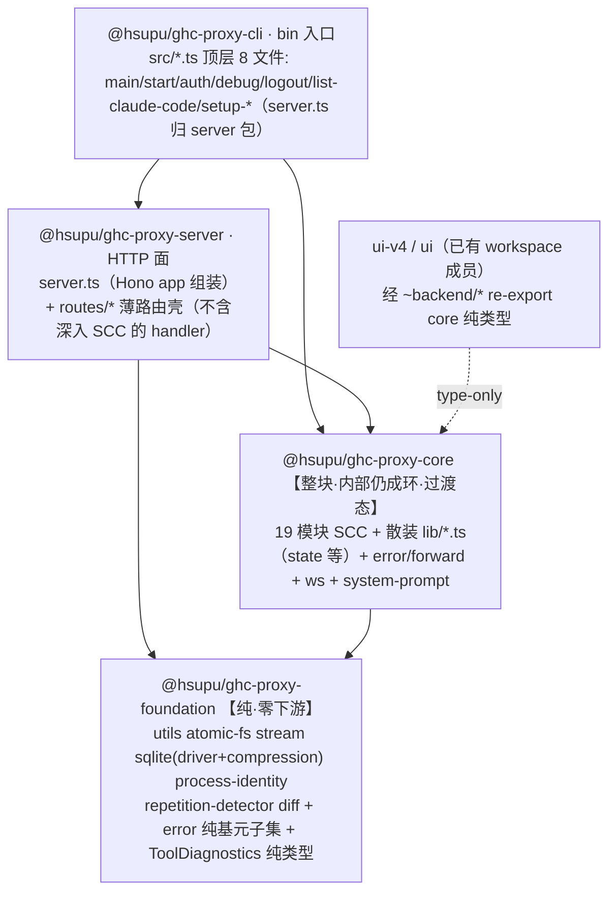

# Spec：按模块拆分为 monorepo workspace 子项目

状态：**设计定稿待用户 review** · 日期：2026-07-22 · 类型：架构重构 spec（what & why + 粗粒度 how，细节 how 交后续 plan）

> 归属：本 spec 是「monorepo 拆分」这条 roadmap 的单一事实源。配套 ADR（边界硬强制手段、core-as-block 过渡态定位）待本 spec 定稿后补。实施 plan 交 `docs/plan/`。三方讨论原始材料见 [../../exp/monorepo-split/architect-claude.md](../../exp/monorepo-split/architect-claude.md) 与 `exp/monorepo-split/architect-gpt.md`（GPT 对抗性第二意见）。

## 1. 目标与背景（what & why）

### 1.1 问题

当前后端是单一 package.json 下的 `src/`（440 文件 / ~90K LOC）+ 独立 `tests/` 树（654 文件 / ~125K LOC）。痛点：**代码与测试缺乏良好分类、模块之间无强制边界**。任何模块都能 `import { state } from "~/lib/state"` 或深 import 任意其他模块，依赖方向靠自觉、无机械约束。

### 1.2 目标

把后端按模块拆成 **monorepo workspace 子项目**（`packages/*`，每包独立 `package.json`，一个仓库单 lockfile），使：

- 每个子项目的 `src` 与 `tests` 内聚（同一包内）；
- 包与包之间的依赖方向被**机械硬强制**（非法跨包 import 直接报错），而非靠自觉。

### 1.3 已锁定的两个上位决策（用户裁断，本 spec 围绕其优化、不推翻）

1. **目标形态 = monorepo workspaces**（`packages/*` + 单 lockfile + 包间边界硬强制）。
2. **策略 = 粗粒度先切**：把核心的巨型依赖环整体塞进一个 `core` 包内部（包内成环允许、边界检查器看不见），之后再增量剥离。

### 1.4 判据（本 spec 与后续 plan 一律按此，禁用 ROI/YAGNI 砍范围）

长远正确 + 完整 > 短期省事；架构健康 / 可维护性 / 边界硬度 > 向后兼容 / 回归风险 / 迁移麻烦。对齐 CLAUDE.md：`long-termism-wins`、`无向后兼容负担`（可强制迁移旧→新、允许短期报错、不留双轨包袱）、`single-source-of-truth-types`、`concurrent-sessions 行级共存`。

## 2. 决定性的实测发现（拆分的第一性约束）

在依赖图上（模块 = `src/lib/<m>` 或 `src/routes/<r>` 或 `src/<top-file>`）实测：

- **34 对模块级双向环**（A→B 且 B→A），遍布核心，不是几条可外科切断的回边。
- 由此形成**一个 19 模块的巨型 SCC**（强连通分量）：`anthropic` `codec` `config` `context` `diagnostics` `gemini` `history` `models` `observability` `openai` `pipeline` `request` `restart` `telemetry` `token` `transport` `tui` + **部分**散装 `lib/*.ts`（`state`/`tool-name-mapper`/`abort-bridge` 等；注意 `stream.ts` 实测纯、**不属 SCC**、归 foundation）+ `routes/responses`。
- **TS project references（`composite`+`references`）与本 spec 拟引入的边界 lint 规则**禁止包间成环——**纯 workspace 包声明本身并不自动强制这一点**（多数包管理器允许甚至能 resolve 循环 workspace 依赖）。所以 workspace 拆分**不是移动文件的活**——在这些环被切断前，这 19 个模块在依赖图上是一个不可分割的整体。这正是「core 当整块」策略的第一性依据。

候选 5 包分区 `foundation ← core ← server ← cli` **在包级几乎已是干净 DAG**：合法向下边 `server→core` 279 / `core→foundation` 147 / `cli→core` 76；**全部跨包回边仅两类**——`core→server` **2 处**（两个放错位置的函数）、`foundation→core` ≤10 处（仅当把 error/ws/system-prompt 上提 foundation 才需切）。

### 2.1 实测纠正的三个「纯基元」误判（决定 foundation day-1 边界）

- `error/http-error.ts` **不纯**：`import type { ToolDiagnostics } from "~/lib/upstream-diagnostics"`，而 upstream-diagnostics `import { state }`（core 值）。虽 type-only 运行时无环，但类型层把 http-error 拴在 core。
- `fetch-utils.ts` **不纯**：import `context/request` 的 `HeadersCapture` type + `models/timeout-resolver` value。
- `system-prompt/override.ts` **不纯**：import `pipeline/envelope` 的 `ClientFormat` + `types/api/anthropic`；且用户已定 **system-prompt rewrite 未来进 hook、留 core**，foundation 不碰。
- `state.ts` **本身不是叶子**：反向 import `models/model-name`(value) + `anthropic/recover-refusal`(value) + type 依赖 `models/client`/`config/schema`/`anthropic/sanitize`。state 是 SCC 的核心节点、被 **~83 个 src 文件** `import { state }`（其中 routes 内 20 个；GPT 报告的 94 是「跨域 import-site」计数、口径不同）依赖——**「把 state 沉到 foundation」day-1 走不通**（会拽下半个 SCC），强化「state 实现整个留 core」的正确性。
  - ⚠️ **2026-07-28：本条的结论已被 supersede，但它的推理仍然成立**。上面判「走不通」的**依据**正是那几条 value/type 实边；用户 2026-07-27 裁定的新方案就是**逐条拆掉这些依据**，然后把 state 降为 foundation 叶子（叶子无出边 → 谁依赖它都不成环，`~83 个 importer` 不再是障碍）。**「day-1 走不通」≠「永远不该做」。** 权威入口 [docs/plan/2026-07-28-state-to-foundation/HANDOVER.md](../plan/2026-07-28-state-to-foundation/HANDOVER.md)（含完整出边清单与分步拆解）。§5 的 reader seam 方案、§11 「error 上提会把 state 拖进 foundation」那条否决理由，同样只在 state 还不是叶子时成立。
- **state 未来拆分是机械活、非重设计**（利好实证）：`state.ts` 里已存在按功能域命名的 setter（`setHistoryConfig`/`setTelemetryConfig`/`setUpstreamTransportConfig`/`setResponsesConfig`/`setBufferedRetryShared`/`setNegotiationConfig`/`setShutdownConfig`/`setHooksConfig`）——说明它概念上早已是 N 个配置域拼在一个可变对象里，耦合是「物理位置」而非「语义」。这支撑 §5 的窄接口 seam：给 ~83 个消费点一个统一入口不需要先解决「state 该怎么拆」这个难问题。

## 3. 目标架构：5 包分层

依赖方向严格向下 `foundation ← core ← server ← cli`。**包命名（用户裁断）**：workspace 包 = `@hsupu/ghc-proxy-{foundation,core,server,cli}`（`ghc-proxy` 对应项目内 GHC 简称）；**发布根包 `@hsupu/copilot-api` 与 bin 名 `copilot-api` 均不改**（workspace 包是内部开发边界、非发布单元，公开契约保持不变）。

### 3.1 各包边界（裁断结果）

| 包 | 内容 | 边界裁断 |
|---|---|---|
| **foundation** | 已验证纯基元（见图）+ error 纯基元子集 + `ToolDiagnostics` 纯类型 | day-1 只收「已证纯」，不贪多 |
| **core** | 19 模块 SCC 整块 + error/`forward.ts`（耦合 state+Hono）+ ws（对 core 仅 2 条无害 type-only 回边、不值上浮）+ system-prompt（未来进 hook、留此） | **过渡态**、内部仍成环；防熵增见 §6 |
| **server** | **单包**（用户裁断）：Hono app 组装 + `routes/*/route.ts` 薄壳；凡 handler 深入 SCC（messages/responses/chat handler-v4 等）**留 core**，server 只依赖 core 导出的 handler | 不按 vendor 纵切（见 §10 未采纳） |
| **cli** | `src/*.ts` 顶层文件中的 **8 个干净文件**（`main`/`auth`/`debug`/`logout`/`list-claude-code`/`setup-claude-code`/`setup-codex`/`start`，全走相对 import；`cli` 是 DAG 顶点，**合法依赖 core 与 server**） | day-1 冷区、最先兑现 |
| **ui / ui-v4** | 已有 workspace 成员，经 `~backend/*` 消费 core 纯类型 | 仅需随 core 物理位置更新 alias（见 §7 陷阱 1） |

> **`server.ts` 归属澄清**：`src/server.ts`（Hono app 组装：`registerHttpRoutes`/`registerOpenApiDocs`/middleware/state）import `./routes`，是 **server 包**内容、**不在 cli 的 8 文件内**。链条 `main → start → server.ts → routes`：`start.ts`（cli）经包名引用 server 包的 `createServer`（`cli→server` 是合法向下边）。

### 3.2 `error` 劈裂落地（barrel 零改动）

- **前置 gatekeeper**：把 `ToolDiagnostics` **纯类型定义下沉 foundation**（行为 `summarizeToolsForDiagnostics`/`logToolDiagnostics` 依赖 state/consola、留 core；core 侧 `upstream-diagnostics.ts` re-export 该类型）。这解开 `http-error → core` 最后一根类型线。
- **纯基元下沉 foundation**：`parsing.ts`、`utils.ts` 纯函数、`http-error.ts`（解链后）、`classify.ts`。
- **留 core**：`forward.ts` 整体（import `state` 值 + Hono `Context` + `RequestContext` + `logToolDiagnostics`）——HTTP 边界胶水，本属 server-facing core。
- **barrel 表面永不动**：core 内保留 `lib/error/index.ts` barrel，继续 re-export forward（本地）+ 从 foundation re-export 纯基元。**~57 个 src 消费端零改动**（符号名不变、物理来源跨包）→ 对并发 worktree 零撞行。

## 4. 边界硬强制机制：lint，非 TS project references（day-1）

**裁断：day-1 用 ESLint `no-restricted-imports`（或 `import/no-restricted-paths` / dependency-cruiser）作层序硬强制；TS project references 推迟到阶段 4+ core 真拆子包时作第二道防线。**

理由（本项目特性）：

- 本项目 `tsc --noEmit`、构建走 **tsdown bundle**、不 emit `.d.ts`、不做 `tsc --build`。project references 两大核心价值（增量 build 缓存 + `.d.ts` 边界产物）在此**全失效**；剩下的「`composite` 下 tsc 拒绝未声明跨包 import」lint 能更轻覆盖。
- `composite: true` 会**卡死粗粒度阶段必须容忍的 type-only 回边**（ws 的 2 条 `import type`、可能残留的 core↔server type-only 边）——tsc 不区分 type-only 的运行时无环。lint 可配置「允许 type-only 跨边、禁止 value 跨边」，这是相对 project refs 的关键灵活性。
- 契合现状：`@echristian/eslint-config` 已在用；项目 2026-06-29 起**无 pre-commit 门禁**、lint 靠手动 + subagent review；报错点在编辑器、无需 build。

lint 规则集（层序）：foundation 禁 import core/server/cli；core 禁 import server（`routes`）/cli；server 禁 import cli；**并同时禁 `~/*` 跨包写法**（见 §7 陷阱 3，否则 `~/` 可绕过边界检查器造假 DAG）。

## 5. state seam（用户裁断：day-1 推进消费端迁移）

**用户选择：day-1 就把 state 消费端逐步迁到窄读接口**（而非「只加 seam 不强迁」的双轨档）。

- **落地**：先在 core 内部定义按消费域切分的**窄读接口 seam**（如 `core/state/reader-*.ts`），实现仍是同一 `mutableState` 单例；然后**主动把 ~83 个 `import { state }` 消费端逐域迁到窄接口**（其中 ~63 处在 `src/lib/*` 包内、~20 处在 `routes/*` 跨包），旧表面在迁移完成后移除（不留双轨）。对应阶段 0d（day-1 起步边缘域）+ 阶段 4+（核心域），见 §7.2。
- **与 CLAUDE.md 的自洽性**：此选择直接兑现 `无向后兼容负担`（强制迁移旧→新、允许短期报错、不留双轨包袱）与 `架构健康 > 回归风险`。它有意排在「避免 worktree 冲突」之前——见 §5.1 的取舍记录。
- **撞行缓解**（honor 选择的同时把代价降到最低）：① seam 定义是纯新增文件、零撞行，先落；② 消费端迁移**逐域推进**（telemetry/models/token 等边缘域先迁，history/context/pipeline 等烫域协调对应 worktree owner 或等其 land）；③ 一律 isolated worktree + 同文件不重叠行 + 显式 pathspec commit；④ 接受短期编译中间态（单 commit 内），跨 commit 边界 typecheck 绿。

### 5.1 未采纳的 architect 建议（record-not-adopted）

两位 architect 都建议 **day-1 只做加法、不强迁消费端**（把撞行降到最低），但**机制不同、作用域不同**：Claude 侧建议 **core 内部窄读接口**（覆盖 ~63 处包内消费点——这些点根本不跨包、真正决定未来能否把模块从 SCC 剥离）；GPT 侧建议 **core 对外 barrel + 跨包 lint 禁深 import**（覆盖 ~20 处 routes 跨包消费点）。**两种机制本 spec 都采纳**（§5 窄接口 + §6 措施 1 桶入口），只是各自解决不同耦合面、非重复劳动。**用户不采纳的只是「是否强迁」这一点**——选择 day-1 主动推进迁移（非「不设 deadline」）。**原因**：用户价值排序「架构健康 / 不留双轨 > 避免并发冲突」，与 architect 默认的「最小化撞行」不同；后者在用户判据下属于把正确解耦降级为「等以后」，违反 `never-drop-a-right-thing`。存档仅为可追溯，不复议。

## 6. core 防熵增（用户裁断：全选）

core 是「边界检查器免疫区」，若不设防会熵增成永久泥球。day-1 起施加：

1. **core public surface 桶入口**：`core/index.ts`（+ 纯类型 barrel `core/types.ts` 供前端 `~backend` 消费）显式导出公共面，**server/cli 只能从桶入口进、禁深 import**（lint 强制）。防 core 内部实现细节被外部依赖、锁死未来重构自由。
2. **冻结 core 内部新反向边 + 循环快照 ratchet**：ESLint `no-restricted-imports` 冻结「散装 `lib/*.ts` → 子模块」等已知反向边；**并把 `madge --circular --ts-config tsconfig.json --json` 的当前环集合提交为基线快照，加一条守卫（对标已有 `tests/architecture/*` 手法）——新增环或环成员数增加即 fail、只减不增才过**。这把「当前无法立即解决」的债务冻结在当前规模、不让 SCC 继续横向扩张出新成员。
3. **解环纪律写进 CLAUDE.md + 排序清单**：把「碰到某模块时顺手把它对 state 的读迁到窄接口 / 顺手减一条跨模块环边」写成常驻工程纪律；并在 `docs/todo/` 建「下一步拆哪个模块出 core」的排序清单（按 fan-in/fan-out + SCC 成员资格：**state 第一**（~94 importer、SCC 入口）、**anthropic/openai/gemini 第二**（state 解耦后可提纵切，见 §10）、**pipeline/codec 局部环第三**（cell-assembly 三方环））。防 §5 迁移退化成半拉子、对齐 `never-drop-a-right-thing`。

## 7. 迁移排期（strangler，与并发 worktree 行级共存）

### 7.1 冷热分区（动刀顺序第一性原理）

> **worktree census 时效警告（评审校准）**：本节的 worktree 名单是**某时间点快照**，本仓库提交频率极高（~48h 内约 20 commit），快照数小时即过期——**执行任一阶段前必须 `git worktree list` + `git log --oneline -5 -- <目标路径>` 现场重核，绝不机械等待具名分支**。截至 2026-07-22 复核：活跃 worktree = master + 4（`activity-detail-outline`/`history-cas-stage`/`history-search-oop`/`shadcn-redesign`），**均未触碰 `routes/responses/`、`pipeline/router.ts`、`codec/openai-responses/`**；spec 早期草稿点名的 `client-query-forwarding`（`forwardClientQuery` 运行时选项）**已于 2026-07-20 全部合入 master**、`process-lifecycle` 分支查无实据——故下述「阶段 1 需等某分支 land」的门槛**当前已自然解除**。机制对 N 稳健，具体门槛按现场重核为准。

- **冷区（当前无 worktree 触碰、先切、几乎零撞行）**：`cli` 8 文件（不含 `server.ts`，见 §3.1 修正）、`foundation` 纯基元候选。
- **烫区（历史活动区、物理搬迁前须现场重核）**：`history`/`context`/`pipeline`/`routes/responses`/`state`/`transport` 等——这些是「core 主体大搬迁」（阶段 3）撞行面最大处，非「零位移改造」阶段的对象。
- **核心策略**：物理搬迁尽量安排在目标路径无活跃 worktree 提交的窗口；`state` 窄接口迁移（阶段 0d）与脏边下沉（阶段 1）是「零位移/局部」改造、撞行面小、可较早做。

### 7.2 阶段序列（每阶段一组细粒度 pathspec commit）

- **阶段 0 — 脚手架 + 冷区兑现（对 worktree 零撞行）**
  - 0a. 建 `packages/` 骨架；根 workspace 声明追加 `packages/*`；根 tsconfig `~/*`→`src/*` 暂不动。**invariant**：typecheck + `test:backend` 全绿、运行时零行为变化。
  - 0b. 切 `cli` 包：把 **8 个干净顶层文件**（`main`/`auth`/`debug`/`logout`/`list-claude-code`/`setup-claude-code`/`setup-codex`/`start`）迁 `packages/cli/src/`，相对 `./lib/...` 改 `@hsupu/ghc-proxy-core`（显式化 cli→core 边）。**`server.ts` 不在此列**（它 import `./routes`、是 app 组装、归 server 包，见 §3.1）——过渡期 `start.ts` 对 `createServer`/routes 的引用经包名指向 server 包（cli→server 是合法边）。**invariant**：`dist/main.mjs` bin 入口仍产出、`bun run start` 行为逐字节不变。
  - 0c. 切 `foundation` 包：迁已验证纯基元。**invariant**：foundation 包**零** `@hsupu/ghc-proxy-core` import（lint + madge 验证）。
  - **0d. 建 state 窄接口 seam + 迁边缘域消费端（兑现 §5 的 day-1 承诺）**。**telemetry 与 token 两域已由各自的领域包剥离吸收、不再需要单独走 0d**：token 由 C5 的凭据 store 所有权反转吸收（其早期 `state-readers/token.ts` seam 已随之移除），telemetry 由 2026-07-27 抽包的 T2 composition-root injection 吸收（`TelemetryConfigView` 就是它的窄读接口，且比 reader seam 更强——包对 core 零 import，由边界守卫机器强制）。**剩余 0d 范围 = models 域**。⚠️ **2026-07-28 更新：state 的方案已由用户改变** —— 不再走本节的 reader seam，而是**把 `state.ts` + `state-defaults.ts` 降为只依赖语言/系统内置的 foundation 叶子**（叶子无出边 → 谁依赖它都不成环，无需窄读接口）。**「0d 剩余的 models 域」与新方案的关系尚待裁决**（两者对象相同、机制不同：0d 迁的是 `import { state }` 的消费端，新方案搬的是 state 里的逻辑出去）。权威入口 [docs/plan/2026-07-28-state-to-foundation/HANDOVER.md](../plan/2026-07-28-state-to-foundation/HANDOVER.md) §2.5 与 §5。**动工前先读它，别按下面的原文起步。** 原文：新建 `core/state/reader-*.ts` 窄读接口（纯新增、零撞行），并**立即**把边缘域消费端（telemetry/models/token，§5 优先序）从 `import { state }` 迁到窄接口。**invariant**：已迁域数 ratchet 只增不减；每迁一域 typecheck + `test:backend` 绿、不留双轨旧表面于该域。（与阶段 4+「核心域长期迁移」是不同粒度：0d 是 day-1 起步的边缘域，5+ 是随剥离推进的核心域。）
- **阶段 1 — 消 2 条 core→server 脏边（server 边界前置、中危）**
  - 下沉 `routes/responses/conversation-rebuild::rebuildConversationMessages` → core `lib/`（codec 旁），`codec/openai-responses/codec.ts` 改指 lib。
  - 下沉 `routes/responses/fallback::shouldForceChatCompletionsFallback` → core `lib/pipeline/`，`pipeline/router.ts` 改指 lib。
  - **invariant**：`rg 'from "~/routes"' src/lib` 归零（server↛core 单向 DAG 验收 oracle）；两函数行为逐字节不变；`test:backend` 绿。
  - **前置**：执行前现场重核 `routes/responses/` 无活跃 worktree 近期提交（截至 2026-07-22 无）；独立 worktree + 逐函数单 commit。
- **阶段 2 — 切 `server` 包**：server 装 Hono app 组装（`server.ts` + registerHttpRoutes/OpenApi）+ routes 薄壳；深入 SCC 的 handler 留 core。**invariant**：`packages/server`→`@hsupu/ghc-proxy-core` 单向；core 无 `@hsupu/ghc-proxy-server` 运行时 import；`GET /openapi.json` 端点表面逐字节不变。
- **阶段 3 — core 主体物理搬迁（迁移全程 diff 面积最大、最危险的一步）**：把剩余 `src/lib/*`（~400 文件）搬进 `packages/core/src/`、`src/routes/*` 搬进 `packages/server/src/`，同时**用 `ts-morph` codemod 批量重写 import 路径**（`~/lib/*`→包内相对或 `@hsupu/ghc-proxy-core`，routes 侧 ~280 处 + lib 侧跨域 import 全过一遍）。**必须原子提交**（不能留「移一半」中间态、否则 tsc/test 全灭观察不出回归）、在**独立 worktree/分支**完成后一次性合并（原子性与「细粒度每阶段提交」的例外，`commit-is-error-tolerant` 兜底）。**invariant**：`GET /openapi.json` + `test:backend` 逐字节/逐行为不变；跨包回边只减不增。**合并顺序风险**：此步落地后，其余 worktree 改的文件路径已变（`src/lib/x`→`packages/core/src/lib/x`），无法自动 3-way merge——须**先等目标路径的活跃 worktree land**（现场重核），或用 `git mv` 生成的路径映射脚本对未 land 分支重放 diff。**同步项**：`tests/architecture/*.unit.test.ts` 内硬编码 `import.meta.dir`+`../../src/lib/...` 路径（实测 `generation-engine-boundaries.unit.test.ts` 多处）必须在同一 commit 改到新位置并验证仍定位到真实目录（防搬迁后静默扫空目录假绿）。
- **阶段 4+ — core 内部增量解环（长期、不设 deadline）**：依托阶段 0d 的 state 窄接口，逐域把核心域从 SCC 剥出（低入度先剥）；每次只剥一个、land 后重评 SCC。测试同置在此阶段随模块迁移增量做（Phase-2，见 §8.2 + deferred-backlog）。**invariant**：跨包回边只减不增。

### 7.3 每 commit 通用 invariant

1. **终态绿**：每 commit 后 typecheck + `test:backend`（涉包边界须全后端、fast 档不够）绿；编译中间态仅限单 commit 内。
2. **行为字节不变**：搬迁类 commit 不改运行时行为。**冻结 oracle = pre-move HEAD 上已通过的 `test:backend` + `GET /openapi.json` 快照**——既有全套件即冻结基线，import-path 改写绝不能改任何测试的观测行为，**无需新增 golden**（新造 golden 只编码新行为、证明不了等价）。
3. **DAG 方向单调**：跨包回边数只减不增（`rg 'from "~/routes"' src/lib`、foundation 包内 `@hsupu/ghc-proxy-core` 计数、madge 环快照等机械 oracle）。
4. **边界 lint 绿**：每 commit 后 `bun run lint:all`（或边界规则子集）无新增违规，与 typecheck/test:backend **同等地位的强制项**——本项目无 CI/无 pre-commit 门禁，lint 硬强制只在「有人跑」时生效，故必须写进 invariant 清单（否则 §9 陷阱 3 的「`~/` 偷跨包造假 DAG」最易被绕过）。建议阶段 0 顺手加一个**仅覆盖边界规则**的轻量 pre-commit hook（区别于已移除的 lint-staged 全量门禁）。
5. **显式 pathspec 提交**：`git add -- <精确路径>` / `git commit -F <msg> -- <精确路径>`，免疫 peer 并发 `git add` 的 index race。

**回滚路径**：高危步骤（阶段 3 大搬迁、阶段 1 脏边）一律隔离 worktree 内完成，**未合并前 master 零风险**；已合并 commit 用 `git revert` 单 commit 回退（每 commit 自足绿保证可 revert）。

### 7.4 最危险的一步 = 阶段 3（core 主体大搬迁）

阶段 3 改几乎全部文件首行 import、diff 面积比其他阶段大一个数量级，三重风险：① 与在飞 worktree 撞同批文件概率最高（随世界状态变化，须现场重核缓解）；② 原子提交需求与细粒度提交纪律冲突（隔离 worktree 一次性合并缓解）；③ 合并顺序死锁（路径已变、未 land 分支须重放 diff）。**论证以架构正确性风险为主、撞行风险为辅**——即使未来无分支占用，②③ 仍完全成立，不随世界状态失效。（阶段 1 脏边下沉降为「中危 gatekeeper」：移 2 函数、diff 面小，但不消这 2 边则阶段 2 server 包切不干净。）

## 8. 工程机制

### 8.1 `~/*` 别名演进

包内一律相对 import（`./foo`），跨包一律包名（`@hsupu/ghc-proxy-core`）。过渡期用根 tsconfig `paths` 让 `~/*` 继续解析到**搬迁后的真实位置**，作为「尚未迁移的 import」兜底、新代码禁用 `~/*`。**风险**：`~/*` 能解析到任意包会弱化边界硬度（可用 `~/` 偷跨包绕过检查器造假 DAG）——故 lint 必须**同时禁 `@hsupu/ghc-proxy-` 反向 + `~/` 跨包**，过渡期 `~/` 跨包用 lint warn、终态 error。

### 8.2 测试同置（day-1 不动）

- **654 test / 125K LOC 是仅次于阶段 3 的高危撞行面**，day-1 绝不搬。保留 `tests/` + 根 `bunfig.toml` 单一 `[test].preload`（sandbox-paths 沙箱地板）；bun workspace 仍单 lockfile 单进程跑全套件——`useIsolatedRuntime` fixture、RESETTERS 全仓单例 reset 表、沙箱地板全部按现状继续工作（它们本就为「单进程全套件、全局单例跨文件泄漏」设计，拆包不改变此前提）。
- **终态（阶段 4+ 同置后）**：测试随模块剥离逐包迁移。若走每包各自 `bun test`，各包 bunfig 各自 `[test].preload` 但**指向同一份共享 sandbox-paths**（放 foundation 或 `packages/test-harness`、各包 re-export，绝不各包复制）；`RESETTERS` 表随单例分包、L1 守卫 `resetters-complete.unit.test.ts` 改成每包各自枚举本包 `*ForTests` 导出。**这是测试同置最易被低估的连带工作。**

### 8.3 tsdown build

build 入口留 `cli` 包、仍单入口 `packages/cli/src/main.ts` → `dist/main.mjs`，tsdown（rolldown 底座）沿 `@hsupu/ghc-proxy-*` workspace import 把 core/foundation 全 bundle 进单产物、与现状逐字节等价——**不给每包各自出 dist**（产物是单 bin CLI、无包级发布需求、包边界价值全在开发期）。每包 `package.json` 须声明 `exports`/`main` 指向其 `src/index.ts`（顺带成为包公共 API 面）。`neverBundle: ["bun:sqlite","node:sqlite"]` 保持。UI build（`build:ui`/`build:ui-v4`）已独立、正交、不受影响。

**未验证技术点（poc-if-unclear、先探后诺）**：tsdown 对 `workspace:*` 依赖是**内联**（继续单产物）还是**外联**（多产物 + 运行时 resolve node_modules）**尚未实测**。这直接影响阶段 3 后 build 脚本怎么写：若默认内联，单 bundle 产物功能不变、`build:backend` 基本不改；若默认外联，多包发布反而更简单、`neverBundle` sqlite 例外可能不必每包重复。**实施前须派 PoC 验证**（`gpt-souls:poc-runner` 或等价），在此之前**不把「各包可独立 build/发布」写进任何用户可见承诺**（§11 开放问题、§10 未采纳均已对齐）。

## 9. 陷阱清单

1. **`~backend/*` 前端别名随 core 物理位置漂移（高危易漏、两处）**：ui-v4 经 `~backend/*` re-export 后端纯类型（`RequestTelemetrySnapshot`/`LearnedSnapshot` 等）；该别名**同时在两处**——`ui-v4/vite.config.ts:20`（`resolve.alias`）+ `ui-v4/tsconfig*.json:21`（`compilerOptions.paths`）。类型迁进 `packages/core/...` 后**两处都要同步改**（只改 vite → `build:ui-v4` 过但 `typecheck:ui-v4` 断）；建议从 `package.json` `exports` 单一来源派生、避免手写两份。改后用 `bun run build:ui-v4` **且** `typecheck:ui-v4` 双验（`~backend` 纯度 + 路径解析）。
2. **`~backend/*` 拉入后端运行时依赖**：跨包 re-export 时类型出口必须是**纯 barrel**（建议每包除 `src/index.ts` 外另出 `src/types.ts` 纯类型 barrel 供前端消费）；否则某类型 SSOT 被挪进带 state 依赖的模块会拉爆 ui-v4 build。
3. **`~/*` alias 弱化边界硬度**：见 §8.1，lint 必须同时禁 `@hsupu/ghc-proxy-` 反向 + `~/` 跨包，否则「名义 foundation 不 import core、实际用 `~/lib/state` 偷 import」造假 DAG（编译过、检查绿、环还在）。
4. **`mock.module` 跨包泄漏 + RESETTERS 分包**：若终态走每包各自 `bun test`，单例 reset 责任分散、`RESETTERS` 表须拆、L1 守卫须改。过渡期单进程全套件不触发（§8.2 推荐 day-1 不拆测试进程的原因之一）。
5. **type-only 回边被 project refs `composite` 卡死**：day-1 贸然上 project references 会拒 ws 2 条 `import type` + core↔server type-only 边（§4 已用 lint 规避）。
6. **单 lockfile hoisting 的幽灵依赖**：bun workspace 单根 `bun.lock` hoist——某包用了只在别包声明的依赖仍能 resolve，包 `dependencies` 声明可能与实际 import 不符而不报错（发布/CI 换环境即崩）。建议 `knip`（已在用）或 depcruise 校验「每包 import 的外部依赖 ⊆ 该包 package.json deps」。
7. **`sqlite/driver.ts` 下沉 foundation 后 runtime 分流不能断**：driver 靠 `typeof globalThis.Bun` 分流 `bun:sqlite`/`node:sqlite`、`neverBundle` external。迁移后**必跑真实 server（非 4141 端口）+ Node 双 runtime 冒烟**，不能只信 typecheck。
8. **state 消费端迁移退化风险**（因用户选 day-1 推进而非双轨，此坑变体）：迁移若中途搁置会短期出现「部分窄接口 + 部分旧 state」混态；因不留双轨、须确保每个 land 的 commit 内 typecheck 绿、不把混态跨 commit 边界带出。
9. **胖模块里的瘦基元被下层反向依赖（切分前须先抽）**：`lib/tui/` 不是纯 server 表现层——`token/lifecycle.ts` 与 `token/providers/device-auth.ts` 反向依赖 `tui/sensitive-output.ts::writeSensitiveOnce`（「敏感信息只写一次到交互终端」原语）。若把整个 `lib/tui/` 当「server 专属」搬走，会连带把 token（core/foundation 候选）依赖的这个基元搬歪、产生新 core→server 回边。**切分前先把 `sensitive-output.ts`（+ 其 port 接口）单独抽到 foundation 或 core 顶层**，`lib/tui/` 目录整体才能干净归位。（`diagnostics/emergency-output` 是同类模式、目前方向正确——切分时逐一识别。）
10. **cli 与 server 的合法依赖方向（勿误设「cli 禁 import server」不变量）**：`cli` 是 DAG 顶点、**合法依赖 core 与 server**（`start.ts` 经包名引用 server 的 `createServer`）。**真正要钉死的不变量是 `core ↛ server`（core 不得反向依赖 server）**，不是「cli 不 import server」——`server.ts`/`start.ts` 今天就 import `./routes`，若误写「阶段 0 就测 cli 不 import server」会 day-1 自证伪。阶段 0 的架构测试应断言：`core` 包无 `@hsupu/ghc-proxy-server` import + `foundation` 无上层 import。
11. **大搬迁用 codemod 不用 sed**：阶段 3 批量改 import 路径用 `ts-morph` codemod，不手工 sed——记忆库 `sed-touched-files-bundle-inflight-work` 已踩过「sed 碰过的文件裹入在飞工作」的坑；搬后 `git diff --cached --stat` 逐文件核对无夹带修改。

## 10. 未采纳方案记录（record-not-adopted）

- **按格式域纵切**（anthropic/openai/gemini 各成包）：否决。34 环里 ≥12 对在 anthropic↔openai↔codec↔pipeline，纵切会把这些变成**包间循环依赖**被 TS/lint 直接拒，比横切多切 3-4 倍边。横切（分层）胜出。
- **server 按 vendor 纵切**（server-anthropic/openai/gemini）：**本 spec 综合提出的未来可选项**（非 architect 原始提议——GPT 提的是 core 解耦后的 core 层 vendor 子包 Phase-2、非 server 层），用户裁断先保持 server 单包。routes/* 之间几乎无横向依赖、server 层纵切技术上成立，但 day-1 工作量、包数量翻倍不值；作为未来可选项保留。
- **error 整体上提 foundation**：否决。`forward.ts` 依赖 state 单例，硬上提会把 state 拖进 foundation → foundation 不再是叶子。只上提纯基元。
- **ws 上浮 foundation**：否决。仅为消 2 条无害 type-only 回边而把 history/observability 领域类型拽进 foundation = 污染 foundation「零业务」定位的负交易。
- **day-1 上 TS project references**：否决（§4）。noEmit + tsdown 栈价值低、`composite` 卡 type-only 回边。
- **day-1 试图打破 34 对环**：叫停。是 6 个月的活、会无限期阻塞交付。粗粒度先切正是为规避它。
- **state「只加 seam 不强迁」双轨**：architect 推荐、用户不采纳（§5.1），选 day-1 推进消费端迁移。

## 11. 开放问题（待 review 澄清）

1. **命名已定**（无遗留）：workspace 包 = `@hsupu/ghc-proxy-{foundation,core,server,cli}`；发布根包 `@hsupu/copilot-api` + bin `copilot-api` **均不改**（workspace 包是内部开发边界、非发布单元）。
2. **已关闭**：阶段 1 曾依赖 `client-query-forwarding` land——实测该分支已于 2026-07-20 全部合入 master，前置条件已满足、可直接执行（执行前仍按 §7.1 惯例现场重核目标路径无新分支占用）。
3. `packages/test-harness` 是否作为独立包承载共享测试基建（sandbox-paths/fixtures/helpers）——阶段 4+ 测试同置时决策，本 spec 先标记（并入 deferred-backlog）。
4. **tsdown workspace 依赖处理（PoC 待办）**：§8.3 的「内联 vs 外联」须 PoC——**验收标准**：最小 2 包 workspace 验证 tsdown 对 `workspace:*` 是否内联/外联，产出记录到 `exp/monorepo-split/tsdown-poc/FINDINGS.md`；在此之前不把「各包可独立 build/发布」写进承诺。

## 12. 验收（用户可观察）

- `bun run start` 起服务器、`GET /openapi.json` 端点全表面、关键 golden/`test:backend` 逐字节/逐行为不变（拆分是纯结构重构、零功能回归）。
- lint 边界守卫能机械挡住任一反向跨包 import（正样本：故意写一条 foundation→core import，lint 必红）。
- 每阶段 commit 后跨包回边数只减不增（机械 oracle）。
