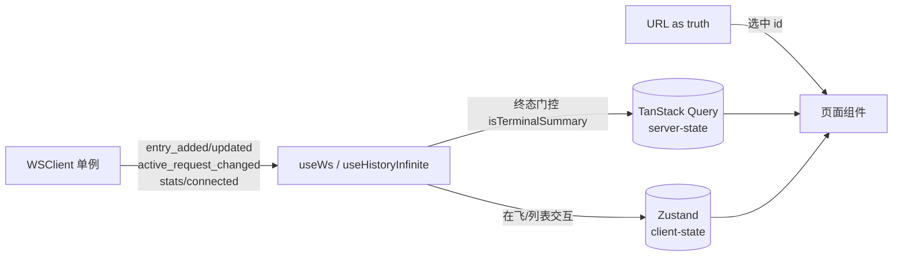

# ui-v4 架构现状（活文档）

> **这是什么**：`ui-v4/` 前端的**当前架构现状**——栈、入口、数据层、状态分层、渲染管线、目录职责、构建/测试。新会话/接手先读本文建立心智模型，再下到 [DESIGN.md](DESIGN.md)（设计意图 WHAT/WHY）、[evolution.md](evolution.md)（逐 Plan 演进史）、具体 [plans/](plans/) 与 [decisions/](decisions/)。
>
> **裁判轴**：现状以**实测代码为准**（本文事实已对 `package.json`/`App.tsx`/`main.tsx`/`vite.config.ts`/`src/` 目录逐一 spot-verify）。DESIGN.md 早期写「React 18 + RR6」是**文档漂移**，实测为 React 19 + RR7，以本文为准。
>
> **定位**：ui-v4 是 copilot-api 请求历史查看器的 React 全面重写，从「请求历史浏览器」升级为「实时 LLM 流量检视台」（DevTools / Network-inspector 范式），与旧 Vue `ui/` 并行共存（2026-07-22 起两者均由运维独立托管，后端不再挂载任何 UI 静态路由，见根 README「Hosting the Web UI」），达功能对等后替换旧 UI（对等 gating 清单见 [TODO.md](TODO.md)）。**⚠ 与后端 `docs/v4/`（模型请求管线重构）无关，只是共用 "v4" 代号。**

## 1. 技术栈（实测 `package.json`）

| 关注点 | 选型 | 版本 |
|---|---|---|
| 框架 | React（StrictMode） | 19.2 |
| 语言 | TypeScript strict | — |
| 构建 | Vite | 7 |
| 样式 | Tailwind v4（`@tailwindcss/vite`，CSS-first `@theme`） | 4 |
| 路由 | react-router-dom（**hash** `createHashRouter`） | 7.18 |
| server-state | TanStack Query | 5.62 |
| client-state | Zustand | 5.0 |
| 表格 | @tanstack/react-table | 8.21 |
| headless 组件 | radix-ui（统一包） | 1.6 |
| 语法高亮 | shiki（4× `@shikijs/*`：core / engine-javascript / langs / themes） | 4.2 |
| diff | diff（jsdiff） | 9 |

> 交互原语走 radix-ui（迁移史见 [decisions/2026-07-05-adopt-radix-primitives.md](decisions/2026-07-05-adopt-radix-primitives.md)）；数据表走 @tanstack/react-table（ModelsTable 已正式重写，见 [decisions/2026-07-05-headless-component-stack.md](decisions/2026-07-05-headless-component-stack.md)）。react-aria-components 曾作数据表方案对照 PoC，评估后不采纳、已卸载。

## 2. 入口与路由（实测 `main.tsx` / `App.tsx`）

- **入口** `src/main.tsx`：`StrictMode > QueryClientProvider(queryClient) > RouterProvider(router)`，挂 `#root`，import `styles/theme.css`。
- **路由** `src/App.tsx`：`createHashRouter`，根 `path:"/"` = `<AppShell>` 壳（`errorElement=<RouteError>`），8 个子路由：

  | path | 组件 | 说明 |
  |---|---|---|
  | index | `<Navigate to="/requests" replace>` | 默认重定向 |
  | `requests` | RequestsListPage | 列表全屏 |
  | `requests/:id` | RequestDetailPage | 详情全屏（深链） |
  | `overview` | OverviewPage | 精简健康 + Grafana 入口 |
  | `models` | ModelsPage | 模型目录表 + 详情面板 |
  | `config` | ConfigPage | YAML/结构化配置 |
  | `tools/json` | JsonToolsPage | JSON 工具 |
  | `sessions` | SessionsPage | 会话聚合列表 |
  | `sessions/:id` | SessionDetailPage | 会话详情（agent 泳道） |
  | `*` | NotBuiltYet | 兜底未知路径 |

  左 rail 导航 5 项：Overview / Requests / Sessions / Models / Config（`tools/json` 是路由但不在 nav）。

## 3. 数据层（`src/lib/`）

- **`ws-client.ts`** —— **React 树外的模块单例 WSClient + 引用计数**（`createWsClient`）：首个 `acquire()` 建连、末个 `release()` 断连；重连指数退避 1s→30s + ±25% jitter（逐字移植旧 `ui/src/api/ws.ts`）；`socket !== thisSocket` 守卫规避 StrictMode 双挂载 churn；派发 6 类回调 `onEntryAdded`/`onEntryUpdated`/`onStatsUpdated`/`onStatusChange`/`onActiveRequestChanged`/`onConnected`。
- **`api.ts`** —— `createApi(fetchImpl)` DI + `ApiError`；get / getBlob（zstd）/ put / delete。
- **`query.ts`** —— QueryClient 配置（staleTime 5s、retry 1、无 refetchOnFocus）。
- **hooks 桥接**（`src/hooks/`，14 个）：`useWs` = latest-ref 包装 WSClient（挂载只 acquire 一次、事件读 ref.current）；Query hooks `useEntries`/`useEntry`/`useHistoryInfinite`/`useLiveRequests`/`useSessions`/`useSessionEntries`/`useModels`/`useModelTelemetry`/`useStatus`/`useConfigYaml`；UI hooks `useAnchorScroll`/`useResizableWidth`/`useHighlightedLines`。

## 4. 状态分层（三源分工）



- **TanStack Query（server-state）**：`useHistoryInfinite`（queryKey `["history-infinite"]`，`/history/api/entries` + `terminalOnly=true` + cursor + `direction=older`）、`useEntry`、`useSessions`、`useSessionEntries`（`?sessionId=&limit=1000`）、`useModels`（`/api/models`）、`useModelTelemetry`（`/api/status`）、`useStatus`、`useConfigYaml`（GET+PUT `/api/config/yaml`）。
- **Zustand（client-state，`src/stores/`，3 个）**：
  - `live-store` —— `byId` 在飞请求，纯 reducer `applyActiveEvent`；三终态（completed/failed/aborted）离场。
  - `list-store` —— `tailOn` + `bufferedIds`，纯 reducer `reduceListEvent`（tail 暂停/恢复 + 「N 条新」缓冲 + 选中 `selectedId` 粘滞）。
  - `ui-store` —— `theme`（localStorage）+ `wsConnected`。
- **URL-as-truth**：选中 id 走 URL——列表 `?at=`、详情 `/requests/:id`、models `?model=`。
- **WS→store 门控**：`useHistoryInfinite` 里 `onEntrySettled` 经 `isTerminalSummary`（`lib/activity-row.ts`，镜像后端 `isInFlightSummary`）——**终态才进 History**（tail-on→invalidate / paused→记 buffer），在飞归 Live 泳道；一个请求要么 Live 要么 History，不双显。

## 5. 内容渲染管线（`src/lib/content/` + `src/components/detail/`）

```
normalizeToContentBlocks(msg)  ← 统一 3 情况
  ├─ Anthropic content[]          → 原样
  ├─ OpenAI string + tool_calls   → text 块 + 虚拟 tool_use 块
  └─ OpenAI role:"tool"           → tool_result 块
        ↓
ContentRenderer  按 type 分发 8 类块（各包 ErrorBoundary）
  text / thinking / redacted_thinking / tool_use / tool_result / image / (generic 兜底)
SystemMessage    独立支路（不走 ContentRenderer）：system-reminder 解析 + original↔rewritten↔diff
```

- 领域类型经 `~backend/lib/history/store` re-export（single-source-of-truth，前端不重定义）。
- diff 原语在 `lib/diff/`（`block-diff.ts` via jsdiff + `rewrite-marks.ts` inbound→effective 标记）；高亮在 `lib/highlight/`（`shiki.ts` 异步单例 + JS 正则引擎，自写 `amber-theme.ts` terminal-amber 主题，`codeToHast`→按行拆→行号 gutter，无 `dangerouslySetInnerHTML`）。
- 详情页两路由全屏分离（`/requests` 列表 / `/requests/:id` 详情），详情 sub-rail 分段 Convo / System / Stages / Response / SSE / Headers / Meta，各段懒加载 + Convo/Stages/System 带左侧 TOC 树（`lib/content/anchors.ts` + `toc.ts`）。

## 6. 目录职责（`src/`，实测 117 文件 / ~8400 行）

| 目录 | 职责 |
|---|---|
| `components/` | 9 个页面/领域子树：`overview` `requests` `sessions` `models` `config` `detail`（含 blocks/segments/toc）`tools` `shell`（AppShell/NavRail/TopBar/RouteError/NotBuiltYet）`shared` |
| `hooks/` | 14 个：WS 桥（useWs）+ Query hooks + UI hooks（scroll/resize/highlight） |
| `stores/` | 3 个 Zustand：`live-store` / `list-store` / `ui-store` |
| `lib/` | 纯逻辑与数据层：子目录 `content/`（normalize/anchors/toc/tool-pairing/accumulate-forwarded/types）`diff/`（block-diff/rewrite-marks）`highlight/`（shiki/amber-theme）+ `api` `query` `ws-client` `activity-row` `format` `clipboard` `export-entry` `json-tools` `model-columns` `model-filters` `model-telemetry` `models-csv` |
| `types/` | 3 个：`index`（多经 `~backend` re-export）/ `status` / `ws` |
| `styles/` | `theme.css`（CSS-var 单一来源，Terminal Amber 工业风） |

## 7. 构建 / 别名 / 代理（实测 `vite.config.ts`）

- **别名**（vite + tsconfig 一致）：`@/*`→`ui-v4/src`、`~backend/*`→`../src`、`~/*`→`../src`（`~/*` 供后端源码内部自引用解析，跨引用后端源码时必需）。
- **base**：dev（`serve`）= `/`，build = `/ui-v4/`（2026-07-22 起后端不再服务此 `dist`，由运维独立托管静态服务器 + 反代 API，见根 README「Hosting the Web UI」）。
- **dev proxy** 4 路 → 后端（默认 `localhost:4141`，`COPILOT_API_HOST`/`COPILOT_API_PORT` 覆盖）：`/history/api`、`/ws`（`ws:true`）、`/api`、`/models`。

## 8. 测试（双 runner 后缀互斥，72 测试文件）

- `*.bun.test.ts` → `bun test`（纯逻辑：normalize / 类型守卫 / block-diff / filters / utils，无 DOM）。
- `*.vitest.test.tsx` → vitest + jsdom + RTL（组件挂载 / 交互）。
- 命令：`test:bun` = `bun test .bun.test`；`test` = bun + vitest；`typecheck` = `tsc --noEmit`。
- **选择规则**：无 DOM 纯逻辑 → bun；需挂载/交互 → vitest。两 runner 按后缀互斥，勿混用。UI 交付验证须跑 `build:ui-v4`（真 rollup 才暴露 `~backend/*` 不纯的假绿，typecheck + vitest 会双假绿）。

## 9. 关键不变量（改动时勿破）

- **类型 single-source**：领域类型在后端定义、前端经 `~backend/*` re-export，绝不在前端重定义。
- **WSClient 树外单例**：绝不每 hook 一个连接（StrictMode 双挂载/HMR 泄漏）。
- **Live 与 History 不双显**：`terminalOnly=true` + `isTerminalSummary` 门控是唯一真源。
- **richest-data-flow**：后端投影完整存、前端选择性呈现；未关联遥测/空 system 等如实渲染、不静默丢弃。
- **shiki 无 `dangerouslySetInnerHTML`**：走 hast→token→行号 gutter，React 自动转义。
